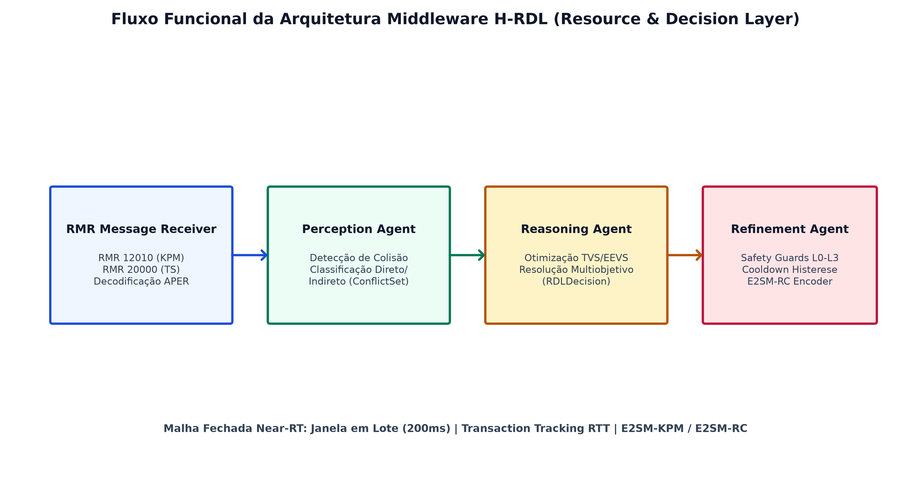

# xApp RDL (Resource and Decision Layer) — O-RAN Conflict Mitigation

<div align="center">

**Implementação experimental de uma xApp H-RDL para Near-RT RIC, com suporte em evolução às interfaces E2AP, E2SM-KPM e E2SM-RC.**  
*A interoperabilidade normativa ponta a ponta é validada incrementalmente contra O-RAN ALLIANCE, O-RAN SC (Release J), NORI (5G-LENA v5.1 / ns-3.48) e OpenRAN@Brasil Blueprint v3.*

</div>

---

### Navegação Multi-Fases do Projeto RDL (Resource and Decision Layer)

| Fase do Projeto | Descrição e Paradigma de Controle | Status de Implementação | Repositório Oficial |
| :---: | :--- | :---: | :---: |
| **Fase 1 (Atual)** | **RDL Determinística e Segura (H-RDL)**<br/>*Janela em lote (200ms), heurísticas TVS/EEVS, Safety Guards físicos e mapeamento formal E2AP/E2SM.* | **Implementada e Operacional** | [georgebarbosa3090/XApp-RDL-F1](https://github.com/georgebarbosa3090/XApp-RDL-F1) |
| **Fase 2** | **RDL Baseada em Contexto (CA-RDL)**<br/>*Aprendizado por Reforço Multiagente (MARL / MAPPO) e cognição contextual.* | **Ativa / Em Evolução** | [georgebarbosa3090/XApp-RDL-F2](https://github.com/georgebarbosa3090/XApp-RDL-F2) |
| **Fase 3** | **RDL Autônoma e Federada 6G (Zero-Touch)**<br/>*Inteligência distribuída, orquestração por intenção (Intent-Driven) e O-Cloud 6G.* | **Roadmap / Planejada** | *Em especificação futura* |

---

## 1. Visão Geral da Arquitetura (Fase 1: H-RDL)

A **xApp RDL (Resource and Decision Layer)** atua como o middleware central de governança no **Near-RT RIC**, interceptando e mitigando colisões geradas por **3 xApps de referência abertas da literatura**:

1. **xSlice (QoS & Slicing Optimizer) — [`peihaoY/xslice-oran`](https://github.com/peihaoY/xslice-oran):** Solicita cotas elevadas de PRBs (`PRB_QUOTA = 80%`, prioridade 90) para fatias URLLC/eMBB.
2. **Energy Saving (Green RAN Optimizer) — [`Orange-OpenSource/ns-O-RAN-flexric`](https://github.com/Orange-OpenSource/ns-O-RAN-flexric):** Solicita redução de potência (`TX_POWER = 20 dBm`, prioridade 65) e sono de células, colidindo com a garantia de QoS.
3. **Traffic Steering (Mobility Optimizer) — [`o-ran-sc/ric-app-ts`](https://github.com/o-ran-sc/ric-app-ts):** Solicita migração e balanceamento de tráfego (`HANDOVER`, prioridade 80).

* **Agente de Percepção (`PerceptionAgent`):** Agrupa propostas de controle E2 em **janelas de decisão em lote ($\Delta t = 200\text{ ms}$)** e identifica conflitos diretos e indiretos entre as 3 xApps.
* **Agente de Raciocínio (`ReasoningAgent`):** Aplica funções de utilidade multiobjetivo fundamentadas em **modelos analíticos calibrados de rádio 5G** (capacidade espectral de Shannon com SINR real e overhead 3GPP, atraso sigmoide de fila $M/G/1$ e modelo linear de consumo elétrico Earth/3GPP).
* **Agente de Refinamento (`RefinementAgent`):** Garante a segurança física da rede (*Safety Guards*), aplicando *clamping* de potência ($P_{\text{tx}} \in [-10, 23]\text{ dBm}$), orçamento de PRBs ($\le 100\%$) e bloqueio de ping-pong ($\Delta t \ge 1000\text{ ms}$).
* **Camada E2 e Mapeadores Normativos (`src/e2/`):**
  * `e2ap/`: Serialização e parsing ASN.1 APER de `RICsubscriptionRequest`, `RICcontrolRequest`, `RICcontrolAcknowledge` e `RICcontrolFailure` (E2AP v02.03).
  * `kpm/`: Construtores normativos de `E2SM_KPM_EventTriggerDefinition` (Formato 1) e `E2SM_KPM_ActionDefinition` (Formato 1) com métricas 3GPP 28.552 (`DRB.UEThpDl`, `RRU.PrbTotDl`, `DRB.PacketLossRateDl`).
  * `rc/`: Mapeador `RCMapper` que traduz `RDLDecision` em `E2SM_RC_ControlHeader` e `E2SM_RC_ControlMessage` (Formato 1, Estilo 1) com tabela canônica de parâmetros RAN (`PRB_QUOTA`, `SCHEDULER_WEIGHT`, `TX_POWER`, `HANDOVER`).
* **Pipeline de Pass-Through de Ações Limpas:** Despacha imediatamente ações não conflitantes para as gNodeBs após validação de segurança.
* **Rastreamento Assíncrono de Transações E2:** Mapeia `transaction_id` para mensagens `RIC_CONTROL_REQ` e mede o RTT de controle via `RIC_CONTROL_ACK`.



---

## 2. Estrutura do Repositório

```text
.
├── configs/                     # Descritores de configuração xApp (config-file.json, routes.rt)
├── deploy/                      # Manifestos de Implantação
│   ├── helm/                    # Helm Charts oficiais (RDL, xSlice, Energy Saving, Traffic Steering)
│   ├── kubernetes/              # Manifestos K8s puros (Near-RT RIC ricplt + 3 xApps + RDL ricxapp)
│   └── openran-br-v3/           # Perfil de Implantação OpenRAN@Brasil Blueprint v3 (Release J)
├── docs/                        # Portal de Documentação Oficial Consolidada
│   ├── README.md                # Índice mestre e trilhas de leitura por perfil
│   ├── 01_arquitetura_e_modelagem.md            # [Vol 01] Arquitetura Core e Modelos
│   ├── 02_guia_operacional_deploy_e_simulacao.md# [Vol 02] Deploy K8s/k3d e ns-3
│   ├── 03_taxonomia_de_conflitos_e_cenarios.md  # [Vol 03] Conflitos e Cenários S0-S15
│   ├── 04_relatorio_cientifico_mestre_rdl.md    # [Vol 04] Monografia Mestre Causal
│   ├── 05_auditoria_e_conformidade_oran.md      # [Vol 05] Auditoria e Normas O-RAN
│   └── 06_roadmap_e_pesquisa_futura_6g.md       # [Vol 06] Roadmap e Futuro 6G
├── reference-xapps/             # Adaptadores leves das 3 xApps de referência abertas
├── reproducibility/             # Bloqueio de versões (versions.lock) e Runbook de reprodução
├── scripts/                     # Automação de Deploy, Testes, Validação S0-S15 e Reprodução
│   ├── validate_all_scenarios_s0_s15.py # Motor E2E de validação de todos os 16 cenários S0-S15
│   ├── reproduce_f1.sh          # Pipeline completo de reprodução determinística (Fase 1)
│   ├── deploy_helm.sh           # Pipeline Helm (Near-RT RIC -> 3 xApps -> RDL)
│   ├── deploy_k8s.sh            # Pipeline K8s/Kustomize equivalente
│   └── verify_3_xapps.sh        # Smoke test unificado de todas as xApps
├── simulations/                 # Cenários C++ de Co-Simulação no ns-3 NORI / 5G-LENA (S0 a S15)
│   └── ns3/                     # scenario_rdl_s0 a s15 e run_all_s0_s15_simulations.sh
├── src/                         # Código-Fonte Python da xApp RDL (Clean Architecture)
│   ├── conflict_types.py        # Contratos formais desacoplados (RDLDecision, XAppAction)
│   ├── rdl_xapp.py              # Ciclo de vida xApp e despacho via E2/RCMapper
│   ├── e2/                      # Pilha de protocolos E2 (e2ap/, kpm/, rc/)
│   ├── agents/                  # Agentes cognitivos (Perception, Reasoning, Refinement)
│   └── models/                  # Modelos analíticos físicos (Shannon, M/G/1, Earth)
├── tests/                       # Suíte de Testes Modulares (tests/codec, tests/unit, tests/integration)
└── Makefile                     # CLI unificada de operação, testes e benchmarks
```

---

## 3. Infraestrutura Leve com k3d, Rancher e Kiali

Para desenvolvimento ágil e validação de baixo consumo de recursos, o projeto suporta provisionamento de clusters Kubernetes leves via **k3d (K3s em Docker)** com exposição das portas padronizadas da arquitetura O-RAN:

### 3.1. Topologias de Cluster k3d Disponíveis

#### Opção 1: Single-Node (1 Servidor/Worker Unificado, ~450 MB RAM)
> *Ideal para desenvolvimento local rápido, CI/CD e máquinas com recursos limitados.*

```bash
k3d cluster create rdl-cluster \
  --servers 1 \
  -p "36422:36422/sctp@server:0" \
  -p "8080-8087:8080-8087@server:0" \
  -p "4560-4561:4560-4561@server:0"
```

#### Opção 2: Dual-Node (1 Control-Plane + 1 Worker Node, ~900 MB RAM)
> *Separação física de pods entre plano de controle do cluster e nós de execução.*

```bash
k3d cluster create rdl-cluster \
  --servers 1 \
  --agents 1 \
  -p "36422:36422/sctp@server:0" \
  -p "8080-8087:8080-8087@server:0" \
  -p "4560-4561:4560-4561@server:0"
```

#### Opção 3: 3-Nodes / Multi-Node (1 Control-Plane + 2 Worker Nodes, ~1.5 GB RAM)
> *Topologia de produção: Isolamento estrito de namespaces (`ricplt` no worker-1 e `ricxapp` no worker-2).*

```bash
k3d cluster create rdl-cluster \
  --servers 1 \
  --agents 2 \
  -p "36422:36422/sctp@server:0" \
  -p "8080-8087:8080-8087@server:0" \
  -p "4560-4561:4560-4561@server:0"
```

### 3.2. Mapeamento de Portas e Serviços O-RAN

| Porta / Protocolo | Componente / Serviço | Namespace | Descrição Funcional |
| :---: | :---: | :---: | :--- |
| `36422/SCTP` | `service-ricplt-e2term-sctp` | `ricplt` | Terminação E2 (E2AP / E2SM-KPM / E2SM-RC) conectando gNBs/ns-3 |
| `38000/TCP` | `service-ricplt-e2term-rmr` | `ricplt` | Barramento RMR interno do E2 Termination |
| `6379/TCP` | `service-ricplt-dbaas-tcp` | `ricplt` | Banco de dados Redis SDL (Shared Data Layer) |
| `4560/TCP` | `service-ricxapp-iqos-xapp-rdl-rmr` | `ricxapp` | Canal de dados e despacho de ações RMR da xApp-RDL |
| `4561/TCP` | `service-ricxapp-iqos-xapp-rdl-rmr` | `ricxapp` | Canal de controle e distribuição de tabelas de rota RMR |
| `8080/TCP` | `service-ricxapp-iqos-xapp-rdl-http` | `ricxapp` | Healthcheck REST (`/health/alive`, `/health/ready`) |
| `8081/TCP` | `service-ricxapp-iqos-xapp-rdl-http` | `ricxapp` | Métricas Prometheus de Governança e Decisões RDL |
| `8443/TCP` | `rancher-server` | `cattle-system` | Dashboard Web e gestão centralizada de nós e workloads |
| `20001/TCP` | `kiali-dashboard` | `istio-system` | Visualização gráfica de topologia e tráfego Service Mesh |

---

## 4. Guia Rápido de Execução e Deploy

Entrar no diretório do projeto:

```bash
cd XApp-RDL-F1
```

Instalar o utilitário Make (caso não esteja instalado no host):

```bash
apt update && apt install -y make
```

### Opção A: Implantação Rápida via Perfil OpenRAN@Brasil Blueprint v3 (`deploy/openran-br-v3/`)
Manifestos K8s puros e otimizados para o namespace `ricxapp` seguindo a especificação normativa da Release J / OpenRAN@Brasil:

1. Criar os namespaces oficiais se ainda não existirem:
```bash
kubectl create namespace ricplt --dry-run=client -o yaml | kubectl apply -f -
kubectl create namespace ricxapp --dry-run=client -o yaml | kubectl apply -f -
```

2. Aplicar ConfigMap e tabela de rotas RMR:
```bash
kubectl apply -f deploy/openran-br-v3/config-map.yaml
```

3. Aplicar Serviços de Rede (RMR 4560/4561 + HTTP 8080/8081):
```bash
kubectl apply -f deploy/openran-br-v3/service.yaml
```

4. Aplicar o Deployment da xApp RDL:
```bash
kubectl apply -f deploy/openran-br-v3/deployment.yaml
```

5. Validar o status da implantação:
```bash
kubectl get pods,svc -n ricxapp -l app=iqos-xapp-rdl
```

### Opção B: Deploy Governança Completa Helm (Near-RT RIC + 3 Reference xApps + RDL)
```bash
make helm-deploy
```

### Opção C: Deploy Baseline (Near-RT RIC + 3 Reference xApps SEM RDL)
```bash
make helm-deploy-baseline
```

### Opção D: Validação e Smoke Test das 3 xApps de Referência
```bash
make test-3xapps
```

### Opção E: Suíte de Testes Modulares (11/11 PASS)
```bash
make test
```

### Opção F: Validação Automatizada dos Cenários S0 a S15

Executar todos os cenários (S0 a S15):
```bash
/home/george/.venv-rdl/bin/python scripts/validate_all_scenarios_s0_s15.py --group all
```

Executar apenas Grupo 1 (Redes Terrestres 5G — S0 a S8):
```bash
/home/george/.venv-rdl/bin/python scripts/validate_all_scenarios_s0_s15.py --group 5g
```

Executar apenas Grupo 2 (Redes Avançadas 6G — S9 a S15):
```bash
/home/george/.venv-rdl/bin/python scripts/validate_all_scenarios_s0_s15.py --group 6g
```

Executar cenário individual específico (exemplo S1 ou S14):
```bash
/home/george/.venv-rdl/bin/python scripts/validate_all_scenarios_s0_s15.py --scenario S1
```

### Opção G: Execução das Co-Simulações C++ no ns-3 (S0 a S15)

Executar todas as co-simulações C++ em lote:
```bash
bash simulations/ns3/run_all_s0_s15_simulations.sh all
```

Executar apenas Grupo 1 (5G) ou Grupo 2 (6G):
```bash
bash simulations/ns3/run_all_s0_s15_simulations.sh 5g
bash simulations/ns3/run_all_s0_s15_simulations.sh 6g
```

Executar simulação de um cenário individual específico (para economizar recursos de CPU/RAM):
```bash
bash simulations/ns3/run_all_s0_s15_simulations.sh S1
```

### Opção H: Reprodução Determinística do Ambiente
```bash
make reproduce-f1
```

---

## 5. Observabilidade e Monitoramento

* **Rancher Dashboard:** Interface visual de gestão do cluster, nós e namespaces (`ricplt`, `ricxapp`):
```bash
make rancher-stop
make rancher-start
make rancher-logs
make rancher-password
```

Vincular o cluster ao Rancher através do comando de importação:
```bash
make rancher-connect URL="https://localhost:8443/v3/import/c-m-xxxx_c-m-xxxx.yaml"
```

* **Kiali Service Mesh:** Para visualização em grafo animado do fluxo de dados entre xApps e o Near-RT RIC:
```bash
make kiali-install
```

---

## 6. Política Rígida de Proveniência e Resultados Experimentais

$$
\boxed{
\text{Resultado científico válido} \iff \text{ns-3 + 5G-LENA + NORI + E2 real}
}
$$

A infraestrutura experimental **ns-3 / 5G-LENA v5.1 / NORI** está em validação atrelada à política estrita de **Zero Dados Sintéticos**. Resultados científicos somente serão publicados após aprovação automática dos gates de proveniência e interoperabilidade (**Gate 1 a Gate 4**).

### 6.1. Critérios dos Gates de Validação Experimental

| Gate | Descrição e Requisito de Aprovação | Condição de Bloqueio |
| :---: | :--- | :---: |
| **Gate 1** | **Interoperabilidade E2 KPM Real**<br/>Conexão SCTP/NORI $\to$ Near-RT RIC, subscrição aceita, `RICindication` `.raw` decodificado via APER e validação semântica com o FlowMonitor ($\epsilon < 5\%$). | **Obrigatório (`GATE_1_REQUIRED=true`)** |
| **Gate 2** | **Rastreabilidade e Providência Extrema**<br/>Verificação de hashes SHA256 do binário ns-3, sementes, FlowMonitor XML, logs e manifestos `execution_manifest.json`. | **Obrigatório** |
| **Gate 3** | **Controle E2SM-RC em Malha Fechada**<br/>Envio de `RICcontrolRequest` via APER e confirmação externa por `RICcontrolAcknowledge` sobre SCTP real. | **Obrigatório** |
| **Gate 4** | **Fechamento do Causal Loop RAN**<br/>Encadeamento de causa-efeito: $\text{KPM}(t_0) \to \text{H-RDL} \to \text{Control} \to \text{NORI} \to \text{ns-3} \to \text{State Change} \to \text{KPM}(t_1)$. | **Obrigatório** |

---

## 7. Reprodutibilidade e Validação de Proveniência em Um Comando

### 7.1. Diretriz Inviolável: Zero Dados Sintéticos e Proveniência Estrita do ns-3 FlowMonitor

É expressamente proibido utilizar simuladores discretos simplificados ou parâmetros fixos para produzir dados científicos. Todos os datasets, métricas de SLA, vazão, perdas de pacotes e latência de rádio devem ser **obrigatoriamente exportados pelo módulo nativo `FlowMonitor` do ns-3 (5G-LENA v5.1 / NORI)** a partir dos códigos-fonte C++ (`simulations/ns3/*.cc`).

Para executar a verificação estrita de proveniência e integridade sem dados sintéticos:

```bash
python scripts/check_no_synthetic_results.py
```

Validação do pipeline de proveniência de dados reais:
```bash
python scripts/validate_provenance.py experiments/runs/gate1/seed-1001
```

Suíte de testes funcionais e codecs de software:
```bash
make test-unit
make test-codec
make test-integration
make test-interop
```

---

## 8. Como Sincronizar e Subir os Resultados para o GitHub

Após rodar os testes ou simulações, você pode subir todos os resultados usando qualquer uma das opções abaixo:

### Opção A: Via Atalho Make (Recomendado)
```bash
make push-results
```

### Opção B: Manual via Git
```bash
git add experiments/results/ docs/
git commit -m "chore(sim): update ns-3 FlowMonitor experimental traces and reports"
git push origin main
```

---

## 9. Volumes Canônicos da Documentação e Referências

* **[Volume 01: Arquitetura, Módulos Core e Modelagem Matemática](docs/01_arquitetura_e_modelagem.md)**
* **[Volume 02: Guia Operacional de Deploy, Simulação e Observabilidade](docs/02_guia_operacional_deploy_e_simulacao.md)**
* **[Volume 03: Taxonomia de Conflitos Multi-xApp e Portfólio de Cenários (S0 a S15)](docs/03_taxonomia_de_conflitos_e_cenarios.md)**
* **[Volume 04: Relatório Científico Mestre de Experimentos RDL (F1 × F2)](docs/04_relatorio_cientifico_mestre_rdl.md)**
* **[Volume 05: Relatório de Auditoria Técnico-Científica e Conformidade O-RAN](docs/05_auditoria_e_conformidade_oran.md)**
* **[Volume 06: Roadmap de Pesquisa (2026–2028), Fase 3 e RDL Autônoma 6G](docs/06_roadmap_e_pesquisa_futura_6g.md)**
* **[Portal de Documentação e Trilhas de Leitura](docs/README.md)**

---

<div align="center">

**Projeto xApp RDL — O-RAN Near-RT RIC Conflict Mitigation**  
*Desenvolvido em conformidade estrita com ETSI TS 104 039, O-RAN.WG3.E2AP e O-RAN Software Community Release I/J.*

</div>
