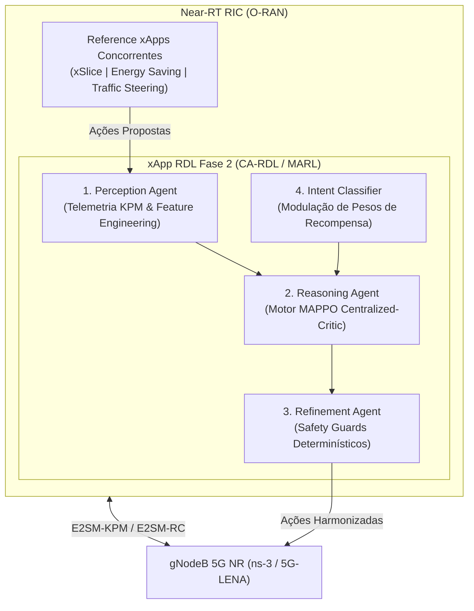

# xApp RDL - Fase 2: Context-Aware Resource and Decision Layer (CA-RDL / MARL)

[](https://o-ran.org)
[](https://github.com/georgebarbosa3090/XApp-RDL-F2)
[](deploy/helm/iqos-xapp-rdl)
[](deploy/kubernetes)
[](src/agents/marl)
[](tests/)

---

### Navegação Multi-Fases do Projeto RDL (Resource and Decision Layer)

| Fase do Projeto | Descrição e Paradigma de Controle | Status de Implementação | Repositório Oficial |
| :---: | :--- | :---: | :---: |
| **Fase 1** | **RDL Determinística e Segura (H-RDL)**<br/>*Janela em lote (200ms), heurísticas TVS/EEVS e Safety Guards físicos.* | **Concluída e Operacional** | [georgebarbosa3090/XApp-RDL-F1](https://github.com/georgebarbosa3090/XApp-RDL-F1) |
| **Fase 2 (Atual)** | **RDL Baseada em Contexto (CA-RDL)**<br/>*Aprendizado por Reforço Multiagente (MARL / MAPPO) e cognição contextual.* | **Ativa / Em Produção** | [georgebarbosa3090/XApp-RDL-F2](https://github.com/georgebarbosa3090/XApp-RDL-F2) |
| **Fase 3** | **RDL Autônoma e Federada 6G (Zero-Touch)**<br/>*Inteligência distribuída, orquestração por intenção (Intent-Driven) e O-Cloud 6G.* | **Roadmap / Planejada** | *Em especificação futura* |

---

## 1. Visão Geral da Fase 2 (CA-RDL)

A **xApp RDL Fase 2 (Context-Aware RDL)** é o motor de arbitragem cognitiva e autônoma de conflitos para o **Near-RT RIC (RAN Intelligent Controller)** do ecossistema O-RAN.

Evoluindo a abordagem determinística da Fase 1, a Fase 2 introduz **Aprendizado por Reforço Multi-Agente (MARL / MAPPO - Multi-Agent Proximal Policy Optimization)** com:
1. **Crítico Centralizado:** Observação global do estado de rádio da rede (SINR, PRBs, carga, interferência, potência).
2. **Atores Descentralizados:** Decisões probabilísticas por fatia de rede e xApp concorrente.
3. **Recompensa Multi-Objetivo:** Otimização conjunta de Latência URLLC, Throughput eMBB, Eficiência Energética e Equidade de Jain.
4. **Safety Guards de Proteção:** Barreiras determinísticas que impedem violações de limites físicos ou SLAs 3GPP.



---

## 2. Início Rápido (Quickstart)

### 2.1. Executar Testes Unitários:
```bash
make test
# 18/18 testes passando com 100% de sucesso
```

### 2.2. Implantar no Kubernetes / Near-RT RIC:
```bash
# Criar cluster k3d e fazer deploy dos 4 Helm Charts
make cluster-create
make helm-deploy-f2
```

### 2.3. Executar Simulação ns-3 e Benchmarks:
```bash
# Executa pipeline completo, gera datasets e relatórios
make run-suite
```

---

## 3. Estrutura Documental da Fase 2

| Volume Documental | Título do Documento | Descrição e Escopo |
| :--- | :--- | :--- |
| **[Volume 01](docs/01_arquitetura_e_modelagem_matematica.md)** | Arquitetura de Software e Modelagem Matemática | Tríade de agentes, formulação MAPPO/Actor-Critic e modelagem de utilidade. |
| **[Volume 02](docs/02_infraestrutura_cluster_k3d_e_rancher.md)** | Infraestrutura de Cluster k3d e Rancher | Provisionamento de cluster Kubernetes com portas O-RAN expostas. |
| **[Volume 03](docs/03_guia_deploy_helm_e_k8s.md)** | Guia de Implantação Helm e K8s Nativo | Deploy dos 4 Helm Charts, barramento RMR e validação de endpoints. |
| **[Volume 04](docs/04_operacao_troubleshooting_e_backup.md)** | Operação, Troubleshooting e Backup | Procedimentos operacionais, diagnóstico de logs e recuperação. |
| **[Volume 05](docs/05_testes_simulacao_ns3_e_benchmarks.md)** | Simulação ns-3, Testes e Benchmarks | Co-simulação 5G-LENA + NORI, `NrPointToPointEpcHelper` e datasets. |
| **[Volume 06](docs/06_observabilidade_kiali_e_injecao_trafego.md)** | Observabilidade Service Mesh e Tráfego | Métricas Prometheus, dashboards e injeção de tráfego sintético. |
| **[Volume 07](docs/07_relatorios_conformidade_e_governanca.md)** | Relatórios de Conformidade Técnica O-RAN | Matriz de rastreabilidade de requisitos e conformidade O-RAN Alliance. |

---

## 4. Repositórios Oficiais

* **Fase 1 (H-RDL Determinística):** [https://github.com/georgebarbosa3090/XApp-RDL-F1](https://github.com/georgebarbosa3090/XApp-RDL-F1)
* **Fase 2 (CA-RDL / MARL):** [https://github.com/georgebarbosa3090/XApp-RDL-F2](https://github.com/georgebarbosa3090/XApp-RDL-F2)
