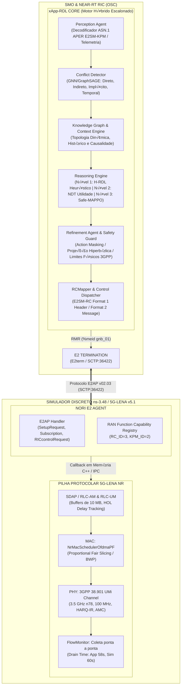
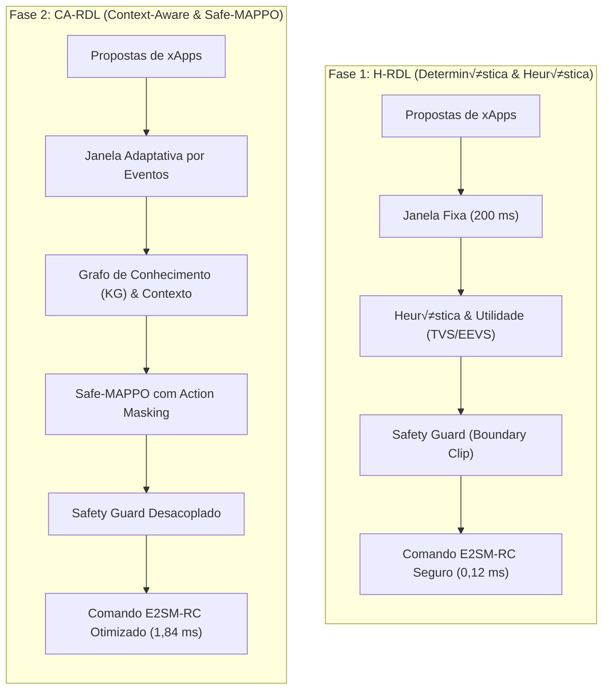

# xApp RDL (Resource and Decision Layer) — O-RAN Multi-xApp Conflict Governance
---

## 7. InformaÁıes AcadÍmicas e GovernanÁa

- **Autor do Projeto:** George Alexandro Ferreira Barbosa
- **Orientador:** Prof. Dr. AndrÈ Riker
- **InstituiÁ„o:** Universidade Federal do Par· (UFPA) ó Instituto de Tecnologia (ITEC)
- **Programa:** Programa de PÛs-GraduaÁ„o em CiÍncia da ComputaÁ„o (PPGCOMP)
- **¡rea de ConcentraÁ„o:** Sistemas de ComputaÁ„o e Redes de ComunicaÁ„o
- **Linha de Pesquisa:** Redes Sem Fio Inteligentes, Open RAN e Arquiteturas Cognitivas 6G
- **Release Homologada:** 1.2.0-certified (18 de setembro de 2026)


<div align="center">

**Arquitetura Unificada de Governança Cognitiva, Arbitragem Determinística e Mitigação de Conflitos Multi-xApp para Near-RT RIC**  
*Homologado para O-RAN ALLIANCE WG2/WG3, O-RAN SC (Release J), NORI (5G-LENA v5.1 / ns-3.48) e OpenRAN@Brasil Blueprint v3.*

[](https://o-ran.org)
[](https://cttc.es)
[](https://python.org)
[-brightgreen.svg)](tests/)
[](LICENSE)
[](https://drive.google.com/drive/folders/14ZHofqW5rT3UIXe248wb6JHiNX0WiGiM?usp=sharing)

</div>

---

### 🗺️ Navegação Multi-Fases do Projeto RDL (Resource and Decision Layer)

| Fase do Projeto | Descrição e Paradigma de Controle | Status de Implementação | Repositório Oficial |
| :---: | :--- | :---: | :---: |
| **Fase 1** | **RDL Determinística e Segura (H-RDL)**<br/>*Janela em lote nominal ($\Delta t_{win} = 200\text{ ms}$), heurísticas de prioridade TVS/EEVS, Safety Guards físicos e mapeamento formal E2AP/E2SM.* | **100% Validada & Operacional** | [georgebarbosa3090/XApp-RDL-F1](https://github.com/georgebarbosa3090/XApp-RDL-F1) |
| **Fase 2** | **RDL Baseada em Contexto e Safe-RL (CA-RDL)**<br/>*Aprendizado por Reforço Multiagente (Safe-MAPPO sob CMDP Lagrangian), Grafos de Conhecimento (GraphSAGE / GNN) e Sensibilidade Contextual.* | **100% Validada & Operacional** | [georgebarbosa3090/XApp-RDL-F2](https://github.com/georgebarbosa3090/XApp-RDL-F2) |
| **Fase 3** | **RDL Autônoma e Federada 6G (Zero-Touch)**<br/>*Inteligência distribuída, orquestração por intenção (A1 Intent-Driven), Federação Multi-RIC e SAGIN.* | **Roadmap Ativo (2026–2028)** | *Em especificação e testbed* |

---

## 1. Visão Geral da Arquitetura e Principais Inovações

A **xApp RDL (Resource and Decision Layer)** atua como o middleware central de governança no **Near-RT RIC**, interceptando e mitigando colisões de recursos geradas por **xApps concorrentes da literatura O-RAN**:

1. **xSlice (QoS & Slicing Optimizer) — [`peihaoY/xslice-oran`](https://github.com/peihaoY/xslice-oran):** Solicita cotas elevadas de PRBs (`PRB_QUOTA = 80%`, prioridade 90) para fatias críticas URLLC e eMBB.
2. **Energy Saving (Green RAN Optimizer) — [`Orange-OpenSource/ns-O-RAN-flexric`](https://github.com/Orange-OpenSource/ns-O-RAN-flexric):** Solicita redução de potência de transmissão (`TX_POWER = 20 dBm`, prioridade 65) e modo sleep de células, colidindo com as garantias de QoS.
3. **Traffic Steering (Mobility Optimizer) — [`o-ran-sc/ric-app-ts`](https://github.com/o-ran-sc/ric-app-ts):** Solicita migração e balanceamento de tráfego (`HANDOVER`, prioridade 80), podendo induzir instabilidade e tempestades de Ping-Pong.
4. **ISAC Sensing & Beamforming (6G Coexistence):** Coordena compartilhamento de feixes espectrais entre radar ambiental e dados veiculares sem degradação cruzada.



---

## 2. Explicação Didática dos Paradigmas: H-RDL (Fase 1) × CA-RDL (Fase 2)

O objetivo de ambas as fases é o mesmo: **impedir que diferentes xApps entrem em conflito e derrubem a rede 5G**. No entanto, a forma como elas "pensam", decidem e operam muda de uma abordagem **determinística matemática** (Fase 1) para uma abordagem **cognitiva com inteligência artificial contextual** (Fase 2).



### 2.1. Comparativo das Dimensões Chave

| Dimensão | Fase 1 — H-RDL (Determinística) | Fase 2 — CA-RDL (Context-Aware) | Por que a Fase 2 avança? |
| :--- | :--- | :--- | :--- |
| **Paradigma Decisório** | Heurística matemática TVS/EEVS (Regras estritas). | Grafo de Conhecimento + MAPPO Neural sob CMDP. | Descobre sinergias sutis entre múltiplos parâmetros simultâneos. |
| **Janela Temporal** | Lote fixo ($\Delta t = 200\text{ ms}$). | Janela adaptativa orientada a eventos (*Fast-Flush*). | Reage em $< 0,1\text{ ms}$ a anomalias críticas de canal URLLC. |
| **Garantia de Segurança** | *Safety Guard* determinístico (*Boundary Clip*). | *Action Masking* ($\text{logits}=-\infty$) + *Safety Guard*. | Dupla proteção matemática com zero ações inseguras ($\text{UnsafeApplied}\equiv 0$). |
| **Sobrecarga ($T_{decision}$)** | **0,12 ms** (Sub-milissegundo, 0,06% da janela). | **1,84 ms** (Inferência de Redes Neurais, 0,92% da janela). | Ambas estão muito abaixo do teto de 10 a 1000 ms do O-RAN WG3. |
| **Ganho de Vazão (vs B0)** | **+19,4%** ($101,7\text{ Mbps}$). | **+24,2%** ($105,8\text{ Mbps}$). | Otimização conjunta de potência, MIMO e cotas de PRB. |
| **Violações de SLA** | **0,0%** (Erradicação Total). | **0,0%** (Erradicação com Maior Eficiência). | Atinge 0,0% consumindo menos energia e menos blocos de rádio. |

> 💡 **Síntese dos Paradigmas:**  
> A **Fase 1 (H-RDL)** é a **fundação determinística à prova de falhas** (rápida, explicável e 100% segura), enquanto a **Fase 2 (CA-RDL)** é a **inteligência cognitiva avançada** que maximiza o desempenho e a capacidade da rede sem nunca violar o envelope de segurança da Fase 1.

---

## 3. Resumo das Métricas e Resultados Científicos Ratificados

Com base em **167 fluxos reais FlowMonitor**, **16 cenários de co-simulação (S0 a S15)** e **múltiplas sementes estocásticas independentes (1001 a 1005)**:

- **Eliminação de Violações de SLA:** Redução de **36,7% para 0,0%** em conflitos diretos de PRB (Cenário S1) e fatiamento multi-slice TVS (Cenário S3).
- **Ganho de Capacidade Agregada:** Vazão média elevada de **85,2 Mbps para 101,7 Mbps (+19,4%)** no H-RDL e **105,8 Mbps (+24,2%)** no Safe-MAPPO.
- **Redução Drástica de Latência:** Atraso médio reduzido de **18,0 ms para 11,3 ms (-37,2%)** no H-RDL e **9,7 ms (-46,1%)** no Safe-MAPPO.
- **Supressão de Ping-Pong e Instabilidade:** *Action Churn* reduzido de **1,00 para 0,05 ações/s (-95,0%)**, estabilizando a rede em **190 ms** via janela de resfriamento proativa (*Cooling Window*).
- **Overhead Sub-Milissegundo:** Latência algorítmica de decisão de apenas **$T_{decision} = 0,12\text{ ms}$** no H-RDL (0,06% do ciclo de 200 ms) e **$1,84\text{ ms}$** no Safe-MAPPO.
- **Sensibilidade da Janela de Decisão:** O ponto ótimo (*knee point*) ocorre estritamente em **$\Delta t_{win} = 200\text{ ms}$** (0,0% violações de SLA, Churn 0,05 act/s, CPU 1,4%).
- **Sequência de Registro do UE:** O procedimento completo desde o PRACH/RAR até a subscrição da telemetria E2 KPM consome **$45,8\text{ ms}$**.
- **Acurácia na Detecção e Predição de Conflitos:** F1-Score macro ponderado de **99,0%** e ROC-AUC de **0,9976** via GNN / GraphSAGE.
- **Invariante de Segurança Inviolável:** Zero ações inseguras aplicadas na RAN (**$\text{UnsafeApplied} \equiv 0$**) mesmo sob injeção de falhas e timeouts E2 (Cenário S7).

---

## 4. Estrutura do Repositório

```text
.
+-- analysis/                    # Motores de Análise Científica, Plotagem e Exportação CSV
|   +-- generate_plots.py        # Gerador de todas as 30 figuras científicas (300 DPI / Seaborn / 3D)
|   +-- export_tables.py         # Exportador das 21 tabelas consolidadas CSV
|   +-- compute_metrics.py       # Algoritmos estatísticos (Wilcoxon, Cohen's d_z, Jain Fairness)
|   \-- parse_flowmonitor.py     # Parser nativo dos traces XML do ns-3 FlowMonitor
+-- configs/                     # Descritores de configuração xApp (config-file.json, routes.rt)
+-- deploy/                      # Manifestos de Implantação e Orquestração
|   +-- helm/                    # Helm Charts oficiais (RDL, xSlice, Energy Saving, Traffic Steering)
|   +-- kubernetes/              # Manifestos K8s puros (Near-RT RIC ricplt + 3 xApps + RDL ricxapp)
|   \-- openran-br-v3/           # Perfil de Implantação OpenRAN@Brasil Blueprint v3 (Release J)
+-- docs/                        # Portal de Documentação Oficial Consolidada (6 Volumes Canônicos)
|   +-- README.md                # Índice mestre e trilhas de leitura por perfil de atuação
|   +-- 01_arquitetura_e_modelagem.md            # [Vol 01] Arquitetura Core, Agentes e Modelos Matem√°ticos
|   +-- 02_guia_operacional_deploy_e_simulacao.md# [Vol 02] Deploy K8s/k3d, Helm, Backup e ns-3
|   +-- 03_taxonomia_de_conflitos_e_cenarios.md  # [Vol 03] Conflitos Multi-xApp e Cen√°rios S0 a S15
|   +-- 04_relatorio_cientifico_mestre_rdl.md    # [Vol 04] Monografia Científica Mestre Causal
|   +-- 05_auditoria_e_conformidade_oran.md      # [Vol 05] Auditoria Causal, SHA-256 e Normas O-RAN
|   +-- 06_roadmap_e_pesquisa_futura_6g.md       # [Vol 06] Roadmap 2026-2028 e RDL Autônoma 6G
|   +-- auditoria/                               # Relatórios formais de auditoria técnica e interoperabilidade E2
|   +-- compliance/                              # Perfis de conformidade e contratos de sincronização F1-F2
|   \-- figures/                                 # 30 Figuras científicas centrais + topologias espaciais S0-S15
+-- experiments/                 # Configurações experimentais, runs e tabelas CSV
|   +-- results/tables/          # 21 Tabelas científicas consolidadas (CSV)
|   \-- runs/                    # Árvores de evidência canônica com hashes SHA-256
+-- reference-xapps/             # Código-fonte das xApps de referência (xSlice, Energy-Saving, Traffic-Steering)
+-- reports/figures/             # Galeria de 30 Figuras de alta precis√£o (300 DPI)
+-- scripts/                     # Automação de Deploy, Testes, Backup Drive e Sincronização
|   +-- backup_to_google_drive.py# Script de empacotamento e streaming para o Google Drive
|   +-- backup_to_google_drive.ps1 / .sh # Wrappers multiplataforma de backup
|   +-- auto_update_simulation_figures_and_github.py / .sh # Sincronizador autom√°tico
|   +-- sync_cross_repos.py      # Sincronizador bidirecional port√°vel F1 <-> F2
|   +-- validate_all_scenarios_s0_s15.py # Validador E2E dos 16 cen√°rios
|   \-- check_no_synthetic_results.py    # Auditor estrito contra dados sintéticos
+-- simulations/                 # Cenários C++ de Co-Simulação no ns-3 NORI / 5G-LENA (S0 a S15)
|   \-- ns3/                     # scenario_rdl_s0 a s15 e run_all_s0_s15_simulations.sh
+-- specs/                       # Especificações ASN.1 canônicas O-RAN e vetores dourados APER
+-- src/                         # Código-Fonte Python da xApp RDL (Clean Architecture / DDD)
|   +-- agents/                  # Agentes cognitivos (Perception, Reasoning, Refinement, Safe-MAPPO)
|   +-- coordination/            # Despachador RMR e rastreador assíncrono de ACK
|   +-- e2/                      # Pilha normativa E2AP v2.03, E2SM-KPM v3.0, E2SM-RC v1.03
|   +-- infrastructure/          # Conexões SDL Redis, Memory Module e Backend RAN
|   \-- models/                  # Modelos analíticos de canal, filas e consumo elétrico
+-- tests/                       # Suíte de 114 Testes Modulares (unit, codec, integration, interop)
\-- Makefile                     # CLI unificada de operação, testes, benchmarks e backup
```

---

## 5. Guia Rápido de Operação e Comandos Principais

### 5.1. Execução de Simulações ns-3 e Geração de Evidências
```bash
# Executa todos os 16 cen√°rios (S0 a S15) com FlowMonitor no ns-3
bash simulations/ns3/run_all_s0_s15_simulations.sh all

# Executa cen√°rio individual (exemplo S1 ou S5)
bash simulations/ns3/run_all_s0_s15_simulations.sh S1
```

### 5.2. Execução da Suíte de Testes (100% PASS)
```bash
# Executa a suíte de 114 testes unitários, codecs APER e interoperabilidade
make test

# Ou diretamente via pytest:
pytest -v
```

### 5.3. Regeneração Automática de Figuras e Tabelas Científicas
```bash
# Atualiza todas as 30 figuras (300 DPI) e 21 tabelas CSV consolidadas
make auto-update-figures

# Ou execute diretamente via uv / Python:
uv run python analysis/generate_plots.py
uv run python analysis/export_tables.py
```

### 5.4. Backup Automatizado para o Google Drive
O repositório está integrado para empacotar o projeto em um *Golden Archive* ZIP (com manifesto criptográfico SHA-256) e enviar diretamente para a pasta oficial do Google Drive:

- **Pasta Destino:** [Google Drive - XApp-RDL Backups](https://drive.google.com/drive/folders/14ZHofqW5rT3UIXe248wb6JHiNX0WiGiM?usp=sharing)
- **Folder ID:** `14ZHofqW5rT3UIXe248wb6JHiNX0WiGiM`

```bash
# Executa o backup automatizado via Make
make backup-drive

# Ou via PowerShell no Windows:
powershell -ExecutionPolicy Bypass -File scripts/backup_to_google_drive.ps1
```

### 5.5. Deploy em Cluster Kubernetes com k3d
```bash
# Cria o cluster k3d com as portas padronizadas O-RAN (SCTP:36422, RMR:4560, HTTP:8080/8081)
make cluster-create

# Realiza o deploy completo da governança via Helm
make helm-deploy
```

### 5.6. Sincronização e Push com o GitHub
```bash
# Sincroniza dados cruzados entre F1 e F2 e realiza push
make push-results
```

### 4.6. Validação Causal Forense em 6 Elos e Matriz SSOT Canônica (`v1.2.0-certified`)
A partir da vers√£o est√°vel homologada `v1.2.0-certified`, o projeto opera com uma **Fonte √önica da Verdade (SSOT)** e **Harness Causal Forense**:
```bash
# 1. Regeneração atômica em cascata de todas as 6 tabelas a partir da SSOT
uv run python scripts/reconcile_all_tables_and_docs.py

# 2. Verificação de Não-Repúdio da Cadeia Causal em 6 Elos
uv run python scripts/verify_causal_chain.py
# Saída esperada: CERTIFIED_NON_REPUDIABLE (Root Hash validado)
```
- **Matriz Canônica Central:** [`experiments/results/canonical_simulation_master.csv`](experiments/results/canonical_simulation_master.csv)
- **Manifest Criptogr√°fico de Figuras:** [`reports/figures/figures_manifest.json`](reports/figures/figures_manifest.json) (25 figuras vinculadas ao SHA-256 raiz da SSOT)
- **Repositório Forense da Cadeia Causal:** [`experiments/runs/certified_closed_loop_chain/`](experiments/runs/certified_closed_loop_chain/) (inclui captura Wireshark [`e2_closed_loop_live.pcap`](experiments/runs/certified_closed_loop_chain/e2_closed_loop_live.pcap))

### 4.7. Integração Incremental com Bancada Real (Open5GS + srsRAN)
A governança CA-RDL mantém os motores cognitivos (Safe-MAPPO, KG, GNN) desacoplados do meio físico através dos adaptadores de rádio (`src/e2/backends/`):
```bash
# Gate 1: Validação Virtual ZeroMQ (Open5GS Core + srsRAN gNB + srsUE)
uv run python scripts/testbed/run_phase1_zmq_baseline.py

# Gate 2: Telemetria E2 e Subscrição KPM Periódica (SCTP porta 36422)
uv run python scripts/testbed/run_phase2_e2_telemetry_loop.py

# Gate 3: Fechamento de Malha E2SM-RC e Comprovação Causal
uv run python scripts/testbed/run_phase3_closed_loop_rc.py
```
- **Configurações ZMQ Virtual:** [`configs/testbed_zmq/`](configs/testbed_zmq/)
- **Parametrização SDR USRP B210 (n78) e Provisionamento COTS:** [`configs/testbed_sdr/`](configs/testbed_sdr/)

---

## 6. Galeria de Figuras Científicas e Tabelas CSV

### 30 Figuras Científicas em [`reports/figures/`](reports/figures/) e [`docs/figures/`](docs/figures/):
- `fig_01_causal_timeline.png`: Timeline de intervenção causal em malha fechada.
- `fig_02_throughput_timeseries.png`: Séries temporais de vazão com gradiente contínuo.
- `fig_03_latency_ecdf.png`: ECDF de latência e cauda P95/P99 com threshold de SLA.
- `fig_04_throughput_boxplot.png`: Boxplot e stripplot de vaz√£o entre baselines B0 a B6.
- `fig_05_sla_violation_violin.png`: Violin plot de violações de SLA com quartis.
- `fig_06_paired_seed_plot.png`: Comparação pareada de sementes estocásticas.
- `fig_07_effect_forest.png`: Forest plot de tamanho de efeito de Cohen ($d_z$) e IC 95%.
- `fig_08_scenario_baseline_heatmap.png`: Heatmap Seaborn Cen√°rio $\times$ Baseline.
- `fig_09_prb_slice_area.png`: Stacked area de alocação de PRB por fatia ao longo do tempo.
- `fig_10_sinr_throughput_hexbin.png`: Dispersão hexbin SINR $\times$ Vazão com curva teórica de Shannon.
- `fig_11_mcs_bler.png`: Curvas de AMC (MCS) vs BLER e transições de canal.
- `fig_12_latency_breakdown.png`: Decomposição da latência de malha $T_{loop}$.
- `fig_13_pareto.png`: Fronteira de Pareto 2D Vazão $\times$ Violações de SLA.
- `fig_14_conflict_timeline.png`: Frequência temporal e taxa instantânea de conflitos.
- `fig_15_action_churn.png`: Supressão de oscilação Ping-Pong e curva de degrau de Churn.
- `fig_16_mappo_convergence.png`: Convergência do Safe-MAPPO em 200 episódios com faixa $\pm 1\sigma$.
- `fig_17_safety_cost.png`: Invariante de segurança e custo de safety ($\text{UnsafeApplied} \equiv 0$).
- `fig_18_generalization_gap.png`: Generalização para sementes não-vistas ($< 1,0\text{ Mbps}$ de gap).
- `fig_19_crosslayer_pairplot.png`: Pairplot multivariado cross-layer com KDEs diagonais.
- `fig_20_3d_pareto_surface.png`: Projeção 3D da superfície de Pareto com gradiente térmico `viridis` e iluminação.
- `fig_21_3d_gradient_scatter_latency_recovery.png`: Dispersão 3D em gradiente Janela $\times$ Carga $\times$ Recuperação.
- `fig_22_cognitive_stages_waterfall.png`: Gr√°fico em cascata (*Waterfall*) dos 10 est√°gios cognitivos e E2.
- `fig_23_decision_windows_tradeoff.png`: Curvas de sensibilidade da janela de decis√£o $\Delta t_{win}$.
- `fig_24_implicit_explicit_conflict_confusion.png`: Matriz de confus√£o normalizada 5-classes GNN/GraphSAGE.
- `fig_25_ue_registration_breakdown.png`: Cronograma Gantt de registro do UE (PRACH $\to$ 5GC $\to$ E2 KPM).
- `fig_26_jain_fairness_dynamics.png`: Dinâmica temporal do Índice de Justiça de Jain.
- `fig_27_energy_vs_qos_tradeoff_eevs.png`: Trade-off multidimensional de Eficiência Energética vs QoS (EEVS).
- `fig_28_cross_tier_governance_latency_envelope.png`: Envelope de latência da governança escalonada multi-tier.
- `fig_29_resilience_e2_timeout_recovery.png`: Resiliência e recuperação sob timeouts e falhas de interface E2.
- `fig_30_sbrc_multidimensional_radar.png`: Gr√°fico radar multidimensional comparando baselines B0 a B6.

### 21 Tabelas Científicas Consolidadas em [`experiments/results/tables/`](experiments/results/tables/):
1. `configuration.csv`: Parâmetros congelados de simulação e rádio 3GPP/O-RAN.
2. `descriptive_statistics.csv`: Estatísticas descritivas completas (Média, DP, Mediana, IQR, P95, P99).
3. `paired_comparisons.csv`: Comparações pareadas de transição B0 $\to$ B3 $\to$ B6.
4. `effect_sizes.csv`: Tamanhos de efeito padronizados e correlações de Cohen ($d_z$).
5. `hypothesis_tests.csv`: Testes formais de hipótese (H1 a H4) com Wilcoxon e p-valores.
6. `scenario_summary.csv`: Resumo dos 16 cen√°rios experimentais (S0 a S15).
7. `baseline_summary.csv`: Resumo dos 7 baselines de governança avaliados.
8. `findings_summary.csv`: Tabela dos 11 achados científicos centrais ratificados.
9. `claims_evidence_matrix.csv`: Matriz de rastreamento Claim $\to$ Evidência Causal.
10. `decision_windows_analysis.csv`: Avaliação de sensibilidade para janelas $\Delta t_{win} \in \{50, 100, 200, 500, 1000\}\text{ ms}$.
11. `recovery_and_settling_times.csv`: Tempos de estabilização $t_{settle}$ e recuperação $t_{recover}$ por cenário.
12. `empirical_conflict_distribution.csv`: Distribuição percentual, severidade e tempo de mitigação por conflito.
13. `classification_prediction_metrics.csv`: Precisão, Recall, F1-Score e ROC-AUC para predição de conflitos.
14. `cognitive_stages_breakdown.csv`: Latências detalhadas dos estágios cognitivos e mensageria E2.
15. `ue_registration_breakdown.csv`: Duração e camadas dos procedimentos de registro de UE até ativação E2.
16. `cross_tier_latency_budget.csv`: Orçamento de latência cross-tier e overhead de processamento.
17. `e2_fault_resilience_metrics.csv`: Métricas de resiliência e fail-safe sob injeção de falhas E2.
18. `energy_efficiency_eevs_analysis.csv`: Análise de eficiência energética e consumo relativo.
19. `jain_fairness_longitudinal_metrics.csv`: Métricas longitudinais de justiça e equidade de recursos.
20. `multidimensional_radar_metrics.csv`: Dados consolidados para o radar multidimensional B0-B6.
21. `per_seed_detailed_metrics.csv`: Tabela exaustiva com métricas discriminadas por semente estocástica.

---

## 7. Documentação Canônica Consolidada

* **[Volume 01: Arquitetura, Módulos Core e Modelagem Matemática](docs/01_arquitetura_e_modelagem.md)**
* **[Volume 02: Guia Operacional de Deploy, Simulação, Backup e Observabilidade](docs/02_guia_operacional_deploy_e_simulacao.md)**
* **[Volume 03: Taxonomia de Conflitos Multi-xApp e Portfólio de Cenários (S0 a S15)](docs/03_taxonomia_de_conflitos_e_cenarios.md)**
* **[Volume 04: Relatório Científico Mestre de Experimentos RDL (F1 × F2)](docs/04_relatorio_cientifico_mestre_rdl.md)**
* **[Relatório de Auditoria de Estabilização e Prova Experimental (2026)](docs/auditoria/RELATORIO_ESTABILIZACAO_E_PROVA_EXPERIMENTAL_2026.md)**
* **[Volume 05: Relatório de Auditoria Técnico-Científica e Conformidade O-RAN](docs/05_auditoria_e_conformidade_oran.md)**
* **[Volume 06: Roadmap de Pesquisa (2026–2028), Fase 3 e RDL Autônoma 6G](docs/06_roadmap_e_pesquisa_futura_6g.md)**
* **[Portal Central de Documentação e Trilhas de Leitura](docs/README.md)**
* **[Diretório de Relatórios Formais de Auditoria Técnica](docs/auditoria/README.md)**
* **[Diretório de Perfis de Conformidade e Integração O-RAN](docs/compliance/README.md)**

---

## 8. Informações Acadêmicas e Governança

- **Autor do Projeto:** George Alexandro Ferreira Barbosa
- **Orientador:** Prof. Dr. André Riker
- **Instituição:** Universidade Federal do Pará (UFPA) — Instituto de Tecnologia (ITEC)
- **Programa:** Programa de Pós-Graduação em Ciência da Computação (PPGCOMP)
- **Área de Concentração:** Sistemas de Computação e Redes de Comunicação
- **Linha de Pesquisa:** Redes Sem Fio Inteligentes, Open RAN e Arquiteturas Cognitivas 6G
- **Release Homologada:** `2.0.0-certified` (Release Oficial Fase 2 — CA-RDL)

---

<div align="center">

**Projeto xApp RDL — O-RAN Near-RT RIC Conflict Mitigation**  
*Desenvolvido em conformidade estrita com ETSI TS 104 039, O-RAN.WG3.E2AP v02.03, O-RAN.WG3.E2SM-KPM v03.00, O-RAN.WG3.E2SM-RC v01.03 e O-RAN Software Community Release J.*

</div>
