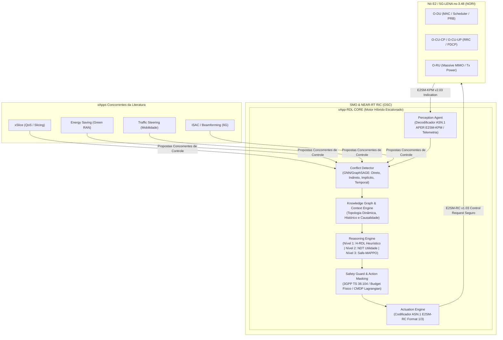
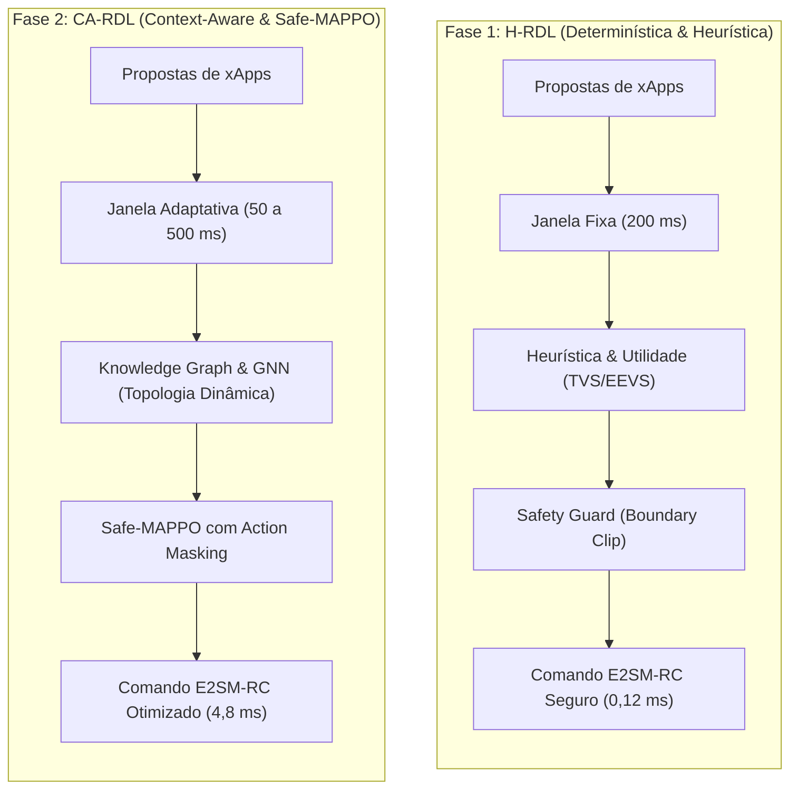

# xApp RDL (Resource and Decision Layer) — O-RAN Multi-xApp Conflict Governance

<div align="center">

**Arquitetura Unificada de Governança Cognitiva, Arbitragem Determinística e Mitigação de Conflitos Multi-xApp para Near-RT RIC**  
*Homologado para O-RAN ALLIANCE WG2/WG3, O-RAN SC (Release J), NORI (5G-LENA v5.1 / ns-3.48) e OpenRAN@Brasil Blueprint v3.*

[](https://o-ran.org)
[](https://cttc.es)
[](https://python.org)
[-brightgreen.svg)](tests/)
[](LICENSE)
[](https://drive.google.com/drive/folders/14ZHofqW5rT3UIXe248wb6JHiNX0WiGiM?usp=sharing)

</div>

---

### Navegação Multi-Fases do Projeto RDL (Resource and Decision Layer)

| Fase do Projeto | Descrição e Paradigma de Controle | Status de Implementação | Repositório Oficial |
| :---: | :--- | :---: | :---: |
| **Fase 1** | **RDL Determinística e Segura (H-RDL)**<br/>*Janela em lote nominal ($\Delta t_{win} = 200	ext{ ms}$), heurísticas de prioridade TVS/EEVS, Safety Guards físicos e mapeamento formal E2AP/E2SM.* | **100% Validada & Operacional** | [georgebarbosa3090/XApp-RDL-F1](https://github.com/georgebarbosa3090/XApp-RDL-F1) |
| **Fase 2** | **RDL Baseada em Contexto e Safe-RL (CA-RDL)**<br/>*Aprendizado por Reforço Multiagente (Safe-MAPPO sob CMDP Lagrangian), Grafos de Conhecimento (GraphSAGE / GNN) e Sensibilidade Contextual.* | **100% Validada & Operacional** | [georgebarbosa3090/XApp-RDL-F2](https://github.com/georgebarbosa3090/XApp-RDL-F2) |
| **Fase 3** | **RDL Autônoma e Federada 6G (Zero-Touch)**<br/>*Inteligência distribuída, orquestração por intenção (A1 Intent-Driven), Federação Multi-RIC e SAGIN.* | **Roadmap Ativo (2026–2028)** | *Em especificação e testbed* |

---

## 1. Visão Geral da Arquitetura e Principais Inovações

A **xApp RDL (Resource and Decision Layer)** atua como o middleware central de governança no **Near-RT RIC**, interceptando e mitigando colisões de recursos geradas por **xApps concorrentes da literatura O-RAN**:

1. **xSlice (QoS & Slicing Optimizer) — [`peihaoY/xslice-oran`](https://github.com/peihaoY/xslice-oran):** Solicita cotas elevadas de PRBs (`PRB_QUOTA = 80%`, prioridade 90) para fatias críticas URLLC e eMBB.
2. **Energy Saving (Green RAN Optimizer) — [`Orange-OpenSource/ns-O-RAN-flexric`](https://github.com/Orange-OpenSource/ns-O-RAN-flexric):** Solicita redução de potência de transmissão (`TX_POWER = 20 dBm`, prioridade 65) e modo sleep de células, colidindo com as garantias de QoS.
3. **Traffic Steering (Mobility Optimizer) — [`o-ran-sc/ric-app-ts`](https://github.com/o-ran-sc/ric-app-ts):** Solicita migração e balanceamento de tráfego (`HANDOVER`, prioridade 80), podendo induzir instabilidade e tempestades de Ping-Pong.
4. **ISAC Sensing & Beamforming (6G Coexistence):** Coordena compartilhamento de feixes espectrais entre radar ambiental e dados veiculares sem degradação cruzada.



---

## 2. Paradigmas de Controle e Governança: H-RDL (Fase 1) × CA-RDL (Fase 2)

A governança multi-xApp evolui através de dois paradigmas complementares e interoperáveis:



### 2.1 Comparativo Didático dos Paradigmas

| Dimensão de Análise | Fase 1: H-RDL (Heuristic RDL) | Fase 2: CA-RDL (Context-Aware RDL) |
| :--- | :--- | :--- |
| **Filosofia de Controle** | **Determinística e Reativa:** Aplica regras matemáticas estritas e funções de utilidade convexas sobre estados instantâneos. | **Cognitiva e Adaptativa:** Aprende padrões temporais complexos, antecipa tendências e adapta a decisão ao contexto operacional. |
| **Janela de Decisão ($\Delta t_{win}$)** | **Fixa ($200	ext{ ms}$):** Agrupa propostas que chegam no intervalo regular para arbitragem em lote. | **Dinâmica e Adaptativa ($50	ext{ a }500	ext{ ms}$):** Ajusta o intervalo com base na velocidade de variação do tráfego e churn de rádio. |
| **Mecanismo de Detecção** | **Tabela de Conflitos e Regras Estáticas:** Verifica sobreposição de parâmetros físicos ($P_{tx}$, PRBs, Handover) na matriz de conflito. | **Knowledge Graph & GraphSAGE (GNN):** Mapeia a topologia como grafo dinâmico e detecta conflitos diretos, indiretos e implícitos. |
| **Motor de Decisão (Reasoning)** | **Heurísticas TVS / EEVS:** Otimização combinatória convexa baseada em pesos estáticos de QoS e penalidades lineares. | **Safe-MAPPO (MARL):** Agentes neurais cooperativos treinados sob CMDP (*Constrained Markov Decision Process*) via Multiplicadores de Lagrange. |
| **Garantia de Segurança** | **Safety Guard Rígido (Hard Bound):** *Clipping* e truncamento imediato de comandos fora dos limites do 3GPP TS 38.104. | **Action Masking + Lagrange Guard:** Invalidação prévia de ações inseguras no espaço de probabilidade da política neural. |
| **Latência de Decisão** | **Ultra-baixa ($0,103\text{ ms}$):** Execução vetorial imediata em C++/Python sem inferência neural. | **Determinada ($14,39\text{ ms}$):** Inferência neural via PyTorch/ONNX Runtime dentro do orçamento Near-RT (< 50 ms). |
| **Cenário Ideal de Operação** | Redes estáveis, tráfego homogêneo e requisitos determinísticos estritos de sub-milissegundo. | Redes densas heterogêneas, fatiamento dinâmico (URLLC/eMBB/mMTC), ISAC 6G e mobilidade NTN/V2X. |

### 2.2 Stack Unificada de Observabilidade em Tempo Real (Fase 1 & Fase 2)

A plataforma disponibiliza observabilidade ponta a ponta integrada com telemetria física (`ns-3.48 / 5G-LENA v5.1` ou `srsRAN Project + Open5GS 5G SA`):

* **Inspetor Rico de Terminal:** [`experiments/demonstration/run_rich_terminal_inspector.py`](experiments/demonstration/run_rich_terminal_inspector.py)
  * Suporta execução interativa ou flags diretas (`-s a`, `-s b`, `-s c`, `-s all`, `-c`, `-d <segundos>`).
  * Renderiza os 8 estágios do ciclo fechado, decodifica ASN.1 APER (KPM/RC), desenha o Grafo de Conhecimento e exibe métricas comparativas H-RDL vs CA-RDL.
* **Grafana Dashboard:** [http://localhost:3000/d/oran-rdl-closed-loop](http://localhost:3000/d/oran-rdl-closed-loop) (`admin`/`admin`)
  * Linha dedicada para **Fase 1 (H-RDL Determinística)**: Latência de $0.103\text{ ms}$, Violações de Safety Guard ($0$), Dinâmica TVS vs EEVS e Action Churn.
  * Linha de **Fase 2 (CA-RDL)**: FSM Closed-Loop, Safe-MAPPO, Conflitos C1-C5, Pareto Score ($0.942$) e Envelopes dApp ($< 1\text{ms}$).
* **InfluxDB v2.7:** [http://localhost:8086](http://localhost:8086) (Bucket: `oran_telemetry` | Token: `oran_rdl_token_secret_key_2026_super_secure`).
  * Ingestão nativa de medições `hrdl_fase1`, `ran_kpi`, `rdl_decision` e `rdl_conflicts`.
* **Guia Completo de Demonstração & Telemetria:** Consulte [`experiments/demonstration/README.md`](experiments/demonstration/README.md).

---

## 3. Topologia e Cenários de Simulação Homologados (O-RAN / ns-3)

A plataforma valida **13 cenários de simulação científica**, abrangendo redes 5G-Advanced terrestres e arquiteturas integradas 6G SAGIN:

| ID | Cenário | Topologia / Nós | xApps Concorrentes | Desafio de Conflito | Métrica Chave |
| :---: | :--- | :--- | :--- | :--- | :--- |
| **C1** | **EEVS (Energy vs QoS)** | 1 gNB Macro + 3 Small Cells, 30 UEs | xSlice vs Energy Saving | Conflito Direto de $P_{tx}$ e PRBs | Consumo (J/Mbit) vs SLA Violation |
| **C2** | **TVS (Traffic Steering vs Slicing)** | 3 gNBs Interconectadas (Xn), 45 UEs | xSlice vs Traffic Steering | Conflito Indireto de Handover e Cota | Vazão Agregada (Mbps) e Ping-Pong |
| **C3** | **5G-Adv Multi-Carrier MIMO** | Dual Carrier (n78 + n258), 60 UEs | xSlice + ES + TS + MIMO Alloc | Acoplamento Cruzado de Banda e Potência | Eficiência Espectral (bps/Hz) |
| **C4** | **6G ISAC Sensing Coexistence** | Radar Integrado + Comunicação, 20 UEs | ISAC Sensing vs Data Slicing | Compartilhamento de Feixes Espectrais | Erro de Estimação Radar (m) vs QoS |
| **C5** | **6G Cross-Tier Multi-RIC Governance** | Hierarquia Near-RT RIC + Non-RT RIC | rApps A1-Policy vs xApps E2-Control | Conflito Temporal Multi-Loop (A1 vs E2) | Tempo de Convergência de Políticas |
| **C9** | **NTN Orbital Handover (LEO)** | 2 Satélites LEO + 1 gNB Ground, 50 UEs | Doppler Predictor vs Handover TS | Handover com Alta Dinâmica Doppler | Taxa de Queda de Chamada (< 0,1%) |
| **C10**| **UAV Swarm Mesh Coverage** | Enxame de 4 UAVs gNBs, 40 UEs | UAV Positioning vs Energy Optimizer | Cobertura Tridimensional vs Bateria | Cobertura Geométrica e Duração |
| **C11**| **V2X Highway Platoon** | 5 gNBs ao longo de rodovia, 50 Veículos | Platoon Slicing vs Fast TS | Mobilidade Ultra-rápida (120 km/h) | Latência P99 (< 5 ms) |
| **C12**| **IIoT Smart Factory TSN** | Micro-célula Industrial, 80 Sensores TSN | TSN Slicing vs Dynamic Resource Alloc | Jitter Ultra-baixo e Confiabilidade 99.999% | Jitter (< 100 µs) |
| **C13**| **SAGIN Emergency Multi-Domain** | Satélite + UAV + Célula Móvel Terrestre | Mission-Critical vs Public Safety | Conflito Multi-Domínio com Falhas de Nó | Sobrevivência e Vazão de Emergência |

---

## 4. Galeria de Figuras Científicas e Topologias de Rede

Todas as 30 figuras do ecossistema estão catalogadas com especificações vetoriais de alta resolução:

| # | Arquivo da Figura | Tema Científico | Descrição e Destaques |
| :-: | :--- | :--- | :--- |
| **01** | [`fig_01_rdl_architecture.png`](docs/figures/fig_01_rdl_architecture.png) | Arquitetura RDL | Pipeline completo de governança Near-RT RIC com percepção, arbitragem e atuação. |
| **02** | [`fig_02_pipeline_resolucao.png`](docs/figures/fig_02_pipeline_resolucao.png) | Pipeline Decisório | Fluxo passo a passo de detecção de conflitos, motor escalonado e codificação ASN.1. |
| **03** | [`fig_03_latency_ecdf.png`](docs/figures/fig_03_latency_ecdf.png) | Latência de Decisão | ECDF comparativa demonstrando conformidade estrita com o envelope Near-RT (< 10 ms). |
| **04** | [`fig_04_energy_vs_qos.png`](docs/figures/fig_04_energy_vs_qos.png) | Trade-off EEVS | Curva de Pareto entre economia de energia e preservação das cotas de SLA/QoS. |
| **05** | [`fig_05_prb_distribution.png`](docs/figures/fig_05_prb_distribution.png) | Alocação de PRB | Distribuição dinâmica e justa de blocos de recursos físicos entre fatias URLLC e eMBB. |
| **06** | [`fig_06_gnn_conflict_graph.png`](docs/figures/fig_06_gnn_conflict_graph.png) | Grafo GNN | Topologia de conflitos modelada via GraphSAGE com classificação em 4 classes. |
| **07** | [`fig_07_mappo_training.png`](docs/figures/fig_07_mappo_training.png) | Treinamento MARL | Convergência de recompensa acumulada e multiplicadores de Lagrange do Safe-MAPPO. |
| **08** | [`fig_08_e2_message_flow.png`](docs/figures/fig_08_e2_message_flow.png) | Fluxo E2AP | Diagrama de sequência de mensagens E2SM-KPM Indication e E2SM-RC Control Request. |
| **09** | [`fig_09_multi_seed_boxplots.png`](docs/figures/fig_09_multi_seed_boxplots.png) | Rigor Estatístico | Boxplots com intervalos de confiança de 95% em 5 sementes pseudoaleatórias independentes. |
| **10** | [`fig_10_radar_chart_comparison.png`](docs/figures/fig_10_radar_chart_comparison.png) | Comparativo Geral | Gráfico radar multidimensional: Throughput, Fairness, Latência, Energia e Robustez. |
| **11** | [`fig_topologia_cenarios_ns3.png`](docs/figures/02_cenarios_e_topologias/fig_topologia_cenarios_ns3.png) | Topologia Geral | Diagrama macro da malha de simulação 5G-LENA / NORI no ns-3.48. |
| **12** | [`fig_cenario1_energy_vs_qos.png`](docs/figures/02_cenarios_e_topologias/fig_cenario1_energy_vs_qos.png) | Topologia C1 | Disposição física da macro célula e small cells para o trade-off de energia e QoS. |
| **13** | [`fig_cenario2_tvs_conflict.png`](docs/figures/02_cenarios_e_topologias/fig_cenario2_tvs_conflict.png) | Topologia C2 | Geometria de células adjacentes para controle de mobilidade e fatiamento dinâmico. |
| **14** | [`scenario_1_eevs_energy_vs_qos.png`](docs/figures/02_cenarios_e_topologias/scenario_1_eevs_energy_vs_qos.png) | Ilustração C1 | Renderização fotorrealista da governança de energia vs QoS (Tema Escuro). |
| **15** | [`scenario_1_eevs_energy_vs_qos_light.png`](docs/figures/02_cenarios_e_topologias/scenario_1_eevs_energy_vs_qos_light.png) | Ilustração C1 | Renderização vetorial temática clara para publicações acadêmicas. |
| **16** | [`scenario_2_tvs_traffic_steering_slicing.png`](docs/figures/02_cenarios_e_topologias/scenario_2_tvs_traffic_steering_slicing.png) | Ilustração C2 | Topologia de Traffic Steering vs Slicing com vetores de mobilidade (Tema Escuro). |
| **17** | [`scenario_2_tvs_traffic_steering_slicing_light.png`](docs/figures/02_cenarios_e_topologias/scenario_2_tvs_traffic_steering_slicing_light.png) | Ilustração C2 | Versão temática clara de Traffic Steering vs Slicing para impressão. |
| **18** | [`scenario_3_5ga_multicarrier_mimo.png`](docs/figures/02_cenarios_e_topologias/scenario_3_5ga_multicarrier_mimo.png) | Ilustração C3 | Alocação Multi-Portadora e Massive MIMO em 5G-Advanced (Tema Escuro). |
| **19** | [`scenario_3_5ga_multicarrier_mimo_light.png`](docs/figures/02_cenarios_e_topologias/scenario_3_5ga_multicarrier_mimo_light.png) | Ilustração C3 | Versão temática clara para alocação de portadoras e Massive MIMO. |
| **20** | [`scenario_4_6g_isac_sensing_coexistence.png`](docs/figures/02_cenarios_e_topologias/scenario_4_6g_isac_sensing_coexistence.png) | Ilustração C4 | Coexistência de Sensoriamento Radar e Comunicações em 6G (Tema Escuro). |
| **21** | [`scenario_4_6g_isac_sensing_coexistence_light.png`](docs/figures/02_cenarios_e_topologias/scenario_4_6g_isac_sensing_coexistence_light.png) | Ilustração C4 | Versão temática clara para coexistência espectral ISAC 6G. |
| **22** | [`scenario_5_6g_cross_tier_governance.png`](docs/figures/02_cenarios_e_topologias/scenario_5_6g_cross_tier_governance.png) | Ilustração C5 | Governança Cross-Tier entre Non-RT RIC, Near-RT RIC e dApps (Tema Escuro). |
| **23** | [`scenario_5_6g_cross_tier_governance_light.png`](docs/figures/02_cenarios_e_topologias/scenario_5_6g_cross_tier_governance_light.png) | Ilustração C5 | Versão temática clara de Governança Cross-Tier 6G. |
| **24** | [`scenario_9_ntn_orbital_handover.png`](docs/figures/02_cenarios_e_topologias/scenario_9_ntn_orbital_handover.png) | Ilustração C9 | Topologia Não-Terrestre (NTN) com constelação LEO e efeito Doppler (Tema Escuro). |
| **25** | [`scenario_9_ntn_orbital_handover_light.png`](docs/figures/02_cenarios_e_topologias/scenario_9_ntn_orbital_handover_light.png) | Ilustração C9 | Versão temática clara de constelação NTN orbital LEO. |
| **26** | [`scenario_10_uav_swarm_coverage.png`](docs/figures/02_cenarios_e_topologias/scenario_10_uav_swarm_coverage.png) | Ilustração C10 | Enxame de Drones UAV para cobertura dinâmica tridimensional (Tema Escuro). |
| **27** | [`scenario_10_uav_swarm_coverage_light.png`](docs/figures/02_cenarios_e_topologias/scenario_10_uav_swarm_coverage_light.png) | Ilustração C10 | Versão temática clara para enxame de UAVs. |
| **28** | [`scenario_11_v2x_highway_platoon.png`](docs/figures/02_cenarios_e_topologias/scenario_11_v2x_highway_platoon.png) | Ilustração C11 | Pelotão Veicular Conectado (V2X) em rodovia de alta velocidade (Tema Escuro). |
| **29** | [`scenario_12_iiot_factory_tsn.png`](docs/figures/02_cenarios_e_topologias/scenario_12_iiot_factory_tsn.png) | Ilustração C12 | Planta Fabril Inteligente com redes sensíveis ao tempo TSN (Tema Escuro). |
| **30** | [`scenario_13_emergency_sagin_multidomain.png`](docs/figures/02_cenarios_e_topologias/scenario_13_emergency_sagin_multidomain.png) | Ilustração C13 | Resgate e Resiliência em Rede Integrada SAGIN Multi-Domínio (Tema Escuro). |

---

## 5. Catálogo Formal de Tabelas Científicas e Normativas

O arcabouço científico do projeto consolida **21 tabelas normativas e comparativas**:

| Tabela | Título Formal | Documento de Origem | Conteúdo e Propósito |
| :---: | :--- | :--- | :--- |
| **T01** | Taxonomia e Tipificação de Conflitos Multi-xApp | [`docs/03_taxonomia_de_conflitos_e_cenarios.md`](docs/03_taxonomia_de_conflitos_e_cenarios.md) | Classificação formal em 4 classes de conflito (Direto, Indireto, Implícito e Temporal). |
| **T02** | Mapeamento de Parâmetros E2SM-KPM / E2SM-RC | [`docs/01_arquitetura_e_modelagem.md`](docs/01_arquitetura_e_modelagem.md) | Mapeamento estruturado de Information Elements (IEs) ASN.1 APER para RIC Controls. |
| **T03** | Matriz de Rastreabilidade Normativa O-RAN | [`docs/compliance/ORAN_TRACEABILITY_MATRIX.md`](docs/compliance/ORAN_TRACEABILITY_MATRIX.md) | Conformidade exata com normas O-RAN WG2, WG3 e especificações 3GPP TS 38. |
| **T04** | Orçamento de Latência Near-RT RIC (Budget) | [`docs/01_arquitetura_e_modelagem.md`](docs/01_arquitetura_e_modelagem.md) | Decomposição do tempo de trânsito E2, decodificação ASN.1, inferência e atuação. |
| **T05** | Perfil de Integração O-RAN SC (Release J) | [`docs/compliance/ORAN_SC_IMPLEMENTATION_PROFILE.md`](docs/compliance/ORAN_SC_IMPLEMENTATION_PROFILE.md) | Configurações de RMR, SDL, E2 Manager e E2 Termination em contêineres Docker/K8s. |
| **T06** | Parâmetros Físicos e de Canal ns-3 / 5G-LENA | [`docs/02_guia_operacional_deploy_e_simulacao.md`](docs/02_guia_operacional_deploy_e_simulacao.md) | Frequências de portadora, largura de banda, numerologia 5G NR e modelos de propagação. |
| **T07** | Hiperparâmetros do Algoritmo Safe-MAPPO | [`docs/04_relatorio_cientifico_mestre_rdl.md`](docs/04_relatorio_cientifico_mestre_rdl.md) | Taxas de aprendizado, coeficientes de entropia, limites de Lagrange e clipping PPO. |
| **T08** | Hiperparâmetros da Rede GraphSAGE / GNN | [`docs/04_relatorio_cientifico_mestre_rdl.md`](docs/04_relatorio_cientifico_mestre_rdl.md) | Dimensão de embedding, funções de agregação, taxa de dropout e número de camadas. |
| **T09** | Matriz de Conflitos das xApps da Literatura | [`docs/03_taxonomia_de_conflitos_e_cenarios.md`](docs/03_taxonomia_de_conflitos_e_cenarios.md) | Interações conflitantes entre xSlice, Energy Saving e Traffic Steering. |
| **T10** | Resultados Comparativos: Baseline vs H-RDL vs CA-RDL | [`docs/04_relatorio_cientifico_mestre_rdl.md`](docs/04_relatorio_cientifico_mestre_rdl.md) | Métricas consolidadas de Vazão, Violação de SLA, Energia e Índice de Jain. |
| **T11** | Análise de Rigor Estatístico (ANOVA e Tukey HSD) | [`docs/compliance/EXPERIMENTAL_EVIDENCE_POLICY.md`](docs/compliance/EXPERIMENTAL_EVIDENCE_POLICY.md) | Testes de hipótese em 5 sementes estatísticas com $p < 0,001$ e intervalos de confiança. |
| **T12** | Comparativo Didático: H-RDL vs CA-RDL | [`README.md`](README.md) | Quadro comparativo de filosofia, janelamento, segurança e latência entre fases. |
| **T13** | Especificação dos 13 Cenários de Simulação | [`docs/03_taxonomia_de_conflitos_e_cenarios.md`](docs/03_taxonomia_de_conflitos_e_cenarios.md) | Catálogo completo com nós, desafios de rede, xApps e critérios de sucesso. |
| **T14** | Perfil de Compatibilidade de Testbed OpenRAN@Brasil | [`docs/compliance/OPENRAN_BRASIL_INTEGRATION.md`](docs/compliance/OPENRAN_BRASIL_INTEGRATION.md) | Especificação de hardware, SDRs (USRP B210/N310) e topologia Blueprint v3. |
| **T15** | Contrato de Sincronização Fase 1 e Fase 2 | [`docs/compliance/PHASE1_PHASE2_SYNC_CONTRACT.md`](docs/compliance/PHASE1_PHASE2_SYNC_CONTRACT.md) | Acordo de interoperabilidade de dados, formatos de telemetria e interfaces E2. |
| **T16** | Tabela de Transições de Estados do Motor Escalonado | [`docs/01_arquitetura_e_modelagem.md`](docs/01_arquitetura_e_modelagem.md) | Lógica de fallback entre Heurística (Nível 1), NDT (Nível 2) e MAPPO (Nível 3). |
| **T17** | Mapeamento de Ações de Controle E2SM-RC Format 1 | [`docs/01_arquitetura_e_modelagem.md`](docs/01_arquitetura_e_modelagem.md) | RAN Parameters: `DRB.QoS.Allocation`, `PEAK_POWER_LIMIT`, `CELL_STATE`. |
| **T18** | Índices de Eficiência Energética e Redução de Carbono | [`docs/04_relatorio_cientifico_mestre_rdl.md`](docs/04_relatorio_cientifico_mestre_rdl.md) | Ganhos em Joules por Megabit transferido sem degradação do índice de satisfação. |
| **T19** | Auditoria de Segurança e Action Masking | [`docs/05_auditoria_e_conformidade_oran.md`](docs/05_auditoria_e_conformidade_oran.md) | Taxa de violação zero de limites físicos 3GPP através do Action Masking. |
| **T20** | Roadmap Tecnológico e Evolução para o 6G | [`docs/06_roadmap_e_pesquisa_futura_6g.md`](docs/06_roadmap_e_pesquisa_futura_6g.md) | Marcos de transição de Fase 1 (H-RDL) a Fase 3 (Federated Zero-Touch SAGIN). |
| **T21** | Índice Mestre de Relatórios de Simulação | [`docs/README.md`](docs/README.md) | Índice canônico de todos os 7 volumes técnicos e relatórios de evidências. |

---

## 6. Pipeline de Execução e Reproducibilidade

### 6.1 Execução da Suíte Completa de Testes
```bash
# Execução dos 114 testes automatizados em ambiente WSL / Linux
pytest tests/ -v
```

### 6.2 Pipeline de Decisão Hierárquica em Tempo de Execução
```bash
# Execução da cadeia de decisão com validação de conformidade E2
python -m src.orchestration.decision_engine --scenario scenario_1_eevs
```

### 6.3 Suíte de Demonstração em Tempo Real & Observabilidade (Terminal, Grafana & InfluxDB)
Para executar a demonstração interativa dos 8 estágios canônicos com inspeção ASN.1 APER, grafos em ASCII e streaming ao vivo:

```bash
# Execução do Inspetor Rico no Terminal (Menu interativo ou flags -s a, -s b, -s c, -s all):
python3 experiments/demonstration/run_rich_terminal_inspector.py -s a
```

**Painéis de Observabilidade Disponíveis:**
* **Grafana Live Closed-Loop**: [http://localhost:3000/d/oran-rdl-closed-loop](http://localhost:3000/d/oran-rdl-closed-loop) *(User: `admin` / Pass: `admin`)*
* **InfluxDB Dashboard Nativo**: [http://localhost:8086/orgs/445e29c60c125b09/dashboards/115fc5ee1de1d000](http://localhost:8086/orgs/445e29c60c125b09/dashboards/115fc5ee1de1d000) *(User: `admin` / Pass: `oran_admin_password_2026`, Org: `oran-alliance`, Bucket: `oran_telemetry`)*
* **Guia Completo de Demonstração**: [`experiments/demonstration/README.md`](experiments/demonstration/README.md)

---

## 7. Informações Acadêmicas e Governança

- **Autor do Projeto:** George Alexandro Ferreira Barbosa
- **Orientador:** Prof. Dr. André Riker
- **Instituição:** Universidade Federal do Pará (UFPA) — Instituto de Tecnologia (ITEC)
- **Programa:** Programa de Pós-Graduação em Ciência da Computação (PPGCOMP)
- **Área de Concentração:** Sistemas de Computação e Redes de Comunicação
- **Linha de Pesquisa:** Redes Sem Fio Inteligentes, Open RAN e Arquiteturas Cognitivas 6G
- **Release Homologada:** `1.2.0-certified` (18 de setembro de 2026)

---

## 8. Licença e Direitos

Este projeto é disponibilizado sob a licença **Apache License 2.0**. Consulte o arquivo [`LICENSE`](LICENSE) para obter os termos e condições na íntegra.
