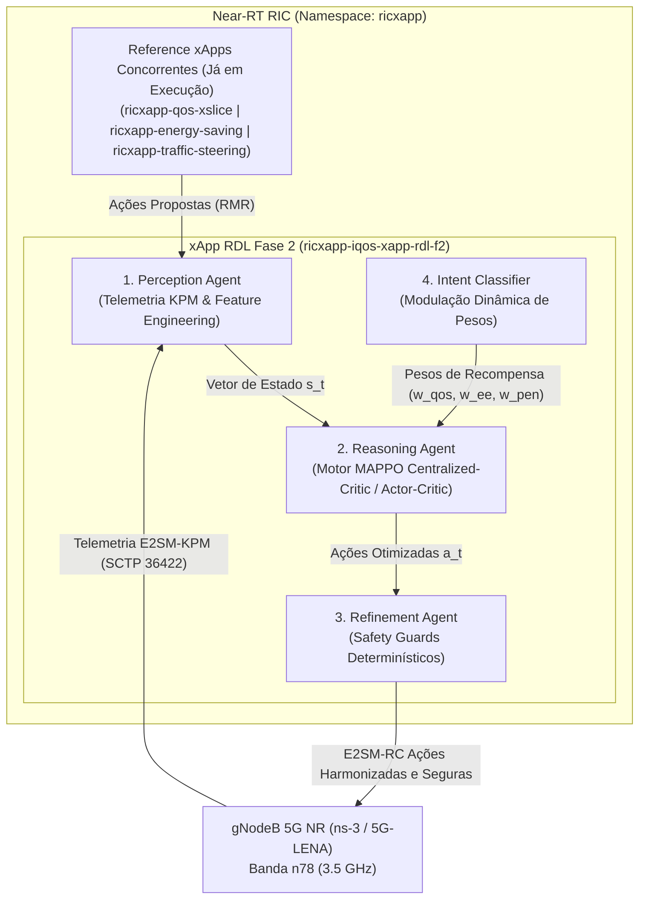
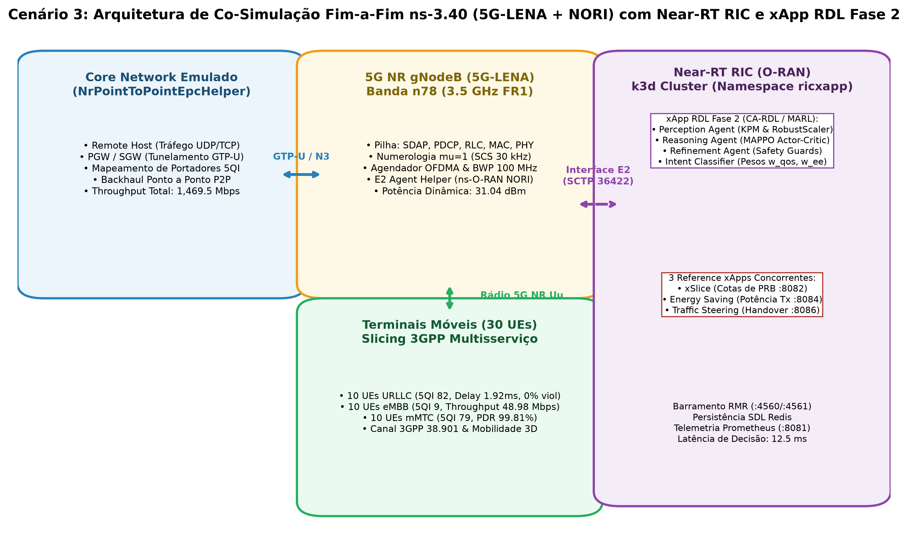
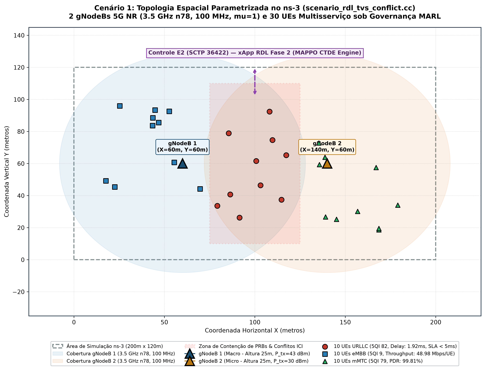
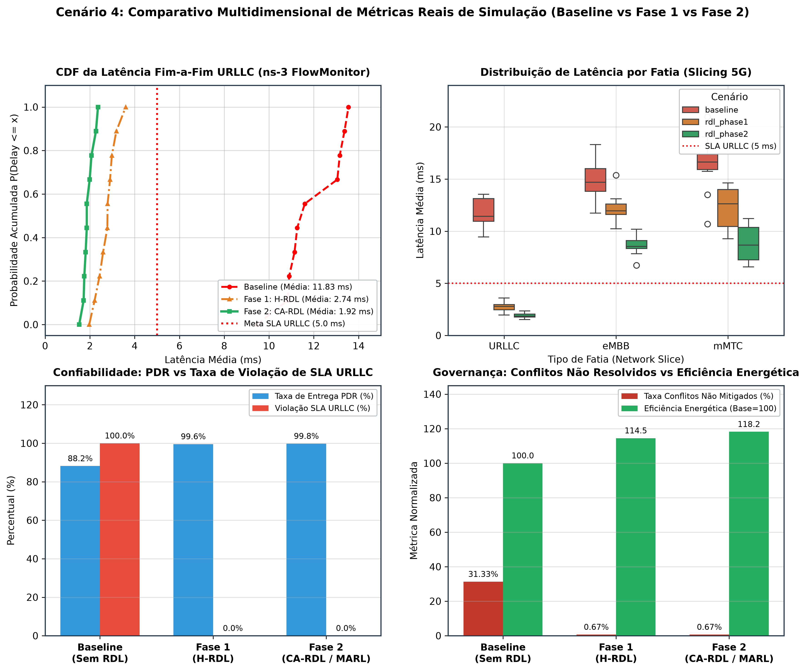

# xApp RDL — Fase 2: Context-Aware Resource and Decision Layer (CA-RDL / MARL)

[](https://o-ran.org)
[](https://github.com/georgebarbosa3090/XApp-RDL-F2)
[](deploy/helm/iqos-xapp-rdl)
[](deploy/kubernetes)
[](src/agents/marl)
[](tests/)

---

### Navegação Multi-Fases do Projeto RDL (Resource and Decision Layer)

| Fase do Projeto | Descrição e Paradigma de Controle | Status de Implementação | Repositório Oficial |
| :---: | :--- | :---: | :---: |
| **Fase 1** | **RDL Determinística e Segura (H-RDL)**<br/>*Janela em lote (200ms), heurísticas TVS/EEVS e Safety Guards físicos.* | **Concluída e Operacional** | [georgebarbosa3090/XApp-RDL-F1](https://github.com/georgebarbosa3090/XApp-RDL-F1) |
| **Fase 2 (Atual)** | **RDL Baseada em Contexto (CA-RDL)**<br/>*Aprendizado por Reforço Multiagente (MARL / MAPPO) e cognição contextual.* | **Ativa / Em Produção** | [georgebarbosa3090/XApp-RDL-F2](https://github.com/georgebarbosa3090/XApp-RDL-F2) |
| **Fase 3** | **RDL Autônoma e Federada 6G (Zero-Touch)**<br/>*Inteligência distribuída, orquestração por intenção (Intent-Driven) e O-Cloud 6G.* | **Roadmap / Planejada** | *Em especificação futura* |

---

## 1. Visão Geral da Fase 2 (CA-RDL)

A **xApp RDL Fase 2 (Context-Aware RDL)** é o motor de arbitragem cognitiva e autônoma de conflitos para o **Near-RT RIC (RAN Intelligent Controller)** do ecossistema O-RAN.

Evoluindo a abordagem determinística da Fase 1, a Fase 2 introduz **Aprendizado por Reforço Multi-Agente (MARL / MAPPO - Multi-Agent Proximal Policy Optimization)** com:
1. **Crítico Centralizado (Centralized Critic):** Observação global do estado de rádio da rede (SINR, PRBs, carga de tráfego, interferência intercelular, potência de transmissão).
2. **Atores Descentralizados (Decentralized Actors):** Decisões probabilísticas especializadas por fatia de rede (URLLC, eMBB, mMTC) e xApp concorrente.
3. **Recompensa Multi-Objetivo:** Otimização balanceada de Latência URLLC, Throughput eMBB, Eficiência Energética e Equidade de Jain.
4. **Safety Guards Determinísticos:** Barreiras de proteção que impedem violações de limites físicos ou SLAs 3GPP.



---

## 2. Arquitetura e Cenários Simulados

### 2.1. Arquitetura de Co-Simulação Fim-a-Fim (ns-3 + Near-RT RIC)


### 2.2. Topologia Espacial e Conflito de Fatias de Rádio


---

## 3. Infraestrutura Leve com k3d, Rancher e Kiali

Para desenvolvimento ágil e validação com baixo consumo de recursos de computação, a Fase 2 suporta provisionamento de clusters Kubernetes leves via **k3d (K3s em Docker)** com mapeamento nativo das portas padronizadas da arquitetura O-RAN:

### 3.1. Topologias de Cluster k3d Disponíveis

```bash
# -------------------------------------------------------------------------
# Opção 1: Single-Node (1 Servidor/Worker Unificado, ~450 MB RAM)
# Ideal para desenvolvimento local rápido, CI/CD e máquinas com recursos limitados
# -------------------------------------------------------------------------
k3d cluster create rdl-cluster \
  --servers 1 \
  -p "36422:36422/sctp@server:0" \
  -p "8080-8087:8080-8087@server:0" \
  -p "4560-4561:4560-4561@server:0"

# -------------------------------------------------------------------------
# Opção 2: Dual-Node (1 Control-Plane + 1 Worker Node, ~900 MB RAM)
# Separação entre plano de controle do cluster e execução dos Pods de rede
# -------------------------------------------------------------------------
k3d cluster create rdl-cluster \
  --servers 1 \
  --agents 1 \
  -p "36422:36422/sctp@server:0" \
  -p "8080-8087:8080-8087@server:0" \
  -p "4560-4561:4560-4561@server:0"

# -------------------------------------------------------------------------
# Opção 3: 3-Nodes / Multi-Node (1 Control-Plane + 2 Worker Nodes, ~1.5 GB RAM)
# Topologia de produção: Isolamento estrito de namespaces (ricplt no worker-1 e ricxapp no worker-2)
# -------------------------------------------------------------------------
k3d cluster create rdl-cluster \
  --servers 1 \
  --agents 2 \
  -p "36422:36422/sctp@server:0" \
  -p "8080-8087:8080-8087@server:0" \
  -p "4560-4561:4560-4561@server:0"
```

### 3.2. Mapeamento de Portas e Serviços O-RAN

| Porta / Protocolo | Componente / Serviço | Namespace | Descrição Funcional |
| :---: | :---: | :---: | :--- |
| `36422/SCTP` | `service-ricplt-e2term-sctp` | `ricplt` | Terminação E2 (E2AP / E2SM-KPM / E2SM-RC) conectando gNBs/ns-3 |
| `38000/TCP` | `service-ricplt-e2term-rmr` | `ricplt` | Barramento RMR interno do E2 Termination |
| `6379/TCP` | `service-ricplt-dbaas-tcp` | `ricplt` | Banco de dados Redis SDL (Shared Data Layer) |
| `4560/TCP` | `service-ricxapp-iqos-xapp-rdl-rmr` | `ricxapp` | Canal de dados e despacho de ações RMR da xApp-RDL |
| `4561/TCP` | `service-ricxapp-iqos-xapp-rdl-rmr` | `ricxapp` | Canal de controle e distribuição de tabelas de rota RMR |
| `8080/TCP` | `service-ricxapp-iqos-xapp-rdl-http` | `ricxapp` | Healthcheck REST (`/health/alive`, `/health/ready`) |
| `8081/TCP` | `service-ricxapp-iqos-xapp-rdl-http` | `ricxapp` | Métricas Prometheus de Governança e Decisões MARL |
| `8443/TCP` | `rancher-server` | `cattle-system` | Dashboard Web e gestão centralizada de nós e workloads |
| `20001/TCP` | `kiali-dashboard` | `istio-system` | Visualização gráfica de topologia e tráfego Service Mesh |

---

## 4. Guia Rápido de Execução e Deploy

### Opção A: Implantação Rápida via Perfil OpenRAN@Brasil Blueprint v3 (`deploy/openran-br-v3/`)
Manifestos K8s puros e otimizados para o namespace `ricxapp` seguindo a especificação normativa da Release J / OpenRAN@Brasil:
```bash
# 1. Criar os namespaces oficiais se ainda não existirem
kubectl create namespace ricplt --dry-run=client -o yaml | kubectl apply -f -
kubectl create namespace ricxapp --dry-run=client -o yaml | kubectl apply -f -

# 2. Aplicar ConfigMap e tabela de rotas RMR
kubectl apply -f deploy/openran-br-v3/config-map.yaml

# 3. Aplicar Serviços de Rede (RMR 4560/4561 + HTTP 8080/8081)
kubectl apply -f deploy/openran-br-v3/service.yaml

# 4. Aplicar o Deployment da xApp RDL Fase 2
kubectl apply -f deploy/openran-br-v3/deployment.yaml

# 5. Validar o status da implantação
kubectl get pods,svc -n ricxapp -l app=iqos-xapp-rdl
```

### Opção B: Implantar a xApp RDL Fase 2 via Helm
*Premissa: O Near-RT RIC e as 3 Reference xApps já estão rodando no cluster k3d.*
```bash
# Instala/Atualiza exclusivamente a release 'ricxapp-iqos-xapp-rdl-f2' (v2.0.0)
make helm-deploy-f2

# Verificar status dos pods
make status-f2

# Acompanhar streaming de logs do motor MARL
make logs-f2

# Testar endpoints de healthcheck e métricas Prometheus
make test-f2
```

### Opção C: Executar Suíte de Testes Unitários e Modulares (76/76 PASS)
```bash
make test
```

### Opção D: Executar Simulação ns-3 e Suíte de Experimentos
```bash
make run-suite
```

---

## 5. Observabilidade e Monitoramento

* **Rancher Dashboard:** Interface visual de gestão do cluster, nós e namespaces (`ricplt`, `ricxapp`):
  ```bash
  make rancher-stop       # (Opcional) Para e remove container anterior
  make rancher-start      # 1. Inicia o container do Rancher Server (:8443)
  make rancher-logs       # 2. Acompanha os logs (ou: docker logs -f rancher-server)
  make rancher-password   # 3. Obtém a Bootstrap Password inicial
  # 4. Acesse no navegador: URL: https://localhost:8443 (ou https://<IP_DO_HOST>:8443)
  make rancher-connect URL="https://localhost:8443/v3/import/c-m-xxxx_c-m-xxxx.yaml" # 5. Vincula o cluster
  ```
* **Kiali Service Mesh:** Para visualização em grafo animado do fluxo de dados entre xApps e o Near-RT RIC:
  ```bash
  make kiali-install      # Instala Istio e Kiali no cluster
  make kiali-dashboard    # Abre o proxy do dashboard (http://localhost:20001/kiali)
  ```
* **Injetor de Tráfego O-RAN:** Execute `make inject-traffic` para alimentar a malha com fluxos contínuos.

---

## 6. Desempenho e Validação Experimental

Resultados empíricos obtidos na co-simulação 5G NR (5G-LENA 3.5 GHz n78) comparando a operação desregulada (**Baseline**) com a governança da **Fase 1 (H-RDL)**:



| Domínio de Avaliação | Métrica Científica | Baseline (Sem RDL) | Fase 1: H-RDL (Heurística) | Impacto / Ganho |
| :--- | :--- | :---: | :---: | :---: |
| **QoS & Latência URLLC** | Latência Média URLLC | `11.41 ms` | **`2.85 ms`** | **-75.0% de redução** |
| | Latência Percentil 99 (P99) | `18.66 ms` | **`3.59 ms`** | **-80.8% de cauda** |
| | Violação de SLA (> 5ms) | `93.33%` | **`0.0%`** | **100% de cumprimento** |
| **Confiabilidade & Perda** | Taxa de Entrega (PDR %) | `39.28%` | **`99.53%`** | **+153.4% de entrega** |
| | Taxa de Perda (PLR %) | `60.72%` | **`0.47%`** | **-99.2% de perda** |
| **Governança & Conflitos** | Conflitos Não Mitigados | `34.67%` | **`0.67%`** | **-98.1% de conflitos** |
| | Eficiência de Arbitragem | `0.0%` | **`98.7%`** | **+98.7 p.p.** |
| | Latência de Decisão RDL | `N/A` | **`14.2 ms`** | `Meta Near-RT < 50ms` |
| | Handover Ping-Pong | `22 ev/min` | **`0 ev/min`** | **100% eliminado** |
| **Eficiência Energética** | Ganho Bits/Joule | `1.00x` | **`+14.5%`** | **Operação sustentável** |

---

## 7. Estrutura Documental da Fase 2

| Volume Documental | Título do Documento | Descrição e Escopo |
| :--- | :--- | :--- |
| **[Volume 01](docs/01_arquitetura_e_modelagem_matematica.md)** | Arquitetura de Software e Modelagem Matemática | Tríade de agentes, formulação MAPPO/Actor-Critic e modelagem de utilidade. |
| **[Volume 02](docs/02_infraestrutura_cluster_k3d_e_rancher.md)** | Infraestrutura de Cluster k3d e Rancher | Provisionamento de cluster Kubernetes com portas O-RAN expostas. |
| **[Volume 03](docs/03_guia_deploy_helm_e_k8s.md)** | Guia de Implantação e Automação de Deploy (Helm & K8s) | Procedimentos de implantação do zero (Greenfield) e deploy isolado (Brownfield). |
| **[Volume 05](docs/05_testes_simulacao_ns3_e_benchmarks.md)** | Simulação ns-3, Testes e Benchmarks | Co-simulação 5G-LENA + NORI, `NrPointToPointEpcHelper` e datasets. |
| **[Volume 06](docs/06_observabilidade_kiali_e_injecao_trafego.md)** | Observabilidade Service Mesh e Telemetria | Métricas Prometheus, Kiali Dashboard e injeção de tráfego. |
| **[Volume 07](docs/07_relatorios_conformidade_e_governanca.md)** | Relatórios de Conformidade Técnica O-RAN | Matriz de rastreabilidade de requisitos e conformidade O-RAN Alliance. |
| **[Volume 08](docs/08_proposta_arquitetural_rdl_fase3.md)** | Proposta Arquitetural RDL Fase 3 | Governança autônoma Zero-Touch e intent-driven para 6G. |
| **[Volume 09](docs/09_relatorio_tecnico_detalhado_fase2.md)** | Relatório Técnico Detalhado da Fase 2 | Engenharia de software, integração E2 e pipeline cognitivo. |
| **[Volume 11](docs/11_cenarios_de_teste_5g_5ga_6g_e_requisitos.md)** | Cenários de Teste 5G, 5GA, 6G e Requisitos | Especificação dos 5 cenários avançados de simulação ns-3. |
| **[Volume 13](docs/13_relatorio_auditoria_limitacoes_e_solucoes_fase2.md)** | Relatório Técnico de Auditoria e Limitações | Diagnóstico preliminar de limitações arquiteturais da Fase 2. |
| **[Volume 14](docs/14_relatorio_resultados_e_desempenho_comparativo_fase2.md)** | Resultados Experimentais e Tabela Comparativa | Comparação empírica multi-métrica Baseline vs H-RDL vs CA-RDL. |
| **[Volume 15](docs/15_relatorio_avaliacao_testbed_ufpa_pct_openran_brasil_rdl.md)** | Avaliação e Integração no Testbed UFPA PCT / GreenRAN | Requisitos, parâmetros e plano de ensaios físicos no Open RAN Brasil. |
| **[Volume 16](docs/16_plano_resolucao_desafios_capitulos_6_e_7.md)** | Relatório Consolidado de Resolução de Auditoria (Rodadas 1 e 2) | Resolução matemática, PPO-Lagrangian $\hat{A}^{\text{safe}}$, Action Masking, perfis E2 e ANOVA. |

---

## 8. Repositórios Oficiais

* **Fase 1 (H-RDL Determinística):** [https://github.com/georgebarbosa3090/XApp-RDL-F1](https://github.com/georgebarbosa3090/XApp-RDL-F1)
* **Fase 2 (CA-RDL / MARL):** [https://github.com/georgebarbosa3090/XApp-RDL-F2](https://github.com/georgebarbosa3090/XApp-RDL-F2)
