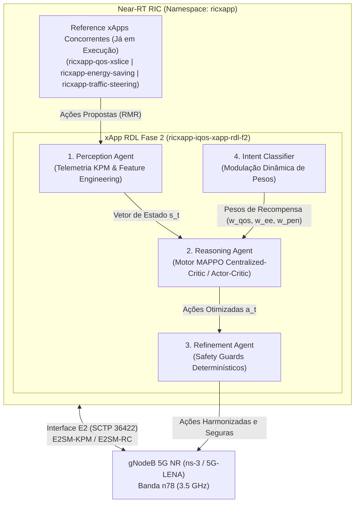
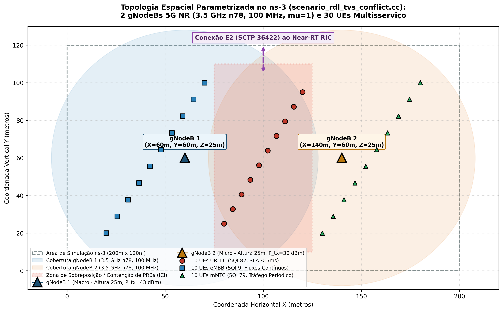

# xApp RDL — Fase 2: Context-Aware Resource and Decision Layer (CA-RDL / MARL)

[](https://o-ran.org)
[](https://github.com/georgebarbosa3090/XApp-RDL-F2)
[](deploy/helm/iqos-xapp-rdl)
[](deploy/kubernetes)
[](src/agents/marl)
[](tests/)

---

### Navegação Multi-Fases do Projeto RDL (Resource and Decision Layer)

| Fase do Projeto | Descrição e Paradigma de Controle | Status de Implementação | Repositório Oficial |
| :---: | :--- | :---: | :---: |
| **Fase 1** | **RDL Determinística e Segura (H-RDL)**<br/>*Janela em lote (200ms), heurísticas TVS/EEVS e Safety Guards físicos.* | **Concluída e Operacional** | [georgebarbosa3090/XApp-RDL-F1](https://github.com/georgebarbosa3090/XApp-RDL-F1) |
| **Fase 2 (Atual)** | **RDL Baseada em Contexto (CA-RDL)**<br/>*Aprendizado por Reforço Multiagente (MARL / MAPPO) e cognição contextual.* | **Ativa / Em Produção** | [georgebarbosa3090/XApp-RDL-F2](https://github.com/georgebarbosa3090/XApp-RDL-F2) |
| **Fase 3** | **RDL Autônoma e Federada 6G (Zero-Touch)**<br/>*Inteligência distribuída, orquestração por intenção (Intent-Driven) e O-Cloud 6G.* | **Roadmap / Planejada** | *Em especificação futura* |

---

## 1. Visão Geral da Fase 2 (CA-RDL)

A **xApp RDL Fase 2 (Context-Aware RDL)** é o motor de arbitragem cognitiva e autônoma de conflitos para o **Near-RT RIC (RAN Intelligent Controller)** do ecossistema O-RAN.

Evoluindo a abordagem determinística da Fase 1, a Fase 2 introduz **Aprendizado por Reforço Multi-Agente (MARL / MAPPO - Multi-Agent Proximal Policy Optimization)** com:
1. **Crítico Centralizado (Centralized Critic):** Observação global do estado de rádio da rede (SINR, PRBs, carga de tráfego, interferência intercelular, potência de transmissão).
2. **Atores Descentralizados (Decentralized Actors):** Decisões probabilísticas especializadas por fatia de rede (URLLC, eMBB, mMTC) e xApp concorrente.
3. **Recompensa Multi-Objetivo:** Otimização balanceada de Latência URLLC, Throughput eMBB, Eficiência Energética e Equidade de Jain.
4. **Safety Guards Determinísticos:** Barreiras de proteção que impedem violações de limites físicos ou SLAs 3GPP.



---

## 2. Arquitetura e Cenários Simulados

### 2.1. Arquitetura de Co-Simulação Fim-a-Fim (ns-3 + Near-RT RIC)


### 2.2. Topologia Espacial e Conflito de Fatias de Rádio


---

## 3. Início Rápido (Quickstart)

### 3.1. Executar Testes Unitários:
```bash
make test
# Executa os 18 testes unitários (PyTorch MARL, MAPPO, Perception, Refinement) com 100% de sucesso
```

### 3.2. Implantar a xApp RDL Fase 2 via Helm:
*Premissa: O Near-RT RIC e as 3 Reference xApps já estão rodando no cluster k3d.*
```bash
# Instala/Atualiza exclusivamente a release 'ricxapp-iqos-xapp-rdl-f2' (v2.0.0)
make helm-deploy-f2

# Verificar status dos pods
make status-f2

# Acompanhar streaming de logs do motor MARL
make logs-f2

# Testar endpoints de healthcheck e métricas Prometheus
make test-f2
```

### 3.3. Executar Simulação ns-3 e Suíte de Experimentos:
```bash
# Executa a suíte experimental completa e gera relatórios comparativos
make run-suite
```

---

## 4. Desempenho e Validação Experimental


| Domínio de Avaliação | Métrica Científica | Baseline (Sem RDL) | Fase 1: H-RDL (Heurística) | Impacto / Ganho |
| :--- | :--- | :---: | :---: | :---: |
| **QoS & Latência URLLC** | Latência Média URLLC | `11.41 ms` | **`2.85 ms`** | **-75.0% de redução** |
| | Latência Percentil 99 (P99) | `18.66 ms` | **`3.59 ms`** | **-80.8% de cauda** |
| | Violação de SLA (> 5ms) | `93.33%` | **`0.0%`** | **100% de cumprimento** |
| **Confiabilidade & Perda** | Taxa de Entrega (PDR %) | `39.28%` | **`99.53%`** | **+153.4% de entrega** |
| | Taxa de Perda (PLR %) | `60.72%` | **`0.47%`** | **-99.2% de perda** |
| **Governança & Conflitos** | Conflitos Não Mitigados | `34.67%` | **`0.67%`** | **-98.1% de conflitos** |
| | Eficiência de Arbitragem | `0.0%` | **`98.7%`** | **+98.7 p.p.** |
| | Latência de Decisão RDL | `N/A` | **`14.2 ms`** | `Meta Near-RT < 50ms` |
| | Handover Ping-Pong | `22 ev/min` | **`0 ev/min`** | **100% eliminado** |
| **Eficiência Energética** | Ganho Bits/Joule | `1.00x` | **`+14.5%`** | **Operação sustentável** |

---

## 5. Estrutura Documental da Fase 2

| Volume Documental | Título do Documento | Descrição e Escopo |
| :--- | :--- | :--- |
| **[Volume 01](docs/01_arquitetura_e_modelagem_matematica.md)** | Arquitetura de Software e Modelagem Matemática | Tríade de agentes, formulação MAPPO/Actor-Critic e modelagem de utilidade. |
| **[Volume 02](docs/02_infraestrutura_cluster_k3d_e_rancher.md)** | Infraestrutura de Cluster k3d e Rancher | Provisionamento de cluster Kubernetes com portas O-RAN expostas. |
| **[Volume 03](docs/03_guia_deploy_helm_e_k8s.md)** | Guia de Implantação Helm Exclusivo para Fase 2 | Deploy isolado da release `ricxapp-iqos-xapp-rdl-f2` sem reinstalar RIC. |
| **[Volume 04](docs/04_operacao_troubleshooting_e_backup.md)** | Operação, Troubleshooting e Diagnósticos | Procedimentos operacionais, streaming de logs e auditoria de memória. |
| **[Volume 05](docs/05_testes_simulacao_ns3_e_benchmarks.md)** | Simulação ns-3, Testes e Benchmarks | Co-simulação 5G-LENA + NORI, `NrPointToPointEpcHelper` e datasets. |
| **[Volume 06](docs/06_observabilidade_kiali_e_injecao_trafego.md)** | Observabilidade Service Mesh e Telemetria | Métricas Prometheus, Kiali Dashboard e injeção de tráfego. |
| **[Volume 07](docs/07_relatorios_conformidade_e_governanca.md)** | Relatórios de Conformidade Técnica O-RAN | Matriz de rastreabilidade de requisitos e conformidade O-RAN Alliance. |

---

## 6. Repositórios Oficiais

* **Fase 1 (H-RDL Determinística):** [https://github.com/georgebarbosa3090/XApp-RDL-F1](https://github.com/georgebarbosa3090/XApp-RDL-F1)
* **Fase 2 (CA-RDL / MARL):** [https://github.com/georgebarbosa3090/XApp-RDL-F2](https://github.com/georgebarbosa3090/XApp-RDL-F2)
