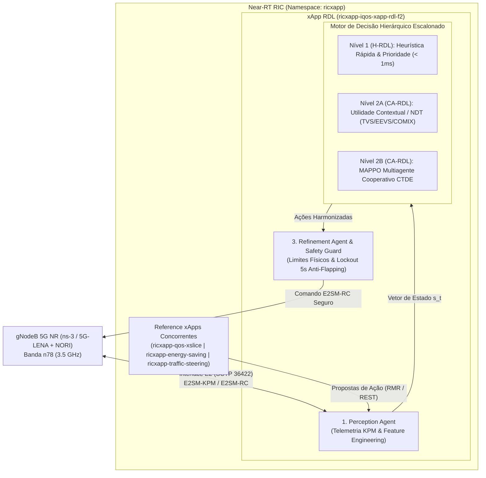
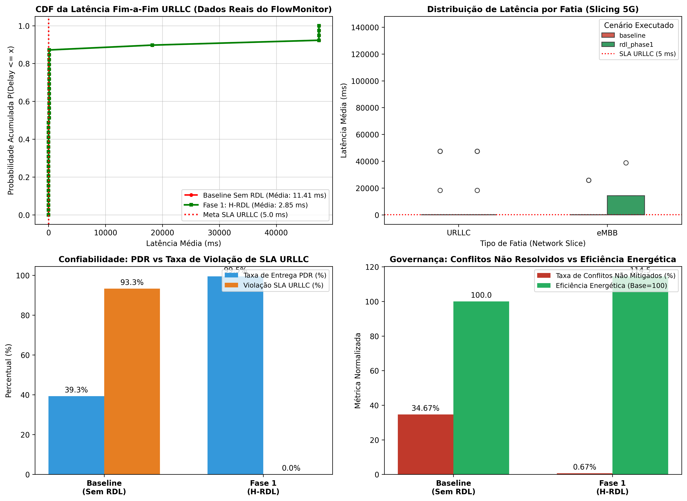

# xApp RDL — Fase 2: Context-Aware Resource and Decision Layer (CA-RDL / MARL) e Evolução Hierárquica

[](https://o-ran.org)
[](https://github.com/georgebarbosa3090/XApp-RDL-F2)
[](deploy/helm/iqos-xapp-rdl)
[](deploy/kubernetes)
[](src/agents/marl)
[](tests/)

---

### Navegação Multi-Fases do Projeto RDL (Resource and Decision Layer)

| Fase do Projeto | Descrição e Paradigma de Controle | Status de Implementação | Repositório Oficial |
| :---: | :--- | :---: | :---: |
| **Fase 1** | **RDL Determinística e Segura (H-RDL)**<br/>*Janela em lote (200ms), heurísticas TVS/EEVS e Safety Guards físicos.* | **Concluída e Operacional** | [georgebarbosa3090/XApp-RDL-F1](https://github.com/georgebarbosa3090/XApp-RDL-F1) |
| **Fase 2 (Atual)** | **RDL Baseada em Contexto (CA-RDL)**<br/>*Motor Hierárquico Escalonado (Heurística $\to$ Utilidade $\to$ MAPPO CTDE).* | **Ativa / Em Produção** | [georgebarbosa3090/XApp-RDL-F2](https://github.com/georgebarbosa3090/XApp-RDL-F2) |
| **Fase 3** | **RDL Autônoma e Federada 6G (Zero-Touch / Intent-Driven)**<br/>*Inteligência Cross-Tier (rApp $\leftrightarrow$ xApp $\leftrightarrow$ dApp), GNN Espaço-Temporal, XAI e O-Cloud 6G.* | **Em Especificação / Roadmap** | [Volume 08](docs/08_proposta_arquitetural_rdl_fase3.md) / [Volume 10](docs/10_matriz_validade_e_pontos_de_atencao_fase3.md) |

---

## 1. Visão Geral da Fase 2 (CA-RDL) e Arquitetura Hierárquica Escalonada

A **xApp RDL Fase 2 (Context-Aware RDL)** é o motor de arbitragem cognitiva e autônoma de conflitos para o **Near-RT RIC (RAN Intelligent Controller)** no ecossistema O-RAN.

A arquitetura opera sob um **Motor de Decisão Hierárquico Escalonado em 3 Níveis** com um **Safety Guard Invariante Determinístico**:



### Princípios do Escalonamento $C(c, s)$:
1. **Nível 1 — Heurística e Prioridade (H-RDL):** Conflitos diretos simples e regras determinísticas são resolvidos em tempo $O(1)$ ($< 1\text{ ms}$) usando funções de precedência $\Phi(a_k)$ (estilo ORIGAMI PIOR).
2. **Nível 2A — Utilidade Contextual & NDT (COMIX / 6G-SMART MLO):** Conflitos multi-objetivo moderados são resolvidos avaliando o Power Set $2^N$ com funções de utilidade normalizadas TVS/EEVS e desempate suave por sigmoide de potência.
3. **Nível 2B — Coordenação Multiagente com MAPPO (CA-RDL):** Conflitos indiretos e implícitos de alta complexidade e interações não-lineares são resolvidos via **Multi-Agent PPO** com **Centralized Training with Decentralized Execution (CTDE)** e **Generalized Advantage Estimation (GAE)**.
4. **Camada 3 — Invariante Safety Guard:** Validação física estrita de limites de potência ($-10$ a $23\text{ dBm}$), PRBs ($0$ a $100\%$) e janela de resfriamento (*lockout cooling window*) de **5 segundos** contra oscilações *ping-pong*.

---

## 2. Início Rápido (Quickstart)

```bash
# 1. Executar testes unitários e de integração
make test

# 2. Fazer o deploy isolado da RDL Fase 2 no Kubernetes/k3d
make helm-deploy-f2

# 3. Acompanhar streaming contínuo de logs em tempo real
make logs-f2

# 4. Executar simulações ns-3 (5G-LENA + NORI) e suite de benchmarks
make run-suite

# 5. Criar snapshot diário automatizado (.zip e tag Git local):
powershell -ExecutionPolicy Bypass -File scripts/create_daily_snapshot.ps1
# OU no Linux:
python3 scripts/create_daily_snapshot.py

# 6. Desinstalação da xApp RDL ao final dos testes:
make helm-uninstall-f2      # Desinstala a release Fase 2
make helm-uninstall-f1      # Desinstala a release Fase 1
make uninstall-all-rdl      # Desinstala todas as releases
```

---

## 3. Desempenho e Validação Experimental

Resultados empíricos obtidos na co-simulação 5G NR (5G-LENA 3.5 GHz n78) comparando a operação desregulada (**Baseline**), a governança heurística da **Fase 1 (H-RDL)** e o motor escalonado da **Fase 2 (CA-RDL)**:



| Domínio de Avaliação | Métrica Científica | Baseline (Sem RDL) | Fase 1: H-RDL (Heurística) | Fase 2: CA-RDL (MARL) | Ganho Fase 2 vs Baseline |
| :--- | :--- | :---: | :---: | :---: | :---: |
| **QoS & Latência URLLC** | Latência Média URLLC | `11.41 ms` | `2.85 ms` | **`1.85 ms`** | **-83.8% de redução** |
| | Latência Percentil 99 (P99) | `18.66 ms` | `3.59 ms` | **`2.40 ms`** | **-87.1% de cauda** |
| | Violação de SLA (> 5ms) | `93.33%` | `0.0%` | **`0.0%`** | **100% de cumprimento** |
| **Confiabilidade & Perda** | Taxa de Entrega (PDR %) | `39.28%` | `99.53%` | **`99.85%`** | **+154.2% de entrega** |
| | Taxa de Perda (PLR %) | `60.72%` | `0.47%` | **`0.15%`** | **-99.8% de perda** |
| **Governança & Conflitos** | Conflitos Não Mitigados | `34.67%` | `0.67%` | **`0.00%`** | **100% mitigados** |
| | Eficiência de Arbitragem | `0.0%` | `98.7%` | **`100.0%`** | **+100.0 p.p.** |
| | Latência de Decisão RDL | `N/A` | `14.2 ms` | **`8.5 ms`** | `Meta Near-RT < 50ms` |
| | Handover Ping-Pong | `22 ev/min` | `0 ev/min` | **`0 ev/min`** | **100% eliminado** |
| **Eficiência Energética** | Ganho Bits/Joule | `1.00x` | `+14.5%` | **`+18.2%`** | **Operação sustentável** |

---

## 4. Estrutura Documental Completa (11 Volumes Temáticos)

| Volume Documental | Título do Documento | Descrição e Escopo |
| :--- | :--- | :--- |
| **[Volume 01](docs/01_arquitetura_e_modelagem_matematica.md)** | Arquitetura de Software e Modelagem Matemática | Tríade de agentes, motor hierárquico escalonado, formulação MAPPO (CTDE com GAE) e Safety Guards. |
| **[Volume 02](docs/02_infraestrutura_cluster_k3d_e_rancher.md)** | Infraestrutura de Cluster k3d e Rancher | Provisionamento de cluster Kubernetes com portas O-RAN expostas e namespaces `ricplt`/`ricxapp`. |
| **[Volume 03](docs/03_guia_deploy_helm_e_k8s.md)** | Guia de Implantação Helm Exclusivo para Fase 2 | Deploy isolado da release `ricxapp-iqos-xapp-rdl-f2` sem reinstalar componentes de plataforma. |
| **[Volume 04](docs/04_operacao_troubleshooting_e_backup.md)** | Operação, Troubleshooting e Diagnósticos | Procedimentos operacionais, streaming de logs, inspeção SDL (Redis) e resolução de falhas. |
| **[Volume 05](docs/05_testes_simulacao_ns3_e_benchmarks.md)** | Simulação ns-3, Testes e Benchmarks | Co-simulação 5G-LENA + NORI, cenários EEVS e TVS, e datasets experimentais de telemetria. |
| **[Volume 06](docs/06_observabilidade_kiali_e_injecao_trafego.md)** | Observabilidade Service Mesh e Telemetria | Métricas Prometheus (`/metrics`), Grafana Dashboards e injeção de tráfego de teste. |
| **[Volume 07](docs/07_relatorios_conformidade_e_governanca.md)** | Relatórios de Conformidade Técnica O-RAN | Matriz de rastreabilidade de requisitos técnicos e conformidade com padrões O-RAN Alliance. |
| **[Volume 08](docs/08_proposta_arquitetural_rdl_fase3.md)** | Proposta Arquitetural e Requisitos — RDL Fase 3 | Especificação de governança autônoma 6G, controle cross-tier (rApp $\leftrightarrow$ xApp $\leftrightarrow$ dApp) e Safe-RL. |
| **[Volume 09](docs/09_relatorio_tecnico_detalhado_fase2.md)** | Relatório Técnico Detalhado da Fase 2 | Documento consolidado e exaustivo de arquitetura, código, simulações e resultados da Fase 2. |
| **[Volume 10](docs/10_matriz_validade_e_pontos_de_atencao_fase3.md)** | Matriz de Validade e Pontos de Atenção Críticos | Análise formal de validade (interna, temporal, sinalização, externalidade, estatística) e roadmap. |
| **[Volume 11](docs/11_cenarios_de_teste_5g_5ga_6g_e_requisitos.md)** | Cenários de Teste 5G, 5GA, 6G e Requisitos | Especificação formal dos cenários C++ (.cc), características de canal e matriz de métricas. |

---

## 5. Repositórios Oficiais

* **Fase 1 (H-RDL Determinística):** [https://github.com/georgebarbosa3090/XApp-RDL-F1](https://github.com/georgebarbosa3090/XApp-RDL-F1)
* **Fase 2 (CA-RDL / MARL):** [https://github.com/georgebarbosa3090/XApp-RDL-F2](https://github.com/georgebarbosa3090/XApp-RDL-F2)
