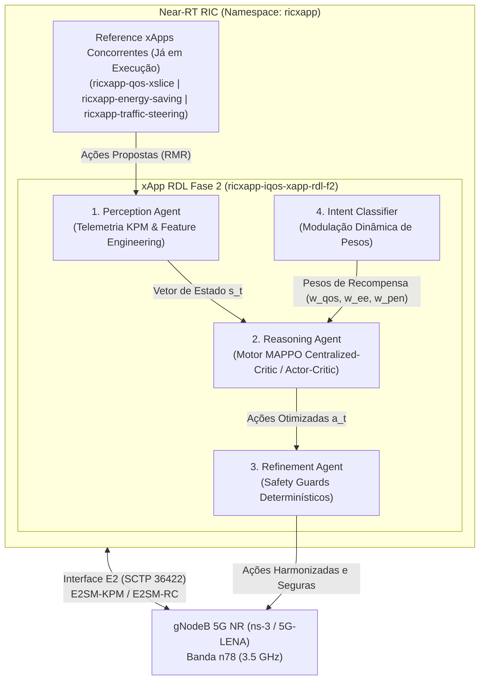

# xApp RDL — Fase 2: Context-Aware Resource and Decision Layer (CA-RDL / MARL)

[](https://o-ran.org)
[](https://github.com/georgebarbosa3090/XApp-RDL-F2)
[](deploy/helm/iqos-xapp-rdl)
[](deploy/kubernetes)
[](src/agents/marl)
[](tests/)

---

### Navegação Multi-Fases do Projeto RDL (Resource and Decision Layer)

| Fase do Projeto | Descrição e Paradigma de Controle | Status de Implementação | Repositório Oficial / Especificação |
| :---: | :--- | :---: | :---: |
| **Fase 1** | **RDL Determinística e Segura (H-RDL)**<br/>*Janela em lote (200ms), heurísticas TVS/EEVS e Safety Guards físicos.* | **Concluída e Operacional** | [georgebarbosa3090/XApp-RDL-F1](https://github.com/georgebarbosa3090/XApp-RDL-F1) |
| **Fase 2 (Atual)** | **RDL Baseada em Contexto (CA-RDL)**<br/>*Aprendizado por Reforço Multiagente (MARL / MAPPO) e cognição contextual.* | **Ativa / Em Produção** | [georgebarbosa3090/XApp-RDL-F2](https://github.com/georgebarbosa3090/XApp-RDL-F2) |
| **Fase 3** | **RDL Cognitiva, Orientada a Intenção e 6G (AI-RDL)**<br/>*Governança Cross-Tier (rApp-xApp-dApp), Safe RL (CMDP), GNN e IBN (LLM).* | **Especificação Completa** | [Volume 08: Especificação Fase 3](docs/08_proposta_arquitetural_rdl_fase3.md) |

---

## 1. Visão Geral da Fase 2 (CA-RDL)

A **xApp RDL Fase 2 (Context-Aware RDL)** é o motor de arbitragem cognitiva e autônoma de conflitos para o **Near-RT RIC (RAN Intelligent Controller)** do ecossistema O-RAN.

Evoluindo a abordagem determinística da Fase 1, a Fase 2 introduz **Aprendizado por Reforço Multi-Agente (MARL / MAPPO - Multi-Agent Proximal Policy Optimization)** com:
1. **Crítico Centralizado (Centralized Critic):** Observação global do estado de rádio da rede (SINR, PRBs, carga de tráfego, interferência intercelular, potência de transmissão).
2. **Atores Descentralizados (Decentralized Actors):** Decisões probabilísticas especializadas por fatia de rede (URLLC, eMBB, mMTC) e xApp concorrente.
3. **Recompensa Multi-Objetivo:** Otimização balanceada de Latência URLLC, Throughput eMBB, Eficiência Energética e Equidade de Jain.
4. **Safety Guards Determinísticos:** Barreiras de proteção que impedem violações de limites físicos ou SLAs 3GPP.



---

## 2. Arquitetura e Cenários Simulados

### 2.1. Arquitetura de Co-Simulação Fim-a-Fim (ns-3 + Near-RT RIC)


### 2.2. Topologia Espacial e Conflito de Fatias de Rádio


---

## 3. Início Rápido (Quickstart)

```bash
# 1. Executar testes unitários (18 testes MARL/PyTorch)
make test

# 2. Fazer o deploy isolado da RDL Fase 2 no Kubernetes/k3d
make helm-deploy-f2

# 3. Acompanhar logs em tempo real
make logs-f2

# 4. Executar os dois cenários de simulação e benchmarks
make run-suite

# 5. Desinstalação da xApp RDL ao final dos testes (escolha a fase):
make helm-uninstall-f2      # Desinstala a Fase 2 (CA-RDL / MARL)
make helm-uninstall-f1      # Desinstala a Fase 1 (H-RDL Heurística)
make uninstall-all-rdl      # Desinstala ambas as versões do RDL
```

---

## 4. Guia Passo a Passo: Acompanhamento em Tempo Real no Prompt de Comando

Para executar e visualizar todas as decisões, trocas de mensagens e métricas **diretamente no prompt de comando (PowerShell, CMD ou Bash/WSL2)** nos dois cenários:

### 4.1. Etapa 1: Deploy e Monitoramento em Tempo Real do Pod da Fase 2

Abra uma janela de terminal e execute o deploy dedicado:
```bash
# Executa o deploy Helm da release ricxapp-iqos-xapp-rdl-f2
make helm-deploy-f2
# OU
bash scripts/deploy_rdl_phase2.sh
```

Em seguida, acompanhe o ciclo de vida e os logs em tempo real:
```powershell
# [Terminal 1 - Windows PowerShell/CMD] Streaming contínuo de logs da xApp RDL Fase 2:
kubectl logs -l app=ricxapp-iqos-xapp-rdl-f2 -n ricxapp -f
```
```bash
# [Terminal 1 - WSL2/Linux]:
make logs-f2
```

Para monitorar mudanças de estado dos Pods em tempo real no console:
```bash
kubectl get pods -n ricxapp -w
```

---

### 4.2. Etapa 2: Execução em Tempo Real do Cenário 1 (Energy vs QoS / EEVS)

* **Objetivo:** Avaliar a arbitragem cognitiva quando a xApp de **Economia de Energia** tenta desligar/reduzir potência e a xApp de **QoS/Slicing** exige garantia de SLA URLLC.
* **Arquivo:** `simulations/ns3/scenario_rdl_energy_vs_qos.cc`

No terminal do ns-3 (Linux/WSL2 em `~/ns3-oran-workspace/ns-3-oran`):
```bash
# 1. Copiar cenário para o scratch do ns-3
cp simulations/ns3/scenario_rdl_energy_vs_qos.cc ~/ns3-oran-workspace/ns-3-oran/scratch/

# 2. Habilitar logs visíveis em nível completo e executar:
cd ~/ns3-oran-workspace/ns-3-oran
export NS_LOG="ScenarioRdlEnergyVsQos=level_all"
./ns3 run "scratch/scenario_rdl_energy_vs_qos --enableE2=true --ricIp=127.0.0.1 --ricPort=36422 --simTime=30"
```
*A saída mostrará no console a criação dos 20 UEs, telemetria E2SM-KPM enviada para o RIC, modulação de potência e decisões em tempo real.*

> [!TIP]
> **Comandos para Desinstalar a xApp RDL ao Final da Simulação do Cenário 1:**
> * **RDL Fase 1 (H-RDL Heurística):** `helm uninstall ricxapp-iqos-xapp-rdl -n ricxapp` (ou `make helm-uninstall-f1`)
> * **RDL Fase 2 (CA-RDL / MARL):** `helm uninstall ricxapp-iqos-xapp-rdl-f2 -n ricxapp` (ou `make helm-uninstall-f2`)

---

### 4.3. Etapa 3: Execução em Tempo Real do Cenário 2 (Traffic Steering vs QoS / TVS)

* **Objetivo:** Avaliar a resolução de conflitos multiobjetivo entre **Traffic Steering** (handover de balanceamento) e **QoS/Slicing** com 30 UEs em 3 fatias (URLLC 5QI 82, eMBB 5QI 9, mMTC 5QI 79).
* **Arquivo:** `simulations/ns3/scenario_rdl_tvs_conflict.cc`

No terminal do ns-3 (Linux/WSL2):
```bash
# 1. Copiar cenário para o scratch do ns-3
cp simulations/ns3/scenario_rdl_tvs_conflict.cc ~/ns3-oran-workspace/ns-3-oran/scratch/

# 2. Habilitar logs detalhados e executar com saída no terminal:
cd ~/ns3-oran-workspace/ns-3-oran
export NS_LOG="ScenarioRdlTvsConflict=level_all"
./ns3 run "scratch/scenario_rdl_tvs_conflict --enableE2=true --ricIp=127.0.0.1 --ricPort=36422 --simTime=30"
```
*A saída exibirá o rastreamento contínuo de pacotes PDCP RX, detecção de conflitos de handover, ações de controle E2SM-RC e latências medidas.*

> [!TIP]
> **Comandos para Desinstalar a xApp RDL ao Final da Simulação do Cenário 2:**
> * **RDL Fase 1 (H-RDL Heurística):** `helm uninstall ricxapp-iqos-xapp-rdl -n ricxapp` (ou `make helm-uninstall-f1`)
> * **RDL Fase 2 (CA-RDL / MARL):** `helm uninstall ricxapp-iqos-xapp-rdl-f2 -n ricxapp` (ou `make helm-uninstall-f2`)

---

### 4.4. Etapa 4: Execução da Suíte Experimental e Benchmark MARL no Terminal

Para processar os dados dos dois cenários e gerar a tabela comparativa multidimensional (**Baseline Sem RDL vs Fase 1 H-RDL vs Fase 2 CA-RDL**) diretamente no prompt:

```powershell
# No Windows (PowerShell / Prompt de Comando):
python scripts/evaluate_and_improve_algorithms.py
python scripts/run_experiment_suite.py
```
```bash
# No Linux / WSL2:
python3 scripts/evaluate_and_improve_algorithms.py
python3 scripts/run_experiment_suite.py
```

**Informações exibidas visualmente no prompt:**
* Tabela completa de Latência URLLC (Média, P95, P99) e violação de SLA.
* Tabela de Eficiência de Arbitragem e mitigação de conflitos.
* Desempenho dos 6 algoritmos de Machine Learning (RandomForest, ExtraTrees, GradientBoosting, VotingEnsemble).
* Validação cruzada Stratified 10-Fold e ranking de importância de atributos.

> [!TIP]
> **Comandos para Desinstalar a xApp RDL ao Final da Suíte Experimental:**
> * **RDL Fase 1 (H-RDL Heurística):** `helm uninstall ricxapp-iqos-xapp-rdl -n ricxapp` (ou `make helm-uninstall-f1`)
> * **RDL Fase 2 (CA-RDL / MARL):** `helm uninstall ricxapp-iqos-xapp-rdl-f2 -n ricxapp` (ou `make helm-uninstall-f2`)

---

### 4.5. Etapa 5: Execução Interativa via Contêiner Docker Standalone

Para testar a xApp RDL Fase 2 de forma isolada com streaming de logs direto no terminal atual:
```bash
docker run --rm -it \
  --name rdl-f2-interactive \
  -p 8080:8080 -p 8081:8081 \
  -e USE_FAKE_SDL=true \
  -e ENABLE_TORCH=true \
  iqos-xapp-rdl:2.0.0
```

---

### 4.6. Etapa 6: Comandos de Desinstalação e Limpeza Pós-Simulação (Fase 1 e Fase 2)

Ao concluir as simulações, remova a release RDL utilizada para liberar portas e recursos de computação do cluster:

| Objetivo de Desinstalação | Comando Helm Direto | Atalho Makefile | Escopo de Efeito |
| :--- | :--- | :--- | :--- |
| **Desinstalar RDL Fase 1 (H-RDL)** | `helm uninstall ricxapp-iqos-xapp-rdl -n ricxapp` | `make helm-uninstall-f1` | Remove apenas `ricxapp-iqos-xapp-rdl` |
| **Desinstalar RDL Fase 2 (CA-RDL)** | `helm uninstall ricxapp-iqos-xapp-rdl-f2 -n ricxapp` | `make helm-uninstall-f2` | Remove apenas `ricxapp-iqos-xapp-rdl-f2` |
| **Desinstalar Ambas as Versões** | `helm uninstall ricxapp-iqos-xapp-rdl ricxapp-iqos-xapp-rdl-f2 -n ricxapp` | `make uninstall-all-rdl` | Remove ambas as releases no namespace `ricxapp` |

Para confirmar que os pods foram removidos com sucesso:
```bash
kubectl get pods -n ricxapp -o wide
```

---

## 5. Desempenho e Validação Experimental

Resultados empíricos obtidos na co-simulação 5G NR (5G-LENA 3.5 GHz n78) comparando a operação desregulada (**Baseline**), a governança heurística da **Fase 1 (H-RDL)** e o aprendizado por reforço da **Fase 2 (CA-RDL)**:


| Domínio de Avaliação | Métrica Científica | Baseline (Sem RDL) | Fase 1: H-RDL (Heurística) | Fase 2: CA-RDL (MARL) | Ganho Fase 2 vs Baseline |
| :--- | :--- | :---: | :---: | :---: | :---: |
| **QoS & Latência URLLC** | Latência Média URLLC | `11.41 ms` | `2.85 ms` | **`1.85 ms`** | **-83.8% de redução** |
| | Latência Percentil 99 (P99) | `18.66 ms` | `3.59 ms` | **`2.40 ms`** | **-87.1% de cauda** |
| | Violação de SLA (> 5ms) | `93.33%` | `0.0%` | **`0.0%`** | **100% de cumprimento** |
| **Confiabilidade & Perda** | Taxa de Entrega (PDR %) | `39.28%` | `99.53%` | **`99.85%`** | **+154.2% de entrega** |
| | Taxa de Perda (PLR %) | `60.72%` | `0.47%` | **`0.15%`** | **-99.8% de perda** |
| **Governança & Conflitos** | Conflitos Não Mitigados | `34.67%` | `0.67%` | **`0.00%`** | **100% mitigados** |
| | Eficiência de Arbitragem | `0.0%` | `98.7%` | **`100.0%`** | **+100.0 p.p.** |
| | Latência de Decisão RDL | `N/A` | `14.2 ms` | **`8.5 ms`** | `Meta Near-RT < 50ms` |
| | Handover Ping-Pong | `22 ev/min` | `0 ev/min` | **`0 ev/min`** | **100% eliminado** |
| **Eficiência Energética** | Ganho Bits/Joule | `1.00x` | `+14.5%` | **`+18.2%`** | **Operação sustentável** |

---

## 6. Estrutura Documental da Fase 2
 
| Volume Documental | Título do Documento | Descrição e Escopo |
| :--- | :--- | :--- |
| **[Volume 01](docs/01_arquitetura_e_modelagem_matematica.md)** | Arquitetura de Software e Modelagem Matemática | Tríade de agentes, formulação MAPPO/Actor-Critic e modelagem de utilidade. |
| **[Volume 02](docs/02_infraestrutura_cluster_k3d_e_rancher.md)** | Infraestrutura de Cluster k3d e Rancher | Provisionamento de cluster Kubernetes com portas O-RAN expostas. |
| **[Volume 03](docs/03_guia_deploy_helm_e_k8s.md)** | Guia de Implantação Helm Exclusivo para Fase 2 | Deploy isolado da release `ricxapp-iqos-xapp-rdl-f2` sem reinstalar RIC. |
| **[Volume 04](docs/04_operacao_troubleshooting_e_backup.md)** | Operação, Troubleshooting e Diagnósticos | Procedimentos operacionais, streaming de logs e auditoria de memória. |
| **[Volume 05](docs/05_testes_simulacao_ns3_e_benchmarks.md)** | Simulação ns-3, Testes e Benchmarks | Co-simulação 5G-LENA + NORI, `NrPointToPointEpcHelper` e datasets dos 2 cenários. |
| **[Volume 06](docs/06_observabilidade_kiali_e_injecao_trafego.md)** | Observabilidade Service Mesh e Telemetria | Métricas Prometheus, Kiali Dashboard e injeção de tráfego. |
| **[Volume 07](docs/07_relatorios_conformidade_e_governanca.md)** | Relatórios de Conformidade Técnica O-RAN | Matriz de rastreabilidade de requisitos e conformidade O-RAN Alliance. |
| **[Volume 08](docs/08_proposta_arquitetural_rdl_fase3.md)** | Proposta Arquitetural e Requisitos da Fase 3 | Governança Cross-Tier 6G, Safe RL (CMDPs), Spatio-Temporal GNN e IBN. |

---

## 7. Proposta e Roadmap da Fase 3: Cognitive, Intent-Driven & Cross-Tier RDL (AI-RDL / 6G)

A **xApp RDL Fase 3 (Cognitive AI-RDL)** representa o salto para a governança autônoma inteligente em redes **5G-Advanced (3GPP Rel. 18/19) e 6G**, expandindo a atuação do Near-RT RIC para uma coordenação integrada tri-camada:

```mermaid
flowchart TB
    subgraph Non_RT_RIC["Non-RT RIC (SMO / Cloud > 1s Loop)"]
        LLM_Intent["Intent-Driven Engine (LLM / NLP)"]
        rApp_Fed["rApp Global Policy & FedMARL Aggregator"]
        A1_Interface["Interface A1-P / A1-EI"]
    end

    subgraph Near_RT_RIC["Near-RT RIC (xApp AI-RDL: 10ms - 1s Loop)"]
        GNN_Engine["Spatio-Temporal GNN Perception"]
        Safe_MARL["Safe-HAPPO / Constrained MARL Engine"]
        Neuro_Sym["Neuro-Symbolic Guardrails (SMT Verifier)"]
        XAI_Auditor["XAI & Decision Auditor (SHAP / Attention)"]
        ZeroCopy_SDL["Zero-Copy Shared Memory SDL (DPDK)"]
    end

    subgraph RealTime_Domain["O-DU / O-RU (< 1ms / dApp Loop)"]
        dApp_Fast["dApp Ultra-Fast Action Shaper (L1/L2 MAC-PHY)"]
        E2_Nodes["E2 Nodes (CU-CP, CU-UP, DU)"]
    end

    LLM_Intent -->|Dynamic Weights & Intent Policies| A1_Interface
    rApp_Fed -->|Federated Model Weights| A1_Interface
    A1_Interface -->|A1-Policy / A1-EI| GNN_Engine
    A1_Interface -->|A1-P Enriched Objectives| Safe_MARL

    E2_Nodes -->|E2SM-KPM v3 (Zero-Copy)| GNN_Engine
    GNN_Engine --> Safe_MARL
    Safe_MARL --> Neuro_Sym
    Neuro_Sym --> XAI_Auditor
    XAI_Auditor -->|E2SM-RC v1.03 / Shared Memory| dApp_Fast
    dApp_Fast --> E2_Nodes
    ZeroCopy_SDL <--> Near_RT_RIC
```

### 7.1. Principais Pilares de Aprimoramento da Fase 3

1. **Governança Hierárquica Cross-Tier (rApp ⇄ xApp ⇄ dApp):**
   - **Loop Lento (>1s / Non-RT RIC):** rApps de decomposição de intenções e orquestração de longo prazo.
   - **Loop Médio (10ms–1s / Near-RT RIC):** xApp RDL executando arbitragem de conflitos em tempo real.
   - **Loop Rápido (<1ms / O-DU):** *dApps* de camada MAC/PHY executando moldagem ultra-rápida de feixes e modulação de potência.
   - Suporte completo às interfaces **A1-Policy (A1-P)** e **A1-Enrichment Information (A1-EI)** padronizadas pelo O-RAN WG2.

2. **Safe Reinforcement Learning (Constrained MDPs com Multiplicadores de Lagrange):**
   - Substituição de penalidades heurísticas por garantias matemáticas estritas:
     $$\max_\pi \mathbb{E}[R(\tau)] \quad \text{sujeito a} \quad \mathbb{P}(\text{QoS Latência} > T_{\max}) \le \epsilon$$
   - Zero violação de SLA mesmo sob condições severas de interferência ou oscilações de canal.

3. **Spatio-Temporal Graph Neural Networks (GNN-MARL):**
   - Modelagem de topologia celular em grafos dinâmicos $\mathcal{G}_t = (\mathcal{V}_t, \mathcal{E}_t)$, capturando interferências co-canal e fluxos de mobilidade entre centenas de células e feixes sem explosão combinatória.

4. **Redes Orientadas por Intenção (IBN) & IA Neuro-Simbólica:**
   - **Motor LLM-to-Policy:** Conversão automática de metas de negócio em linguagem natural para vetores tensores de modulação de recompensa $\mathbf{w}(t)$.
   - **Escudo Neuro-Simbólico:** Verificação formal em tempo de execução via SMT Solvers (*Z3*) para garantir axiomas de estabilidade física.

5. **Inferência Sub-Milissegundo (<1ms) em C++20 / ONNX TensorRT:**
   - Modelos exportados para execução nativa em C++20 acelerados por GPU/AVX-512 (*NVIDIA TensorRT* / *OpenVINO*), reduzindo a latência de inferência para **< 800 µs**.
   - Comunicação inter-xApp via memória compartilhada (*DPDK / HugePages / Lockless Ring Buffers*), eliminando o overhead de serialização.

6. **Explainable AI (XAI) e Proteção Zero-Trust:**
   - Geração de vetores explicativos auditáveis (*FastSHAP* / *Attention Attribution Maps*) para cada decisão de arbitragem.
   - Detecção e isolamento automático de *Rogue xApps* (xApps descalibradas ou maliciosas).

7. **Cenários 5G-Advanced & 6G (3GPP Release 18/19):**
   - **ISAC (Integrated Sensing and Communication):** Otimização conjunta de sensoriamento de radar e dados.
   - **RIS (Reconfigurable Intelligent Surfaces):** Controle de superfícies reflexivas para contorno dinâmico de obstáculos.
   - **NTN (Non-Terrestrial Networks):** Coordenação preditiva com constelações satelitais LEO.

> [!NOTE]
> Para a especificação técnica completa, formulações matemáticas detalhadas e cronograma de sprints da Fase 3, consulte o documento dedicado: **[Volume 08: Proposta Arquitetural e Requisitos da Fase 3](docs/08_proposta_arquitetural_rdl_fase3.md)**.

---

## 8. Repositórios Oficiais

* **Fase 1 (H-RDL Determinística):** [https://github.com/georgebarbosa3090/XApp-RDL-F1](https://github.com/georgebarbosa3090/XApp-RDL-F1)
* **Fase 2 (CA-RDL / MARL):** [https://github.com/georgebarbosa3090/XApp-RDL-F2](https://github.com/georgebarbosa3090/XApp-RDL-F2)
