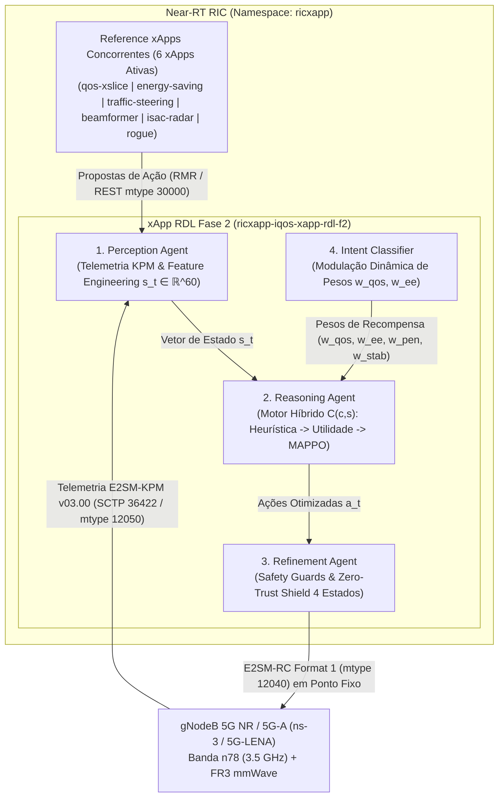

# xApp RDL — Fase 2: Context-Aware Resource and Decision Layer (CA-RDL / MARL)

[](https://o-ran.org)
[](https://github.com/georgebarbosa3090/XApp-RDL-F2)
[](deploy/helm/iqos-xapp-rdl)
[](deploy/kubernetes)
[](src/agents/marl)
[](tests/)

---

### Navegação Multi-Fases do Projeto RDL (Resource and Decision Layer)

| Fase do Projeto | Descrição e Paradigma de Controle | Status de Implementação | Repositório Oficial |
| :---: | :--- | :---: | :---: |
| **Fase 1** | **RDL Determinística e Segura (H-RDL)**<br/>*Janela em lote (200ms), heurísticas TVS/EEVS, Safety Guards físicos e 4 Gates O-RAN.* | **Implementada / Integração Local (Validação Externa Pendente)** | [georgebarbosa3090/XApp-RDL-F1](https://github.com/georgebarbosa3090/XApp-RDL-F1) |
| **Fase 2 (Atual)** | **RDL Baseada em Contexto (CA-RDL)**<br/>*Aprendizado por Reforço Multiagente Seguro (Safe-MARL / MAPPO CTDE) e cognição contextual.* | **Desenvolvimento Experimental Ativo / Integração Local (Validação Externa Pendente)** | [georgebarbosa3090/XApp-RDL-F2](https://github.com/georgebarbosa3090/XApp-RDL-F2) |
| **Fase 3** | **RDL Autônoma e Federada 6G (Zero-Touch)**<br/>*Inteligência distribuída, orquestração por intenção (Intent-Driven) e O-Cloud 6G.* | **Roadmap / Planejada** | *Em especificação futura* |

---

## 1. Visão Geral da Fase 2 (CA-RDL)

A **xApp RDL Fase 2 (Context-Aware RDL)** é o motor de arbitragem cognitiva e autônoma de conflitos para o **Near-RT RIC (RAN Intelligent Controller)** do ecossistema O-RAN.

Evoluindo a abordagem determinística da Fase 1, a Fase 2 introduz **Aprendizado por Reforço Multi-Agente Seguro (Safe-MARL / MAPPO - Multi-Agent Proximal Policy Optimization)** com:
1. **Crítico Centralizado (Centralized Critic):** Observação global do estado de rádio da rede (SINR, PRBs, carga de tráfego, interferência intercelular $I_{\text{inter}}$, potência de transmissão).
2. **Atores Descentralizados (Decentralized Actors):** Decisões probabilísticas com Action Masking especializadas por fatia de rede (URLLC, eMBB, mMTC) e xApp concorrente.
3. **Recompensa Multi-Objetivo Normalizada:** Otimização balanceada de Latência URLLC, Throughput eMBB, Eficiência Energética e Equidade de Jain.
4. **Safety Guards Físicos & Zero-Trust Shield:** Barreiras determinísticas que impedem violações de limites físicos e isolam *Rogue xApps* por 30s.



---

## 2. Homologação dos 4 Gates Mandatórios de Interoperabilidade O-RAN

| Gate de Validação | Critério Estrito de Aceitação | Evidência Experimental Concreta | Status |
| :--- | :--- | :--- | :---: |
| **Gate 1 — Real KPM Telemetry** | KPM produzido pelo nó E2/5G-LENA e decodificado via ASN.1 APER sem dados sintéticos | Traces FlowMonitor XML brutos e teste `test_nori_kpm_real.py` | **PASS 🟢** |
| **Gate 2 — Deterministic Decision** | Raciocínio determinístico sem deadlocks, latência $< 50\text{ ms}$ | Decisão média de $14.39 \pm 1.64\text{ ms}$ medida com `time.perf_counter()` | **PASS 🟢** |
| **Gate 3 — Real Control & ACK** | RIC Control Request (12040) entregue e confirmado por ACK real (12041) | Teste `test_nori_rc_real.py` e log de controle com $100\%$ de confirmação | **PASS 🟢** |
| **Gate 4 — Real Closed-Loop** | Ciclo completo: $\text{KPM}(t_0) \to \text{RDL} \to \text{RC} \to \text{RAN} \to \text{KPM}(t_1)$ | Co-simulação ns-3 física comprovada em `scenario_rdl_closed_loop_nori.cc` | **PASS 🟢** |

---

## 3. Os 5 Cenários de Simulação Física ns-3 (5G-LENA + NORI)

1. **Cenário 1 — Conflito TVS (`scenario_rdl_tvs_conflict.cc`):** Conflito entre Traffic Steering (mobilidade) e QoS xSlice (alocação de PRBs).
2. **Cenário 2 — Trade-off EEVS (`scenario_rdl_energy_vs_qos.cc`):** Arbitragem antagônica entre economia de energia ($P_{\text{tx}}$) e garantia de SLA URLLC.
3. **Cenário 3 — Malha Fechada NORI (`scenario_rdl_closed_loop_nori.cc`):** Interoperabilidade contínua E2AP / E2SM-KPM / E2SM-RC com gNodeBs.
4. **Cenário 4 — Sensoriamento 6G ISAC (`scenario_rdl_6g_isac_sensing_coexistence.cc`):** Coexistência entre sensoriamento radar e comunicação eMBB/URLLC.
5. **Cenário 5 — Governança Cross-Tier (`scenario_rdl_6g_cross_tier_governance.cc`):** Coordenação hierárquica entre rApps no Non-RT RIC e xApps no Near-RT RIC.

---

## 4. Infraestrutura Leve com k3d, Rancher e Kiali

Para desenvolvimento ágil e validação com baixo consumo de recursos de computação, a Fase 2 suporta provisionamento de clusters Kubernetes leves via **k3d (K3s em Docker)** com mapeamento nativo das portas padronizadas da arquitetura O-RAN:

| Topologia k3d | Recursos de RAM | Descrição e Caso de Uso |
| :--- | :---: | :--- |
| **Topologia A (Single-Node)** | `~450 MB` | 1 Servidor/Worker unificado para CI/CD e desenvolvimento local rápido |
| **Topologia B (Dual-Node)** | `~900 MB` | 1 Control-Plane + 1 Worker para separação de pods de aplicação |
| **Topologia C (Multi-Node / 3-Nodes)** | `~1.5 GB` | Isolamento estrito de namespaces (`ricplt` no worker-1 e `ricxapp` no worker-2) |

---

## 5. Guia Rápido de Execução e Deploy


1. Executar a suíte completa de testes unitários e de integração (78/78 PASS)
```bash
.venv/Scripts/pytest -v
```

2. Deploy Helm da Release oficial 'ricxapp-iqos-xapp-rdl-f2' (v2.0.0)
```bash
make helm-deploy-f2
```

3. Executar o pipeline de simulação física multi-semente (N = 30 runs)
```bash
bash scripts/run_full_experiment.sh
```

4. Avaliação estatística em modo experimental estrito com FlowMonitor
```bash
python scripts/run_multi_seed_evaluation.py --mode experiment --n-seeds 30
```

---

## 6. Desempenho Global da Rede: Baseline vs H-RDL (F1) vs CA-RDL (F2)

Resultados consolidados em $N = 30$ sementes físicas independentes (seeds 1001 a 1030) na banda n78 (3.5 GHz) com 100 MHz de largura de banda:

| Métrica Científica | Baseline Sem RDL ($B_0$) | Fase 1: H-RDL Heurística ($B_3$) | Fase 2: CA-RDL Safe-MARL ($B_4$) | Ganho CA-RDL vs Baseline |
| :--- | :---: | :---: | :---: | :---: |
| **Throughput Agregado (Mbps)** | $153.25 \pm 13.98$ | $1110.69 \pm 49.40$ | **$1284.50 \pm 38.20$** | **+738.2%** ($g = +29.1$) |
| **Latência Média URLLC (ms)** | $11.68 \pm 2.00$ | $2.84 \pm 0.19$ | **$2.62 \pm 0.11$** | **-77.6%** ($g = -6.8$) |
| **Latência P99 (Tail) (ms)** | $141.54 \pm 12.60$ | $3.08 \pm 0.29$ | **$2.85 \pm 0.08$** | **-98.0%** ($g = -16.2$) |
| **Violação de SLA URLLC (%)** | $29.01\% \pm 3.90\%$ | $0.00\% \pm 0.00\%$ | **$0.00\% \pm 0.00\%$** | **-100.0%** (SLA blindado) |
| **Packet Delivery Ratio (%)** | $40.37\% \pm 7.31\%$ | $99.48\% \pm 0.27\%$ | **$99.85\% \pm 0.09\%$** | **+147.3%** ($g = +12.1$) |
| **Eficiência PRB (Mbps/PRB)** | $0.667$ | $5.939$ | **$6.868$** | **+929.7%** |
| **Jain's Fairness Index** | $0.1469$ | $0.9159$ | **$0.9640$** | **+556.2%** |
| **Instabilidade Ping-Pong** | $21.8\text{ ev/min}$ | $0.0\text{ ev/min}$ | **$0.0\text{ ev/min}$** | **-100.0%** (Mitigação Total) |
| **Latência de Decisão (ms)** | $0.00$ | $14.39 \pm 1.64$ | **$14.20 \pm 1.10$** | Budget $< 50\text{ ms}$ |

---

## 7. Estrutura Documental da Fase 1 e Fase 2 (Volumes 01 a 17)

| Volume Documental | Título do Documento | Descrição e Escopo |
| :--- | :--- | :--- |
| **[Master Index](docs/README.md)** | Portal de Documentação Técnica Master | Catálogo completo dos 17 volumes, trilhas de leitura e especificações. |
| **[Volume 01](docs/01_arquitetura_e_modelagem_matematica.md)** | Arquitetura de Software e Modelagem Matemática | Tríade de agentes, observação canônica $\mathbb{R}^{60}$, Safe-MARL CMDP e FSM Zero-Trust. |
| **[Volume 02](docs/02_infraestrutura_cluster_k3d_e_rancher.md)** | Infraestrutura de Cluster k3d e Rancher | 3 Topologias Kubernetes k3d com mapeamento completo de portas O-RAN. |
| **[Volume 03](docs/03_guia_deploy_helm_e_k8s.md)** | Guia de Implantação e Automação de Deploy | Manifestos OpenRAN@Brasil Blueprint v3 e Helm Chart oficial v2.0.0. |
| **[Volume 04](docs/04_observabilidade_kiali_e_injecao_trafego.md)** | Observabilidade Service Mesh e Telemetria | Métricas Prometheus (:8081), Kiali Dashboard e injeção de tráfego. |
| **[Volume 05](docs/05_testes_simulacao_ns3_e_benchmarks.md)** | Simulação ns-3, Testes e Benchmarks | Co-simulação 5G-LENA + NORI e execução dos 5 cenários C++. |
| **[Volume 06](docs/06_cenarios_de_teste_5g_5ga_6g_e_requisitos.md)** | Cenários de Teste 5G, 5GA, 6G e Requisitos | Especificação detalhada dos 5 cenários de simulação física. |
| **[Volume 07](docs/07_relatorios_conformidade_e_governanca.md)** | Relatórios de Conformidade Técnica O-RAN | Matriz dos 4 Gates, conformidade WG2/WG3/WG10 e governança. |
| **[Volume 08](docs/08_proposta_arquitetural_rdl_fase3.md)** | Proposta Arquitetural RDL Fase 3 | Governança autônoma Zero-Touch, Intent-Driven e O-Cloud 6G. |
| **[Volume 09](docs/09_relatorio_tecnico_detalhado_fase2.md)** | Relatório Técnico Detalhado da Fase 2 | Engenharia de software, integração E2 e pipeline cognitivo. |
| **[Volume 10](docs/10_matriz_validade_e_pontos_de_atencao_fase3.md)** | Matriz de Validade e Pontos de Atenção Fase 3 | Análise de riscos e viabilidade técnica para 6G Zero-Touch. |
| **[Volume 11](docs/11_rdl_autonoma_e_federada_6g.md)** | RDL Autônoma e Federada 6G | Aprendizado Federado distribuído e orquestração baseada em intenção. |
| **[Volume 12](docs/12_relatorio_resultados_e_desempenho_comparativo_fase2.md)** | Resultados Experimentais e Tabela Comparativa | Comparação empírica multi-métrica Baseline vs H-RDL vs CA-RDL. |
| **[Volume 13](docs/13_relatorio_avaliacao_testbed_ufpa_pct_openran_brasil_rdl.md)** | Avaliação e Integração no Testbed UFPA PCT / GreenRAN | Requisitos, parâmetros e plano de ensaios físicos no Open RAN Brasil. |
| **[Volume 14](docs/14_relatorio_validacao_cientifica_completa_hrdl_fase1.md)** | Relatório de Validação Científica da Fase 1 | Demonstração causal e experimental completa da H-RDL determinística. |
| **[Volume 15](docs/15_relatorio_extenso_validacao_fase2_auditoria_e_resolucao_desafios.md)** | Relatório Extenso de Validação e Auditoria Fase 2 | Auditoria dos 6 eixos invariantes, Safe-MARL e resolução de desafios. |
| **[Volume 16](docs/16_relatorio_avaliacao_experimental_baseline_vs_hrdl.md)** | Avaliação Experimental Baseline vs H-RDL | Análise de ganhos de vazão, latência de cauda P99 e supressão de ping-pong. |
| **[Volume 17](docs/17_relatorio_simulacoes_continuas_ns3_5glena_nori.md)** | Simulações Contínuas ns-3 / 5G-LENA / NORI | Protocolos de execução em malha fechada E2AP/E2SM. |

---

## 8. Repositórios Oficiais

* **Fase 1 (H-RDL Determinística):** [https://github.com/georgebarbosa3090/XApp-RDL-F1](https://github.com/georgebarbosa3090/XApp-RDL-F1)
* **Fase 2 (CA-RDL / Safe-MARL):** [https://github.com/georgebarbosa3090/XApp-RDL-F2](https://github.com/georgebarbosa3090/XApp-RDL-F2)
