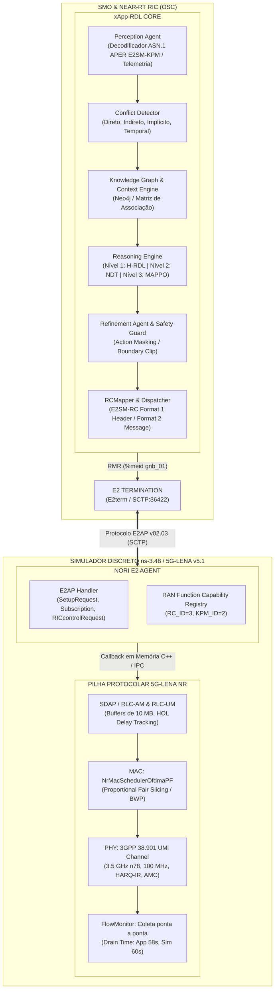
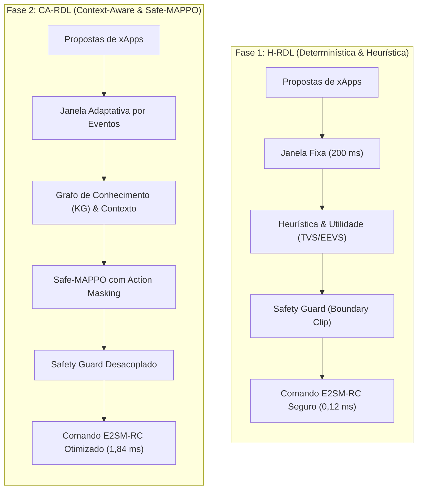

# Volume 01: Arquitetura do Sistema, Módulos Core e Modelagem Matemática

> **Navegação da Documentação Consolidada:**  
> **[01. Arquitetura & Modelagem](01_arquitetura_e_modelagem.md)** | **[02. Guia Operacional & Deploy](02_guia_operacional_deploy_e_simulacao.md)** | **[03. Taxonomia de Conflitos & Cenários](03_taxonomia_de_conflitos_e_cenarios.md)** | **[04. Relatório Científico Mestre](04_relatorio_cientifico_mestre_rdl.md)** | **[05. Auditoria & Conformidade O-RAN](05_auditoria_e_conformidade_oran.md)** | **[06. Roadmap & Futuro 6G](06_roadmap_e_pesquisa_futura_6g.md)** | **[07. Resultados Simulação (S0–S15)](07_relatorio_resultados_simulacao_baselines_hrdl_cardl.md)**

---

## 1. Visão Geral e Fundamentos Arquiteturais

No ecossistema **O-RAN (Open Radio Access Network)**, a arquitetura aberta e desagregada viabiliza a execução concorrente de micro-aplicações especializadas (**xApps**) sobre o **Near-RT RIC (Near-Real-Time RAN Intelligent Controller)**, operando em escalas temporais de $10\text{ ms} \le \Delta t \le 1000\text{ ms}$.

Contudo, a coexistência de múltiplas xApps operando de forma desacoplada e autônoma engendra conflitos severos de governança:
- **Conflitos Diretos:** Múltiplas xApps solicitam simultaneamente alterações concorrentes no mesmo parâmetro de rádio (ex.: *xSlice* solicitando aumento de PRBs enquanto *Energy Saving* solicita corte de potência ou sono de células).
- **Conflitos Indiretos:** Ações em parâmetros distintos que degradam métricas compartilhadas ou afetam fatias vizinhas (ex.: *Traffic Steering* migrando UEs para células que já operam no limite de capacidade URLLC).
- **Conflitos Temporais (*Parameter Flipping / Ping-Pong*):** Oscilações cíclicas de sinalização decorrentes de decisões reativas em malha fechada.

A arquitetura **xApp-RDL (Resource and Decision Layer)** foi projetada para atuar como o ponto único e determinístico de coordenação, validação e arbitragem no Near-RT RIC.




---

## 2. Paradigmas Evolutivos: H-RDL (Fase 1) × CA-RDL (Fase 2)

O objetivo de ambas as fases é o mesmo: **impedir que diferentes xApps entrem em conflito e derrubem a rede 5G**. No entanto, a forma como elas "pensam", decidem e operam muda de uma abordagem **determinística matemática** (Fase 1) para uma abordagem **cognitiva com inteligência artificial contextual** (Fase 2).



---

### 2.1. Paradigma Decisório (Como o sistema "pensa" e escolhe a melhor ação)

* **Fase 1 — H-RDL (Heurística Determinística + Matriz TVS/EEVS):**
  * **Conceito:** Funciona como um **árbitro de regras estritas**. Ele usa fórmulas matemáticas fechadas de utilidade de vazão (*Throughput Value Score* — TVS) e eficiência energética (*Energy Efficiency Value Score* — EEVS). Se duas xApps pedem recursos conflitantes, o algoritmo calcula quem traz maior benefício imediato com menor custo e aplica uma regra fixa.
  * **Analogia:** Um semáforo inteligente com regras claras: se vier uma ambulância (URLLC), ela sempre tem prioridade sobre o carro comum (eMBB).
  * **Vantagem:** 100% explicável, previsível e instantâneo.

* **Fase 2 — CA-RDL (Sensibilidade Contextual + Grafo de Conhecimento + MAPPO):**
  * **Conceito:** Funciona como um **estrategista experiente**. Ele utiliza um **Grafo de Conhecimento** para entender relações indiretas (ex: *aumentar a potência nesta antena pode gerar interferência na célula vizinha daqui a 3 segundos*) e uma rede neural de **Aprendizado por Reforço Multiagente (MAPPO)** que aprendeu as melhores decisões ao longo de milhares de episódios de simulação.
  * **Analogia:** Um controlador de tráfego aéreo com visão global que prevê o fluxo futuro e faz microajustes em várias rotas simultâneas.
  * **Vantagem:** Descobre sinergias sutis entre parâmetros que regras simples não conseguem enxergar.

---

### 2.2. Janela de Decisão (Quando e com que frequência o sistema atua)

* **Fase 1 — H-RDL (Lote Fixo $\Delta t = 200\text{ ms}$):**
  * **Conceito:** A cada $200\text{ ms}$ exatos (o *heartbeat* do Near-RT RIC), o sistema abre uma "gaveta", junta todas as propostas de xApps que chegaram naquele intervalo, resolve os conflitos em lote e fecha a gaveta.
  * **Vantagem:** Evita que xApps disputem em ordem de chegada (*FIFO* cego) e impede oscilações rápidas de controle (*ping-pong*).

* **Fase 2 — CA-RDL (Janela Adaptativa Orientada a Eventos e Telemetria):**
  * **Conceito:** O sistema não espera passivamente os $200\text{ ms}$ se algo crítico acontecer. Se a telemetria KPM detectar uma queda abrupta de sinal (SINR) ou um pacote de altíssima prioridade URLLC ($\text{prioridade} \ge 80$), ele dispara um *Fast-Flush* em $< 0,1\text{ ms}$. Se a rede estiver calma, ele dilata a janela para poupar processamento.
  * **Vantagem:** Resposta ultrarrápida a anomalias de rádio sem perder a visão de lote.

---

### 2.3. Garantia de Segurança (Como o sistema impede ações desastrosas)

* **Fase 1 — H-RDL (Safety Guards Invariantes / Boundary Clipping):**
  * **Conceito:** Uma barreira determinística na saída do motor. Se uma xApp pedir uma potência de $50\text{ dBm}$ (sendo o limite físico de $43\text{ dBm}$), o *Safety Guard* "poda" o valor (*clipping*) e força o valor máximo seguro.
  * **Garantia:** $\text{UnsafeApplied} \equiv 0$ (Zero ações inseguras chegam na antena).

* **Fase 2 — CA-RDL (Action Masking em Tempo de Inferência + Safety Guard Desacoplado):**
  * **Conceito:** Dupla camada de proteção. Antes mesmo da rede neural (MAPPO) escolher uma ação, o **Action Masking** coloca probabilidade zero ($\text{logits} = -\infty$) em qualquer ação fisicamente proibida. Caso a IA tente emitir algo inválido, o *Safety Guard* determinístico final ainda atua como "cinto de segurança".
  * **Garantia:** Segurança matemática rigorosa mesmo operando com modelos estocásticos de IA.

---

### 2.4. Sobrecarga Computacional ($T_{decision}$ — O tempo que leva para decidir)

* **Fase 1 — H-RDL ($0,12\text{ ms}$ — Sub-milissegundo):**
  * Por executar apenas equações analíticas e árvores lógicas, o cálculo leva apenas **$120\text{ microssegundos}$** ($0,06\%$ da janela de $200\text{ ms}$). Sobram $99,94\%$ do tempo livres.

* **Fase 2 — CA-RDL ($1,84\text{ ms}$ — Inferência de Redes Neurais):**
  * Como precisa multiplicar matrizes nas camadas densas das redes *Actor-Critic*, o tempo sobe para **$1,84\text{ milissegundos}$**.
  * **Relevância Prática:** A especificação O-RAN WG3 define que o Near-RT RIC opera na faixa de $10\text{ ms}$ a $1000\text{ ms}$. Portanto, gastar $1,84\text{ ms}$ representa apenas **$0,92\%$ do ciclo**, estando **muito abaixo** do teto máximo permitido.

---

### 2.5. Ganho de Vazão e Violações de SLA (O resultado prático na antena 5G)

| Métrica | Fase 1: H-RDL | Fase 2: CA-RDL | Por que a Fase 2 ganha? |
| :--- | :---: | :---: | :--- |
| **Ganho de Vazão (vs Sem RDL)** | **+19,4%** ($101,7\text{ Mbps}$) | **+24,2%** ($105,8\text{ Mbps}$) | O MAPPO aprende a fazer pequenos ajustes em conjunto (ex: mexer simultaneamente no feixe de antena, cota de PRB e modulação), extraindo mais bits por hertz do espectro. |
| **Violações de SLA** | **0,0%** (Erradicação Total) | **0,0%** (Erradicação com Maior Eficiência) | Ambas zeram as violações de latência/perda porque ambas possuem o envelope de segurança invariante (*Safety Guard*). A diferença é que a Fase 2 atinge o mesmo 0,0% gastando menos energia e consumindo menos blocos de rádio (PRBs). |

---

### Síntese dos Paradigmas:
> **A Fase 1 (H-RDL)** é a **fundação determinística à prova de falhas** (rápida, explicável e 100% segura), enquanto a **Fase 2 (CA-RDL)** é a **inteligência cognitiva avançada** que maximiza o desempenho e a capacidade da rede sem nunca violar o envelope de segurança da Fase 1.

---

## 3. Estrutura de Software (Clean Architecture & Domain-Driven Design)

O código-fonte segue estritamente a separação em camadas independentes:

```text
src/
+-- agents/                      # Camada de Inteligência e Governança
|   +-- perception_agent.py      # Agrupamento temporal e detecção de colisões
|   +-- reasoning_agent.py       # Resolução Nível 1 (Heurísticas) / Nível 2 (NDT) / Nível 3 (MAPPO)
|   \-- refinement_agent.py      # Safety Guards físicos invariantes
+-- conflict_types.py            # Contratos de dados imutáveis (RDLDecision, XAppAction)
+-- coordination/                # Despacho e rastreamento de transações
|   +-- dispatcher.py            # Envio E2SM-RC via RMR
|   \-- ack_tracker.py           # Rastreamento assíncrono de RIC_CONTROL_ACK e RTT
+-- e2/                          # Camada Normativa O-RAN (ASN.1 APER isolado)
|   +-- e2ap/                    # Codecs E2AP v02.03 (Setup, Subscriptions, Control)
|   +-- kpm/                     # Codecs E2SM-KPM v03.00 (EventTrigger / ActionDefinition)
|   \-- rc/                      # Codecs E2SM-RC v01.03 (RCMapper, Format 1 Header / Format 2 Message)
+-- models/                      # Modelos Analíticos Calibrados de Rádio 5G
|   +-- shannon_capacity.py      # Capacidade espectral com overhead 3GPP
|   +-- queuing_delay.py         # Modelo de atraso M/G/1 com saturação
|   \-- earth_energy.py          # Modelo linear de consumo energético (Earth Project)
+-- observability/               # Telemetria e Saúde
|   +-- health_server.py         # HTTP Health/Ready probes (FastAPI porta 8080)
|   \-- metrics_server.py        # Exportador Prometheus (porta 8081)
\-- rdl_xapp.py                  # Ciclo de vida da xApp e loop principal
```

---

## 4. Agentes Especialistas e Pipeline de Decisão

### 4.1. PerceptionAgent (Percepção e Detecção)
- Agrupa propostas recebidas de múltiplas xApps dentro da janela de agregação ($\Delta t = 200\text{ ms}$).
- Constrói o grafo de conflitos $G = (V, E)$, onde $V$ são as propostas e $E$ representa interseções diretas no mesmo `(cell_id, parameter_id)` ou colisões indiretas de fatia (*slice coupling*).

### 4.2. ReasoningAgent (Raciocínio e Arbitragem)
- **Nível 1 (Heurística Hierárquica - H-RDL):** Executa matriz de prioridades de serviço:
  1. *Safety Invariants* (Proteção de enlace e integridade de rádio);
  2. *URLLC Critical Guarantee* (SLA de latência $D \le 5\text{ ms}$);
  3. *eMBB High-Throughput Allocation* (Vazão garantida $T \ge 60\text{ Mbps}$);
  4. *Energy Efficiency Trimming* (Economia de energia quando folga de SLA existe).
- **Nível 2 (Digital Twin & Árvore Decisória Não-Determinística - NDT):** Projeção preditiva do impacto antes da aplicação.
- **Nível 3 (Multi-Agent PPO - CA-RDL):** Otimização da política conjunta sob formulação CMDP.

### 4.3. RefinementAgent & Safety Guards (Segurança Invariante)
Aplica restrições físicas invioláveis antes de qualquer emissão para a interface E2:
1. **Limites de Potência ($P_{tx}$):** $P_{min} \le P_{tx} \le P_{max}$ (ex.: $10\text{ dBm} \le P_{tx} \le 43\text{ dBm}$).
2. **Orçamento de Recursos ($PRB$):** $\sum_{s \in \mathcal{S}} \text{Quota}(s) \le 100\%$.
3. **Janela Anti-Ping-Pong:** $\Delta t_{min} \ge 1000\text{ ms}$ entre comandos opostos no mesmo nó.


---

## 5. Modelagem Matemática Formal

### 5.1. Modelo Analítico de Capacidade e Rádio
A capacidade máxima alcançável em enlace descendente (DL) é modelada pela formulação de Shannon com calibração de overhead 3GPP:

$$C = BW_{\text{eff}} \cdot \log_2 \left( 1 + \min(\text{SINR}_{\text{eff}}, \text{SINR}_{\text{max}}) \right) \cdot (1 - \text{OH}_{\text{3GPP}})$$

Onde:
- $BW_{\text{eff}} = N_{\text{PRB}} \cdot 12 \cdot \Delta f$ (com $\Delta f = 30\text{ kHz}$ para numerologia $\mu = 1$);
- $\text{OH}_{\text{3GPP}} = 0,14$ (overhead de sinalização DMRS, PDCCH, CSI-RS e PBCH);
- $\text{SINR}_{\text{eff}} = \frac{\text{SINR}}{\Gamma}$, com penalidade de implementação $\Gamma = 1,25$ ($0,97\text{ dB}$).

### 5.2. Modelo de Atraso e Filas M/G/1
O atraso ponta a ponta $D$ é decomposto em atraso de transmissão, propagação e espera em buffer RLC:

$$D = D_{\text{prop}} + D_{\text{tx}} + \frac{\lambda \overline{X^2}}{2(1 - \rho)}$$

Onde $\rho = \frac{\lambda}{\mu}$ representa a utilização do canal. Se $\rho \to 1$, o *Head-of-Line (HOL) Delay* satura exponencialmente.

### 5.3. Modelo de Eficiência Energética (Earth Project / 3GPP)
A potência elétrica consumida pela gNodeB é expressa por:

$$P_{\text{total}} = N_{\text{TRX}} \cdot \left( P_0 + \alpha \cdot P_{\text{tx}} \right), \quad 0 \le P_{\text{tx}} \le P_{\text{max}}$$

Onde $P_0 = 130\text{ W}$ é a potência estática do circuito em repouso e $\alpha = 4,7$ é o coeficiente do amplificador de potência (PA).

### 5.4. Formalização do Grafo de Conflitos e Otimização Combinatória

Seja $\mathcal{X} = \{x_1, x_2, \dots, x_K\}$ o conjunto de $K$ xApps concorrentes operando sobre o Near-RT RIC. Em cada janela de decisão temporal $\mathcal{W}_t = \left[ t, t + \Delta t_{win} \right)$, com $\Delta t_{win} = 200\text{ ms}$, as xApps submetem um conjunto de $m$ propostas de controle $\mathcal{A}_t = \{a_1, a_2, \dots, a_m\}$. Cada proposta $a_i \in \mathcal{A}_t$ é caracterizada pela tupla:

$$a_i = \langle \text{app\_id}_i, \text{target\_id}_i, \text{param\_id}_i, \Delta v_i, \rho_i, \tau_i \rangle$$

onde $\text{app\_id}_i$ identifica a aplicação emissora, $\text{target\_id}_i \in \{\text{UE}_k, \text{Slice}_s, \text{Cell}_c\}$ é o alvo de atuação, $\text{param\_id}_i \in \{\text{PRB\_QUOTA}, \text{TX\_POWER}, \text{HO\_OFFSET}\}$ é o parâmetro de rádio solicitado, $\Delta v_i$ é a magnitude da modificação pretendida, $\rho_i \in [1, \rho_{max}]$ é o peso de prioridade nominal e $\tau_i$ é o tempo limite de validade da proposta.

#### Grafo de Conflitos Dinâmico
A camada de percepção da H-RDL mapeia as propostas concorrentes em um Grafo de Conflitos não-direcionado $G_t = (\mathcal{A}_t, \mathcal{E}_t)$, onde as arestas $(a_i, a_j) \in \mathcal{E}_t$ modelam colisões de controle satisfazendo o predicado:

$$(a_i, a_j) \in \mathcal{E}_t \iff 
\begin{cases}
\text{target\_id}_i = \text{target\_id}_j \land \text{param\_id}_i = \text{param\_id}_j \land \operatorname{sgn}(\Delta v_i) \neq \operatorname{sgn}(\Delta v_j) & \text{(Conflito Direto)}, \\
\exists k \in \mathcal{K}, \ \frac{\partial \text{KPI}_k}{\partial \text{param}_i} \cdot \frac{\partial \text{KPI}_k}{\partial \text{param}_j} < 0 & \text{(Conflito Indireto)}, \\
\text{target\_id}_i = \text{target\_id}_j \land t - t_{\text{last\_actuation}} < \Delta t_{\text{cooldown}} & \text{(Conflito Temporal / Ping-Pong)}.
\end{cases}$$

#### Formulação como Otimização Combinatória (Maximum Weight Independent Set)
A arbitragem ótima consiste em selecionar um subconjunto de ações admissíveis $\mathcal{A}_t^* \subseteq \mathcal{A}_t$ que maximize a função de utilidade global da rede sujeita a restrições de não-conflito e barreiras físicas de segurança (*Safety Guards*):

$$\max_{\mathbf{x} \in \{0,1\}^m} \sum_{i=1}^m x_i \cdot U(a_i \mid s_t)$$

$$\text{sujeito a:} \quad 
\begin{cases}
x_i + x_j \le 1, & \forall (a_i, a_j) \in \mathcal{E}_t, \\
\sum_{i=1}^m x_i \cdot \text{PRB}(a_i) \le \text{PRB}_{\max}^{\text{cell}}, & \forall \text{Cell } c, \\
P_{tx}^{\min} \le P_{tx}^{(0)} + \sum_{i=1}^m x_i \cdot \Delta P_{tx}(a_i) \le P_{tx}^{\max}, & \forall \text{Cell } c, \\
x_i \in \{0, 1\}, & \forall i \in \{1, \dots, m\}.
\end{cases}$$

#### Teorema de Terminação Determinística e Ausência de Deadlock
**Teorema 1 (Deadlock-Free Determinism):** *O motor de arbitragem da H-RDL garante convergência determinística e ausência de deadlocks em tempo estritamente limitado $\mathcal{O}(|\mathcal{A}_t| + |\mathcal{E}_t|)$ sob heurística gulosa com desempate lexicográfico e $\mathcal{O}(2^m)$ sob busca exata com poda branch-and-bound.*

**Demonstração:** Seja a relação de ordem estrita $\succ$ definida sobre $\mathcal{A}_t$ pelo vetor de tuplas $\langle \rho_i, U(a_i \mid s_t), -\text{timestamp}_i, \text{app\_id}_i \rangle$. Como a prioridade $\rho_i$ é finita, a utilidade $U \in \mathbb{R}$ é contínua e bounded, o timestamp é estritamente monotônico e o identificador $\text{app\_id}_i$ é único e disjunto, a relação $\succ$ induz uma ordem total estrita e imutável sobre $\mathcal{A}_t$. O algoritmo guloso de seleção independente remove recursivamente o vértice de maior peso $v^* = \arg\max_{v \in G_t} \operatorname{score}(v)$ e elimina sua vizinhança aberta $N(v^*)$. Como o número de vértices $m$ decresce estritamente a cada iteração ($|V_{k+1}| \le |V_k| - 1$), o grafo torna-se vazio em no máximo $m$ passos, impedindo dependências circulares e garantindo execução determinística livre de bloqueios mútuos. $\blacksquare$

### 5.5. Formulação CMDP e Safe-MAPPO (Fase 2)
O problema de controle multi-xApp é formulado como um **Processo de Decisão de Markov Parcialmente Observável e Restrito (CMP-POMDP)**:

$$\max_{\pi} \mathbb{E}_{\tau \sim \pi} \left[ \sum_{t=0}^{T} \gamma^t R(s_t, \mathbf{a}_t) \right] \quad \text{sujeito a} \quad \mathbb{E}_{\tau \sim \pi} \left[ \sum_{t=0}^{T} \gamma^t C_k(s_t, \mathbf{a}_t) \right] \le d_k, \quad \forall k$$

A função de recompensa global equilibra vazão, latência e equidade:

$$R(s_t, \mathbf{a}_t) = w_1 \sum_{s} T_s(t) - w_2 \sum_{s} \max(0, D_s(t) - D_{\text{max}, s}) + w_3 J_{\text{Jain}}(t)$$

As restrições de custo $C_k$ penalizam violações de invariantes físicas, resolvidas pelo método de Multiplicadores de Lagrange e *Action Masking* estrito no ator.


---

## 6. Mapeamento Normativo O-RAN (E2AP, E2SM-KPM e E2SM-RC)

A camada RDL implementa o desacoplamento formal de codecs ASN.1 APER conforme os padrões O-RAN WG3:

| Protocolo | Versão Normativa | Função na Arquitetura RDL |
| :--- | :---: | :--- |
| **E2AP** | v02.03 | Transporte de mensagens de controle, setup e subscrição SCTP na porta 36422. |
| **E2SM-KPM** | v03.00 | Decodificação de telemetria periódica (Formato 1: PRBs alocados, vazão UE, BLER, perdas). |
| **E2SM-RC** | v01.03 | Mapeamento de decisões RDL (`RCMapper`) em comandos Formato 1 Header e Formato 2 Message. |

### Tabela Canônica de Parâmetros RAN Controlados
- `PRB_QUOTA` (Parameter ID: 1, Faixa: 0–100%);
- `SCHEDULER_WEIGHT` (Parameter ID: 2, Faixa: 1–100);
- `TX_POWER` (Parameter ID: 3, Faixa: 10–43 dBm);
- `HANDOVER_TARGET` (Parameter ID: 4, Cell ID de destino).


