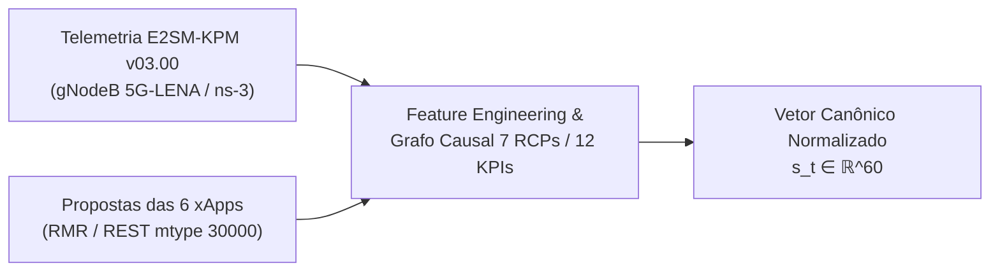
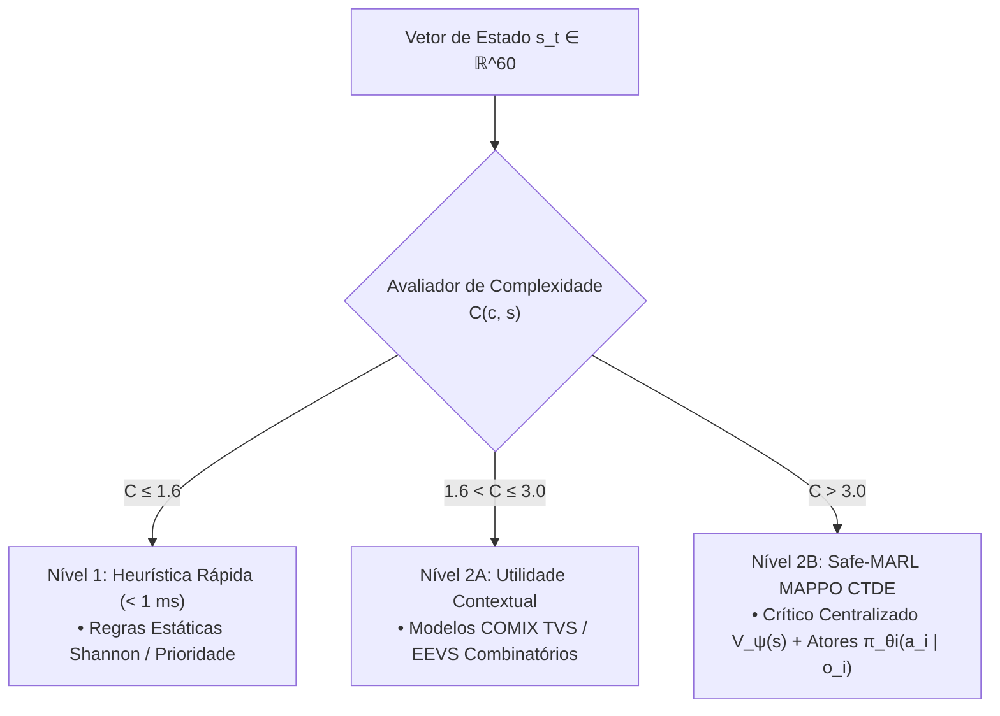
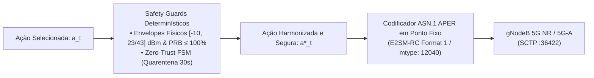
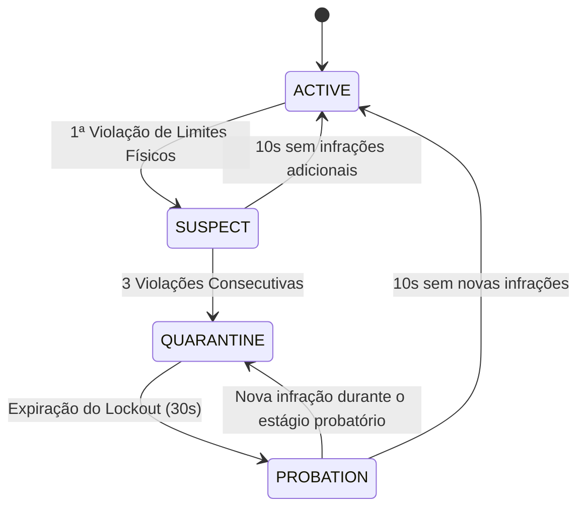

## 1. Visão Geral da Arquitetura Cognitiva

A Fase 2 introduz uma arquitetura orientada a agentes cognitivos com **Aprendizado por Reforço Multiagente Seguro (Safe-MARL)** baseado no paradigma **MAPPO (Multi-Agent Proximal Policy Optimization)** com **Treinamento Centralizado e Execução Descentralizada (CTDE)**.

O sistema é estruturado em três camadas funcionais desacopladas e integradas ao barramento Near-RT RIC:

### 1.1. Camada de Percepção (Perception Layer)

### 1.2. Camada de Raciocínio Escalonado (Reasoning Layer)

### 1.3. Camada de Refinamento e Despacho E2 (Refinement Layer & Safety Guards)

---

## 2. Contrato Canônico de Observação ($\mathbb{R}^{60}$ para $N=6$ xApps)

O extrator de características do `PerceptionAgent` converte telemetrias e propostas em um vetor canônico $s_t \in \mathbb{R}^{60}$ estruturado em 3 blocos sem perdas:

1. **Bloco 1: KPM Global e Metadados do Conflito ($s_t[0 \dots 5]$):**
   - $s_t[0]$: Tipo de conflito ($1.0$ Direto, $0.5$ Indireto);
   - $s_t[1]$: Densidade de xApps envolvidas ($\min(1.0, N_{\text{xapps}} / 6.0)$);
   - $s_t[2]$: Throughput agregado normalizado ($\min(1.0, \text{DRB.UEThpDl} / 100.0)$);
   - $s_t[3]$: Ocupação total de PRBs ($\text{RRU.PrbTotDl} / 100.0$);
   - $s_t[4]$: Atraso médio de pacotes na fila RLC ($\min(1.0, \text{QoS.FlowDelay} / 50.0)$);
   - $s_t[5]$: Qualidade de sinal de rádio SINR ($\min(1.0, \text{L1M.DL-sinr} / 30.0)$).

2. **Bloco 2: Máscara Booleana de Presença de Propostas ($s_t[6 \dots 11]$):**
   - Vetor de 6 bits $M \in \{0, 1\}^6$ indicando a ocupação de cada slot de xApp no lote.

3. **Bloco 3: Blocos Canônicos de Propostas ($s_t[12 \dots 59]$ — 6 slots $\times$ 8 atributos):**
   - Slot $i$ (índice base $12 + 8i$):
     - Atributo 0: Hash numérico determinístico da xApp ($H(\text{xapp\_id}) \pmod{100} / 100.0$);
     - Atributo 1: Identificador numérico do nó gNodeB ($H(\text{node\_id}) \pmod{10} / 10.0$);
     - Atributo 2: Código numérico do Parâmetro de Controle RCP ($0.1$ a $0.9$);
     - Atributo 3: Valor normalizado do parâmetro no envelope físico $[0, 1]$;
     - Atributo 4: Prioridade normalizada da xApp ($\text{priority} / 10.0$);
     - Atributo 5: Custo estimado de restrição CMDP ($0.0$ seguro, $1.0$ invasivo);
     - Atributo 6: Tipo de fatia de rede ($1.0$ URLLC, $0.5$ eMBB, $0.2$ mMTC);
     - Atributo 7: Indicador de histerese temporal ($1.0$ se em período de resfriamento).

---

## 3. Modelagem Matemática do Safe-MARL MAPPO

### 3.1. Processo de Decisão de Markov com Restrições (CMDP)
O problema de controle ótimo sob segurança física é formulado como um CMDP:
$$\max_\theta \mathbb{E}_{\tau \sim \pi_\theta} \left[ \sum_{t=0}^T \gamma^t R(s_t, a_t) \right] \quad \text{sujeito a} \quad \mathbb{E}_{\tau \sim \pi_\theta} \left[ \sum_{t=0}^T \gamma^t C_k(s_t, a_t) \right] \le d_k, \quad \forall k$$

onde $C_k(s, a) \in \{0, 1\}$ penaliza comandos que violam envelopes físicos de potência, PRBs ou histerese.

### 3.2. Vantagem Penalizada Conjunta e Gradiente do Ator
A função de vantagem conjuga a recompensa multi-objetivo com a penalidade lagrangiana:
$$\hat{A}_t^{\text{safe}} = \hat{A}_t^R - \lambda_k \hat{A}_t^C$$

O objetivo clipped do PPO garante gradiente ativo na política do ator:
$$L^{\text{CLIP}}(\theta) = \hat{\mathbb{E}}_t \left[ \min \left( r_t(\theta) \hat{A}_t^{\text{safe}}, \, \text{clip}(r_t(\theta), 1 - \epsilon, 1 + \epsilon) \hat{A}_t^{\text{safe}} \right) \right]$$

com atualização dual de subgradiente para o multiplicador de Lagrange:
$$\lambda_{k+1} = \max\left(0, \, \min\left(10.0, \, \lambda_k + \alpha_{\text{cost}} (\mathbb{E}[C_k] - d_k)\right)\right)$$

### 3.3. Função de Recompensa Multi-Objetivo ($R_t$)
$$R_t = w_{\text{qos}} R_{\text{qos}}(t) + w_{\text{ee}} R_{\text{ee}}(t) - w_{\text{pen}} P_{\text{viol}}(t) - w_{\text{stab}} P_{\text{osc}}(t)$$
* **$R_{\text{qos}}(t)$:** Cumprimento de latência URLLC ($\text{Delay} \le 5.0\text{ ms}$) e vazão eMBB;
* **$R_{\text{ee}}(t)$:** Eficiência energética calculada em $\frac{\text{Throughput (Mbps)}}{P_{\text{tx}} (\text{Watts})}$;
* **$P_{\text{viol}}(t)$:** Penalidade por conflitos não mitigados ($1.0$ se não resolvido);
* **$P_{\text{osc}}(t)$:** Penalidade por instabilidade temporal e ping-pong de handover.

---

## 4. FSM Zero-Trust de 4 Estados (Anti-Rogue Shield)

---

## 5. Tríade de Agentes Autônomos

| Agente | Módulo Python | Responsabilidade Principal |
| :--- | :--- | :--- |
| **Perception Agent** | `src.agents.perception_agent.PerceptionAgent` | Ingestão E2SM-KPM v03.00, extração de features canônicas $\mathbb{R}^{60}$, detecção de conflitos C1-C5 e grafo causal. |
| **Reasoning Agent** | `src.agents.reasoning_agent.ReasoningAgent` | Avaliação de complexidade $C(c, s)$, motor híbrido escalonado (Heurística $\to$ Utilidade TVS/EEVS $\to$ Safe-MARL MAPPO). |
| **Refinement Agent** | `src.agents.refinement_agent.RefinementAgent` | Validação de envelopes físicos, histerese temporal, FSM Zero-Trust e codificação ASN.1 APER E2SM-RC em ponto fixo. |

---

## 🧭 Navegação da Documentação

| [📑 Índice Geral (docs/README.md)](README.md) | [🏠 Início do Repositório](../README.md) | [➡️ Volume 02: Infraestrutura Cluster k3d e Rancher](02_infraestrutura_cluster_k3d_e_rancher.md) |
| :---: | :---: | :---: |
