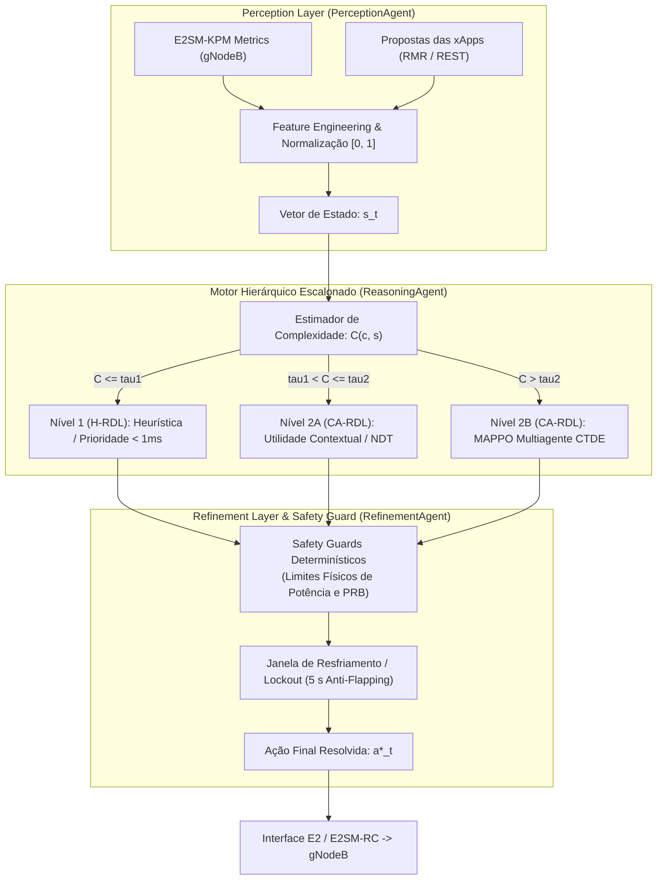

# Volume 01: Arquitetura de Software e Modelagem Matemática da Fase 2 (CA-RDL / MARL) e Evolução Hierárquica

**Documento:** Volume Temático 01  
**Projeto:** xApp RDL (Resource and Decision Layer) — Fase 2: Context-Aware RDL (CA-RDL)  
**Escopo:** Tríade de Agentes Autônomos, Motor Hierárquico Escalonado, Formulação MAPPO (CTDE), Espaço de Estados/Ações, Recompensa Multi-Objetivo e Safety Guards  
**Repositório Oficial:** [https://github.com/georgebarbosa3090/XApp-RDL-F2](https://github.com/georgebarbosa3090/XApp-RDL-F2)  

---

## 1. Visão Geral da Arquitetura Cognitiva Hierárquica

A xApp-RDL evolui para um **Motor de Decisão Hierárquico Escalonado em 3 Níveis** com um **Safety Guard Invariante Determinístico**, evitando sobrecarga computacional em decisões triviais e garantindo resposta determinística e adaptativa:

---

## 2. Roteamento Escalonado e Complexidade $C(c, s)$

A tomada de decisão é escalonada com base na métrica de complexidade do conflito:

$$\mathcal{D}(s, c) = \begin{cases} \mathcal{D}_H(c), & C(c, s) \le \tau_1 \quad \text{(Nível 1: Heurística / Regras / Prioridade)} \\ \mathcal{D}_U(s, c), & \tau_1 < C(c, s) \le \tau_2 \quad \text{(Nível 2A: Utilidade Contextual / Digital Twin NDT)} \\ \mathcal{D}_{\text{MAPPO}}(s, c), & C(c, s) > \tau_2 \quad \text{(Nível 2B: MAPPO Multiagente Cooperativo CTDE)} \end{cases}$$

Onde $C(c, s)$ quantifica:
- Tipo de conflito (Direto vs. Indireto);
- Número de xApps concorrentes $N$;
- Número de KPIs interdependentes;
- Diferença de prioridade $|\Delta \text{prio}|$;
- Degradação observada no KPM (e.g., violação iminente de SLA).

---

## 3. Modelagem Matemática do MAPPO (Nível 2B)

### 3.1. Paradigma CTDE (Centralized Training with Decentralized Execution)
- **Ator Descentralizado $\pi_{\theta_i}(a_i | o_i)$:** Cada xApp associada é tratada como um agente independente que gera ações a partir de sua observação local $o_i$.
- **Crítico Centralizado $V_\psi(s)$:** Observa o estado global concatenado $s = [o_1, o_2, \dots, o_N]$ durante o treinamento em simulação/Digital Twin (NORI/ns-3).

### 3.2. Função Objetivo Clipped e Vantagem GAE
$$\delta_t^V = r_t + \gamma V_\psi(s_{t+1}) (1 - d_t) - V_\psi(s_t)$$
$$\hat{A}_i^t = \sum_{l=0}^\infty (\gamma \lambda)^l \delta_{t+l}^V, \quad (\gamma = 0.99, \, \lambda = 0.95)$$

Perda do Ator:
$$L(\theta_i) = -\hat{\mathbb{E}}_t \left[ \min \left( \frac{\pi_{\theta_i}(a_{i,t}|o_{i,t})}{\pi_{\theta_i,\text{old}}(a_{i,t}|o_{i,t})} \hat{A}_i^t, \, \text{clip}\left(\frac{\pi_{\theta_i}(a_{i,t}|o_{i,t})}{\pi_{\theta_i,\text{old}}(a_{i,t}|o_{i,t})}, 1-\epsilon, 1+\epsilon\right) \hat{A}_i^t \right) \right] - \beta_{\text{ent}} \mathcal{H}(\pi_{\theta_i})$$

Perda do Crítico:
$$L(\psi) = \hat{\mathbb{E}}_t \left[ (V_\psi(s_t) - (\hat{A}_t + V_{\psi,\text{old}}(s_t)))^2 \right]$$

### 3.3. Recompensa Multi-Objetivo Ponderada por Intenção
$$R_t = w_{\text{qos}} f_{\text{qos}}(t) + w_{\text{ee}} f_{\text{ee}}(t) - w_{\text{pen}} \text{penalty}(t) - w_{\text{stab}} \text{oscillation}(t)$$
onde os pesos são dinamicamente modulados via **A1-Policy** do Non-RT RIC.

---

## 4. Tríade de Agentes Autônomos e Componentes

| Agente | Classe Python | Responsabilidade Principal |
| :--- | :--- | :--- |
| **Perception Agent** | `src.agents.perception_agent.PerceptionAgent` | Ingestão E2SM-KPM, extração de features normalizadas, detecção de conflitos direta/indireta e cache Redis. |
| **Reasoning Agent** | `src.agents.reasoning_agent.ReasoningAgent` | Estimador de complexidade $C(c, s)$, roteamento hierárquico (H-RDL $\to$ Utilidade $\to$ MAPPO) e lockout cooling de 5s. |
| **Refinement Agent** | `src.agents.refinement_agent.RefinementAgent` | Verificação de limites físicos (PRBs, potência de -10 a 23 dBm), validação A1 e injeção de fallback seguro. |
| **MAPPO Coordinator** | `src.agents.marl.mappo_agent.MAPPOCoordinator` | Coordenação multiagente CTDE com cálculo formal de GAE e backpropagation com otimizador Adam. |
