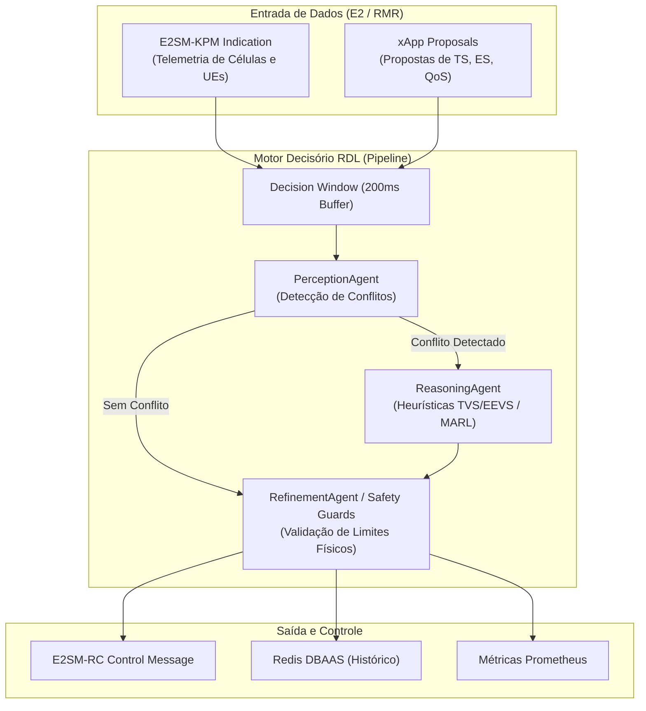

# Volume 01: Arquitetura, Módulos Core e Modelagem Matemática

**Documento:** Volume Temático 01  
**Projeto:** xApp RDL (Resource and Decision Layer)  
**Escopo:** Fundamentos, Clean Architecture / DDD, Módulos Core, Heurísticas Determinísticas, Protocolos O-RAN e Modelagem Matemática  
**Data de Consolidação:** 25/08/2026  

---

## 1. Introdução e Definição do Problema

No ecossistema **O-RAN (Open Radio Access Network)**, a arquitetura aberta e desagregada permite a execução concorrente de múltiplas aplicações especializadas (**xApps**) sobre o **Near-RT RIC (Near-Real-Time RAN Intelligent Controller)**.

### O Desafio dos Conflitos de Ação
Diferentes xApps (como *Traffic Steering*, *Energy Savings*, *QoS Management* e *Handover Optimization*) operam com objetivos distintos e podem emitir comandos simultâneos e conflitantes para as mesmas rádio-bases (gNodeBs) e usuários (UEs):
* **Conflito Direto:** Duas xApps solicitam alterações incompatíveis no mesmo parâmetro de rádio no mesmo instante temporal (ex: xApp 1 solicita aumento de potência de transmissão enquanto xApp 2 solicita corte de potência para economia de energia).
* **Conflito Indireto:** Ações em parâmetros diferentes que geram impacto cruzado negativo (ex: balanceamento de carga que degrada a latência garantida de fatias de rede URLLC).

### A Solução RDL (Resource and Decision Layer)
A **xApp RDL** atua como o ponto único de arbitragem e governança no Near-RT RIC:
1. **Fase 1 (H-RDL - Heuristic RDL):** Resolução determinística baseada em janelas de decisão em lote (200 ms), matrizes de prioridade de serviço (TVS/EEVS) e barreiras de segurança física (*Safety Guards*).
2. **Fase 2 (CA-RDL - Context-Aware RDL):** Arbitragem cognitiva utilizando Aprendizado por Reforço Multi-Agente (MARL / MAPPO) para cenários dinâmicos complexos.

---

## 2. Arquitetura de Software (Clean Architecture & DDD)

A xApp RDL é estruturada rigorosamente sob os princípios de **Clean Architecture** e **Domain-Driven Design (DDD)**, isolando a lógica de negócio de dependências de infraestrutura e protocolos externos:

```text
src/
├── agents/                  # Camada de Inteligência e Decisão
│   ├── perception_agent.py  # Análise combinatória e detecção de conflitos (Janela 200ms)
│   ├── reasoning_agent.py   # Motor de resolução (Heurísticas TVS/EEVS e MARL)
│   └── refinement_agent.py  # Safety Guards (limites de potência, PRB e taxa)
├── coordination/            # Orquestração de Fluxo e ACKs
│   ├── dispatcher.py        # Despacho de mensagens E2SM-RC Control
│   └── ack_tracker.py       # Rastreamento de confirmações E2
├── domain/                  # Entidades e Value Objects Imutáveis
│   ├── entities.py          # ActionProposal, ConflictEvent, Decision
│   └── types.py             # Enums de tipos de conflito e prioridades
├── e2/                      # Codecs e Protocolos O-RAN (Isolamento ASN.1)
│   ├── kpm_decoder.py       # Decodificador E2SM-KPM (Telemetria de rádio)
│   ├── rc_encoder.py        # Codificador E2SM-RC Control (Comandos de rádio)
│   └── e2ap_decoder.py      # Decodificador de mensagens E2AP / RIC Indication
├── infrastructure/          # Adaptadores de Entrada/Saída
│   ├── rmr_client.py        # Cliente de mensageria RMR (C-bindings)
│   ├── sdl_client.py        # Shared Data Layer (Redis / Fake-SDL)
│   └── config_manager.py    # Carregador e validador de configurações
└── observability/           # Telemetria e Monitoramento
    ├── health_server.py     # Servidor HTTP FastAPI (portas 8080 health / ready)
    ├── metrics_server.py    # Servidor de métricas Prometheus na porta 8081
    └── logging.py           # Logging estruturado em formato JSON (Structlog)
```



---

## 3. Módulos Core e Agentes Especialistas

### 3.1. PerceptionAgent (Percepção e Detecção de Conflitos)
* **Janela Temporal de Decisão ($\Delta t = 200\text{ ms}$):** Agrupa propostas recebidas de múltiplas xApps em um buffer thread-safe.
* **Algoritmo de Detecção:**
  - Realiza o cruzamento par a par das propostas recebidas.
  - Identifica sobreposição de alvos: $\text{TargetUE}_1 == \text{TargetUE}_2$ ou $\text{TargetCell}_1 == \text{TargetCell}_2$.
  - Verifica se os parâmetros de controle colidem (ex: alteração de potência, fatiamento de PRB, handover forçado).
  - Emite eventos estruturados `ConflictEvent` contendo as propostas envolvidas e o grau de severidade.

### 3.2. ReasoningAgent (Raciocínio e Resolução)
* **Heurística TVS (Throughput vs. Service Priority):** Prioriza fatias de serviço de missão crítica (URLLC > eMBB > mMTC).
* **Heurística EEVS (Energy Efficiency vs. QoS Satisfaction):** Avalia a perda marginal de throughput frente ao ganho percentual de economia de energia.
* **Decisão Ótima:** Produz uma decisão consolidada `Decision(action, approved_params, rejected_proposals)`.

### 3.3. RefinementAgent (Safety Guards)
* Atua como barreira estrita de segurança antes de qualquer comando sair para a rede de rádio:
  - **Limite de Potência Máxima:** Impede que a potência exceda o teto de saturação da antena (ex: 43 dBm).
  - **Limite de Frequência de Churn:** Bloqueia comandos de handover consecutivos em um intervalo menor que o tempo de histerese (ex: < 1 segundo), prevenindo efeito *ping-pong*.
  - **Conservação de Recursos:** Garante que a soma das frações de PRB alocadas não ultrapasse 100% da capacidade do canal.

---

## 4. Comunicação no Near-RT RIC (Protocolos e RMR)

### 4.1. Mensageria RMR (RIC Message Router)
O RMR provê entrega de mensagens de latência sub-milissegundo entre xApps sem acoplamento de endereço IP:
* **`RIC_INDICATION` (MsgType 12050):** Recepção de relatórios de métricas KPM da rádio.
* **`RDL_ACTION_PROPOSAL` (MsgType 30000):** Recepção de propostas de controle enviadas por outras xApps.
* **`RIC_CONTROL_REQ` (MsgType 12010):** Envio de comandos E2SM-RC arbitrados para a gNodeB.
* **`RIC_CONTROL_ACK` (MsgType 12011):** Confirmação de execução emitida pela rádio-base.

### 4.2. Codecs ASN.1 APER (Pycrate)
* **`kpm_decoder.py`:** Decodifica octet strings APER em estruturas Python contendo métricas de `DRB.UEThpDl`, `RRU.PrbTotDl` e `QoS.FlowDelay`.
* **`rc_encoder.py`:** Codifica comandos de controle estruturados E2SM-RC (Control Style 1 - Radio Resource Allocation).

---

## 5. Modelagem Matemática Formal e Funções de Utilidade

A tomada de decisão na xApp RDL é formulada como um problema de otimização multiobjetivo restrito:

$$\max_{\mathbf{a} \in \mathcal{A}} U(\mathbf{a}) = w_{\text{QoS}} \cdot f_{\text{QoS}}(\mathbf{a}) + w_{\text{EE}} \cdot f_{\text{EE}}(\mathbf{a}) - w_{\text{pen}} \cdot \sum_{i} \text{Penalty}_i(\mathbf{a})$$

Sujeito às restrições físicas de rádio:
$$\sum_{s \in \mathcal{S}} \text{PRB}_s \le \text{PRB}_{\text{total}}, \quad P_{\text{tx}} \le P_{\text{max}}, \quad \text{Delay}_u \le \text{Budget}_u$$

Onde:
* $f_{\text{QoS}}(\mathbf{a})$ quantifica a satisfação de SLA das conexões ativas.
* $f_{\text{EE}}(\mathbf{a})$ quantifica a eficiência energética em bits por Joule.
* $\text{Penalty}_i(\mathbf{a})$ penaliza violações de restrição e oscilações excessivas de controle.
