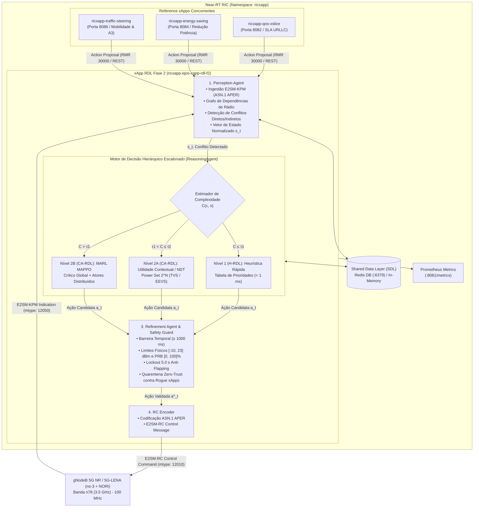

# Volume 01: Arquitetura de Software e Modelagem Matemática da Fase 2 (CA-RDL / MARL) e Evolução Hierárquica

**Documento:** Volume Temático 01  
**Projeto:** xApp RDL (Resource and Decision Layer) — Fase 2: Context-Aware RDL (CA-RDL)  
**Escopo:** Tríade de Agentes Autônomos, Motor Hierárquico Escalonado, Formulação MAPPO (CTDE), Espaço de Estados/Ações, Recompensa Multi-Objetivo e Safety Guards  
**Padrão de Conformidade:** O-RAN Alliance (WG3 Near-RT RIC & WG2 Non-RT RIC / A1-Policy)  
**Repositório Oficial:** [https://github.com/georgebarbosa3090/XApp-RDL-F2](https://github.com/georgebarbosa3090/XApp-RDL-F2)  

---

## 1. Fundamentação Teórica, Contextualização e Motivação Científica

### 1.1. O Desafio da Concorrência no Ecossistema Open RAN
A arquitetura **Open RAN (O-RAN)** estabelece a desagregação das funções de rede de acesso por rádio (RAN) em componentes modulares e abertos: Unidade Central (O-CU), Unidade Distribuída (O-DU) e Unidade de Rádio (O-RU). No coração dessa transformação está a introdução de controladores inteligentes:
* **Non-RT RIC (Non-Real-Time RAN Intelligent Controller):** Opera em escala temporal superior a $1.0\text{ s}$, hospedando **rApps** para orquestração estratégica, definição de políticas de intenção (A1-Policy) e aprendizado de longo prazo.
* **Near-RT RIC (Near-Real-Time RAN Intelligent Controller):** Opera no loop de controle tático entre $10\text{ ms}$ e $1.0\text{ s}$, executando aplicações especializadas denominadas **xApps**.

Em um ambiente de produção 5G-Advanced e 6G, múltiplas xApps de diferentes fornecedores operam simultaneamente e de forma desacoplada sobre a mesma infraestrutura física. No cenário de referência deste projeto, três xApps concorrentes competem pelo controle dos parâmetros de rádio (RCPs) de nós gNodeB:
1. **`ricxapp-qos-xslice`:** Dedicada a fatias de serviço ultra-confiáveis e de baixa latência (URLLC), demandando incrementos na quota de blocos de recursos físicos (`PRB_QUOTA`) e elevação da potência de transmissão (`TX_POWER`) para assegurar SLA de atraso $< 5\text{ ms}$;
2. **`ricxapp-energy-saving`:** Voltada à sustentabilidade ambiental e eficiência energética (Bits/Joule), reduzindo drasticamente a potência `TX_POWER` e desativando feixes em períodos de carga moderada;
3. **`ricxapp-traffic-steering`:** Focada em mobilidade e balanceamento de carga inter-célula, alterando pesos de escalonamento (`SCHEDULER_WEIGHT`), tilts elétricos de feixe (`BEAM_DOWNTILT`) e offsets de handover A3 (`A3_OFFSET`).

### 1.2. A Necessidade da Camada RDL (Resource and Decision Layer)
Sem um mecanismo de coordenação centralizado no Near-RT RIC, a execução descoordenada dessas xApps gera anomalias severas:
* **Colisão de Parâmetros (Conflitos Diretos):** Duas xApps tentam atribuir valores antagônicos ao mesmo parâmetro de rádio no mesmo instante.
* **Interferência Cruzada de KPIs (Conflitos Indiretos):** A redução de potência pela xApp de energia degrada o SINR da célula, forçando a xApp de QoS a solicitar mais PRBs, criando um acoplamento destrutivo não-linear.
* **Tempestade de Sinalização e Flapping (Conflitos Temporais):** Comandos contraditórios emitidos em alta frequência provocam oscilação *ping-pong* no canal de controle E2, degradando o tráfego legítimo de usuários (UEs).

A **xApp RDL (Resource and Decision Layer)** foi projetada para atuar como o **árbitro cognitivo central** do Near-RT RIC. Enquanto a Fase 1 (*H-RDL*) utilizava regras heurísticas determinísticas em janela fixa, a **Fase 2 (*CA-RDL*)** introduz uma arquitetura de **aprendizado multiagente sensível ao contexto (MARL)** operando sob um **motor hierárquico escalonado progressivo**, combinando a velocidade de execução heurística para casos triviais com a inteligência adaptativa do **MAPPO (Multi-Agent PPO)** para conflitos complexos.

---

## 2. Arquitetura Global da Tríade de Agentes Autônomos

A arquitetura de software da xApp-RDL Fase 2 estrutura-se em uma **tríade sequencial de agentes cooperativos com feedback**, garantindo isolamento de responsabilidades, alta testabilidade e modularidade:



### 2.1. Perception Agent (`src.agents.perception_agent.PerceptionAgent`)
O **Agente de Percepção** é o ponto de entrada da telemetria e das intenções no RDL:
1. **Ingestão e Parsing E2SM-KPM:** Decodifica os payloads binários ASN.1 APER transmitidos pelas gNodeBs através das mensagens `RIC_INDICATION` (mtype `12050`), extraindo métricas chave de camada física e de enlace:
   * `DRB.UEThpDl`: Vazão (*throughput*) médio por usuário no enlace descendente;
   * `DRB.RlcSduDelayDl`: Latência média de trânsito de pacotes na camada RLC;
   * `RRU.PrbUsedDl` e `RRU.PrbTotDl`: Ocupação instantânea e total de blocos de recursos físicos;
   * `L1M.DL-sinr`: Relação sinal-ruído mais interferência da camada física;
   * `Energy.PowerConsumption`: Consumo energético estimado dos transmissores de rádio.
2. **Engenharia de Atributos e Vetor de Observação Global ($s_t$):** Converte leituras heterogêneas em um vetor normalizado contínuo $s_t \in [0, 1]^{10}$ contendo densidade de xApps ativas, tipo de conflito, estado de saturação de canal e histórico de ações.
3. **Grafo de Conhecimento e Dependências Causais ($G = (V, E)$):** Implementa um grafo direcionado via `networkx` que mapeia as relações físicas entre Parâmetros de Controle (RCPs) e Indicadores de Desempenho (KPIs):
   * `PRB_QUOTA` $\longrightarrow \{\text{DRB.UEThpDl}, \text{RRU.PrbUsedDl}\}$;
   * `SCHEDULER_WEIGHT` $\longrightarrow \{\text{DRB.UEThpDl}, \text{DRB.RlcSduDelayDl}\}$;
   * `TX_POWER` $\longrightarrow \{\text{L1M.DL-sinr}, \text{DRB.UEThpDl}, \text{Energy.PowerConsumption}\}$;
   * `BEAM_DOWNTILT` $\longrightarrow \{\text{L1M.DL-sinr}, \text{Beam.RSRP}, \text{InterCell.Interference}\}$;
   * `A3_OFFSET` $\longrightarrow \{\text{Mobility.HandoverRate}, \text{Mobility.PingPongRate}\}$.
4. **Detecção e Classificação Topológica:** Quando duas ou mais propostas de ação chegam dentro da janela de agregação ($200\text{ ms}$), o agente analisa o grafo para identificar se há sobreposição direta de parâmetro ou interseção de caminhos causais nos KPIs.

### 2.2. Reasoning Agent (`src.agents.reasoning_agent.ReasoningAgent`)
O **Agente de Raciocínio** é o cérebro cognitivo responsável por selecionar a estratégia de resolução ótima:
1. **Estimador de Complexidade Contextual $C(c, s)$:** Avalia a severidade do conflito com base no acoplamento topológico, no número de xApps envolvidas e na proximidade de violação de SLA.
2. **Motor Hierárquico Escalonado em 3 Níveis:**
   * **Nível 1 (H-RDL Heurístico):** Se $C(c, s) \le \tau_1$ (onde $\tau_1 = 1.2$), conflitos diretos com assimetria evidente de prioridade são decididos em tempo ultra-rápido ($< 1\text{ ms}$) via tabela determinística baseada na precedência $\Phi(a_k)$ (estilo ORIGAMI PIOR).
   * **Nível 2A (Utilidade Contextual Combinatória / NDT):** Se $\tau_1 < C(c, s) \le \tau_2$ (onde $\tau_2 = 2.4$), o motor explora o *Power Set* $2^N$ das ações candidatas, aplicando as funções de pontuação **TVS** (*Throughput Violation-based Selection*) ou **EEVS** (*Energy Efficiency Violation-based Selection*) com desempate sigmoide de potência.
   * **Nível 2B (Coordenação Multiagente MAPPO):** Se $C(c, s) > \tau_2$, conflitos indiretos complexos com acoplamento não-linear são roteados para o coordenador multiagente baseado no algoritmo **MAPPO** com treinamento centralizado e execução descentralizada (**CTDE**).
3. **Gestão da Janela de Resfriamento (*Lockout Cooling Window*):** Aplica um bloqueio temporal estrito de **5 segundos** sobre ações rejeitadas ou que causaram instabilidade prévia, prevenindo oscilações cíclicas (*anti-flapping*).

### 2.3. Refinement Agent (`src.agents.refinement_agent.RefinementAgent`)
O **Agente de Refinamento** atua como a última linha de defesa e blindagem invariante determinística (*Deterministic Safety Guard*):
1. **Barreira de Frequência Temporal (*Temporal Throttling*):** Impede que o mesmo parâmetro em um mesmo nó E2 seja modificado em intervalos inferiores a $\Delta t_{\min} = 1000\text{ ms}$, eliminando saturação no canal SCTP.
2. **Verificação de Limites Físicos de Hardware:**
   * Potência de Transmissão: restringe estritamente $P_{\text{tx}} \in [-10\text{ dBm}, 23\text{ dBm}]$ para células Small Cell e até $43\text{ dBm}$ para nós Macro gNodeB;
   * Quota de Recursos: garante $\text{PRB}_{\text{quota}} \in [0.0\%, 100.0\%]$.
3. **Mecanismo Zero-Trust e Quarentena Comportamental:** Rastreia infrações comportamentais repetidas de cada xApp. Caso uma xApp emita mais de 3 comandos ilegais ou fora de faixa em uma janela de 10 segundos, ela é automaticamente isolada em **quarentena Zero-Trust por 30 segundos**, protegendo o cluster contra *Rogue xApps* (xApps descalibradas ou corrompidas).
4. **Fallback Determinístico Seguro:** Caso a ação gerada pelo modelo de aprendizado viole qualquer restrição física, o Refinement Agent intercepta o comando e injeta uma ação conservadora segura pré-aprovada.

### 2.4. RC Encoder (`src.e2.rc_encoder.py`)
Converte a ação harmonizada e validada em uma mensagem de controle binária **E2SM-RC Control Message** (mtype `12010`) formatada conforme a especificação O-RAN WG3 E2SM-RC v01.03:
* **RAN Parameter ID 1:** `PRB_QUOTA` (Tipo Inteiro / Porcentagem);
* **RAN Parameter ID 2:** `TX_POWER` (Tipo Decimal / dBm);
* **RAN Parameter ID 3:** `SCHEDULER_WEIGHT` (Tipo Decimal / Coeficiente de Fila).

---

## 3. Modelagem Matemática Rigorosa e Funções de Decisão

Nesta seção, todas as funções de decisão, utilidade, formulações de aprendizado por reforço e invariantes de segurança são formalizadas de forma rigorosa e didática.

### 3.1. Taxonomia Formal de Conflitos O-RAN

Seja $\mathcal{X} = \{x_1, x_2, \dots, x_N\}$ o conjunto de xApps ativas, $\mathcal{N} = \{n_1, n_2, \dots\}$ o conjunto de nós gNodeB e $\mathcal{P} = \{p_1, p_2, \dots\}$ o conjunto de parâmetros de controle da RAN (RCPs). Cada proposta de ação emitida por uma xApp $x_i$ é formalmente definida pela tupla:

$$a_i = \langle x_i, n_i, p_i, V_i(p), \mathrm{prio}_i, t_i \rangle$$

onde $n_i \in \mathcal{N}$ é o nó de destino, $p_i \in \mathcal{P}$ é o parâmetro alvo, $V_i(p) \in \mathbb{R}$ é o valor numérico desejado, $\mathrm{prio}_i \in [1, 100]$ é a prioridade da classe de serviço e $t_i$ é o timestamp de emissão.

#### 1. Conflito Direto (Direct Conflict - DC)
Ocorre quando duas xApps distintas tentam modificar simultaneamente o mesmo parâmetro físico de rádio no mesmo nó gNodeB com valores divergentes:

$$C_{\mathrm{direct}}(a_i, a_j) = \begin{cases} 1, & \text{se } n_i = n_j \;\wedge\; p_i = p_j \;\wedge\; x_i \neq x_j \;\wedge\; V_i(p) \neq V_j(p) \\ 0, & \text{caso contrário} \end{cases}$$

#### 2. Conflito Indireto (Indirect Conflict - IC)
Ocorre quando ações direcionadas a parâmetros distintos ($p_m \neq p_n$) propagam efeitos colaterais sobre um mesmo indicador de desempenho $k \in \mathcal{K}$ mapeado no Grafo de Conhecimento $\mathcal{G} = (\mathcal{V}, \mathcal{E})$:

$$C_{\mathrm{indirect}}(a_i, a_j) = \begin{cases} 1, & \text{se } n_i = n_j \;\wedge\; p_i \neq p_j \;\wedge\; x_i \neq x_j \;\wedge\; \exists k \in \mathcal{K} : (p_i, k) \in \mathcal{E} \;\wedge\; (p_j, k) \in \mathcal{E} \\ 0, & \text{caso contrário} \end{cases}$$

#### 3. Conflito Implícito (Implicit Conflict)
Ocorre quando a alteração do parâmetro $p_m$ altera uma métrica intermediária $k_1$ que serve como premissa ou gatilho de observação para a tomada de decisão de outra xApp sobre o parâmetro $p_n$:

$$C_{\mathrm{implicit}}(a_i, a_j) = \begin{cases} 1, & \text{se } (p_i, k_1) \in \mathcal{E} \;\wedge\; (k_1, x_j) \in \mathcal{E} \;\wedge\; (x_j, p_j) \in \mathcal{E} \\ 0, & \text{caso contrário} \end{cases}$$

#### 4. Conflito Temporal e Condição de Oscilação (*Flapping / Ping-Pong*)
Ocorre quando comandos sucessivos sobre o mesmo parâmetro são despachados em intervalo inferior ao tempo de estabilização do canal de rádio ($T_{\mathrm{settling}}$):

$$\Delta t_{\mathrm{action}} = t_{k} - t_{k-1} < T_{\mathrm{settling}} \implies \text{Instabilidade e Tempestade de Sinalização}$$

---

### 3.2. Função de Decisão e Roteamento Escalonado $\mathcal{D}(s, c)$

A função global de decisão $\mathcal{D}(s, c)$ mapeia o vetor de estado da rede $s_t$ e o evento de conflito $c$ para a camada computacional de menor custo capaz de resolver o conflito com garantia de SLA:

$$\mathcal{D}(s, c) = \begin{cases} \mathcal{D}_H(c), & \text{se } C(c, s) \le \tau_1 \\ \mathcal{D}_U(s, c), & \text{se } \tau_1 < C(c, s) \le \tau_2 \\ \mathcal{D}_{\mathrm{MAPPO}}(s, c), & \text{se } C(c, s) > \tau_2 \end{cases}$$

Onde as camadas hierárquicas de computação são:
* **Nível 1 ($\mathcal{D}_H$):** Heurística rápida e tabela de prioridades determinística ($\le 1\text{ ms}$).
* **Nível 2A ($\mathcal{D}_U$):** Utilidade contextual combinatória sobre o *Power Set* $2^N$ (TVS / EEVS).
* **Nível 2B ($\mathcal{D}_{\mathrm{MAPPO}}$):** Coordenação multiagente aprendida via MAPPO sob CTDE.

#### Formulação do Estimador de Complexidade $C(c, s)$:

$$C(c, s) = \alpha_1 \mathbb{I}_{\mathrm{ind}}(c) + \alpha_2 \frac{N_{\mathrm{xapp}}}{N_{\max}} + \alpha_3 \frac{|\mathcal{K}_{\mathrm{aff}}|}{|\mathcal{K}_{\mathrm{tot}}|} + \alpha_4 \max\left(0, 1 - \frac{|\Delta \mathrm{prio}|}{\mathrm{prio}_{\max}}\right) + \alpha_5 \mathrm{Degrad}_{\mathrm{SLA}}(s)$$

onde:
* $\mathbb{I}_{\mathrm{ind}}(c) \in \{0.5, 1.2\}$ indica se o conflito é direto ($0.5$) ou indireto ($1.2$);
* $\frac{N_{\mathrm{xapp}}}{N_{\max}}$ normaliza a quantidade de xApps concorrentes no lote (com peso $\alpha_2 = 0.4$);
* $\frac{|\mathcal{K}_{\mathrm{aff}}|}{|\mathcal{K}_{\mathrm{tot}}|}$ quantifica a dispersão de KPIs impactados no grafo (com peso $\alpha_3 = 0.3$);
* $\max\left(0, 1 - \frac{|\Delta \mathrm{prio}|}{\mathrm{prio}_{\max}}\right)$ pondera a proximidade de prioridade (prioridades idênticas geram ambiguidade máxima);
* $\mathrm{Degrad}_{\mathrm{SLA}}(s) = 0.5$ se o atraso observado $\mathrm{Delay}_{\mathrm{URLLC}} > 20\text{ ms}$, forçando escalonamento imediato.

Os limiares empíricos calibrados são: $\tau_1 = 1.2$ e $\tau_2 = 2.4$.

---

### 3.3. Funções de Utilidade Combinatória de SLA (Nível 2A)

Para conflitos moderados, o motor avalia todos os subconjuntos possíveis $j \subseteq \mathcal{A}_{\mathrm{concorrentes}}$ dentro do *Power Set* $2^N$. A pontuação de cada subconjunto candidato $j$ é computada pelas funções de utilidade normalizadas:

#### 1. TVS (*Throughput Violation-based Selection*)
Prioriza a maximização do atendimento de vazão e eliminação de violações de SLA:

$$s_j^{\mathrm{TVS}}(t) = - \sum_{u \in \mathcal{U}} C_u(t) - \frac{1}{1 + e^{-P_{\mathrm{total}}(j)}}$$

onde:
* $C_u(t) = \max\left(0, \mathrm{Throughput}_{\mathrm{target}}^{(u)} - \mathrm{Throughput}_{\mathrm{pred}}^{(u)}(j)\right)$ é a magnitude da violação de SLA do usuário $u$;
* $P_{\mathrm{total}}(j) = \sum_{a \in j} P_{\mathrm{tx}}(a)$ é a soma das potências de transmissão propostas;
* O termo $-\frac{1}{1 + e^{-P_{\mathrm{total}}}}$ atua como regularizador suave para desempatar subconjuntos com igual cumprimento de SLA, favorecendo aquele de menor potência.

#### 2. EEVS (*Energy Efficiency Violation-based Selection*)
Prioriza a sustentabilidade energética (Bits transmitidos por Joule consumido):

$$s_j^{\mathrm{EEVS}}(t) = - \sum_{u \in \mathcal{U}} E_u(t) - \frac{1}{1 + e^{-P_{\mathrm{total}}(j)}}$$

onde $E_u(t) = \max\left(0, P_{\mathrm{tx}}^{(u)}(j) - P_{\mathrm{budget}}^{(u)}\right)$ penaliza desvios acima do orçamento de potência sustentável.

#### Regra de Decisão do Nível 2A:

$$j^* = \arg\max_{j \in 2^N} s_j(t)$$

---

### 3.4. Formulação MARL: MAPPO sob o Paradigma CTDE (Nível 2B)

Conflitos indiretos e acoplamentos complexos são modelados como um **Processo de Decisão de Markov Parcialmente Observável Descentralizado (Dec-POMDP)**, formalizado pela tupla:

$$\mathcal{M} = \langle \mathcal{S}, \{\mathcal{A}_i\}_{i=1}^N, \mathcal{P}, \{R_i\}_{i=1}^N, \{\Omega_i\}_{i=1}^N, \mathcal{O}, \gamma \rangle$$

onde:
* $\mathcal{S}$ é o espaço de estados globais do cluster Near-RT RIC;
* $\mathcal{A}_i$ é o espaço de ações discretas do agente associado à $i$-ésima xApp;
* $\mathcal{P}(s' | s, \mathbf{a})$ é a probabilidade de transição de estado da RAN;
* $R_i: \mathcal{S} \times \mathbf{a} \to \mathbb{R}$ é a função de recompensa compartilhada;
* $\Omega_i$ é o conjunto de observações locais do agente $i$;
* $\mathcal{O}: \mathcal{S} \times \{1, \dots, N\} \to \Omega_i$ é a função de emissão de observação local;
* $\gamma \in [0, 1)$ é o fator de desconto temporal ($\gamma = 0.99$).

#### 1. Paradigma CTDE (*Centralized Training with Decentralized Execution*)
* **Treinamento Centralizado:** O Crítico $V_\psi(s)$ recebe o estado global concatenado $s_t = [o_1, o_2, \dots, o_N] \in \mathbb{R}^{10 \times N}$, aprendendo a estimar o valor de estado global da rede.
* **Execução Descentralizada:** Cada Ator $\pi_{\theta_i}(a_i | o_i)$ toma decisões em tempo real consultando apenas seu vetor de observação local $o_i \in \mathbb{R}^{10}$, garantindo inferência ultra-rápida sem dependência de comunicação global síncrona.

#### 2. Espaço de Ações Discretas de Arbitragem ($\mathcal{A}_i$)
Cada agente $i$ seleciona uma ação categórica $a_i \in \{0, 1, 2, 3, 4\}$ que parametriza o comportamento de harmonização:
* $a = 0$: **Prioridade Total para xApp 1 (QoS / URLLC);**
* $a = 1$: **Prioridade Total para xApp 2 (Energy Saving);**
* $a = 2$: **Média Ponderada Suave (Trade-off de Recursos);**
* $a = 3$: **Modo Conservador / Fallback Seguro (Preservação de Potência);**
* $a = 4$: **Ajuste Dinâmico Fino de Potência / Downtilt.**

#### 3. Resíduo de Bellman e Vantagem GAE (*Generalized Advantage Estimation*)
O resíduo temporal de Bellman ($\delta_t^V$) e a estimativa de vantagem generalizada ($\hat{A}_i^t$) são calculados para equilibrar viés e variância no gradiente:

$$\delta_t^V = r_t + \gamma V_\psi(s_{t+1}) (1 - d_t) - V_\psi(s_t)$$

$$\hat{A}_i^t = \sum_{l=0}^\infty (\gamma \lambda)^l \delta_{t+l}^V = \delta_t^V + \gamma \lambda (1 - d_t) \hat{A}_i^{t+1}$$

onde $\gamma = 0.99$, $\lambda = 0.95$ e $d_t \in \{0, 1\}$ é o indicador de término de episódio.

#### 4. Função de Perda Clipped Surrogate do Ator ($L(\theta_i)$) com Safe-RL CMDP
Para assegurar atualizações de política estáveis e garantir conformidade estrita com restrições operacionais (Constrained MDP com multiplicadores de Lagrange):

$$L(\theta_i) = -\hat{\mathbb{E}}_t \left[ \min \left( r_t(\theta_i) \hat{A}_i^t, \, \mathrm{clip}(r_t(\theta_i), 1-\epsilon, 1+\epsilon) \hat{A}_i^t \right) \right] - \beta_{\mathrm{ent}} \mathcal{H}(\pi_{\theta_i}) + \lambda_{\mathrm{lagrange}} \cdot \max(0, \, \overline{C}_t - d_{\mathrm{budget}})$$

onde:
* $r_t(\theta_i) = \frac{\pi_{\theta_i}(a_{i,t} \mid o_{i,t})}{\pi_{\theta_i,\mathrm{old}}(a_{i,t} \mid o_{i,t})}$ é a razão de verossimilhança da política (*probability ratio*);
* $\epsilon = 0.20$ é a margem de corte (*clipping margin*);
* $\mathcal{H}(\pi_{\theta_i}) = -\sum_{a} \pi_{\theta_i}(a \mid o_i) \log \pi_{\theta_i}(a \mid o_i)$ é a entropia da política, com coeficiente de incentivo à exploração $\beta_{\mathrm{ent}} = 0.01$;
* $\lambda_{\mathrm{lagrange}} \ge 0$ é o multiplicador de Lagrange dinâmico ajustado via gradiente ascendente para forçar o custo médio de violação $\overline{C}_t$ a permanecer abaixo do orçamento $d_{\mathrm{budget}} = 0.05$:

$$\lambda_{\mathrm{lagrange}}^{(j+1)} = \max\left(0, \, \lambda_{\mathrm{lagrange}}^{(j)} + \alpha_{\mathrm{cost}} \left( \overline{C}_t^{(j)} - d_{\mathrm{budget}} \right)\right)$$

onde $\alpha_{\mathrm{cost}} = 0.01$.

#### 5. Função de Perda do Crítico Centralizado ($L(\psi)$)
Otimizada via Erro Quadrático Médio (MSE) em relação aos retornos reais com bootstrap:

$$L(\psi) = \hat{\mathbb{E}}_t \left[ \left( V_\psi(s_t) - \hat{R}_t \right)^2 \right] \quad \text{onde} \quad \hat{R}_t = \hat{A}_t + V_{\psi,\mathrm{old}}(s_t)$$

#### 6. Função de Recompensa Multi-Objetivo Ponderada por Intenção A1 ($R_t$)

$$R_t = w_{\mathrm{qos}} \cdot f_{\mathrm{qos}}(t) + w_{\mathrm{ee}} \cdot f_{\mathrm{ee}}(t) - w_{\mathrm{pen}} \cdot \mathrm{Pen}(t) - w_{\mathrm{stab}} \cdot \mathrm{Osc}(t)$$

onde os pesos de ponderação são modulados dinamicamente através da interface **A1-Policy** do Non-RT RIC ($w_{\mathrm{qos}} = 0.60, w_{\mathrm{ee}} = 0.30, w_{\mathrm{pen}} = 0.10, w_{\mathrm{stab}} = 0.05$), e os termos individuais são computados por:

* **Componente de QoS ($f_{\mathrm{qos}}$):**
  $$f_{\mathrm{qos}}(t) = \begin{cases} \frac{\mathrm{prio}(a_t)}{10.0} + 0.5, & \text{se } \mathrm{Delay}_{\mathrm{URLLC}} < 15.0\text{ ms} \\ \frac{\mathrm{prio}(a_t)}{10.0} - 0.5, & \text{se } \mathrm{Delay}_{\mathrm{URLLC}} \ge 15.0\text{ ms} \end{cases}$$

* **Componente de Eficiência Energética ($f_{\mathrm{ee}}$):**
  $$f_{\mathrm{ee}}(t) = \begin{cases} 1.0, & \text{se } \Delta P_{\mathrm{tx}} < 0 \;\wedge\; \text{SLA atendido} \\ 0.5, & \text{se } \Delta P_{\mathrm{tx}} = 0 \\ 0.0, & \text{se } \Delta P_{\mathrm{tx}} > 0 \;\wedge\; \text{sem ganho de vazão} \end{cases}$$

* **Penalidade de Conflito ($\mathrm{Pen}(t)$):**
  $$\mathrm{Pen}(t) = \begin{cases} 0.0, & \text{se conflito totalmente harmonizado} \\ 1.0, & \text{se contenção não mitigada} \end{cases}$$

* **Penalidade de Instabilidade / Oscilação ($\mathrm{Osc}(t)$):**
  $$\mathrm{Osc}(t) = \begin{cases} 1.0, & \text{se } \Delta t_{\mathrm{action}} < T_{\mathrm{lockout}} \\ 0.0, & \text{se } \Delta t_{\mathrm{action}} \ge T_{\mathrm{lockout}} \end{cases}$$

---

### 3.5. Modelagem Matemática das Restrições Invariantes de Segurança (Camada 3)

O operador de projeção determinística do **Refinement Agent** assegura que nenhuma ação executada ($a_{\mathrm{exec}}$) viole as leis físicas de propagação e limites de hardware:

$$a_{\mathrm{exec}} = \mathrm{SafeGuard}(a_t^*) = \begin{cases} a_t^*, & \text{se seguro (todas restrições válidas)} \\ a_{\mathrm{fallback}}, & \text{caso contrário (Veto Determinístico)} \end{cases}$$

As condições estritas avaliadas são:

1. **Barreira Temporal:**
   $$\Delta t = t_{\mathrm{now}} - t_{\mathrm{last}}(n, p) \ge 1000\text{ ms}$$

2. **Envelope Físico de Potência de Transmissão ($P_{\mathrm{tx}}$):**
   $$-10.0\text{ dBm} \le P_{\mathrm{tx}} \le 23.0\text{ dBm} \quad (\text{Macro gNodeB: } \le 43.0\text{ dBm})$$

3. **Envelope de Quota de Blocos de Recursos ($\mathrm{PRB}_{\mathrm{quota}}$):**
   $$0.0\% \le \mathrm{PRB}_{\mathrm{quota}} \le 100.0\%$$

4. **Integridade de Destino:**
   $$n_{\mathrm{id}} \neq \emptyset \;\wedge\; n_{\mathrm{id}} \in \mathcal{N}_{\mathrm{cadastrados}}$$

5. **Regra de Isolamento Zero-Trust e Quarentena Comportamental:**
   $$\mathrm{Quarantine}(x_i) = \begin{cases} \text{true}, & \text{se } \sum_{t \in [t_{\mathrm{now}} - W, t_{\mathrm{now}}]} \mathbb{I}_{\mathrm{violation}}(x_i, t) \ge M_{\mathrm{thresh}} \implies \text{Bloqueio por } 30.0\text{ s} \\ \text{false}, & \text{caso contrário} \end{cases}$$
   onde a janela de monitoramento é $W = 10.0\text{ s}$ e o limiar é $M_{\mathrm{thresh}} = 3$ violações.

---

## 4. Topologia das Redes Neurais e Hiperparâmetros

A implementação em PyTorch (`src/agents/marl/mappo_agent.py`) adota redes profundas totalmente conectadas com camadas de normalização (*LayerNorm*) para estabilidade de gradiente:

```
REDE DO ATOR (ActorNetwork):
Entrada: Observação Local o_i ∈ ℝ^10
  │
  ▼
Linear(10 → 128) ──► LayerNorm(128) ──► ReLU
  │
  ▼
Linear(128 → 256) ──► LayerNorm(256) ──► ReLU
  │
  ▼
Linear(256 → 128) ──► ReLU
  │
  ▼
Linear(128 → 5) ──► Softmax(dim=-1)
  │
  ▼
Saída: Distribuição Categórica π_θ(a_i | o_i) sobre as 5 ações discretas

────────────────────────────────────────────────────────────────────────────────

REDE DO CRÍTICO (CriticNetwork):
Entrada: Estado Global Concatenado s_t ∈ ℝ^(10 × N)  (ex.: ℝ^20 para N=2)
  │
  ▼
Linear(20 → 128) ──► LayerNorm(128) ──► ReLU
  │
  ▼
Linear(128 → 256) ──► LayerNorm(256) ──► ReLU
  │
  ▼
Linear(256 → 128) ──► ReLU
  │
  ▼
Linear(128 → 1)
  │
  ▼
Saída: Escalar de Valor Global V_ψ(s_t)
```

### Tabela de Hiperparâmetros de Treinamento:

| Hiperparâmetro | Símbolo | Valor Configurado | Justificativa Técnica |
| :--- | :---: | :---: | :--- |
| **Taxa de Aprendizado do Ator** | $\alpha_{\theta}$ | $3 \times 10^{-4}$ | Convergência suave e estável com otimizador Adam |
| **Taxa de Aprendizado do Crítico** | $\alpha_{\psi}$ | $3 \times 10^{-4}$ | Sincronia de taxa de convergência com o Ator |
| **Fator de Desconto** | $\gamma$ | $0.99$ | Horizonte temporal estendido para mitigação de longo prazo |
| **Coeficiente GAE** | $\lambda$ | $0.95$ | Redução ótima de variância na estimativa de vantagem |
| **Margem de Corte PPO** | $\epsilon$ | $0.20$ | Previne oscilações destrutivas na atualização de política |
| **Coeficiente de Entropia** | $\beta_{\text{ent}}$ | $0.01$ | Exploração balanceada sem degradação de convergência |
| **Épocas de PPO por Rollout** | $K_{\text{epochs}}$ | $10$ | Reuso eficiente de amostras sem sobreajuste |
| **Tamanho do Rollout Buffer** | $B_{\text{rollout}}$ | $64\text{ transições}$ | Alinhado com a dinâmica de rajadas de conflito no Near-RT |
| **Orçamento de Custo Safe-RL** | $d_{\text{budget}}$ | $0.05$ | Tolerância máxima de 5% para ações sob risco de restrição |
| **Taxa de Aprendizado de Lagrange** | $\alpha_{\text{cost}}$ | $0.01$ | Ajuste gradual da penalidade de restrições |

---

## 5. Casos de Uso e Walkthrough Didático de Execução

Para ilustrar o fluxo de controle fim-a-fim, examinemos quatro cenários práticos de operação da xApp-RDL:

```
                                  FLUXO DISCURSIVO DE DECISÃO
┌─────────────────────────────────────────────────────────────────────────────────────────────────┐
│                                                                                                 │
│  [xApps Concorrentes] ──(Propostas a_i)──► [PerceptionAgent] ──(s_t, Conflito)──► [Reasoning]   │
│                                                   ▲                                    │        │
│                                                   │                                    ▼        │
│  [gNodeB 5G NR] ◄──(E2SM-RC)── [RCEncoder] ◄── [Refinement/Safety] ◄──(a_t)── [Motor Hierárq.] │
│         │                                                                                       │
│         └────────(Telemetria E2SM-KPM Indication)───────────────────────────────────────────────┘
```

### Cenário 1: Conflito Direto Simples (Resolução no Nível 1 em $< 1\text{ ms}$)
* **Contexto:** A xApp `ricxapp-qos-xslice` (prioridade 90) solicita `PRB_QUOTA` $= 80\%$ para atender a uma rajada de tráfego de telemedicina. Simultaneamente, a xApp `ricxapp-energy-saving` (prioridade 30) solicita `PRB_QUOTA` $= 30\%$ para o mesmo nó gNodeB.
* **Percepção:** O `PerceptionAgent` identifica $p_1 = p_2 =$ `PRB_QUOTA`, classificando o evento como Conflito Direto ($C_{\text{direct}} = 1$).
* **Raciocínio:** O estimador calcula $C(c, s) = 0.5 + \left(0.4 \times \frac{2}{5}\right) + \left(0.3 \times \frac{2}{12}\right) + \max\left(0, 1 - \frac{60}{50}\right) + 0.0 = 0.5 + 0.16 + 0.05 + 0.0 = 0.71 \le \tau_1 = 1.2$. Como $C(c, s) \le 1.2$, a assimetria de prioridade ($\Delta \text{prio} = 60$) é nítida e o conflito é direto simples, sendo roteado imediatamente para o **Nível 1 (H-RDL)**.
* **Ação:** A regra determinística concede vitória imediata à proposta de maior prioridade (`PRB_QUOTA` $= 80\%$) em tempo inferior a $1\text{ ms}$.
* **Refinamento:** O `RefinementAgent` valida que $80\% \in [0, 100]\%$ e despacha o comando E2SM-RC.

### Cenário 2: Conflito Multi-Objetivo de Fatiamento (Resolução no Nível 2A via TVS/EEVS)
* **Contexto:** Três fatias concorrentes solicitam cotas de PRB cujas somas excedem $100\%$ da capacidade da portadora de $100\text{ MHz}$.
* **Percepção:** Conflito de contenção de capacidade identificado com $N=3$ xApps.
* **Raciocínio:** A complexidade é estimada em $\tau_1 < C(c, s) \le \tau_2$. O motor aciona o **Nível 2A (Utilidade Combinatória)**.
* **Ação:** O algoritmo gera o *Power Set* de $2^3 = 8$ combinações de alocação e calcula a pontuação $s_j^{\mathrm{TVS}}(t)$. O subconjunto ótimo $j^*$ elimina todas as violações de SLA dos fluxos prioritários minimizando a potência agregada.

### Cenário 3: Conflito Indireto Altamente Não-Linear (Resolução no Nível 2B via MAPPO)
* **Contexto:** A xApp de energia reduz $P_{\mathrm{tx}}$ em $6\text{ dBm}$ enquanto a xApp de mobilidade ajusta o offset de handover $A_3$ para adiantar transferências de células. A combinação provoca degradação severa no SINR de borda e elevação da latência URLLC para $25\text{ ms}$ (violação iminente de SLA).
* **Percepção:** O `PerceptionAgent` detecta caminhos causais cruzados no Grafo de Conhecimento (`TX_POWER` $\to$ `SINR` $\to$ `QoS` e `A3_OFFSET` $\to$ `Handover` $\to$ `Throughput`).
* **Raciocínio:** Com degradação crítica observada ($\mathrm{Degrad}_{\mathrm{SLA}} = 0.5$), o estimador resulta em $C(c, s) > \tau_2$. O motor aciona o **Nível 2B (MAPPO)**.
* **Ação:** Os Atores Descentralizados avaliam as observações locais $o_i$ e o coordenador seleciona a ação conjunta harmônica ($a=2$: modulação proporcional de potência com compensação de feixe), restaurando o SINR e mantendo o ganho de energia.

### Cenário 4: Interceptação e Veto de Comando Ilegal pelo Safety Guard
* **Contexto:** Uma xApp descalibrada (*Rogue xApp*) emite repetidamente uma proposta com $P_{\text{tx}} = 55.0\text{ dBm}$ (acima do limite térmico e legal de $43.0\text{ dBm}$).
* **Refinamento:** O `RefinementAgent` intercepta a proposta antes da emissão ao barramento E2, registra a infração no módulo Zero-Trust e aplica veto determinístico.
* **Quarentena:** Como a xApp atinge 3 infrações consecutivas, é colocada em quarentena por $30\text{ s}$, bloqueando suas mensagens e preservando a estabilidade da gNodeB.

---

## 6. Rastreabilidade de Código e Classes de Implementação

| Módulo Arquitetural | Arquivo Fonte Principal | Classes e Funções Chave |
| :--- | :--- | :--- |
| **Pipeline Principal** | [`src/rdl_xapp.py`](file:///c:/Users/george.barbosa/.gemini/antigravity/scratch/iqos-xapp-rdl-phase2/src/rdl_xapp.py) | `RDLxApp.run()`, `process_action_batch()` |
| **Percepção e Grafo** | [`src/agents/perception_agent.py`](file:///c:/Users/george.barbosa/.gemini/antigravity/scratch/iqos-xapp-rdl-phase2/src/agents/perception_agent.py) | `PerceptionAgent.detect_conflicts()`, `_build_topology_graph()` |
| **Decisão Escalonada** | [`src/agents/reasoning_agent.py`](file:///c:/Users/george.barbosa/.gemini/antigravity/scratch/iqos-xapp-rdl-phase2/src/agents/reasoning_agent.py) | `ReasoningAgent.resolve()`, `estimate_complexity()` |
| **Coordenação MARL** | [`src/agents/marl/mappo_agent.py`](file:///c:/Users/george.barbosa/.gemini/antigravity/scratch/iqos-xapp-rdl-phase2/src/agents/marl/mappo_agent.py) | `MAPPOCoordinator`, `ActorNetwork`, `CriticNetwork`, `compute_gae()` |
| **Blindagem Safety Guard** | [`src/agents/refinement_agent.py`](file:///c:/Users/george.barbosa/.gemini/antigravity/scratch/iqos-xapp-rdl-phase2/src/agents/refinement_agent.py) | `RefinementAgent.refine()`, `_validate_parameter_bounds()` |
| **Codecs E2SM** | [`src/e2/kpm_decoder.py`](file:///c:/Users/george.barbosa/.gemini/antigravity/scratch/iqos-xapp-rdl-phase2/src/e2/kpm_decoder.py), [`src/e2/rc_encoder.py`](file:///c:/Users/george.barbosa/.gemini/antigravity/scratch/iqos-xapp-rdl-phase2/src/e2/rc_encoder.py) | `KpmDecoder.decode()`, `RCEncoder.encode_control_message()` |
| **Persistência SDL** | [`src/infrastructure/sdl_repository.py`](file:///c:/Users/george.barbosa/.gemini/antigravity/scratch/iqos-xapp-rdl-phase2/src/infrastructure/sdl_repository.py) | `SdlRepository.save_decision()`, `get_latest_kpm()` |
