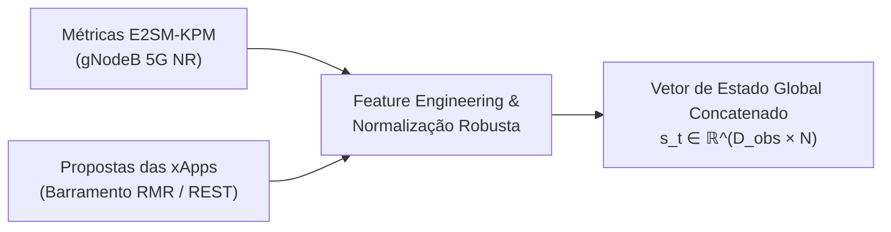
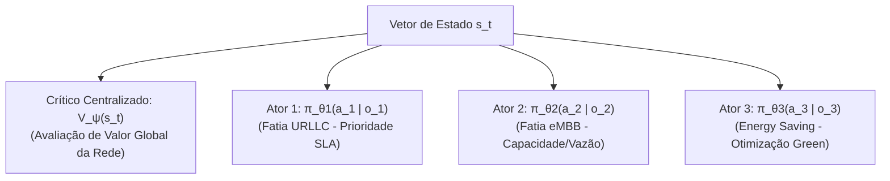
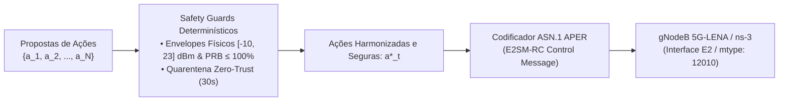

# Volume 01: Arquitetura de Software e Modelagem Matemática da Fase 2 (CA-RDL / MARL)

**Documento:** Volume Temático 01  
**Projeto:** xApp RDL (Resource and Decision Layer) — Fase 2: Context-Aware RDL (CA-RDL)  
**Escopo:** Tríade de Agentes Autônomos, Formulação MAPPO (Multi-Agent PPO), Espaço de Estados/Ações, Recompensa Multi-Objetivo e Safety Guards  
**Repositório Oficial:** [https://github.com/georgebarbosa3090/XApp-RDL-F2](https://github.com/georgebarbosa3090/XApp-RDL-F2)  

---

## 1. Visão Geral da Arquitetura Cognitiva

A Fase 2 introduz uma arquitetura orientada a agentes cognitivos com **Aprendizado por Reforço Multiagente (MARL)** baseado no paradigma **MAPPO (Multi-Agent Proximal Policy Optimization)** com **Treinamento Centralizado e Execução Descentralizada (CTDE)**.

Para máxima clareza e manutenibilidade, a arquitetura é estruturada em três camadas funcionais desacopladas:

### 1.1. Camada de Percepção (Perception Layer)

### 1.2. Camada de Raciocínio e Coordenação (Reasoning Layer - MAPPO CTDE)

### 1.3. Camada de Refinamento e Despacho E2 (Refinement Layer & Safety Guards)

---

## 2. Modelagem Matemática do MAPPO

### 2.1. Espaço de Estados Global ($\mathcal{S}$)
O vetor de estado $s_t \in \mathcal{S}$ capturado pelo `PerceptionAgent` inclui:
$$s_t = \left[ \text{SINR}_t, \, \text{RSRP}_t, \, \text{PRB}_{\text{demanded}}, \, \text{PRB}_{\text{available}}, \, \text{Load}_{\text{traffic}}, \, P_{\text{tx}}, \, N_{\text{ue}}, \, \text{ConflictFlag}, \, \text{SliceType} \right]$$

### 2.2. Função de Perda do Ator (Clipping PPO)
Cada ator descentralizado $\pi_{\theta_i}$ otimiza a política com o mecanismo de clipagem de probabilidade:
$$L^{\text{CLIP}}(\theta_i) = \hat{\mathbb{E}}_t \left[ \min \left( r_t(\theta_i) \hat{A}_t, \, \text{clip}(r_t(\theta_i), 1 - \epsilon, 1 + \epsilon) \hat{A}_t \right) \right]$$
onde $r_t(\theta_i) = \frac{\pi_{\theta_i}(a_i \mid o_i)}{\pi_{\theta_i, \text{old}}(a_i \mid o_i)}$ e $\hat{A}_t$ é a vantagem calculada pelo Crítico Centralizado via GAE (*Generalized Advantage Estimation*).

### 2.3. Função de Recompensa Multi-Objetivo ($R_t$)
A recompensa unificada equilibra múltiplos objetivos ponderados pelo `IntentClassifier`:
$$R_t = w_{\text{qos}} R_{\text{qos}}(t) + w_{\text{ee}} R_{\text{ee}}(t) - w_{\text{pen}} P_{\text{viol}}(t)$$
* **$R_{\text{qos}}(t)$:** Proximidade do cumprimento do SLA URLLC ($\text{Delay} \le 5.0\text{ ms}$).
* **$R_{\text{ee}}(t)$:** Eficiência energética calculada em $\frac{\text{Throughput (Mbps)}}{P_{\text{tx}} (\text{Watts})}$.
* **$P_{\text{viol}}(t)$:** Penalidade proporcional a conflitos não mitigados e violações de recursos.

---

## 3. Tríade de Agentes Autônomos

| Agente | Classe Python | Responsabilidade Principal |
| :--- | :--- | :--- |
| **Perception Agent** | `src.agents.perception.PerceptionAgent` | Ingestão E2SM-KPM, extração de features, normalização robusta e detecção de anomalias de rádio. |
| **Reasoning Agent** | `src.agents.reasoning.ReasoningAgent` | Avaliação de contexto, execução da rede neural MAPPO e geração de propostas de controle. |
| **Refinement Agent** | `src.agents.refinement.RefinementAgent` | Verificação de invariantes físicos, Safety Guards de SLA e formatação de mensagens E2SM-RC. |
