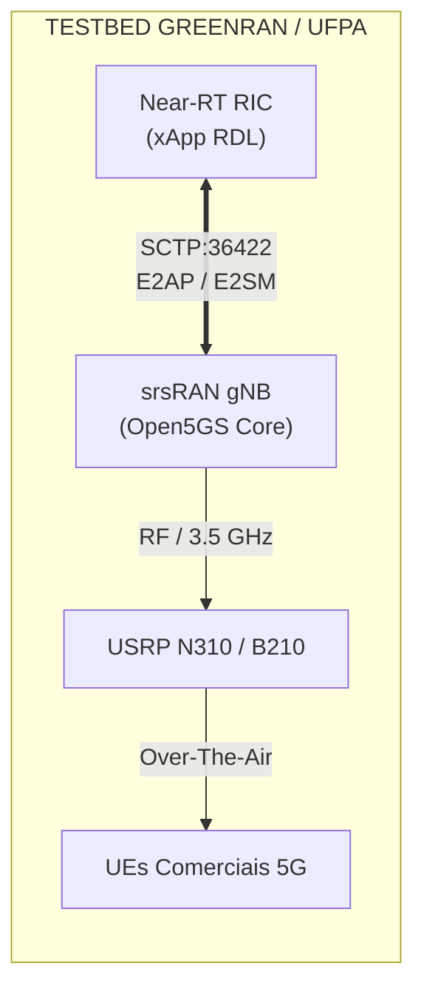

# Volume 02: Guia Operacional de Deploy, Simulação e Observabilidade

> **Navegação da Documentação Consolidada:**  
> **[01. Arquitetura & Modelagem](01_arquitetura_e_modelagem.md)** | **[02. Guia Operacional & Deploy](02_guia_operacional_deploy_e_simulacao.md)** | **[03. Taxonomia de Conflitos & Cenários](03_taxonomia_de_conflitos_e_cenarios.md)** | **[04. Relatório Científico Mestre](04_relatorio_cientifico_mestre_rdl.md)** | **[05. Auditoria & Conformidade O-RAN](05_auditoria_e_conformidade_oran.md)** | **[06. Roadmap & Futuro 6G](06_roadmap_e_pesquisa_futura_6g.md)** | **[07. Resultados Simulação (S0–S15)](07_relatorio_resultados_simulacao_baselines_hrdl_cardl.md)**

---

## 1. Pré-Requisitos e Ambiente de Execução

O ambiente de execução e desenvolvimento da xApp RDL é homologado sobre **WSL2 / Ubuntu 22.04 LTS** ou instâncias Linux nativas:

| Componente | Versão Homologada | Finalidade |
| :--- | :---: | :--- |
| **Docker Engine** | $\ge 24.0$ | Execução de containers e nós k3d |
| **k3d (K3s em Docker)** | $\ge 5.6.0$ | Provisionamento de cluster Kubernetes leve |
| **Helm** | $\ge 3.12.0$ | Gerenciamento de pacotes e deploys de xApps |
| **Python** | $3.10+$ | Runtime da xApp RDL, bibliotecas e agentes |
| **ns-3** | $3.48$ | Simulador de eventos discretos da RAN |
| **5G-LENA** | v5.1 | Módulo NR CTTC-LENA para camada física/MAC |
| **NORI E2 Agent** | SBrT 2025 (`9b64c12`) | Agente E2 C++ com suporte a E2AP v2.03 / E2SM-KPM / E2SM-RC |

---

## 2. Provisionamento do Cluster Kubernetes com k3d

Para viabilizar a comunicação de sinalização O-RAN e observabilidade, o cluster k3d deve expor portas dedicadas para tráfego SCTP (E2) e HTTP/RMR:

### 2.1. Criação do Cluster Single-Node (Padrão para Dev/CI)
```bash
k3d cluster create rdl-cluster \
  --servers 1 \
  -p "36422:36422/sctp@server:0" \
  -p "8080-8087:8080-8087@server:0" \
  -p "4560-4561:4560-4561@server:0"
```

### 2.2. Criação do Cluster Dual-Node (Separação Control-Plane e Worker)
```bash
k3d cluster create rdl-cluster \
  --servers 1 \
  --agents 1 \
  -p "36422:36422/sctp@server:0" \
  -p "8080-8087:8080-8087@server:0" \
  -p "4560-4561:4560-4561@server:0"
```

### 2.3. Configuração dos Namespaces O-RAN
```bash
kubectl create namespace ricplt    # Plataforma Near-RT RIC (E2term, AppMgr, SubMgr, SDL)
kubectl create namespace ricxapp   # Micro-aplicações (RDL, xSlice, Energy Saving, Traffic Steering)
```


---

## 3. Pipeline de Deploy das xApps e Near-RT RIC

### 3.1. Deploy via Helm Charts (Recomendado)
A automação oficial está centralizada no script `scripts/deploy_helm.sh`:

```bash
# Executa deploy completo: Near-RT RIC -> xApps de referência -> xApp RDL
bash scripts/deploy_helm.sh
```

Ou realize o deploy modular manualmente:
```bash
# 1. Deploy da infraestrutura Redis / Shared Data Layer
helm install rdl-sdl deploy/helm/rdl-sdl -n ricplt

# 2. Deploy das 3 xApps de referência abertas
helm install xslice deploy/helm/xslice -n ricxapp
helm install energy-saving deploy/helm/energy-saving -n ricxapp
helm install traffic-steering deploy/helm/traffic-steering -n ricxapp

# 3. Deploy da xApp RDL (Governança e Arbitragem)
helm install xapp-rdl deploy/helm/xapp-rdl -n ricxapp
```

### 3.2. Deploy Alternativo via Manifestos Kubernetes Puros
```bash
kubectl apply -f deploy/kubernetes/ricplt/
kubectl apply -f deploy/kubernetes/ricxapp/
```

### 3.3. Verificação de Saúde e Prontidão dos Pods
```bash
# Verificar status de execução
kubectl get pods -n ricplt
kubectl get pods -n ricxapp

# Smoke test automatizado de todas as xApps
bash scripts/verify_3_xapps.sh
```

---

## 4. Observabilidade, Métricas e Telemetria

### 4.1. Endpoints de Saúde e Métricas HTTP
- **Health Check Probe:** `http://localhost:8080/health` (Retorna `{"status": "UP"}`)
- **Readiness Probe:** `http://localhost:8080/ready` (Retorna `{"status": "READY"}`)
- **Métricas Prometheus:** `http://localhost:8081/metrics`
  - `rdl_conflicts_total`: Total de conflitos detectados por tipo.
  - `rdl_decisions_total`: Total de decisões emitidas por nível.
  - `rdl_decision_latency_seconds`: Histograma da latência de decisão ($T_{decision}$).
  - `rdl_safety_blocks_total`: Total de comandos inseguros barrados pelos Safety Guards.

### 4.2. Stack de Telemetria e Dashboards em Tempo Real (InfluxDB 2.7 + Grafana)
Para observabilidade em tempo real com alta taxa de amostragem durante as simulações, você pode subir via **Helm (Kubernetes / k3d)** ou via **Docker Compose**:

#### Opção A: Deploy Nativo via Helm no Kubernetes (Recomendado para Cluster O-RAN)
```bash
# 1. Instalar o Helm Chart da Stack de Telemetria no namespace ricplt:
helm upgrade --install oran-telemetry deploy/helm/oran-telemetry \
  --namespace ricplt \
  --create-namespace

# 2. Provisionar dashboards nativos automaticamente:
python deployments/telemetry/setup_influxdb_dashboard.py

# 3. Iniciar o streaming de telemetria física em tempo real:
python deployments/telemetry/telemetry_influx_bridge.py --duration 300
```

#### Opção B: Deploy via Docker Compose (Stand-alone)
```bash
# 1. Subir containers no Docker:
docker compose -f deployments/telemetry/docker-compose.telemetry.yml up -d

# 2. Provisionar dashboards nativos:
python deployments/telemetry/setup_influxdb_dashboard.py

# 3. Iniciar streaming de telemetria:
python deployments/telemetry/telemetry_influx_bridge.py --duration 300
```
- **InfluxDB 2.7 UI:** `http://localhost:8086` (Org: `oran-alliance`, Bucket: `oran_telemetry`)
- **Grafana Dashboard:** `http://localhost:3000` (Login: `admin` / Senha: `admin`)

### 4.3. Dissecção e Auditoria de Traces PCAP E2 (Python, Windows e WSL2)
Após executar a captura protocolar (`python scripts/run_e2_live_socket_capture.py`):
```bash
# Opção A (Python Standalone - Direto no terminal Windows/Linux):
python scripts/inspect_pcap_e2_traces.py

# Opção B (Windows com Wireshark/tshark):
& "C:\Program Files\Wireshark\tshark.exe" -r experiments/results/traces/live_e2_loopback_capture.pcap -V

# Opção C (Linux / WSL2 com tshark):
tshark -r experiments/results/traces/live_e2_loopback_capture.pcap -V
```

### 4.4. Dashboard Rancher e Kiali Service Mesh
Para habilitar observabilidade gráfica do fluxo de microsserviços no Kubernetes k3d:
```bash
# Instalação do Rancher Manager no k3d
docker run -d --restart=unless-stopped -p 8443:443 --privileged rancher/rancher:latest

# Instalação do Kiali (após provisionamento Istio)
kubectl apply -f https://raw.githubusercontent.com/kiali/kiali/master/deploy/kubernetes/kiali.yaml
```


---

## 5. Pipeline de Co-Simulação ns-3.48 / 5G-LENA / NORI

### 5.1. Compilação dos Cenários ns-3
Dentro do workspace ns-3 com 5G-LENA v5.1 e extensão NORI:
```bash
# Configuração do CMake com suporte a Ninja e modo otimizado
./ns3 configure -d optimized --enable-examples --enable-tests

# Compilação dos executáveis de cenário (S0 a S15)
./ns3 build
```

### 5.2. Execução Automatizada da Suíte Completa (S0 a S15)
```bash
# Executa todos os 16 cenários com rastreamento FlowMonitor
bash simulations/ns3/run_all_s0_s15_simulations.sh all
```

### 5.3. Processamento de Traces FlowMonitor e Geração de Relatórios
```bash
# Parser e consolidação de métricas em Markdown e CSV
python3 scripts/generate_ns3_flowmonitor_markdown_report.py
```

### 5.4. Regeneração Automática de Figuras e Tabelas Científicas
Para atualizar instantaneamente as **25 figuras científicas (300 DPI)** e as **15 tabelas consolidadas CSV**:
```bash
# Executa a geração via Make
make auto-update-figures

# Ou execute diretamente com uv:
uv run --with matplotlib --with seaborn --with pandas --with scipy python analysis/generate_plots.py
uv run --with matplotlib --with seaborn --with pandas --with scipy python analysis/export_tables.py
```

---

## 6. Integração com Testbed Físico GreenRAN (UFPA)

Para validação em hardware de rádio real e ambiente O-RAN desagregado:



1. **Configuração da gNodeB srsRAN 24.10:** Configurar `e2_ip` apontando para o IP do pod `e2term` no cluster K8s.
2. **Core 5G (Open5GS):** Provisionar fatias URLLC (`SST=2, SD=0x000001`) e eMBB (`SST=1, SD=0x000001`).
3. **Rádios USRP:** Fixar potência de transmissão em $23\text{ dBm}$ (limite COTS indoor) e canal $100\text{ MHz}$ na banda n78.

---

## 7. Troubleshooting, Backups e Limpeza

### 7.1. Diagnóstico e Resolução de Problemas
| Sintoma | Causa Mais Provável | Procedimento de Resolução |
| :--- | :--- | :--- |
| **Porta 36422 recusada (SCTP)** | Pod `e2term` não inicializado ou firewall | `kubectl describe pod -l app=e2term -n ricplt` e verificar regras `iptables` |
| **RMR Routing Failure (`RMR_ERR_NOENDPT`)** | Tabela de rotas RMR desatualizada | Verificar `configs/routes.rt` e reiniciar pod da RDL |
| **Conflitos de portas locais (8080)** | Outro serviço ocupando a porta | Modificar mapeamento no `k3d cluster create` para `8090:8080` |
| **Falha de memória no ns-3** | Múltiplas instâncias simultâneas | Executar com limitador de jobs: `make run-simulations JOBS=2` |

### 7.2. Backup Automatizado para o Google Drive
O projeto inclui um pipeline autônomo de empacotamento com manifesto criptográfico SHA-256 e streaming para o Google Drive:

- **Pasta Destino:** [Google Drive - XApp-RDL Backups](https://drive.google.com/drive/folders/14ZHofqW5rT3UIXe248wb6JHiNX0WiGiM?usp=sharing)
- **Folder ID:** `14ZHofqW5rT3UIXe248wb6JHiNX0WiGiM`

```bash
# Execução via Make
make backup-drive

# Execução via PowerShell (Windows)
powershell -ExecutionPolicy Bypass -File scripts/backup_to_google_drive.ps1

# Execução direta via Python / uv
uv run --with google-api-python-client --with google-auth-httplib2 --with google-auth-oauthlib python scripts/backup_to_google_drive.py
```

### 7.3. Limpeza e Reinicialização Completa do Ambiente
```bash
# Remove o cluster k3d e containers residuais
k3d cluster delete rdl-cluster

# Limpeza de artefatos temporários
make clean
```
