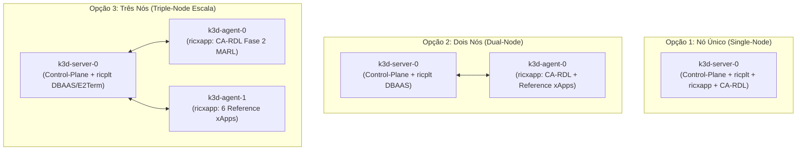

# Volume 02: Infraestrutura de Cluster k3d, Topologias de Nós e Rancher Dashboard

**Documento:** Volume Temático 02  
**Projeto:** xApp RDL (Resource and Decision Layer) — Fase 2: Context-Aware RDL (CA-RDL / MARL)  
**Escopo:** Topologias de Cluster k3d (1 Nó, 2 Nós e 3 Nós) no WSL2, Portas O-RAN, Near-RT RIC, Istio e Rancher Dashboard  
**Repositório Oficial:** [https://github.com/georgebarbosa3090/XApp-RDL-F2](https://github.com/georgebarbosa3090/XApp-RDL-F2)  

---

## 1. Matriz Comparativa das Topologias de Cluster k3d

A implantação do ecossistema O-RAN no Kubernetes local via `k3d` suporta **três topologias operacionais distintas**, adequando-se ao perfil de hardware da máquina de testes e aos requisitos de segregação de plano de controle e dados:

| Parâmetro | Opção 1: Nó Único (Single-Node) | Opção 2: Dois Nós (Dual-Node) | Opção 3: Três Nós (Triple-Node) |
| :--- | :---: | :---: | :---: |
| **Composição de Nós** | `1 Server` (Control-Plane + Worker) | `1 Server` + `1 Agent` (Worker) | `1 Server` + `2 Agents` (Workers) |
| **Segregação de Workloads** | Todos os Pods no mesmo nó | `ricplt` no Server / `ricxapp` no Agent | `ricplt` no Server / `CA-RDL` no Agent 1 / `Reference xApps` no Agent 2 |
| **Consumo de Memória RAM** | Baixo (~4 GB a 6 GB) | Médio (~8 GB a 10 GB) | Completo (~12 GB a 16 GB) |
| **Uso Recomendado** | Desenvolvimento local rápido, CI/CD e máquinas com RAM limitada | Testes de integração O-RAN com isolamento de plano de controle | Benchmarks científicos, testes de alta carga MARL e co-simulação ns-3 |
| **Comando Makefile** | `make cluster-create-1node` | `make cluster-create-2nodes` | `make cluster-create-3nodes` |

---

## 2. Detalhamento e Comandos de Criação por Topologia



---

### 2.1. Opção 1: Nó Único (Single-Node / Minimalista)
* **Objetivo:** Execução leve e unificada para estações de trabalho compactas.
* **Comando Direto k3d:**
  ```bash
  k3d cluster create rancher-lab \
    --servers 1 --agents 0 \
    --port "36422:36422/SCTP@server:0" \
    --port "8080:8080@server:0" \
    --port "8081:8081@server:0" \
    --port "4560:4560@server:0" \
    --port "4561:4561@server:0"
  mkdir -p ~/.kube && k3d kubeconfig get rancher-lab > ~/.kube/config
  ```
* **Via Makefile:**
  ```bash
  make cluster-create-1node
  # ou simplesmente: make cluster-create
  ```

---

### 2.2. Opção 2: Dois Nós (Dual-Node / Segregação RIC vs xApps)
* **Objetivo:** Isolar a infraestrutura do Near-RT RIC (`ricplt`) das aplicações cognitivas (`ricxapp`).
* **Comando Direto k3d:**
  ```bash
  k3d cluster create rancher-lab \
    --servers 1 --agents 1 \
    --port "36422:36422/SCTP@server:0" \
    --port "8080:8080@server:0" \
    --port "8081:8081@server:0" \
    --port "4560:4560@server:0" \
    --port "4561:4561@server:0"
  mkdir -p ~/.kube && k3d kubeconfig get rancher-lab > ~/.kube/config
  ```
* **Via Makefile:**
  ```bash
  make cluster-create-2nodes
  ```

---

### 2.3. Opção 3: Três Nós (Triple-Node / Alta Performance e Avaliação Científica)
* **Objetivo:** Máximo isolamento de recursos para bancada multi-agente, onde o motor MAPPO/PyTorch opera em nó dedicado sem contenção de CPU das 6 Reference xApps.
* **Comando Direto k3d:**
  ```bash
  k3d cluster create rancher-lab \
    --servers 1 --agents 2 \
    --port "36422:36422/SCTP@server:0" \
    --port "8080:8080@server:0" \
    --port "8081:8081@server:0" \
    --port "4560:4560@server:0" \
    --port "4561:4561@server:0"
  mkdir -p ~/.kube && k3d kubeconfig get rancher-lab > ~/.kube/config
  ```
* **Via Makefile:**
  ```bash
  make cluster-create-3nodes
  ```

---

## 3. Gestão e Ciclo de Vida do Cluster

### 3.1. Verificar os Nós Ativos
```bash
kubectl get nodes -o wide
```
* **Exemplo de saída (3 Nós):**
  ```text
  NAME                    STATUS   ROLES                  AGE   VERSION
  k3d-rancher-lab-server-0   Ready    control-plane,master   2m    v1.28.2+k3s1
  k3d-rancher-lab-agent-0    Ready    <none>                 2m    v1.28.2+k3s1
  k3d-rancher-lab-agent-1    Ready    <none>                 2m    v1.28.2+k3s1
  ```

### 3.2. Sincronização de Imagens Docker entre os Nós
Quando o cluster possui múltiplos nós (`agents > 0`), as imagens Docker locais devem ser importadas no containerd de todos os nós:
```bash
# Script automatizado que itera por todos os nós ativos (server e agents):
./scripts/deploy_reference_xapps.sh
```

### 3.3. Destruir ou Recriar o Cluster
```bash
# Deleta o cluster k3d:
make cluster-delete

# Recria o cluster limpo:
make cluster-recreate
```

---

## 4. Integração com Rancher Dashboard e Kiali

Ao utilizar o cluster k3d no ambiente WSL2:
1. **Rancher Dashboard:** Pode ser acessado via Docker ou Ingress para gestão gráfica de nós, namespaces e recursos.
2. **Kiali Service Mesh:** Conecta-se diretamente aos pods injetados com o proxy Envoy (`2/2 READY`) nos namespaces `ricxapp` e `ricplt`.
