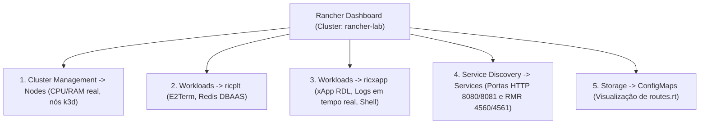

# Volume 02: Infraestrutura de Cluster k3d, Rancher Dashboard e Operações O-RAN

**Documento:** Volume Temático 02  
**Projeto:** xApp RDL (Resource and Decision Layer)  
**Escopo:** Topologias k3d no WSL2, Instalação Near-RT RIC, Rancher Dashboard UI e Agente Especialista de Cluster  
**Data de Consolidação:** 25/08/2026  

---

## 1. Topologias de Cluster k3d para O-RAN no WSL2

Executar a stack completa do **Near-RT RIC** e xApps no WSL2 exige uma gestão precisa de memória RAM e CPU para evitar que o *OOM Killer* do Linux derrube os nós ou o simulador `ns-3`.

### Comparativo de Topologias:

| Critério | 1 Server + 2 Agents (3 nós) | Opção 1: 1 Server + 1 Agent (2 nós) | Opção 2: Single-Node (1 Server) |
| :--- | :---: | :---: | :---: |
| **Overhead de RAM k3d** | ~1.500 MB | ~900 MB | **~450 MB** |
| **Importação de Imagens Docker** | Exige replicar nos 3 nós | Requer importar no `agent-0` | **Importa direto no nó único** |
| **Isolamento de Namespaces** | Lógico (`ricplt`/`ricxapp`) | Lógico (`ricplt`/`ricxapp`) | Lógico (`ricplt`/`ricxapp`) |
| **Estabilidade no WSL2** | Médio / Risco de OOM | Muito Boa | **Excelente (Recomendada)** |

### 1.1. Como Criar o Cluster k3d Otimizado (Single-Node com Portas O-RAN)
```bash
# Deletar cluster antigo (se existir)
k3d cluster delete rancher-lab 2>/dev/null || true

# Criar cluster com portas SCTP (36422), HTTP (8080/8081) e RMR (4560/4561)
k3d cluster create rancher-lab \
  --servers 1 \
  --agents 0 \
  --port "36422:36422/SCTP@server:0" \
  --port "8080:8080@server:0" \
  --port "8081:8081@server:0" \
  --port "4560:4560@server:0" \
  --port "4561:4561@server:0"
```

---

## 2. Instalação e Estrutura da Plataforma Near-RT RIC

A plataforma Near-RT RIC é organizada em dois namespaces centrais:
* **`ricplt` (Plataforma):**
  - **Redis DBAAS:** Shared Data Layer (SDL) para persistência de topologia e histórico de UEs (`porta 6379`).
  - **E2Term:** Ponto de terminação das conexões SCTP com as antenas gNodeB / simulador `ns-3` (`porta 36422`).
  - **AppMgr & RouteMgr:** Gerenciamento do ciclo de vida de xApps e distribuição de tabelas de rotas RMR.
* **`ricxapp` (Aplicações):**
  - Execução da `ricxapp-iqos-xapp-rdl`, `ric-app-ts`, `ric-app-kpimon`.

### Provisionamento Rápido dos Namespaces e Redis DBAAS:
```bash
kubectl create namespace ricplt --dry-run=client -o yaml | kubectl apply -f -
kubectl create namespace ricxapp --dry-run=client -o yaml | kubectl apply -f -

# Subir Redis DBAAS no namespace ricplt
kubectl apply -n ricplt -f - <<EOF
apiVersion: apps/v1
kind: Deployment
metadata:
  name: deployment-ricplt-dbaas-redis
  namespace: ricplt
  labels:
    app: ricplt-dbaas
spec:
  replicas: 1
  selector:
    matchLabels:
      app: ricplt-dbaas
  template:
    metadata:
      labels:
        app: ricplt-dbaas
    spec:
      containers:
      - name: redis
        image: redis:6.2-alpine
        ports:
        - containerPort: 6379
---
apiVersion: v1
kind: Service
metadata:
  name: service-ricplt-dbaas-tcp
  namespace: ricplt
  labels:
    app: ricplt-dbaas
spec:
  selector:
    app: ricplt-dbaas
  ports:
  - port: 6379
    targetPort: 6379
EOF
```

---

## 3. Guia de Operação e Visualização no Rancher Dashboard

O **Rancher Dashboard** (`https://127.0.0.1:8443`) centraliza o gerenciamento visual do cluster.



### 3.1. Navegação Passo a Passo no Rancher:
1. **Selecionar o Cluster:** Na tela inicial, clique no cluster **`rancher-lab`**.
2. **Filtrar por Namespace:** No seletor superior, selecione **`ricxapp`** (ou `ricplt`).
3. **Inspecionar a xApp RDL:**
   - Vá em **Workloads -> Deployments** -> clique em `ricxapp-iqos-xapp-rdl`.
   - **Métricas:** Visualize os gráficos de uso de CPU e Memória RAM.
   - **Logs ao Vivo:** Clique em `⋮` -> **Ver Registros** (*View Logs*) para acompanhar a arbitragem em tempo real.
   - **Terminal Integrado:** Clique em `⋮` -> **Executar Shell** (*Execute Shell*) para abrir o terminal dentro da xApp.

---

## 4. Agente Especialista: `07-k8s-oran-cluster-operator`

O agente especialista atua autonomamente no diagnóstico e resolução de problemas de cluster:
* **Playbook de Correção do Rancher Agent (`cattle-cluster-agent`):**
  ```bash
  # 1. Conectar Rancher na rede Docker do k3d
  docker network connect k3d-rancher-lab rancher-server 2>/dev/null || true

  # 2. Configurar o agente para falar diretamente com o container do Rancher
  kubectl set env deployment/cattle-cluster-agent -n cattle-system \
    CATTLE_SERVER="https://rancher-server:443" \
    CATTLE_SSL_NO_VERIFY="true" 2>/dev/null || true

  # 3. Reiniciar o pod do agente
  kubectl delete pod -n cattle-system -l app=cattle-cluster-agent --force --grace-period=0
  ```
