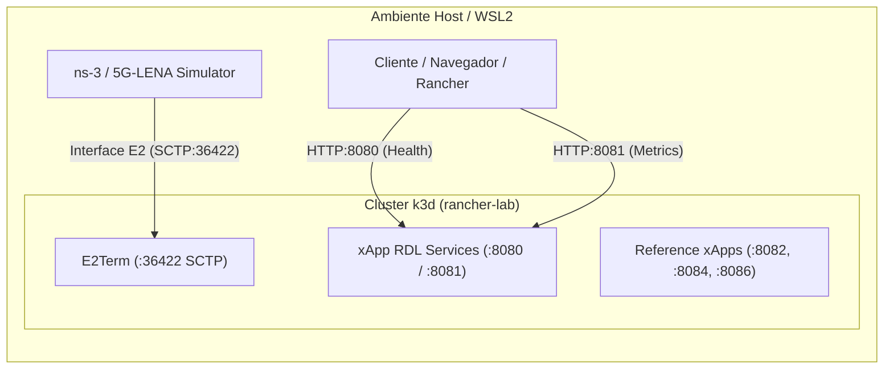

# Volume 02: Infraestrutura de Cluster k3d, Rancher Dashboard e Operações O-RAN

**Documento:** Volume Temático 02  
**Projeto:** xApp RDL (Resource and Decision Layer) — Fase 2: Context-Aware RDL (CA-RDL / MARL)  
**Escopo:** Topologias k3d no WSL2, Configuração de Portas O-RAN, Near-RT RIC e Rancher Dashboard  
**Repositório Oficial:** [https://github.com/georgebarbosa3090/XApp-RDL-F2](https://github.com/georgebarbosa3090/XApp-RDL-F2)  

---

## 1. Topologias de Cluster k3d para O-RAN no WSL2

Executar a stack completa do **Near-RT RIC** e xApps no WSL2 exige uma gestão precisa de portas e limites de memória para suportar a coexistência com o simulador `ns-3`.

### Portas O-RAN Mapeadas no Cluster k3d:
* **Porta `36422/SCTP`:** Interface E2 (SCTP) para conexão do E2 Agent (gNodeB) ao E2Term do Near-RT RIC.
* **Portas `8080/TCP` e `8081/TCP`:** Endpoints HTTP `/health` e `/metrics` (Prometheus) da xApp RDL Fase 2.
* **Portas `4560/TCP` e `4561/TCP`:** Barramento RMR (RIC Message Router) de dados e rotas.
* **Portas `8082`, `8084`, `8086`:** Endpoints HTTP das 3 Reference xApps (`xslice`, `energy-saving`, `traffic-steering`).

