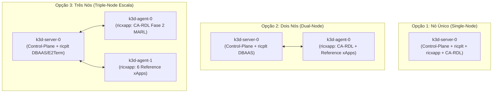
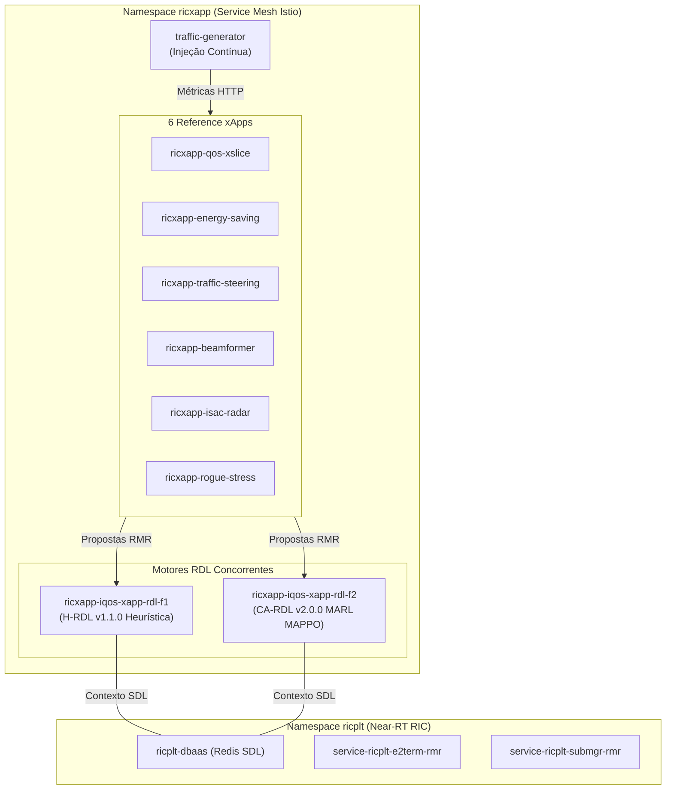

# Volume 03: Guia de Infraestrutura, Implantação e Automação de Deploy (Helm & K8s)

**Documento:** Volume Temático 03 (Integrado com o antigo Volume 02)  
**Projeto:** xApp RDL (Resource and Decision Layer) — Fase 2: Context-Aware RDL (CA-RDL / MARL)  
**Escopo:** Topologias de Cluster k3d (1, 2 e 3 Nós), Implantação Greenfield, Brownfield e Coexistência O-RAN  
**Repositório Oficial:** [https://github.com/georgebarbosa3090/XApp-RDL-F2](https://github.com/georgebarbosa3090/XApp-RDL-F2)  
**Versão da Release:** `ricxapp-iqos-xapp-rdl-f2` | **Imagem:** `iqos-xapp-rdl:2.0.0`  

---

## 1. Execução Rápida no Terminal (Quickstart)

Para usuários que desejam **clonar/atualizar o repositório, resetar o cluster k3d antigo e implantar a infraestrutura Near-RT RIC**, execute o bloco abaixo diretamente no terminal:

```bash
# 1. Navegar até o diretório do repositório F2:
cd ~/XApp-RDL-F2

# 2. Deletar qualquer cluster k3d antigo e criar um novo cluster limpo (1 Nó):
make cluster-delete 2>/dev/null || k3d cluster delete rancher-lab 2>/dev/null
make cluster-create-1node

# 3. Executar o pipeline automatizado de deploy via HELM (Near-RT RIC + Reference xApps + CA-RDL):
bash scripts/deploy_helm.sh --with-rdl
```

---

## 2. Topologias de Cluster k3d e Gestão de Infraestrutura

A implantação do ecossistema O-RAN no Kubernetes local via `k3d` suporta **três topologias operacionais**, permitindo adequar o consumo de RAM e CPU ao perfil da máquina de testes:

### 2.1. Matriz Comparativa de Topologias

| Topologia | Composição dos Nós | Segregação de Workloads | Consumo de RAM | Comando de Criação |
| :--- | :--- | :--- | :---: | :--- |
| **Opção 1: Nó Único (Single-Node)** | `1 Server` (Control-Plane + Worker) | Todos os Pods no mesmo nó | ~4 GB a 6 GB | `make cluster-create-1node` |
| **Opção 2: Dois Nós (Dual-Node)** | `1 Server` + `1 Agent` | `ricplt` no Server / `ricxapp` no Agent | ~8 GB a 10 GB | `make cluster-create-2nodes` |
| **Opção 3: Três Nós (Triple-Node)** | `1 Server` + `2 Agents` | `ricplt` no Server / `CA-RDL` no Agent 1 / `Reference xApps` no Agent 2 | ~12 GB a 16 GB | `make cluster-create-3nodes` |

---

### 2.2. Detalhamento Arquitetural das Topologias



---

### 2.3. Gestão do Ciclo de Vida do Cluster e Rancher

* **Verificar Nós do Cluster:** `kubectl get nodes -o wide`
* **Sincronizar Imagens entre Nós (Clusters Multi-Node):** `./scripts/deploy_reference_xapps.sh`
* **Painel Rancher Dashboard:** Gestão gráfica de nós, Pods e workloads via browser.
* **Kiali Service Mesh:** Visualização gráfica da topologia e tráfego de dados no Istio.

---

## 3. Cenários de Implantação no Kubernetes

```
┌────────────────────────────────────────────────────────────────────────────────────────┐
│                              MATRIZ DE CENÁRIOS DE DEPLOY                              │
├───────────────────────────────────┬────────────────────────────────────────────────────┤
│ Cenário A: Greenfield (Do Zero)   │ Instalação completa (RIC + 6 xApps + CA-RDL F2)    │
├───────────────────────────────────┼────────────────────────────────────────────────────┤
│ Cenário B: Brownfield (Isolado)   │ Atualiza/Instala exclusivamente a RDL Fase 2       │
├───────────────────────────────────┼────────────────────────────────────────────────────┤
│ Cenário C: Coexistência Completa  │ Pilha científica completa (H-RDL F1 + CA-RDL F2)   │
└───────────────────────────────────┴────────────────────────────────────────────────────┘
```

---

### 3.1. Cenário A: Implantação Completa do Zero (Greenfield)

Recomendado para máquinas limpas ou após recriar o ambiente. **Execução passo a passo com blocos de código independentes para copiar e colar no terminal:**

#### Passo 1: Navegar até o repositório e criar/resetar o cluster k3d
```bash
cd ~/XApp-RDL-F2
make cluster-delete 2>/dev/null || k3d cluster delete rancher-lab 2>/dev/null
make cluster-create-1node
```

#### Passo 2: Compilar a imagem Docker unificada e criar as tags
```bash
make build
docker tag iqos-xapp-rdl:2.0.0 iqos-xapp-rdl:1.1.0 2>/dev/null || true
```

#### Passo 3: Importar as imagens para os nós do k3d
```bash
k3d image import iqos-xapp-rdl:1.1.0 iqos-xapp-rdl:2.0.0 -c rancher-lab
```

#### Passo 4: Criar namespaces e implantar o Near-RT RIC (`ricplt`)
```bash
kubectl apply -f deploy/kubernetes/namespace.yaml
kubectl apply -f deploy/kubernetes/near-rt-ric.yaml -n ricplt
kubectl rollout status deployment/deployment-ricplt-dbaas-redis -n ricplt --timeout=90s
```

#### Passo 5: Implantar as 3 Reference xApps via HELM (`ricxapp`)
```bash
helm upgrade --install ricxapp-qos-xslice deploy/helm/xapp-qos-xslice -n ricxapp --create-namespace --set image.pullPolicy=Never
helm upgrade --install ricxapp-energy-saving deploy/helm/xapp-energy-saving -n ricxapp --create-namespace --set image.pullPolicy=Never
helm upgrade --install ricxapp-traffic-steering deploy/helm/xapp-traffic-steering -n ricxapp --create-namespace --set image.pullPolicy=Never
```

#### Passo 6: Implantar a xApp RDL Fase 2 (CA-RDL / MARL) via HELM
```bash
helm upgrade --install ricxapp-iqos-xapp-rdl-f2 deploy/helm/iqos-xapp-rdl -n ricxapp --create-namespace --set image.pullPolicy=Never --set image.tag=2.0.0
```

#### Passo 7: Verificar a prontidão dos Pods no namespace `ricxapp`
```bash
kubectl get pods -n ricxapp -o wide
```

#### Alternativa: Pipeline HELM 1-Comando (Tudo Automatizado)
```bash
bash scripts/deploy_helm.sh --with-rdl
```

---

### 3.2. Cenário B: Implantação Incremental / Isolada (Brownfield)

Utilize este cenário quando a infraestrutura Near-RT RIC e as Reference xApps **já estiverem rodando** no cluster e você deseja atualizar apenas a xApp RDL Fase 2:

```bash
# Implanta/Atualiza apenas a release Helm da Fase 2 sem tocar no Near-RT RIC:
make helm-deploy-f2

# Ou atualização declarativa via Helm Upgrade:
make helm-upgrade-f2
```

---

### 3.3. Cenário C: Implantação de Coexistência Completa (H-RDL F1 + CA-RDL F2 + 6 xApps)

Cenário para **avaliação científica e benchmarking**. Implanta ambas as versões do motor RDL (H-RDL Fase 1 e CA-RDL Fase 2) operando concorrentemente no mesmo cluster:



#### Comando de Implantação em 1 Clique:
```bash
make deploy-full-coexistence
# ou: bash scripts/deploy_dual_rdl_6xapps.sh
```

---

## 4. Validação, Telemetria e Limpeza

### 4.1. Status dos Pods e Logs
```bash
# Status dos Pods nas xApps e RIC:
kubectl get pods -n ricplt -o wide
kubectl get pods -n ricxapp -o wide

# Streaming de logs da xApp RDL Fase 2 em tempo real:
make logs-f2
```

### 4.2. Endpoints HTTP e Telemetria Prometheus
```bash
# Teste automatizado de liveness e métricas:
make test-f2

# Testes manuais:
curl -i http://localhost:8080/health
curl -s http://localhost:8081/metrics | grep -E "rdl_|marl_"
```

### 4.3. Limpeza do Ambiente (Tear Down)
```bash
# Limpeza completa de todos os Pods, Releases Helm e Namespaces:
make clean-all

# Destruir e recriar o cluster k3d do zero:
make cluster-recreate
```

---

## 5. Apêndice: Mapeamento de Portas e Comandos Makefile

### 5.1. Tabela de Serviços e Portas O-RAN Expostas

| Serviço / Componente | Namespace | Porta Contêiner | Porta Mapeada no Host | Finalidade |
| :--- | :--- | :---: | :---: | :--- |
| **xApp RDL F2 (HTTP)** | `ricxapp` | `8080` | `8080` | Liveness/Readiness e API REST |
| **xApp RDL F2 (Metrics)** | `ricxapp` | `8081` | `8081` | Telemetria Prometheus / MARL |
| **xApp RDL F2 (RMR)** | `ricxapp` | `4560` | `4560` | Barramento de Mensagens RMR |
| **DBAAS (Redis SDL)** | `ricplt` | `6379` | `6379` | Shared Data Layer |
| **E2Term / Mock** | `ricplt` | `36422` | `36422/SCTP` | Terminação E2 / simulador ns-3 |
| **QoS xSlice xApp** | `ricxapp` | `8082` | `8082` | Fatiamento de Rede / Quotas PRB |
| **Energy Saving xApp** | `ricxapp` | `8084` | `8084` | Desligamento de Células |
| **Traffic Steering xApp** | `ricxapp` | `8086` | `8086` | Handover / A3 Offset |

---

### 5.2. Cheat Sheet de Comandos Makefile

| Comando Makefile | Ação Executada | Escopo |
| :--- | :--- | :--- |
| **`make cluster-create-1node`** | Cria cluster k3d com 1 Nó (Single-Node) | Infraestrutura K8s |
| **`make cluster-create-2nodes`** | Cria cluster k3d com 2 Nós (Dual-Node) | Infraestrutura K8s |
| **`make cluster-create-3nodes`** | Cria cluster k3d com 3 Nós (Triple-Node) | Infraestrutura K8s |
| **`make cluster-delete`** | Remove o cluster k3d `rancher-lab` | Infraestrutura K8s |
| **`make build`** | Compila a imagem Docker `iqos-xapp-rdl:2.0.0` | Docker Local |
| **`make helm-deploy-f2`** | Deploy exclusivo da release CA-RDL Fase 2 | Namespace `ricxapp` |
| **`make deploy-full-coexistence`** | Deploy completo (H-RDL F1 + CA-RDL F2 + 6 xApps) | Todo o Cluster |
| **`make status-f2`** | Exibe status dos pods no namespace `ricxapp` | Diagnóstico |
| **`make logs-f2`** | Exibe logs da CA-RDL em tempo real | Diagnóstico |
| **`make test-f2`** | Testa endpoints `/health` e `/metrics` da CA-RDL | Diagnóstico |
| **`make clean-all`** | Limpa todos os recursos e namespaces O-RAN | Todo o Cluster |
| **`make sync`** | Sincroniza e envia alterações com o GitHub (1x) | Git / GitHub |
| **`make auto-sync`** | Ativa monitoramento contínuo de auto-sync com o GitHub | Git / GitHub |
