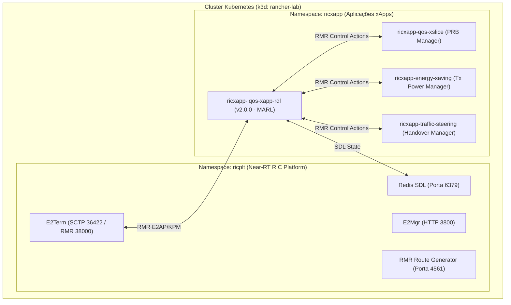

# Volume 03: Guia de Implantação e Operação no Kubernetes (Helm e K8s Nativo)

**Documento:** Volume Temático 03  
**Projeto:** xApp RDL (Resource and Decision Layer) — Fase 2: Context-Aware RDL (CA-RDL / MARL)  
**Escopo:** Procedimentos de Deploy Helm v3, Kustomize K8s, Gestão de Cluster k3d, Roteamento RMR e Verificação de Endpoints  
**Repositório Oficial:** [https://github.com/georgebarbosa3090/XApp-RDL-F2](https://github.com/georgebarbosa3090/XApp-RDL-F2)  
**Versão do Chart / Imagem:** `2.0.0` (Fase 2 - CA-RDL)  

---

## 1. Visão Geral da Arquitetura de Implantação

A **xApp RDL Fase 2** opera como um microserviço nativo em contêiner no namespace `ricxapp` do Near-RT RIC, integrando:
* **Tríade de Agentes Cognitivos:** Perception Agent, Reasoning Agent (Motor MAPPO/MARL) e Refinement Agent (Safety Guards).
* **Barramento de Mensageria RMR:** Portas `4560/TCP` (dados de controle E2) e `4561/TCP` (rotas dinâmicas).
* **Servidor HTTP de Ciclo de Vida:** Porta `8080/TCP` (`/health` e `/state`).
* **Servidor de Telemetria Prometheus:** Porta `8081/TCP` (`/metrics` com métricas `rdl_*`).
* **Persistência SDL (Shared Data Layer):** Redis no namespace `ricplt` ou Mock Resiliente em memória.



---

## 2. Pré-requisitos de Infraestrutura

1. **Docker Engine:** 20.10+ com suporte a contêineres Linux.
2. **Kubernetes CLI (`kubectl`):** v1.26+.
3. **Helm:** v3.10+.
4. **k3d / k3s:** v5.4+ (para orquestração local leve de clusters O-RAN).
5. **Python:** 3.10+ (para testes unitários e pipelines de simulação).

---

## 3. Criação e Configuração do Cluster k3d

Para instanciar o cluster local com todas as portas de rede necessárias mapeadas para o host:

```bash
# Criação do cluster k3d com portas O-RAN e Near-RT RIC
make cluster-create

# Verificar status dos nós
kubectl get nodes -o wide
```

As seguintes portas são expostas no host:
* `36422/SCTP`: Interface O-RAN E2 para conexão com o simulador ns-3.
* `8080-8087/TCP`: Endpoints HTTP REST das xApps e RIC Platform.
* `4560-4561/TCP`: Barramento de Mensageria RMR.

---

## 4. Implantação via Helm Charts (Padrão O-RAN Alliance)

A Fase 2 disponibiliza 4 Helm Charts modulares:
1. `deploy/helm/iqos-xapp-rdl` (Chart v2.0.0 da xApp RDL com MARL)
2. `deploy/helm/xapp-qos-xslice` (Chart da Reference xApp de Fatiamento)
3. `deploy/helm/xapp-energy-saving` (Chart da Reference xApp de Economia de Energia)
4. `deploy/helm/xapp-traffic-steering` (Chart da Reference xApp de Direcionamento de Tráfego)

### 4.1. Deploy Completo com Governança RDL Ativa (Modo Proposta):
```bash
# Empacota e instala todos os Helm Charts no namespace ricxapp
make helm-deploy

# Ou execute diretamente o script shell:
bash scripts/deploy_helm.sh --with-rdl
```

### 4.2. Deploy em Modo Baseline (Sem RDL - Para Benchmarks de Comparação):
```bash
make helm-deploy-baseline
```

### 4.3. Verificação do Status dos Pods:
```bash
kubectl get pods -n ricxapp -o wide
kubectl get pods -n ricplt -o wide
```

---

## 5. Validação de Endpoints e Smoke Testing

### 5.1. Teste de Saúde e Conectividade das xApps:
```bash
# Executa o script de validação das 3 Reference xApps + RDL
make test-3xapps
# ou: bash scripts/verify_3_xapps.sh
```

### 5.2. Verificação Manual dos Endpoints HTTP e Prometheus:
```bash
# 1. Healthcheck da xApp RDL
curl -i http://localhost:8080/health
# Resposta esperada: HTTP/1.1 200 OK  {"status": "UP", "phase": "2.0.0"}

# 2. Métricas Prometheus de Governança e Decisão MARL
curl -s http://localhost:8081/metrics | grep -E "rdl_|marl_"
```

### 5.3. Logs Estruturados em Tempo Real:
```bash
make logs
# ou: kubectl logs -n ricxapp -l app=ricxapp-iqos-xapp-rdl -f
```

---

## 6. Desinstalação e Limpeza

```bash
# Remoção dos Helm releases
make helm-uninstall

# Destruição completa do cluster k3d
make cluster-delete
```
