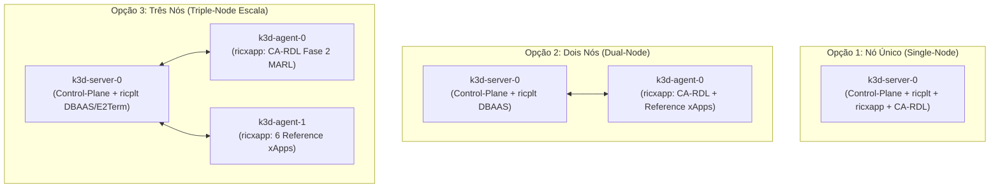
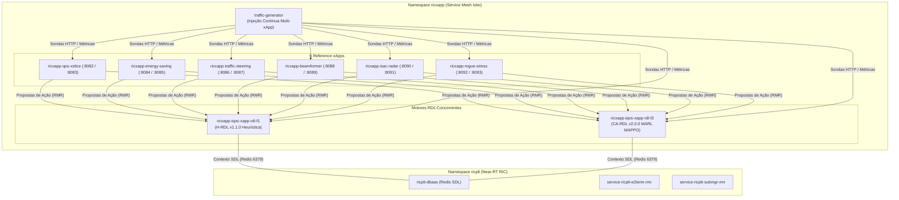

# Volume 03: Guia de Infraestrutura, Implantação e Automação de Deploy (Helm & K8s Nativo)

**Documento:** Volume Temático 03 (Integrado com o antigo Volume 02)  
**Projeto:** xApp RDL (Resource and Decision Layer) — Fase 2: Context-Aware RDL (CA-RDL / MARL)  
**Escopo:** Topologias de Cluster k3d (1, 2 e 3 Nós), Integração Rancher, Implantação Greenfield/Brownfield e Coexistência  
**Repositório Oficial:** [https://github.com/georgebarbosa3090/XApp-RDL-F2](https://github.com/georgebarbosa3090/XApp-RDL-F2)  
**Versão da Release:** `ricxapp-iqos-xapp-rdl-f2` | **Imagem:** `iqos-xapp-rdl:2.0.0`  

---

## 1. Topologias de Cluster k3d e Gestão de Infraestrutura

A implantação do ecossistema O-RAN no Kubernetes local via `k3d` suporta **três topologias operacionais distintas**, adequando-se ao perfil de hardware e aos requisitos de segregação de plano de controle e dados:

### 1.1. Matriz Comparativa das Topologias de Cluster k3d

| Parâmetro | Opção 1: Nó Único (Single-Node) | Opção 2: Dois Nós (Dual-Node) | Opção 3: Três Nós (Triple-Node) |
| :--- | :---: | :---: | :---: |
| **Composição de Nós** | `1 Server` (Control-Plane + Worker) | `1 Server` + `1 Agent` (Worker) | `1 Server` + `2 Agents` (Workers) |
| **Segregação de Workloads** | Todos os Pods no mesmo nó | `ricplt` no Server / `ricxapp` no Agent | `ricplt` no Server / `CA-RDL` no Agent 1 / `Reference xApps` no Agent 2 |
| **Consumo de Memória RAM** | Baixo (~4 GB a 6 GB) | Médio (~8 GB a 10 GB) | Completo (~12 GB a 16 GB) |
| **Uso Recomendado** | Desenvolvimento local rápido, CI/CD e máquinas com RAM limitada | Testes de integração O-RAN com isolamento de plano de controle | Benchmarks científicos, testes de alta carga MARL e co-simulação ns-3 |
| **Comando Makefile** | `make cluster-create-1node` | `make cluster-create-2nodes` | `make cluster-create-3nodes` |

---

### 1.2. Detalhamento Arquitetural das Topologias



---

### 1.3. Comandos de Criação por Topologia

#### Opção 1: Nó Único (Single-Node / Minimalista)
* **Via Makefile:** `make cluster-create-1node` (ou `make cluster-create`)
* **Comando Direto k3d:**
  ```bash
  k3d cluster create rancher-lab \
    --servers 1 --agents 0 \
    --port "36422:36422/SCTP@server:0" \
    --port "8080:8080@server:0" \
    --port "8081:8081@server:0" \
    --port "4560:4560@server:0" \
    --port "4561:4561@server:0"
  mkdir -p ~/.kube && k3d kubeconfig get rancher-lab > ~/.kube/config
  ```

#### Opção 2: Dois Nós (Dual-Node / Segregação RIC vs xApps)
* **Via Makefile:** `make cluster-create-2nodes`
* **Comando Direto k3d:**
  ```bash
  k3d cluster create rancher-lab \
    --servers 1 --agents 1 \
    --port "36422:36422/SCTP@server:0" \
    --port "8080:8080@server:0" \
    --port "8081:8081@server:0" \
    --port "4560:4560@server:0" \
    --port "4561:4561@server:0"
  mkdir -p ~/.kube && k3d kubeconfig get rancher-lab > ~/.kube/config
  ```

#### Opção 3: Três Nós (Triple-Node / Alta Performance MARL)
* **Via Makefile:** `make cluster-create-3nodes`
* **Comando Direto k3d:**
  ```bash
  k3d cluster create rancher-lab \
    --servers 1 --agents 2 \
    --port "36422:36422/SCTP@server:0" \
    --port "8080:8080@server:0" \
    --port "8081:8081@server:0" \
    --port "4560:4560@server:0" \
    --port "4561:4561@server:0"
  mkdir -p ~/.kube && k3d kubeconfig get rancher-lab > ~/.kube/config
  ```

---

### 1.4. Gestão do Ciclo de Vida do Cluster e Rancher

* **Verificar Nós Ativos:**
  ```bash
  kubectl get nodes -o wide
  ```
* **Sincronização de Imagens Docker entre Nós:**
  ```bash
  ./scripts/deploy_reference_xapps.sh
  ```
* **Integração com Rancher Dashboard & Kiali:**
  1. **Rancher Dashboard:** Gestão gráfica dos nós k3d, workloads e namespaces.
  2. **Kiali Service Mesh:** Conexão direta aos pods injetados com proxy Envoy nos namespaces `ricxapp` e `ricplt`.

---

## 2. Visão Geral e Matriz de Cenários de Deploy

O ciclo de vida da **xApp RDL Fase 2 (CA-RDL / MARL)** suporta três modos de implantação no cluster Kubernetes (k3d / K8s puro):

```
┌────────────────────────────────────────────────────────────────────────────────────────┐
│                              MATRIZ DE DEPLOY DA FASE 2                                │
├───────────────────────────────────┬────────────────────────────────────────────────────┤
│ Cenário A: Greenfield (Do Zero)   │ Cluster novo ou limpo:                             │
│                                   │ 1. Cria cluster k3d (1, 2 ou 3 nós)                │
│                                   │ 2. Cria namespaces 'ricplt' e 'ricxapp' com Istio  │
│                                   │ 3. Instala Near-RT RIC (DBAAS Redis, RMR)          │
│                                   │ 4. Instala as 6 Reference xApps                    │
│                                   │ 5. Instala xApp RDL Fase 2 (CA-RDL / MARL)         │
├───────────────────────────────────┼────────────────────────────────────────────────────┤
│ Cenário B: Brownfield (Isolado)   │ Infraestrutura já ativa:                           │
│                                   │ 1. Mantém Near-RT RIC e Reference xApps operando   │
│                                   │ 2. Instala/Atualiza apenas a release               │
│                                   │    'ricxapp-iqos-xapp-rdl-f2' (v2.0.0)             │
├───────────────────────────────────┼────────────────────────────────────────────────────┤
│ Cenário C: Coexistência Completa  │ Bancada Científica e Benchmarks:                   │
│ (Dual RDL + 6 xApps Concorrentes) │ 1. Near-RT RIC (ricplt: Redis, E2Term, SubMgr)     │
│                                   │ 2. H-RDL Fase 1 (v1.1.0 Determinística)            │
│                                   │ 3. CA-RDL Fase 2 (v2.0.0 MARL / MAPPO)             │
│                                   │ 4. Todas as 6 Reference xApps ativas simultâneas   │
│                                   │ 5. Injeção contínua de tráfego e Kiali live mesh   │
└───────────────────────────────────┴────────────────────────────────────────────────────┘
```

---

## 3. Cenário A: Implantação Completa do Zero (Greenfield — Sem RIC, Sem xApps, Sem RDL)

Este cenário é o recomendado quando você está iniciando em uma máquina nova ou após recriar o ambiente. **Nenhum componente O-RAN precisa estar previamente instalado.**

### 3.1. Passo 1: Criar o Cluster Kubernetes (k3d)
Escolha uma das topologias descritas na Seção 1 (ex: `make cluster-create-1node`).

> [!IMPORTANT]
> **Como alterar a topologia se o cluster `rancher-lab` já existir:**  
> Se o cluster já estiver criado e você tentar criar outra topologia, remova o cluster existente antes:
> ```bash
> make cluster-delete && make cluster-create-2nodes
> ```

### 3.2. Passo 2: Criar os Namespaces O-RAN
```bash
kubectl create namespace ricplt --dry-run=client -o yaml | kubectl apply -f -
kubectl create namespace ricxapp --dry-run=client -o yaml | kubectl apply -f -
```

### 3.3. Passo 3: Implantar a Plataforma Near-RT RIC (`ricplt`)
Implanta o DBAAS Redis (Shared Data Layer - SDL) e serviços da plataforma:

```bash
# 1. Navegue até o diretório do repositório F2
cd ~/XApp-RDL-F2

# 2. Garanta que os namespaces necessários existam
kubectl apply -f deploy/kubernetes/namespace.yaml

# 3. Aplique o manifesto do Near-RT RIC
kubectl apply -f deploy/kubernetes/near-rt-ric.yaml -n ricplt

# 4. Aguarde a prontidão do Redis DBAAS
kubectl rollout status deployment/deployment-ricplt-dbaas-redis -n ricplt --timeout=90s
```

### 3.4. Passo 4: Implantar as Reference xApps (`ricxapp`)
Implanta as Reference xApps que fornecerão métricas e atuarão nas decisões de rede:
```bash
# Opção A: Script automatizado das 6 Reference xApps
bash scripts/deploy_reference_xapps.sh

# Opção B: Via Kustomize / Kubectl direto:
kubectl apply -f deploy/kubernetes/xapp-qos-xslice.yaml -n ricxapp
kubectl apply -f deploy/kubernetes/xapp-energy-saving.yaml -n ricxapp
kubectl apply -f deploy/kubernetes/xapp-traffic-steering.yaml -n ricxapp

# Valida o status dos pods das xApps:
kubectl get pods -n ricxapp -o wide
```

### 3.5. Passo 5: Compilar e Implantar a xApp RDL Fase 2 (CA-RDL / MARL)
```bash
# 1. Build da imagem Docker da Fase 2 (v2.0.0 com PyTorch / MARL):
make build

# 2. Deploy Helm da release dedicada:
make helm-deploy-f2
```

### 3.6. Pipeline Automatizado de Deploy Completo (Tudo em 1 Comando)
Você também pode executar a suíte completa de ponta a ponta:
```bash
# Executa a criação dos namespaces, deploy do RIC, deploy das 3 xApps e deploy da RDL:
bash scripts/deploy_k8s.sh --with-rdl
```

---

## 4. Cenário B: Implantação Incremental / Isolada (Brownfield — RIC e xApps já Ativos)

Utilize este cenário quando o Near-RT RIC e as Reference xApps já estiverem rodando no cluster e você deseja implantar ou atualizar **apenas** a xApp RDL Fase 2:

### 4.1. Implantar/Atualizar Exclusivamente a Release da Fase 2:
```bash
make helm-deploy-f2
```
*Premissa:* Não reinstala nem interrompe os componentes do `ricplt` nem as Reference xApps existentes.

### 4.2. Atualização Declarativa (Helm Upgrade):
```bash
make helm-upgrade-f2
```

---

## 5. Cenário C: Implantação de Coexistência Completa (H-RDL + CA-RDL Concorrentes + 6 Reference xApps)

Este cenário é ideal para **avaliações científicas comparativas**, benchmarking simultâneo de algoritmos e testes de governança hierárquica. Ele implanta a pilha completa do Near-RT RIC, as 6 Reference xApps e **ambas as versões do motor RDL operando concorrentemente**:



### 5.1. Mapeamento de Workloads e Releases no Cenário C:

| Componente | Release Helm / Deployment | Versão | Portas Istio / Protocolos | Finalidade |
| :--- | :--- | :---: | :--- | :--- |
| **Near-RT RIC DBAAS** | `deployment-ricplt-dbaas-redis` | `1.0.0` | `tcp-redis: 6379` | Shared Data Layer (SDL) |
| **H-RDL Fase 1** | `ricxapp-iqos-xapp-rdl-f1` | `1.1.0` | `http-health: 8080`, `tcp-rmr-data: 4560` | Arbitragem Heurística / Baseline |
| **CA-RDL Fase 2** | `ricxapp-iqos-xapp-rdl-f2` | `2.0.0` | `http-health: 8080`, `http-metrics: 8081`, `tcp-rmr-data: 4560` | Arbitragem Cognitiva MARL / MAPPO |
| **1. QoS xSlice** | `ricxapp-qos-xslice` | `1.1.0` | `http-health: 8082`, `http-metrics: 8083`, `tcp-rmr-data: 4562` | Quotas PRB / Fatiamento 5G |
| **2. Energy Saving** | `ricxapp-energy-saving` | `1.1.0` | `http-health: 8084`, `http-metrics: 8085`, `tcp-rmr-data: 4563` | Economia de Energia / Power Off |
| **3. Traffic Steering** | `ricxapp-traffic-steering` | `1.1.0` | `http-health: 8086`, `http-metrics: 8087`, `tcp-rmr-data: 4564` | Handover A3 Offset |
| **4. Beamformer** | `ricxapp-beamformer` | `1.1.0` | `http-health: 8088`, `http-metrics: 8089`, `tcp-rmr-data: 4565` | Massive MIMO / Downtilt elétrico |
| **5. ISAC Radar** | `ricxapp-isac-radar` | `1.1.0` | `http-health: 8090`, `http-metrics: 8091`, `tcp-rmr-data: 4566` | Sensoriamento Radar e Coexistência 6G |
| **6. Rogue Stress** | `ricxapp-rogue-stress` | `1.1.0` | `http-health: 8092`, `http-metrics: 8093`, `tcp-rmr-data: 4567` | Injeção de Anomalias e Testes de Estresse |
| **Gerador de Carga** | `traffic-generator` | `latest` | Client Outbound | Injeção Contínua para Kiali Mesh |

---

### 5.2. Executar o Deploy Completo em 1 Comando:

```bash
# Executa a implantação do Near-RT RIC, H-RDL, CA-RDL e 6 Reference xApps:
make deploy-full-coexistence

# Ou script direto:
bash scripts/deploy_dual_rdl_6xapps.sh
```

---

## 6. Validação, Healthcheck e Monitoramento

### 6.1. Visualizar Status dos Pods em Todos os Namespaces:
```bash
# Namespace da Plataforma RIC:
kubectl get pods -n ricplt -o wide

# Namespace das xApps e RDL Fase 2:
kubectl get pods -n ricxapp -o wide
# ou: make status-f2
```

### 6.2. Inspecionar Logs da xApp RDL Fase 2 em Tempo Real:
```bash
make logs-f2
# ou: kubectl logs -n ricxapp -l app=ricxapp-iqos-xapp-rdl-f2 -f
```

### 6.3. Testar Endpoints HTTP e Telemetria Prometheus:
```bash
# Teste automatizado dos endpoints da Fase 2:
make test-f2

# Teste manual de Liveness / Readiness:
curl -i http://localhost:8080/health

# Métricas cognitivas do motor MAPPO / MARL:
curl -s http://localhost:8081/metrics | grep -E "rdl_|marl_"

# Teste de integridade das Reference xApps:
make test-3xapps
```

---

## 7. Limpeza e Reset do Ambiente (Tear Down)

### 7.1. Limpeza Completa de Todos os Recursos O-RAN (Mantendo o Cluster Ativo):
Remove todas as releases Helm, todos os Pods/Services nos namespaces `ricxapp` e `ricplt` e deleta os namespaces:
```bash
make clean-all
# ou: ./scripts/cleanup_all.sh
```

### 7.2. Desinstalar Apenas a xApp RDL Fase 2:
```bash
make helm-uninstall-f2
```

### 7.3. Desinstalar Todas as xApps (RDL Fase 1 e Fase 2):
```bash
make uninstall-all-rdl
```

### 7.4. Destruir ou Recriar o Cluster k3d por Completo:
```bash
# Destrói o cluster k3d e todos os contêineres/volumes associados:
make cluster-delete

# Recria um cluster limpo do zero (1 Nó):
make cluster-recreate
```

---

## 8. Mapeamento de Portas e Serviços O-RAN

| Serviço / Componente | Namespace | Tipo | Porta do Contêiner | Porta Mapeada no Host | Finalidade |
| :--- | :--- | :--- | :--- | :--- | :--- |
| **xApp RDL F2 (HTTP)** | `ricxapp` | ClusterIP / NodePort | `8080` | `8080` | Sondas de Liveness/Readiness e API REST |
| **xApp RDL F2 (Metrics)** | `ricxapp` | ClusterIP / NodePort | `8081` | `8081` | Telemetria Prometheus e Métricas MARL |
| **xApp RDL F2 (RMR)** | `ricxapp` | ClusterIP | `4560` | `4560` | Barramento de Mensagens RMR O-RAN |
| **DBAAS (Redis SDL)** | `ricplt` | ClusterIP | `6379` | `6379` | Shared Data Layer (Estado e Contexto) |
| **E2Term / Mock** | `ricplt` | ClusterIP | `36422` | `36422/SCTP` | Terminação E2 / Conexão com simulador ns-3 |
| **QoS xSlice xApp** | `ricxapp` | ClusterIP | `8082` / `4562` | `8082` | Fatiamento de Rede e Controle de Banda |
| **Energy Saving xApp** | `ricxapp` | ClusterIP | `8084` / `4563` | `8084` | Desligamento de Células / Economia de Energia |
| **Traffic Steering xApp** | `ricxapp` | ClusterIP | `8086` / `4564` | `8086` | Handover e Redirecionamento de Tráfego |
| **Beamformer xApp** | `ricxapp` | ClusterIP | `8088` / `4565` | `8088` | Massive MIMO / Downtilt elétrico |
| **ISAC Radar xApp** | `ricxapp` | ClusterIP | `8090` / `4566` | `8090` | Sensoriamento Radar e Coexistência 6G |
| **Rogue Stress xApp** | `ricxapp` | ClusterIP | `8092` / `4567` | `8092` | Injeção de Anomalias e Testes de Estresse |

---

## 9. Resumo dos Targets do Makefile

| Comando Makefile | Ação Executada | Escopo de Impacto |
| :--- | :--- | :--- |
| **`make cluster-create-1node`** | Cria cluster k3d com 1 Nó (Control-Plane + Worker) | Infraestrutura K8s |
| **`make cluster-create-2nodes`** | Cria cluster k3d com 2 Nós (1 Server + 1 Agent) | Infraestrutura K8s |
| **`make cluster-create-3nodes`** | Cria cluster k3d com 3 Nós (1 Server + 2 Agents) | Infraestrutura K8s |
| **`make cluster-delete`** | Destrói cluster k3d `rancher-lab` | Infraestrutura K8s |
| **`make cluster-recreate`** | Deleta e recria o cluster k3d do zero | Infraestrutura K8s |
| **`make clean-all`** | Limpeza automatizada de todos os pods, xApps e namespaces | Namespaces `ricxapp`/`ricplt` |
| **`make deploy-full-coexistence`** | Deploy completo de H-RDL F1 + CA-RDL F2 + 6 Reference xApps | Todo o Cluster |
| **`make build`** | Compila a imagem Docker `iqos-xapp-rdl:2.0.0` | Imagem Local |
| **`make test`** | Executa os testes unitários (pytest) | Local |
| **`make helm-deploy-f2`** | Deploy exclusivo da release `ricxapp-iqos-xapp-rdl-f2` | Namespace `ricxapp` |
| **`make helm-upgrade-f2`** | Upgrade da release `ricxapp-iqos-xapp-rdl-f2` | Namespace `ricxapp` |
| **`make helm-uninstall-f2`** | Remove a release `ricxapp-iqos-xapp-rdl-f2` | Namespace `ricxapp` |
| **`make status-f2`** | Exibe status detalhado dos pods no namespace `ricxapp` | Diagnóstico |
| **`make logs-f2`** | Streaming de logs da xApp RDL Fase 2 | Diagnóstico |
| **`make test-f2`** | Testa endpoints `/health` e `/metrics` da Fase 2 | Diagnóstico |
| **`make test-3xapps`** | Verifica saúde das Reference xApps | Diagnóstico |
