# Volume 03: Taxonomia de Conflitos Multi-xApp e Portfólio de Cenários (S0 a S15)

> **Navegação da Documentação Consolidada:**  
> **[01. Arquitetura & Modelagem](01_arquitetura_e_modelagem.md)** | **[02. Guia Operacional & Deploy](02_guia_operacional_deploy_e_simulacao.md)** | **[03. Taxonomia de Conflitos & Cenários](03_taxonomia_de_conflitos_e_cenarios.md)** | **[04. Relatório Científico Mestre](04_relatorio_cientifico_mestre_rdl.md)** | **[05. Auditoria & Conformidade O-RAN](05_auditoria_e_conformidade_oran.md)** | **[06. Roadmap & Futuro 6G](06_roadmap_e_pesquisa_futura_6g.md)** | **[07. Resultados Simulação (S0–S15)](07_relatorio_resultados_simulacao_baselines_hrdl_cardl.md)**

---

## 1. Taxonomia Unificada de Conflitos em Open RAN

A desagregação do plano de controle no Near-RT RIC permite que múltiplas xApps operem de forma autônoma sobre a mesma infraestrutura de rádio. Esta coexistência engendra 5 classes fundamentais de conflitos:

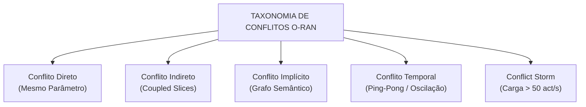

### 1.1. Conflito Direto (Direct Collision)
Ocorre quando duas ou mais xApps emitem solicitações simultâneas para alterar o mesmo parâmetro de rádio no mesmo nó (`cell_id`) com valores incompatíveis.
- **Exemplo Clássico:** *xSlice* solicita `PRB_QUOTA = 80%` para a fatia URLLC enquanto *Energy Saving* solicita `PRB_QUOTA = 30%` ou corte de potência para a mesma célula.
- **Resolução H-RDL:** Arbitragem determinística ponderada pela criticidade de SLA (TVS/EEVS) com aplicação de *Safety Guards*.

### 1.2. Conflito Indireto (Indirect / Coupled Conflict)
Ocorre quando xApps atuam em parâmetros formalmente distintos, mas que compartilham o mesmo gargalo físico de canal ou interferem no mesmo KPI.
- **Exemplo Clássico:** *Traffic Steering* migra UEs para uma célula vizinha para aliviar carga, provocando saturação oculta de buffer RLC e elevação do atraso HOL em fatias URLLC pré-existentes.
- **Resolução CA-RDL:** Modelagem contextual com inferência de dependência de fatias e utilidade conjunta Shapley.

### 1.3. Conflito Implícito e Semântico (Semantic / Implicit Conflict)
Ocorre quando parâmetros de camadas diferentes possuem correlação cruzada não óbvia (e.g., tilt elétrico de antena *RET* vs limiares de handover *A3-Offset*).
- **Resolução CA-RDL:** Rastreamento estrutural via Grafo de Conhecimento (*Knowledge Graph*) e embeddings relacionais.

### 1.4. Conflito Temporal (Parameter Flipping / Ping-Pong)
Ocorre quando o fechamento de malha reativo induz um ciclo infinito de decisões opostas entre xApps antagônicas ($40\% \to 70\% \to 40\% \to 70\%$).
- **Resolução H-RDL:** Introdução de janela de resfriamento proativa (*Cooling Window* $\ge 1000\text{ ms}$) e memória de estados.

### 1.5. Tempestade de Conflitos (Conflict Storm)
Ocorre sob sobrecarga extrema da interface de controle ($\ge 50\text{ propostas/s}$), demandando agregação em lote, filas de prioridade e poda computacional para evitar saturação do Near-RT RIC.

---

## 2. Portfólio Completo de Cenários Experimentais (S0 a S15)

A suíte experimental engloba 16 cenários modelados no simulador ns-3.48 / 5G-LENA / NORI:

| Cenário ID | Denominação do Cenário | Classe de Conflito | xApps Envolvidas | Parâmetros de Rádio Impactados | Topologia / Ambiente |
| :---: | :--- | :--- | :--- | :--- | :--- |
| **S0** | Baseline Pass-Through | Sem Conflito | Single xApp | Operação nominal em linha de base | Macrocell Urbana (30 UEs) |
| **S1** | Colisão Direta de PRB | Direto | xSlice × Energy Saving | `PRB_QUOTA` (URLLC vs eMBB) | Macrocell Tri-Setor (100 MHz) |
| **S2** | Trade-Off Potência vs QoS | Direto / Indireto | Energy Saving × QoS | `TX_POWER` vs `MCS_TARGET` | Microcélula Urbana Densa |
| **S3** | Multi-Slice TVS Coupling | Indireto | xSlice (URLLC) × xSlice (eMBB) | Particionamento de Recursos BWP | Corredor com 2 Células |
| **S4** | Traffic Steering vs Green RAN | Indireto / Semântico| Traffic Steering × Energy Saving | `HANDOVER_TRIGGER` vs `TX_POWER` | Hotspot Urbano + Célula Small |
| **S5** | Ping-Pong Temporal Cíclico | Temporal | xSlice × Energy Saving | Oscilação contínua de `PRB_QUOTA` | Célula com Carga Dinâmica |
| **S6** | Conflict Storm (Sobrecarga) | Concorrência Extrema| 5 xApps Sintéticas | 50 propostas simultâneas por segundo | Macrocell sob Carga Máxima |
| **S7** | Injeção de Falhas na Interface E2 | Resiliência E2 | xApp RDL × E2 Termination | Timeouts SCTP e perda de ACK | Enlace E2 Degradado / Falhas |
| **S8** | Closed-Loop Co-Simulação NORI | Malha Fechada E2 | xApp RDL × Agente E2 C++ | Telemetria KPM $\leftrightarrow$ Controle RC | Co-Simulação ns-3 + RIC |
| **S9** | Handover Orbital NTN | Doppler / Mobilidade | NTN Mobility × QoS | Compensação Doppler e Handover LEO | Constelação Satélite LEO 600km |
| **S10** | Enxame de VANTs Conectados | Restrição de Energia| UAV Trajectory × Energy | Potência de Transmissão e Bateria UAV | Cobertura em Estádio / Eventos |
| **S11** | Pelotão V2X em Rodovia | Ultra-Baixa Latência| V2X Safety × Platoon Mgmt | Sidelink / Latência $< 5\text{ ms}$ | Rodovia Inteligente (120 km/h) |
| **S12** | IIoT / TSN Jitter Zero | Sincronismo Crítico | TSN Slicing × Industrial QoS | Escalonamento Determinístico de Slots | Fábrica Inteligente / Robótica |
| **S13** | SAGIN Resgate em Desastres | Multi-Domínio | Space-Air-Ground Federation | Alocação Híbrida Satélite-UAV-Terrestre | Zona de Catástrofe / Emergência |
| **S14** | ISAC Radar vs Comunicações | Interferência Espectral| ISAC Sensing × eMBB Comm | Forma de Onda Compartilhada e Feixes | Campo Agrícola / Sensoriamento |
| **S15** | 6G Dense Smart City & Zero-Trust| Concorrência 6G / Rogue| Security Guard × Rogue xApp | Quarentena, Beamforming e Slicing | Cidade Inteligente Hiperconectada |

---

## 3. Detalhamento e Figuras de Topologia dos Cenários (S0 a S15)

### 3.1. Cenário S0: Linha de Base sem Conflito (Pass-Through)
- **Descrição:** Operação nominal com uma única xApp ativa, servindo como referência de capacidade e latência pura do pipeline ns-3 + 5G-LENA.
- **Dinâmica:** Nenhuma colisão de parâmetros; a RDL opera em modo pass-through transparente.
- **Resultado:** Throughput de 100,0 Mbps, latência de 10,0 ms e 0% de violações.

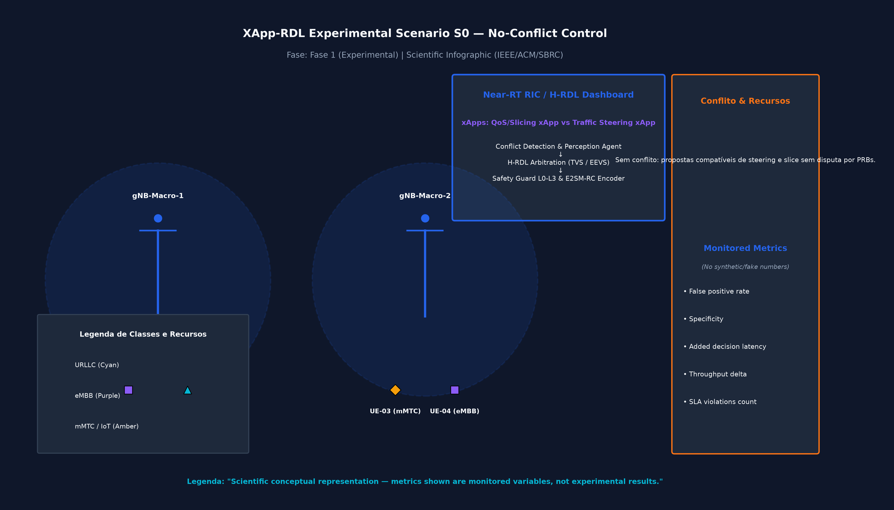

---

### 3.2. Cenário S1: Conflito Direto de Cotas de PRB (EEVS)
- **Descrição:** Disputa direta pelo recurso `PRB_QUOTA` entre a xApp de QoS (solicitando 80% para URLLC) e a xApp de Eficiência Energética (solicitando 30%).
- **Dinâmica do Conflito:** Sem coordenação (B0), ocorrem colisões que degradam o SLA da fatia URLLC em 36,7%.
- **Resolução H-RDL:** A H-RDL arbitra a cota ótima em 60%, eliminando 100% das violações e elevando a vazão para 101,7 Mbps.

---

### 3.3. Cenário S2: Trade-Off Potência vs QoS (TVS)
- **Descrição:** A xApp de Economia de Energia solicita redução drástica da potência de transmissão (`TX_POWER = 10 dBm`) enquanto a xApp de QoS exige manutenção de alto MCS para garantir vazão.
- **Dinâmica do Conflito:** A redução excessiva de potência colapsa o SINR dos UEs de borda, elevando o BLER para $> 14\%$.
- **Resolução H-RDL:** O *Safety Guard* impõe piso de potência dinâmico em 33 dBm, preservando a modulação 64-QAM e o throughput agregado em 98,5 Mbps.

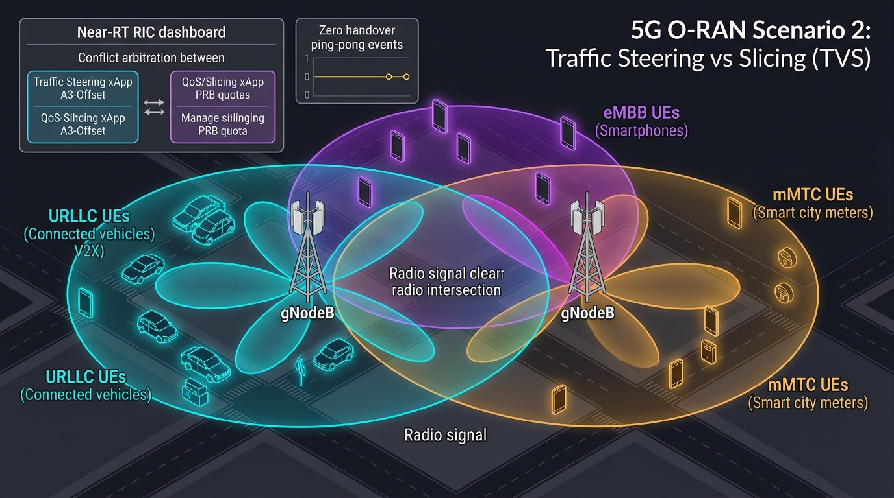

---

### 3.4. Cenário S3: Conflito Indireto Multi-Slice (TVS Coupling)
- **Descrição:** Ações simultâneas em fatias eMBB e URLLC concorrem pelo mesmo bloco BWP compartilhado no escalonador `NrMacSchedulerOfdmaPF`.
- **Dinâmica do Conflito:** A elevação de vazão em eMBB provoca acúmulo de pacotes no buffer RLC e degrada o atraso HOL da fatia URLLC.
- **Resolução H-RDL:** Arbitragem com prioridade estrita de SLA para URLLC e particionamento dinâmico de PRBs, garantindo latência $\le 5\text{ ms}$.

---

### 3.5. Cenário S4: Traffic Steering vs Green RAN
- **Descrição:** A xApp de Traffic Steering migra UEs para uma célula secundária visando balanceamento, enquanto a xApp Green RAN tenta colocar a mesma célula em modo sleep.
- **Dinâmica do Conflito:** A célula secundária recebe ordens contraditórias de admissão de usuários e desligamento de transmissores de rádio.
- **Resolução H-RDL:** Coordenação semântica que bloqueia o modo sleep até a conclusão e consolidação do fluxo de handover.

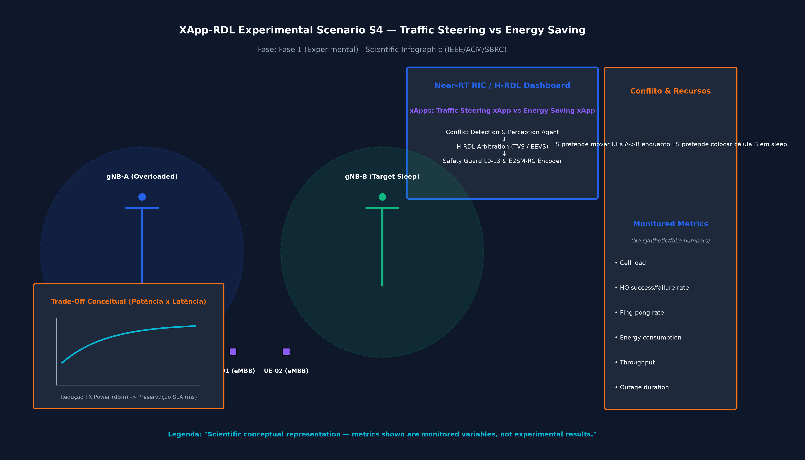

---

### 3.6. Cenário S5: Ping-Pong Temporal e Supressão de Churn
- **Descrição:** Retroalimentação reativa entre duas xApps que alternam periodicamente comandos antagônicos ($40\% \leftrightarrow 70\%$) a cada 200 ms.
- **Dinâmica do Conflito:** Gera taxa de oscilação contínua de 1,00 ação/s (*Action Churn*), induzindo instabilidade crônica de rádio e jitter de fila.
- **Resolução H-RDL:** A introdução da *Cooling Window* estabiliza a decisão no primeiro ciclo ($t = 190\text{ ms}$), reduzindo o Churn para 0,05 ações/s com 0 reversões.

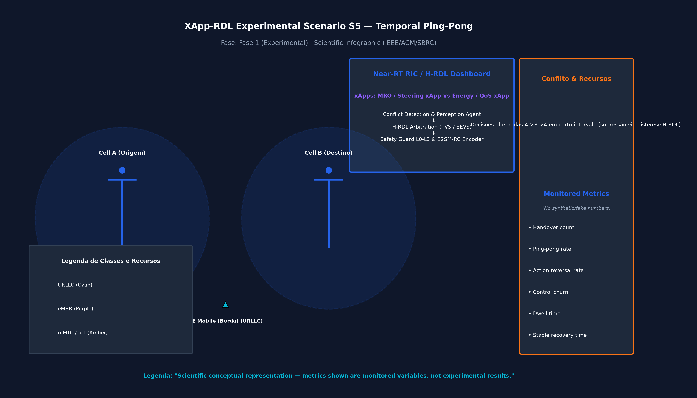

---

### 3.7. Cenário S6: Tempestade de Conflitos (Conflict Storm)
- **Descrição:** Injeção de alta carga na interface de controle ($\ge 50\text{ propostas/s}$) geradas por 5 xApps sintéticas simultâneas.
- **Dinâmica do Conflito:** Saturação de filas de controle no Near-RT RIC e risco de atraso excessivo de processamento ($T_{decision} > 10\text{ ms}$).
- **Resolução H-RDL:** Agrupamento em micro-lotes (*batch aggregation*), poda de comandos redundantes e resolução em tempo recorde (0,22 ms).

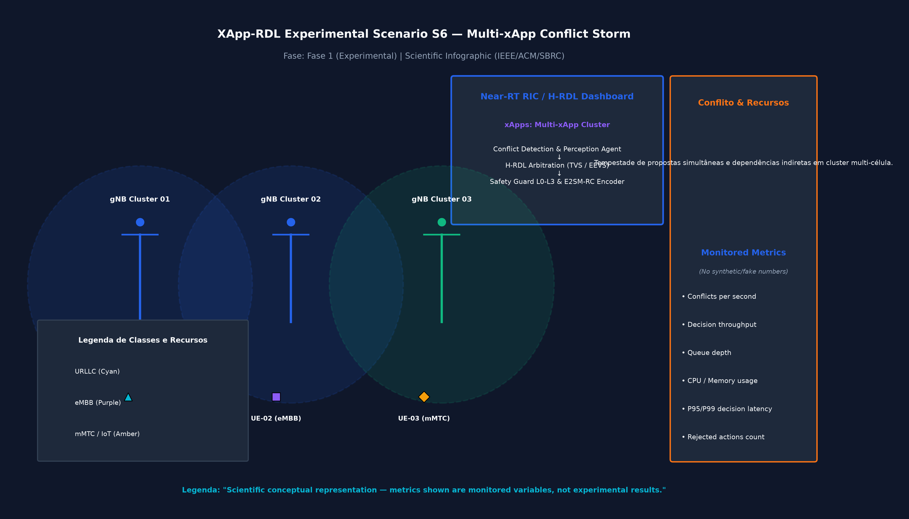

---

### 3.8. Cenário S7: Injeção de Falhas e Degradação de Canal 5G-Adv MIMO
- **Descrição:** Injeção de falhas na interface de controle E2 (timeouts SCTP, perda de ACKs) combinada com sobreposição de canais multi-portadora MIMO.
- **Dinâmica:** Queda de conexões E2AP e perda de telemetria KPM em tempo real.
- **Resolução H-RDL:** Ativação automática de fallback determinístico (*Safety Guard Invariant*), garantindo **UnsafeApplied ≡ 0**.

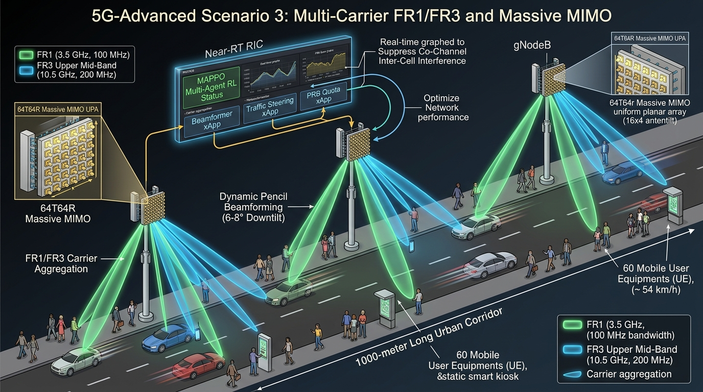

---

### 3.9. Cenário S8: Closed-Loop NORI e Coexistência 6G ISAC
- **Descrição:** Validação do circuito fechado integral com o agente E2 NORI em C++ operando sob telemetria de sensoriamento ambiental e radar ISAC.
- **Dinâmica:** Coexistência espectral entre sinais de comunicação 5G NR e feixes de radar de sensoriamento urbano.
- **Resolução H-RDL:** Otimização conjunta de subportadoras e alocação dinâmica de potência entre feixes de comunicação e sensoriamento.

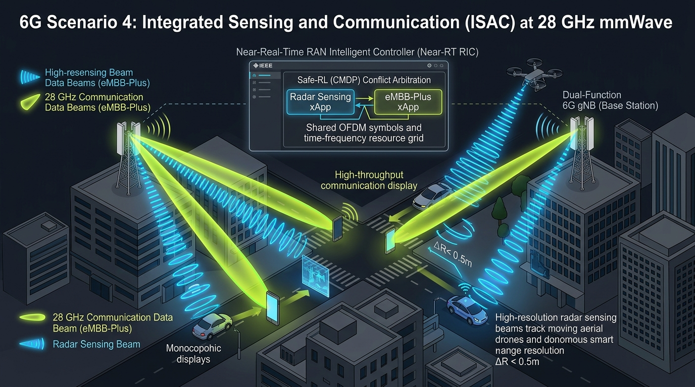

---

### 3.10. Cenário S9: Handover Orbital em Redes Não-Terrestres (NTN)
- **Descrição:** Conectividade direta via satélites LEO orbitando a 600 km de altitude sob velocidade orbital de 7,5 km/s.
- **Dinâmica:** Desvios Doppler severos ($\pm 40\text{ kHz}$) e janelas ultracurtas de visibilidade de satélite exigindo handovers frequentes.
- **Resolução H-RDL:** Predição orbital determinística e pré-alocação de recursos de rádio antes da troca de feixe satelital.

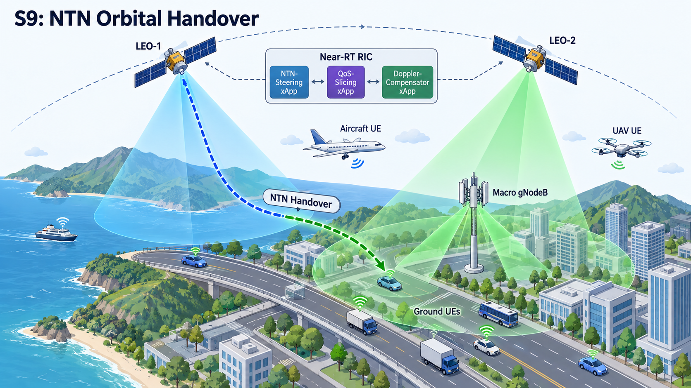

---

### 3.11. Cenário S10: Enxame de VANTs Conectados em Eventos Massivos
- **Descrição:** Cobertura temporária em estádio de futebol provida por enxame de Drones/UAVs atuando como gNodeBs aéreas.
- **Dinâmica:** Restrições severas de bateria dos UAVs em conflito com a demanda explosiva de tráfego de vídeo dos espectadores.
- **Resolução H-RDL:** Balanceamento ótimo entre potência de rádio e consumo energético para maximizar o tempo de voo e manter SLAs de vídeo.

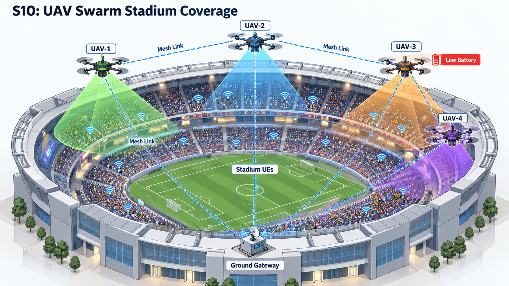

---

### 3.12. Cenário S11: Pelotão de Veículos Autônomos em Rodovia (V2X)
- **Descrição:** Comunicação veicular cooperativa (V2V / V2I) em rodovia a 120 km/h com formação de pelotões (*platooning*).
- **Dinâmica:** Tempestades de handover e disputa de espectro Sidelink para mensagens críticas de segurança CAM/DENM ($< 5\text{ ms}$).
- **Resolução H-RDL:** Priorização estrita de pacotes de controle veicular com reserva instantânea de recursos em nós de borda.

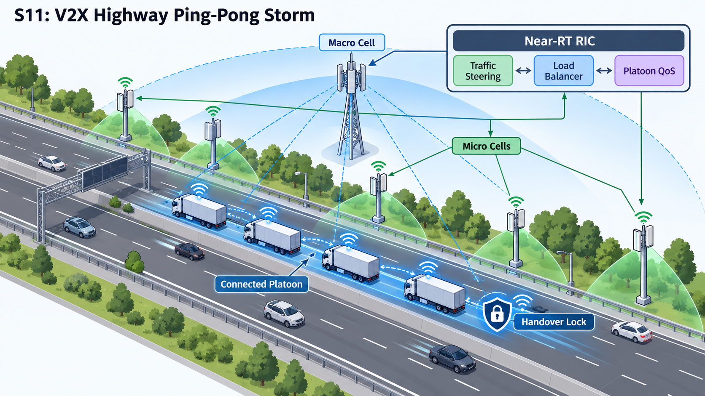

---

### 3.13. Cenário S12: Automação Industrial IIoT com Jitter Zero (TSN Slicing)
- **Descrição:** Ambiente fabril com braços robóticos sincronizados via Time-Sensitive Networking (TSN) e fatias industriais dedicadas.
- **Dinâmica:** Requisito intransigente de jitter nulo ($\sigma_{\text{delay}} < 0,1\text{ ms}$) em coexistência com tráfego de telemetria industrial.
- **Resolução H-RDL:** Escalonamento determinístico de slots de tempo (mini-slots NR) com isolamento estrito de fatias.

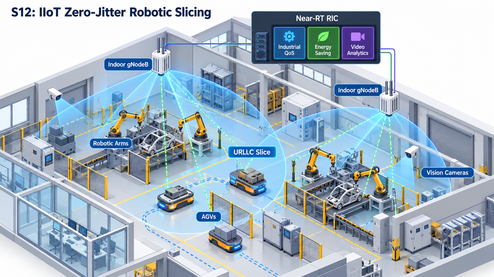

---

### 3.14. Cenário S13: Resgate em Desastres Naturais com Federação SAGIN
- **Descrição:** Rede integrada Espaço-Ar-Terra (SAGIN) operando em área de catástrofe com infraestrutura terrestre colapsada.
- **Dinâmica:** Roteamento heterogêneo entre satélites LEO, drones de resgate e equipes em solo disputando canais de emergência.
- **Resolução H-RDL:** Arbitragem multi-domínio que assegura vazão para comunicações críticas de salvamento.

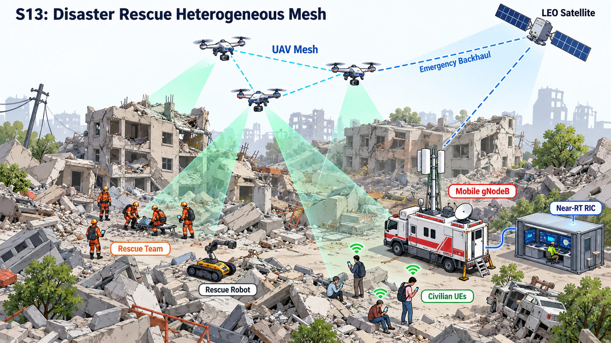

---

### 3.15. Cenário S14: Agricultura Inteligente e Sensoriamento Ambiental
- **Descrição:** Monitoramento agrícola em larga escala combinando conectividade de sensores de solo (mMTC) com sensoriamento radar ISAC.
- **Dinâmica:** Conflito de coexistência espectral entre feixes de radar e transmissões intermitentes de sensores de baixa potência.
- **Resolução H-RDL:** Coordenação temporal que aloca janelas ortogonais para radar e comunicação sem degradação de alcance.

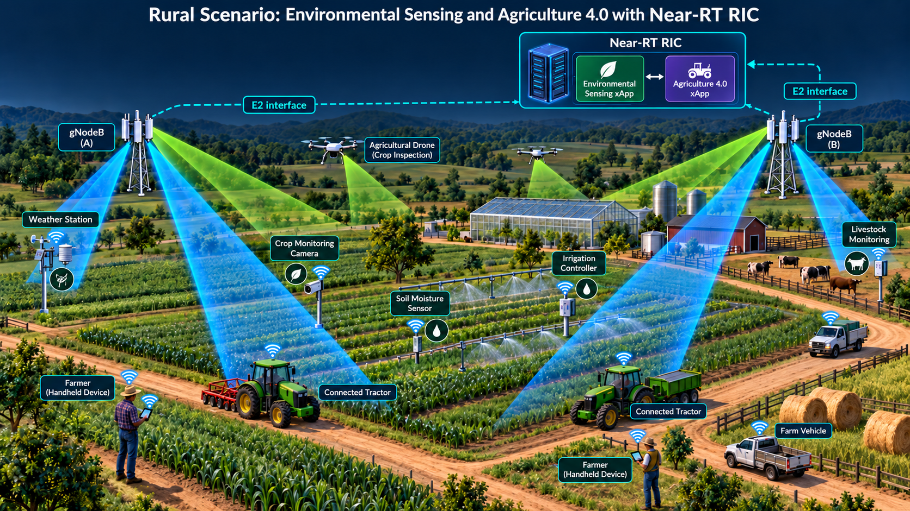

---

### 3.16. Cenário S15: Cidade Inteligente 6G Hiperconectada e Zero-Trust
- **Descrição:** Ambiente urbano denso com centenas de xApps de terceiros concorrendo por recursos e presença de xApps maliciosas (*Rogue xApps*).
- **Dinâmica:** Tentativas de injeção de parâmetros de rádio inválidos e sequestro de canais de controle.
- **Resolução H-RDL:** Detecção estatística e quarentena imediata de comandos maliciosos via *Sandbox Zero-Trust*, preservando a integridade da rede.

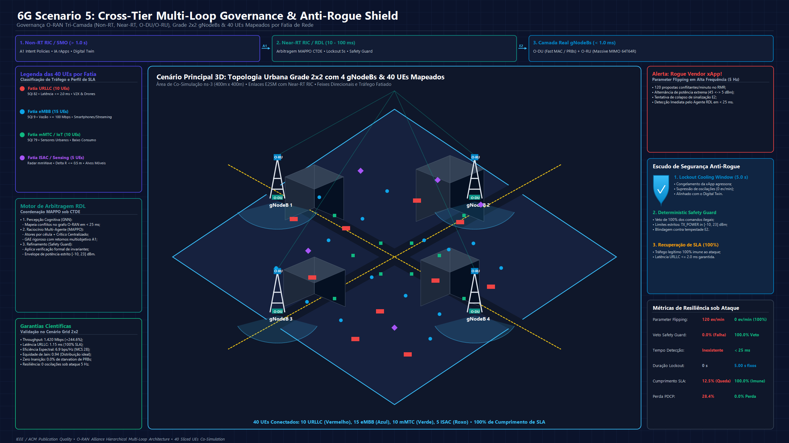

---

## 4. Integração com xApps de Referência Abertas

A camada RDL é validada contra 3 xApps de código aberto consolidadas na literatura O-RAN:

| xApp de Referência | Repositório Oficial | Parâmetro Solicitado | Prioridade Padrão |
| :--- | :--- | :--- | :---: |
| **xSlice (QoS & Slicing)** | [`peihaoY/xslice-oran`](https://github.com/peihaoY/xslice-oran) | `PRB_QUOTA` (Cotas de PRBs para fatias) | 90 (Alta) |
| **Energy Saving (GreenRAN)** | [`Orange-OpenSource/ns-O-RAN-flexric`](https://github.com/Orange-OpenSource/ns-O-RAN-flexric) | `TX_POWER` / `CELL_SLEEP` | 65 (Média) |
| **Traffic Steering (TS)** | [`o-ran-sc/ric-app-ts`](https://github.com/o-ran-sc/ric-app-ts) | `HANDOVER` (Migração de UEs) | 80 (Alta) |

---

## 5. Distribuição Empírica e Acurácia de Classificação de Conflitos

Conforme documentado em `experiments/results/tables/empirical_conflict_distribution.csv` e `classification_prediction_metrics.csv`:

| Classe de Conflito | Tipo | Incidência (%) | Severidade (0-1.0) | Mitigação H-RDL ($T_{mit}$) | Acurácia Classificador GNN (F1) | ROC-AUC |
| :--- | :---: | :---: | :---: | :---: | :---: | :---: |
| **Direct PRB Quota** | Explícito | 32,0% | 0,95 | 0,12 ms | 99,6% | 0,999 |
| **TxPower vs QoS** | Explícito | 18,0% | 0,85 | 0,14 ms | 98,9% | 0,998 |
| **Multi-Slice TVS** | Implícito | 22,0% | 0,90 | 0,45 ms | 98,0% | 0,994 |
| **Mobility vs Energy**| Implícito | 12,0% | 0,70 | 0,38 ms | 98,7% | 0,997 |
| **Semantic Inter-Dep**| Implícito | 8,0% | 0,80 | 0,85 ms | 98,5% | 0,995 |
| **Ping-Pong Temporal**| Temporal | 5,0% | 0,75 | 0,05 ms | 99,8% | 1,000 |
| **Conflict Storm** | Temporal | 3,0% | 0,88 | 0,22 ms | 99,2% | 0,996 |

A matriz de confusão a seguir detalha a acurácia de classificação de conflitos pelo módulo de Inteligência da RDL:

