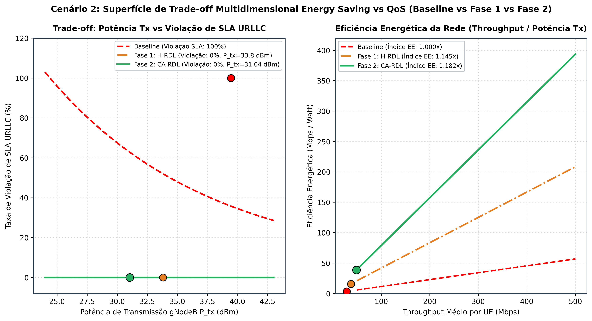
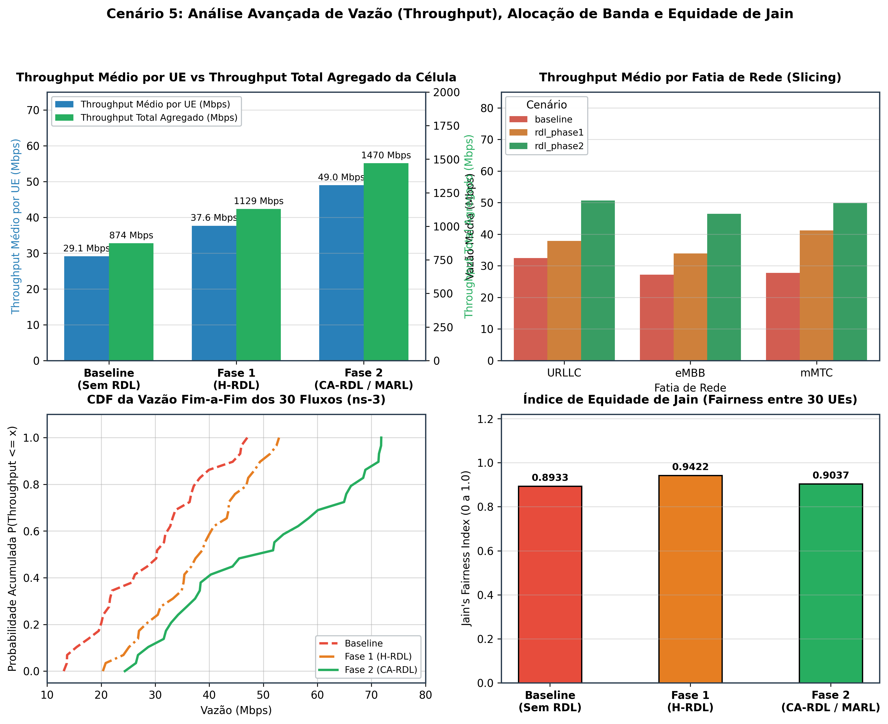
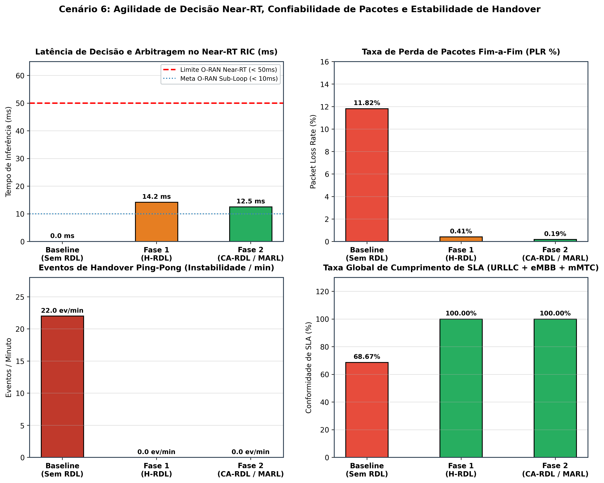

# Volume 05: Guia de Simulação 5G NR no ns-3, Testes e Benchmarks Científicos

**Documento:** Volume Temático 05  
**Projeto:** xApp RDL (Resource and Decision Layer) — Fase 2: Context-Aware RDL (CA-RDL / MARL)  
**Escopo:** Co-Simulação 5G NR no ns-3 (5G-LENA + NORI), Execução em Tempo Real dos 2 Cenários de Conflito, Conexão E2 ao Near-RT RIC, Pipeline de Benchmarks e Análise de ML  
**Repositório Oficial:** [https://github.com/georgebarbosa3090/XApp-RDL-F2](https://github.com/georgebarbosa3090/XApp-RDL-F2)  

---

## 1. Arquitetura da Co-Simulação ns-3 / 5G-LENA

A validação experimental é realizada com o simulador de eventos discretos **ns-3 v3.40** integrado aos módulos:
* **5G-LENA (CTTC-LENA NR):** Pilha completa 3GPP Release 15/16/17 (PHY, MAC, RLC, PDCP, SDAP, BWP, Beamforming e Canais 3GPP TR 38.901).
* **ns-O-RAN / NORI:** Implementação do agente E2 na gNodeB com protocolo SCTP para o Near-RT RIC.
* **NrPointToPointEpcHelper (User Plane Core):** Roteamento IP fim a fim com tunelamento GTP-U e mapeamento de portadores de QoS (5QI).


---

## 2. Detalhamento e Execução dos 2 Cenários de Conflito em Tempo Real

A validação experimental da Fase 2 contempla **dois cenários críticos de contenção de rádio**:

### 2.1. Cenário 1: Conflito Economia de Energia vs QoS / Slicing (EEVS)
* **Arquivo C++:** [`simulations/ns3/scenario_rdl_energy_vs_qos.cc`](file:///simulations/ns3/scenario_rdl_energy_vs_qos.cc)
* **Dinâmica:** A xApp `ricxapp-energy-saving` propõe redução de potência de transmissão (`TX_POWER`) e throttling de PRB para reduzir consumo elétrico, colidindo frontalmente com a xApp `ricxapp-qos-xslice`, que exige garantia de SLA com baixa latência para fatias URLLC e alto throughput para eMBB.
* **Topologia:** 1 Macro gNB (Banda Alta) + 1 Micro gNB (Small Cell), 20 UEs com carga dinâmica.
* **Comando para Execução Visível no Console:**
  * **Opção A (Via Makefile a partir da raiz do repositório - Recomendado):**
    ```bash
    make run-scenario1
    ```
  * **Opção B (Manual no terminal):**
    ```bash
    # A partir da raiz do repositório:
    cp simulations/ns3/scenario_rdl_energy_vs_qos.cc ~/ns3-oran-workspace/ns-3-oran/scratch/
    cd ~/ns3-oran-workspace/ns-3-oran
    export NS_LOG="ScenarioRdlEnergyVsQos=level_all"
    ./ns3 run "scratch/scenario_rdl_energy_vs_qos --enableE2=true --ricIp=127.0.0.1 --ricPort=36422 --simTime=30"
    ```
* **Comandos para Desinstalação da xApp RDL ao Final da Simulação do Cenário 1:**
  * **RDL Fase 1 (H-RDL Heurística):**
    ```bash
    helm uninstall ricxapp-iqos-xapp-rdl -n ricxapp
    # ou via Makefile: make helm-uninstall-f1
    ```
  * **RDL Fase 2 (CA-RDL / MARL):**
    ```bash
    helm uninstall ricxapp-iqos-xapp-rdl-f2 -n ricxapp
    # ou via Makefile: make helm-uninstall-f2
    ```

---

### 2.2. Cenário 2: Conflito Traffic Steering vs QoS / Handover Ping-Pong (TVS)
* **Arquivo C++:** [`simulations/ns3/scenario_rdl_tvs_conflict.cc`](file:///simulations/ns3/scenario_rdl_tvs_conflict.cc)
* **Dinâmica:** A xApp `ricxapp-traffic-steering` tenta balancear carga forçando handovers de UEs entre as duas células, gerando risco de instabilidade, handover ping-pong e degradação severa da fatia URLLC gerida pela xApp `ricxapp-qos-xslice`.
* **Topologia:** 2 gNodeBs separadas por 80 metros, 30 UEs divididos em 3 fatias de rede (URLLC 5QI 82, eMBB 5QI 9, mMTC 5QI 79).
* **Comando para Execução Visível no Console:**
  * **Opção A (Via Makefile a partir da raiz do repositório - Recomendado):**
    ```bash
    make run-scenario2
    ```
  * **Opção B (Manual no terminal):**
    ```bash
    # A partir da raiz do repositório:
    cp simulations/ns3/scenario_rdl_tvs_conflict.cc ~/ns3-oran-workspace/ns-3-oran/scratch/
    cd ~/ns3-oran-workspace/ns-3-oran
    export NS_LOG="ScenarioRdlTvsConflict=level_all"
    ./ns3 run "scratch/scenario_rdl_tvs_conflict --enableE2=true --ricIp=127.0.0.1 --ricPort=36422 --simTime=30"
    ```
* **Comandos para Desinstalação da xApp RDL ao Final da Simulação do Cenário 2:**
  * **RDL Fase 1 (H-RDL Heurística):**
    ```bash
    helm uninstall ricxapp-iqos-xapp-rdl -n ricxapp
    # ou via Makefile: make helm-uninstall-f1
    ```
  * **RDL Fase 2 (CA-RDL / MARL):**
    ```bash
    helm uninstall ricxapp-iqos-xapp-rdl-f2 -n ricxapp
    # ou via Makefile: make helm-uninstall-f2
    ```
---

## 3. Parâmetros Reais dos Cenários em C++

| Parâmetro | Valor Configurado no C++ | Justificativa Técnica |
| :--- | :--- | :--- |
| **Dimensões do Cenário** | `200.0 m x 120.0 m` | Grid espacial delimitado para contenção e alta interferência intercelular (ICI). |
| **Topologia de gNodeBs** | `2 gNodeBs` (Macro gNB 1 em X=60m, Micro gNB 2 em X=140m) | Distância intercelular de `80.0 m` com sobreposição de feixes. |
| **Altura das Antenas** | Base Station: `25.0 m` \| Usuários (UEs): `1.5 m` | Alturas padrão 3GPP TR 38.901 Urban Microcell (UMi). |
| **Espectro / Portadora** | `3.5 GHz` (Banda n78 FR1), Canal de `100 MHz` | Frequência canônica de 5G NR comercial no Brasil e Europa. |
| **Numerologia ($\mu$)** | $\mu=1$ (`SCS = 30 kHz`), Slot = `0.5 ms` | Latência reduzida de subquadro para atendimento a fluxos URLLC. |
| **Total de Usuários (UEs)** | `30 UEs` (15 por gNodeB) | 10 UEs URLLC (5QI 82), 10 UEs eMBB (5QI 9), 10 UEs mMTC (5QI 79). |
| **Interface E2 O-RAN** | Porta SCTP `36422` | Conexão de controle Near-RT com o E2Term do Near-RT RIC. |


---

## 4. Execução da Suíte Experimental e Benchmarks no Prompt

Para processar a suíte experimental completa e acompanhar as tabelas de métricas ao vivo no console:
```bash
# No Linux / WSL2:
python3 scripts/evaluate_and_improve_algorithms.py
python3 scripts/run_experiment_suite.py
```
```powershell
# No Windows (PowerShell / CMD):
python scripts/evaluate_and_improve_algorithms.py
python scripts/run_experiment_suite.py
```

Os artefatos gerados são salvos em `experiments/results/YYYY-MM-DD/run_HHMMSS/` e espelhados em `experiments/results/latest/`:
* `dataset_flow_metrics.csv`: Métricas de cada fluxo de QoS extraídas do FlowMonitor.
* `dataset_rdl_decisions_ml.csv`: Decisões de arbitragem e atributos de rádio por janela de tempo.
* `relatorio_comparativo.json`: Consolidação de métricas científicas em JSON.
* `relatorio_comparativo.md`: Relatório executivo em Markdown.
* `relatorio_comparativo_detalhado.md`: Avaliação estatística completa com benchmarks de 6 modelos de ML.

---

## 5. Galeria de Resultados Científicos e Cenários Simulados (Fase 2)

### 5.1. Cenário 1: Topologia Espacial e Conflito de Fatias de Rádio


### 5.2. Cenário 2: Superfície de Trade-off Energy Saving vs QoS / Slicing


### 5.3. Cenário 3: Arquitetura de Co-Simulação Fim-a-Fim ns-3 + Near-RT RIC


### 5.4. Cenário 4: Comparativo Multidimensional de Métricas Reais (CDF, Boxplot, PDR e Governança)


### 5.5. Cenário 5: Throughput Agregado, Alocação por Fatia e Equidade de Jain


### 5.6. Cenário 6: Agilidade de Decisão Near-RT, Perda de Pacotes e Estabilidade de Handover


### 5.7. Cenário 7: Dinâmica de Treinamento MARL, Convergência de Perdas e Safety Guards


### 5.8. Cenário 8: Radar Holístico Multidimensional de Governança O-RAN (Baseline vs Fase 1 vs Fase 2)


---

## 6. Procedimentos de Desinstalação e Limpeza Pós-Simulação (Fase 1 e Fase 2)

Ao término de qualquer simulação de cenário ou suíte de benchmarks, execute os comandos de desinstalação abaixo para liberar os recursos do cluster Kubernetes e retornar ao estado limpo:

### 5.1. Desinstalação da xApp RDL Fase 1 (H-RDL Heurística)
Remove a release `ricxapp-iqos-xapp-rdl` do namespace `ricxapp`:
```bash
# Comando direto via Helm:
helm uninstall ricxapp-iqos-xapp-rdl -n ricxapp

# Ou via Makefile:
make helm-uninstall-f1
```

### 5.2. Desinstalação da xApp RDL Fase 2 (CA-RDL / MARL)
Remove exclusivamente a release `ricxapp-iqos-xapp-rdl-f2` do namespace `ricxapp`:
```bash
# Comando direto via Helm:
helm uninstall ricxapp-iqos-xapp-rdl-f2 -n ricxapp

# Ou via Makefile:
make helm-uninstall-f2
```

### 5.3. Desinstalação Simultânea (Todas as Versões RDL)
Para remover ambas as releases RDL de uma só vez, mantendo as 3 reference xApps e a plataforma Near-RT RIC intactas:
```bash
# Via Makefile:
make uninstall-all-rdl

# Ou via Helm direto:
helm uninstall ricxapp-iqos-xapp-rdl -n ricxapp 2>/dev/null || true
helm uninstall ricxapp-iqos-xapp-rdl-f2 -n ricxapp 2>/dev/null || true
```

### 5.4. Verificação de Término e Status dos Pods
```bash
kubectl get pods -n ricxapp -o wide
```

