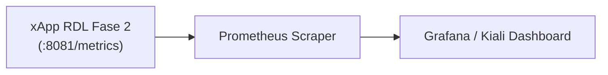
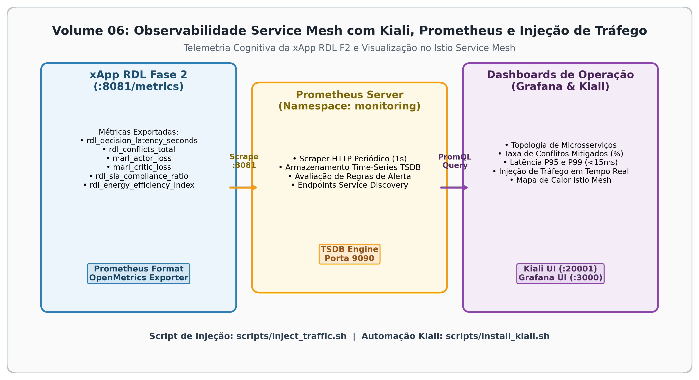

# Volume 06: Observabilidade Service Mesh com Kiali e Injeção de Tráfego O-RAN

**Documento:** Volume Temático 06  
**Projeto:** xApp RDL (Resource and Decision Layer) — Fase 2: Context-Aware RDL (CA-RDL / MARL)  
**Escopo:** Métricas Prometheus, Telemetria Cognitiva MARL, Service Mesh Istio e Dashboard Kiali  
**Repositório Oficial:** [https://github.com/georgebarbosa3090/XApp-RDL-F2](https://github.com/georgebarbosa3090/XApp-RDL-F2)  

---

## 1. Métricas de Observabilidade Prometheus da Fase 2

A xApp RDL Fase 2 exporta métricas cognitivas e de governança na porta `8081`:

| Métrica Prometheus | Tipo | Descrição |
| :--- | :---: | :--- |
| `rdl_decision_latency_seconds` | Histogram | Tempo de inferência e arbitragem do motor MAPPO (meta < 50ms). |
| `rdl_conflicts_total` | Counter | Total de conflitos de rádio interceptados e mitigados. |
| `marl_actor_loss` | Gauge | Perda (Loss) da rede neural do Ator durante o treinamento online. |
| `marl_critic_loss` | Gauge | Perda (Loss) da rede neural do Crítico Centralizado. |
| `rdl_sla_compliance_ratio` | Gauge | Taxa percentual de cumprimento de SLA por fatia de rede. |

