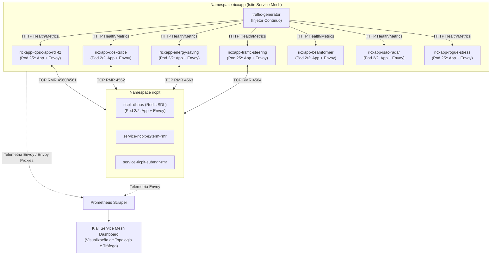

# Volume 06: Observabilidade Service Mesh com Kiali, Istio e Injeção de Tráfego O-RAN

**Documento:** Volume Temático 06  
**Projeto:** xApp RDL (Resource and Decision Layer) — Fase 2: Context-Aware RDL (CA-RDL / MARL)  
**Escopo:** Métricas Prometheus, Telemetria Cognitiva MARL, Service Mesh Istio, Padronização de Portas e Dashboard Kiali  
**Repositório Oficial:** [https://github.com/georgebarbosa3090/XApp-RDL-F2](https://github.com/georgebarbosa3090/XApp-RDL-F2)  

---

## 1. Visão Geral da Arquitetura de Observabilidade

A infraestrutura O-RAN 5G-Advanced da CA-RDL opera sobre uma malha de serviços (**Istio Service Mesh**) no Kubernetes, permitindo rastreabilidade, monitoramento de latência e governança em tempo real entre todas as xApps e os componentes do Near-RT RIC.



---

## 2. Métricas de Observabilidade Prometheus da Fase 2

A xApp RDL Fase 2 exporta métricas cognitivas e de governança na porta `8081` (`/metrics`):

| Métrica Prometheus | Tipo | Descrição |
| :--- | :---: | :--- |
| `rdl_decision_latency_seconds` | Histogram | Tempo de inferência e arbitragem do motor MAPPO / Safe-RL (meta < 50ms). |
| `rdl_conflicts_total` | Counter | Total de conflitos de rádio interceptados e mitigados pela CA-RDL. |
| `marl_actor_loss` | Gauge | Perda (Loss) da rede neural do Ator durante o treinamento online. |
| `marl_critic_loss` | Gauge | Perda (Loss) da rede neural do Crítico Centralizado. |
| `rdl_sla_compliance_ratio` | Gauge | Taxa percentual de cumprimento de SLA por fatia de rede (URLLC/eMBB/mMTC). |
| `rdl_action_propagation_latency_ms` | Histogram | Latência fim a fim ($t_{\text{ack}} - t_{\text{arrival}}$) de propagação E2SM-RC. |

---

## 3. Requisitos e Padrões Obrigatórios do Istio e Kiali

Para que o Kiali exiba o grafo de tráfego, as conexões ativas e as métricas sem alertas de erro, os manifestos do Kubernetes devem aderir estritamente a três regras fundamentais:

### 3.1. Injeção Automática de Sidecar (`istio-injection: enabled`)
Todos os namespaces monitorados (`ricxapp` e `ricplt`) devem possuir a label de injeção automática:
```yaml
apiVersion: v1
kind: Namespace
metadata:
  name: ricxapp
  labels:
    istio-injection: enabled
```
* **Verificação:** Ao rodar `kubectl get pods -n ricxapp`, a coluna `READY` deve mostrar `2/2` (indicando o container principal + o container `istio-proxy` Envoy).

### 3.2. Padronização de Nomenclatura de Portas (Regra `KIA0601`)
O Istio e o Kiali exigem que o nome de qualquer porta em `Service` e `Deployment` siga o padrão:
$$\text{formato: } \langle\text{protocol}\rangle\text{[-}\langle\text{suffix}\rangle\text{]}$$

* **Portas HTTP:** Devem ser nomeadas como `http-health`, `http-metrics` ou `http-api`.
* **Portas TCP/RMR:** Devem ser nomeadas como `tcp-rmr-data`, `tcp-rmr-route` ou `tcp-redis`.
* ❌ **Nomes Inválidos (geram erro `KIA0601`):** `metrics`, `rmr-data`, `rmr-route`, `rmr`, `redis`.

### 3.3. Labels Canônicos de Workload (`app` e `version`)
Todo `Deployment` e `PodTemplate` deve possuir as labels `app` e `version`:
```yaml
metadata:
  labels:
    app: ricxapp-beamformer
    version: "1.1.0"
```

---

## 4. Guia de Resolução de Problemas (Troubleshooting Kiali)

| Sintoma / Alerta no Kiali | Causa Raiz | Procedimento de Correção |
| :--- | :--- | :--- |
| **"Empty Graph: No graph traffic for the time period"** | Não houve requisições trafegando pelos proxies Envoy nos últimos 5 minutos (janela ociosa) ou as portas estavam sem prefixo de protocolo. | 1. Iniciar o gerador de tráfego: `kubectl apply -f deploy/kubernetes/traffic-generator.yaml -n ricxapp`<br/>2. Ou rodar o script interativo: `./scripts/inject_mesh_traffic.sh 300` |
| **`KIA0601 Port name must follow <protocol>[-suffix] form`** | Porta nomeada sem o prefixo do protocolo (ex.: `metrics` na porta 8089). | Renomear para `http-metrics`, `http-health` ou `tcp-rmr-data` no `Service` e `Deployment`. |
| **`Pod has no Istio sidecar`** / **`Istio sidecar container not found`** | Namespace não rotulado para injeção ou Pod criado antes da habilitação do Istio. | 1. `kubectl label namespace ricxapp istio-injection=enabled --overwrite`<br/>2. `kubectl rollout restart deployment -n ricxapp` |
| **`version label is missing`** | O Deployment ou Pod não possui a tag `version`. | Adicionar `version: "1.0.0"` (ou versão apropriada) em `spec.template.metadata.labels`. |
| **`zsh: permission denied: ./scripts/...`** | Arquivo `.sh` sem permissão de execução no SO. | Executar `chmod +x scripts/*.sh` ou rodar via `bash ./scripts/...`. |

---

## 5. Procedimento de Implantação e Injeção de Tráfego

### Passo 1: Atualizar o Repositório e Conceder Permissões
```bash
git pull origin main
chmod +x scripts/*.sh
```

### Passo 2: Reaplicar as Reference xApps e Plataforma RIC
```bash
# Aplica os manifestos corrigidos com sidecar e portas Istio
kubectl apply -f deploy/kubernetes/near-rt-ric.yaml -n ricplt
./scripts/deploy_reference_xapps.sh
```

### Passo 3: Ativar o Gerador Contínuo de Tráfego
```bash
# Inicia requisições contínuas a todas as 6 Reference xApps + CA-RDL Fase 2
kubectl apply -f deploy/kubernetes/traffic-generator.yaml -n ricxapp
```

Ou executar a injeção sob demanda via terminal:
```bash
./scripts/inject_mesh_traffic.sh 300
```

---

## 6. Como Navegar e Visualizar no Dashboard do Kiali

1. **Acessar o Kiali:**
   - Acesse a interface web do Kiali (via NodePort, Ingress ou Rancher Dashboard).
2. **Abrir a Visualização de Grafo:**
   - No menu lateral esquerdo, clique no ícone **Graph** (segundo ícone).
3. **Configurar os Filtros no Topo:**
   - **Namespace:** Marque as caixas `ricxapp` e `ricplt`.
   - **Graph Type:** Selecione `Workload` ou `App graph`.
   - **Time Range:** Selecione `Last 1m` ou `Last 5m`.
   - **Refresh:** Selecione `Every 10s`.
4. **Habilitar Opções de Exibição (Menu *Display*):**
   - ☑ **Traffic Animation:** Mostra as partículas de tráfego fluindo entre os componentes em tempo real.
   - ☑ **Request Rates:** Exibe a taxa de requisições por segundo (RPS / HTTP RPS) em cada aresta do grafo.
   - ☑ **Response Time:** Exibe a latência média de resposta em milissegundos.
   - ☑ **Security:** Exibe cadeados indicando mTLS ativo entre os proxies Envoy.
