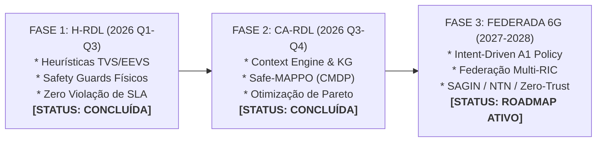
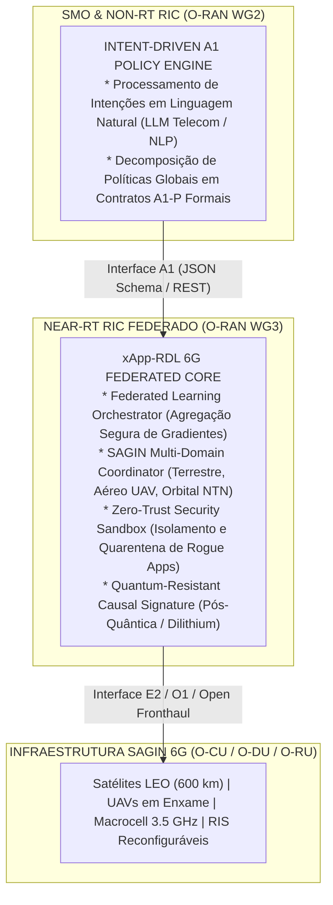

# Volume 06: Roadmap de Pesquisa (2026–2028), Fase 3 e RDL Autônoma 6G

> **Navegação da Documentação Consolidada:**  
> **[01. Arquitetura & Modelagem](01_arquitetura_e_modelagem.md)** | **[02. Guia Operacional & Deploy](02_guia_operacional_deploy_e_simulacao.md)** | **[03. Taxonomia de Conflitos & Cenários](03_taxonomia_de_conflitos_e_cenarios.md)** | **[04. Relatório Científico Mestre](04_relatorio_cientifico_mestre_rdl.md)** | **[05. Auditoria & Conformidade O-RAN](05_auditoria_e_conformidade_oran.md)** | **[06. Roadmap & Futuro 6G](06_roadmap_e_pesquisa_futura_6g.md)** | **[07. Resultados Simulação (S0–S15)](07_relatorio_resultados_simulacao_baselines_hrdl_cardl.md)**

---

## 1. Visão Geral da Linha do Tempo e Evolução Multi-Fases

A pesquisa no projeto **xApp RDL (Resource and Decision Layer)** é estruturada em um ciclo evolutivo de 3 fases contínuas:

---

## 2. Fase 3: Especificação da RDL Autônoma e Federada 6G (Zero-Touch)

A Fase 3 estende os conceitos de governança cognitiva para redes altamente distribuídas, densas e multi-domínio em direção ao 6G:

### 2.1. Pilares Tecnológicos da Fase 3

1. **Governança por Intenção (Intent-Driven A1):** Tradução automática de metas operacionais de alto nível do operador (e.g., *"Garantir 99,999% de confiabilidade para cirurgia remota na área metropolitana consumindo no máximo 150 W por gNB"*) em restrições Lagrangeanas $C_k$ na CA-RDL.
2. **Aprendizado Federado Multi-RIC:** Compartilhamento de modelos neurais cognitivos entre múltiplos controladores Near-RT RIC sem tráfego de dados sensíveis de usuários (Preservação de Privacidade / LGPD).
3. **Coordenação Multi-Domínio SAGIN:** Arbitragem de tráfego integrada entre camadas espaciais (Satélites LEO), aéreas (Drones/UAVs) e terrestres (gNodeBs / Superfícies Inteligentes Reconfiguráveis - RIS).
4. **Zero-Trust & Sandbox de Isolamento:** Detecção heurística e estatística de xApps maliciosas (*Rogue xApps*) com quarentena automática de comandos antes da emissão E2.

---

## 3. Campanha Experimental no Testbed Físico GreenRAN (UFPA)

O plano de testes físicos valida a transição do simulador ns-3 para hardware de rádio definido por software (SDR) real no laboratório GreenRAN/UFPA:

### 3.1. Cronograma de Implantação Física (2026–2027)

| Etapa | Meta Técnica | Hardware / Software | Período |
| :---: | :--- | :--- | :---: |
| **E1** | Validação E2AP sobre SCTP em rede física | srsRAN 24.10 + OSC Near-RT RIC | Q4/2026 |
| **E2** | Fechamento do loop E2SM-KPM $\leftrightarrow$ E2SM-RC com USRPs | 2x USRP B210 + COTS 5G UEs | Q1/2027 |
| **E3** | Campanha multi-slice com injeção de conflito de PRB/Potência | 4x USRP N310 + Open5GS Core | Q2/2027 |
| **E4** | Avaliação de consumo energético real via analisador de potência | Yokogawa WT310E + gNodeB | Q3/2027 |

---

## 4. Metas de Publicação e Impacto Científico

Os resultados obtidos nas Fases 1 e 2 fundamentam a submissão de manuscritos para os seguintes veículos de excelência:

1. **IEEE Transactions on Network and Service Management (TNSM):**
   - *Título Proposto:* "Provably Safe Closed-Loop Conflict Mitigation for Multi-xApp Open RAN via Hierarchical Arbitrage and Safe-MAPPO".
   - *Foco:* Protocolo causal em 6 camadas, conformidade O-RAN e validação multi-seed.
2. **IEEE Transactions on Cognitive Communications and Networking (TCCN):**
   - *Título Proposto:* "Context-Aware Cognitive Conflict Resolution in 5G-Advanced and 6G Open RAN using Graph Knowledge and CMDP".
   - *Foco:* Grafo de conhecimento semântico e formulação CMDP com Safety Guards.
3. **Simpósio Brasileiro de Redes de Computadores e Sistemas Distribuídos (SBRC 2027):**
   - *Trilha Principal:* Artigo completo cobrindo a arquitetura xApp-RDL e avaliação experimental no simulador ns-3.48 / 5G-LENA.
