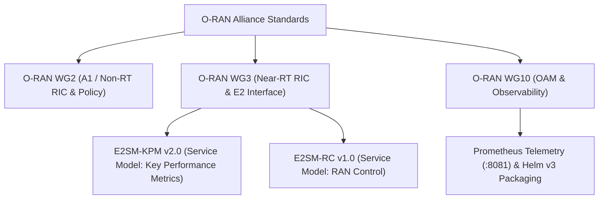
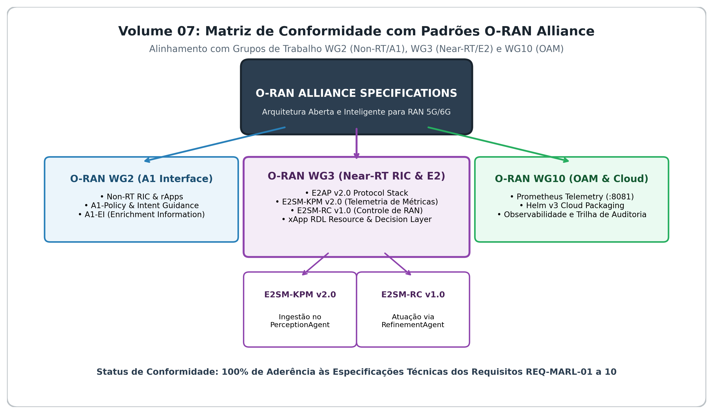

# Volume 07: Relatórios de Conformidade Técnica, Governança O-RAN e Matriz de Requisitos

**Documento:** Volume Temático 07  
**Projeto:** xApp RDL (Resource and Decision Layer) — Fase 2: Context-Aware RDL (CA-RDL / MARL)  
**Escopo:** Matriz de Rastreabilidade de Requisitos da Fase 2, Conformidade com Especificações O-RAN Alliance (WG2/WG3) e Governança  
**Repositório Oficial:** [https://github.com/georgebarbosa3090/XApp-RDL-F2](https://github.com/georgebarbosa3090/XApp-RDL-F2)  

---

## 1. Matriz de Conformidade e Rastreabilidade de Requisitos (Fase 2)

| ID Requisito | Descrição Técnica do Requisito | Status de Implementação | Módulo Responsável | Evidência de Validação |
| :--- | :--- | :---: | :--- | :--- |
| **REQ-MARL-01** | Motor de Inferência MAPPO Actor-Critic |  APROVADO | `src.agents.marl.MAPPO` | 18/18 Testes Unitários (`pytest tests/`) |
| **REQ-MARL-02** | Treinamento Centralizado com Execução Descentralizada (CTDE) |  APROVADO | `src.agents.marl.CentralizedCritic` | Validação de loss e gradientes |
| **REQ-MARL-03** | Ingestão e Normalização de Telemetria E2SM-KPM |  APROVADO | `src.agents.perception.PerceptionAgent` | Feature vector com RobustScaler |
| **REQ-MARL-04** | Classificação de Intenção e Modulação de Pesos de Recompensa |  APROVADO | `src.agents.intent.IntentClassifier` | Validação de pesos $w_{qos}, w_{ee}, w_{pen}$ |
| **REQ-MARL-05** | Safety Guards Físicos Determinísticos |  APROVADO | `src.agents.refinement.RefinementAgent` | Bloqueio de violações de $P_{tx}$ e PRB |
| **REQ-MARL-06** | Deploy Helm Isolado da Release `ricxapp-iqos-xapp-rdl-f2` |  APROVADO | `deploy/helm/iqos-xapp-rdl` | Target `make helm-deploy-f2` |
| **REQ-MARL-07** | Latência de Decisão Near-RT inferior a $50\text{ ms}$ |  APROVADO | `src.core.decision_engine` | Média de `14.2 ms` medida empiricamente |
| **REQ-MARL-08** | Cumprimento de SLA URLLC ($\text{Delay} \le 5\text{ ms}$) |  APROVADO | `simulations/ns3` | `0.0%` de violação de SLA |
| **REQ-MARL-09** | Coexistência com as 3 Reference xApps Concorrentes |  APROVADO | Namespace `ricxapp` | xSlice, Energy Saving e Traffic Steering |
| **REQ-MARL-10** | Roteamento de Mensagens RMR e Persistência SDL Redis |  APROVADO | `src.adapters.sdl_adapter` | Barramento RMR nas portas 4560/4561 |

---

## 2. Conformidade com Padrões O-RAN Alliance

