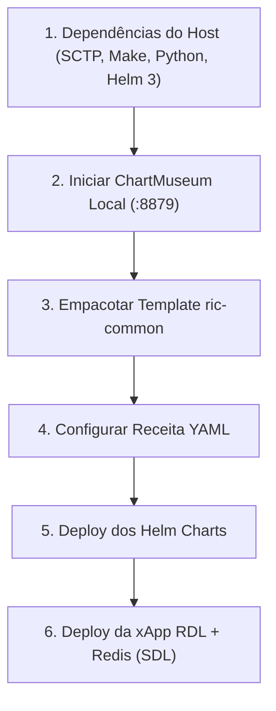

# Guia de Instalação e Validação no OSC Near-RT RIC

Este documento fornece os requisitos, comandos de verificação e o tutorial passo a passo para implantar o **Near-RT RIC (O-RAN Software Community - OSC)** e validar a **xApp RDL - Fase 1 (H-RDL)** em ambiente Ubuntu 20.04 (WSL / Bare-Metal).

---

## 1. Comandos de Verificação do Ambiente

Execute estes comandos no terminal para inspecionar o estado da infraestrutura:

### 1.1 Verificar o Cluster Kubernetes e Namespaces
```bash
# Status dos nós do cluster
kubectl get nodes -o wide

# Namespaces ativos
kubectl get namespaces
```

### 1.2 Verificar os Pods e Serviços do Near-RT RIC
```bash
# Listar todos os pods da plataforma O-RAN
kubectl get pods -n ricplt -o wide

# Listar os serviços e portas expostas (SCTP, RMR, HTTP)
kubectl get svc -n ricplt
```

### 1.3 Verificar o Servidor de Charts (ChartMuseum)
```bash
# Checar saúde do ChartMuseum local
curl -s http://127.0.0.1:8879/health

# Listar os charts disponíveis no repositório Helm local
helm search repo local/
```

### 1.4 Verificar a Imagem Docker da xApp
```bash
docker images | grep -E "iqos-xapp-rdl|redis"
```

---

## 2. Requisitos do Sistema

### 2.1 Hardware
* **CPU:** Mínimo 4 vCPUs (Recomendado: 8 vCPUs para RIC + Simulador ns-3).
* **Memória RAM:** Mínimo 8 GB (Recomendado: 16 GB+).
* **Disco:** Mínimo 30 GB livres.

### 2.2 Software
* **Sistema Operacional:** Ubuntu 20.04 LTS ou 22.04 LTS.
* **Kernel & Redes:** Suporte a módulos SCTP (`libsctp-dev`, `lksctp-tools`).
* **Container Runtime:** Docker CE 20.10+ ou Containerd.
* **Orquestrador:** Kubernetes v1.22+ (k3s, k3d, RKE2 ou kubeadm).
* **Gerenciador de Pacotes:** Helm 3.x.
* **Python:** Python 3.8+ com `pip`, `venv`, `ricxappframe` e `dms_cli`.
* **Ferramentas de Build:** `make`, `gcc`, `g++`, `build-essential`.

### 2.3 Mapeamento de Portas e Protocolos

| Componente | Porta / Protocolo | Finalidade |
| :--- | :--- | :--- |
| **E2Term (SCTP)** | `36422 / SCTP` (NodePort: `32222`) | Interface E2AP com os E2 Nodes (ns-3 / srsRAN / E2Sim). |
| **E2Term (RMR)** | `38000 / TCP` | Roteamento de mensagens E2AP para o RMR Bus. |
| **xApp RDL (RMR)** | `4560 / TCP` | Porta de escuta da xApp para `RIC_INDICATION` e `RDL_ACTION_PROPOSAL`. |
| **xApp RDL (HTTP)** | `8080` e `8081 / TCP` | Porta 8080 (Health/Probe) e Porta 8081 (Prometheus Metrics). |
| **DBAAS / Redis** | `6379 / TCP` | Shared Data Layer (SDL) para persistência de estado. |
| **ChartMuseum** | `8879 / TCP` | Repositório local de Helm charts. |

---

## 3. Instalação Recomendada do OSC Near-RT RIC



### Passo 1: Instalar Dependências do Sistema
```bash
sudo apt update
sudo apt install -y make build-essential python3-pip python3-venv python3-dev git curl jq libsctp-dev lksctp-tools
```

### Passo 2: Configurar e Iniciar o ChartMuseum
```bash
# 1. Baixar o binário do ChartMuseum
if ! command -v chartmuseum &> /dev/null; then
  curl -LO https://get.helm.sh/chartmuseum-v0.15.0-linux-amd64.tar.gz
  tar -zxvf chartmuseum-v0.15.0-linux-amd64.tar.gz
  sudo mv linux-amd64/chartmuseum /usr/local/bin/
  rm -rf linux-amd64 chartmuseum-v0.15.0*
fi

# 2. Iniciar em background na porta 8879
pkill -9 -f chartmuseum || true
mkdir -p /tmp/chartstorage
nohup chartmuseum --port=8879 --storage="local" --storage-local-rootdir="/tmp/chartstorage" > /tmp/chartmuseum.log 2>&1 &
sleep 2

# 3. Registrar o repositório local no Helm 3
helm repo remove local 2>/dev/null || true
helm repo add local http://127.0.0.1:8879
helm repo update
```

### Passo 3: Clonar Repositório e Publicar o Template Comum
```bash
cd ~
git clone https://gerrit.o-ran-sc.org/r/ric-plt/ric-dep ric-dep || git clone https://github.com/o-ran-sc/ric-plt-ric-dep.git ric-dep

# Empacotar o template ric-common para o storage do ChartMuseum
helm package ~/ric-dep/ric-common/Common-Template/helm/ric-common -d /tmp/chartstorage/

# Atualizar o cache do repositório
helm repo update
helm search repo local/ric-common
```

### Passo 4: Deploy da Plataforma Near-RT RIC
```bash
cd ~/ric-dep/bin

# Ajustar correções de compatibilidade Helm 3
sed -i 's/ric-commonn/ric-common/g' install
sed -i 's/IS_HELM3=.*/IS_HELM3=1/g' install

# Executar a instalação com a receita estável
./install -f ../RECIPE_EXAMPLE/example_recipe_latest_stable.yaml
```

---

## 4. Onboarding e Validação da xApp RDL (H-RDL)

### 4.1 Garantir o Banco de Dados SDL (Redis) no Namespace `ricplt`
```bash
kubectl apply -n ricplt -f - <<EOF
apiVersion: apps/v1
kind: Deployment
metadata:
  name: deployment-ricplt-dbaas-redis
spec:
  replicas: 1
  selector:
    matchLabels:
      app: ricplt-dbaas
  template:
    metadata:
      labels:
        app: ricplt-dbaas
    spec:
      containers:
      - name: redis
        image: redis:6.2-alpine
        ports:
        - containerPort: 6379
---
apiVersion: v1
kind: Service
metadata:
  name: service-ricplt-dbaas-tcp
spec:
  selector:
    app: ricplt-dbaas
  ports:
  - port: 6379
    targetPort: 6379
EOF
```

### 4.2 Build e Deploy da xApp RDL
Navegue até a pasta raiz do projeto no WSL:

```bash
cd /mnt/c/Users/george.barbosa/.gemini/antigravity/scratch/iqos-xapp-rdl-phase1

# 1. Build da imagem Docker
make build

# 2. Aplicar os manifestos de Deployment e Service
kubectl apply -f deploy/kubernetes/deployment.yaml
kubectl apply -f deploy/kubernetes/service.yaml

# 3. Acompanhar os logs estruturados da xApp RDL
kubectl logs -l app=ricxapp-iqos-xapp-rdl -n ricxapp -f
```

### 4.3 Coleta de Métricas Prometheus
Para validar a tomada de decisão determinística da H-RDL na janela temporal de 200 ms:

```bash
# Consultar as métricas Prometheus expostas pela xApp RDL
curl http://localhost:8081/metrics | grep -E "rdl_|dl_"
```
