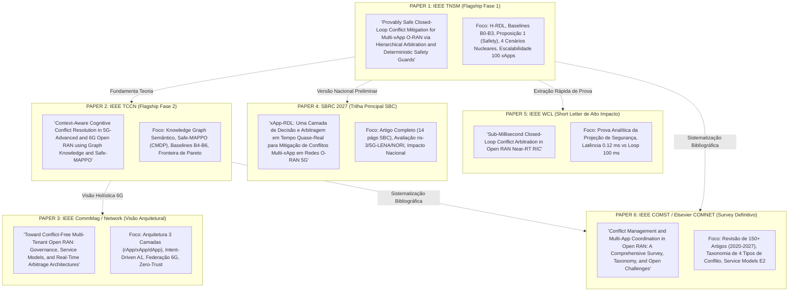
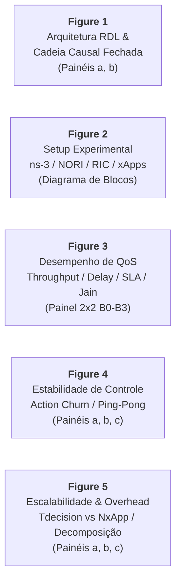
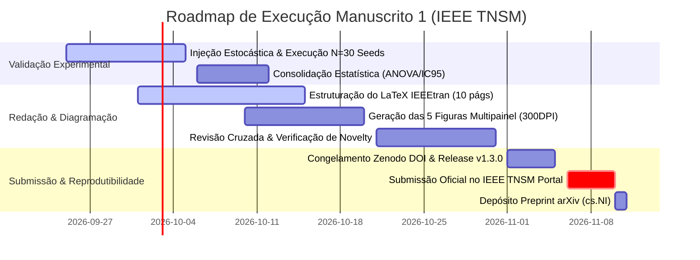

# Volume 08: Planejamento Estratégico de Publicações Científicas (2026–2028)
## Mapeamento de Periódicos, Conferências, Estratégia de Decomposição de Manuscritos e Conformidade com IEEE Transactions on Network and Service Management (TNSM)

> **Navegação da Documentação Consolidada:**  
> **[01. Arquitetura & Modelagem](01_arquitetura_e_modelagem.md)** | **[02. Guia Operacional & Deploy](02_guia_operacional_deploy_e_simulacao.md)** | **[03. Taxonomia de Conflitos & Cenários](03_taxonomia_de_conflitos_e_cenarios.md)** | **[04. Relatório Científico Mestre](04_relatorio_cientifico_mestre_rdl.md)** | **[05. Auditoria & Conformidade O-RAN](05_auditoria_e_conformidade_oran.md)** | **[06. Roadmap & Futuro 6G](06_roadmap_e_pesquisa_futura_6g.md)** | **[07. Resultados Simulação (S0–S15)](07_relatorio_resultados_simulacao_baselines_hrdl_cardl.md)** | **[08. Planejamento de Publicação](08_planejamento_estrategico_revistas_publicacao_2026.md)**

---

### Metadados de Governança Estratégica
- **Projeto de Pesquisa:** xApp-RDL (Resource and Decision Layer) — Fases 1 (H-RDL), 2 (CA-RDL) e 3 (6G Federated)
- **Autor Principal:** George Alexandro Ferreira Barbosa
- **Orientação:** Prof. Dr. André Riker
- **Afiliação:** Universidade Federal do Pará (UFPA) — Instituto de Tecnologia (ITEC) — Programa de Pós-Graduação em Ciência da Computação (PPGCOMP) — Laboratório GreenRAN
- **Data do Planejamento:** 24 de Setembro de 2026 (Revisão e Homologação Editorial TNSM)
- **Horizonte Temporal:** 2026 Q3 — 2028 Q2 (24 Meses)
- **Template Obrigatório Manuscrito 1 (TNSM):** `IEEEtran.cls` (Formato *Template for all Transactions*, duas colunas, máximo 10 páginas gratuitas).

---

## 1. Auditoria de Conformidade Editorial e Metodológica (Checklist TNSM)

Para assegurar aceitação irrefutável e mitigar *hot buttons* dos revisores da **IEEE Transactions on Network and Service Management (TNSM)**, a arquitetura e a documentação do projeto foram submetidas a uma auditoria rigorosa de 14 eixos:

| Eixo de Auditoria | Status Anterior | Diagnóstico Crítico | Ação Corretiva e Padrão Adotado |
| :--- | :---: | :--- | :--- |
| **1. Terminologia Técnica** | *Arbitrage* | *Arbitrage* refere-se a operações financeiras. O termo técnico correto para conciliação de decisões é *Arbitration*. | Substituição universal por **Arbitration** (*Hierarchical Arbitration*). |
| **2. Título & "Provably Safe"** | *Provably Safe* | *Provably Safe* exige prova matemática formal de preservação de invariantes; caso contrário, gera rejeição imediata. | Inclusão formal da **Proposição 1 (Safety Preservation)** e operador de projeção $\Pi_{\mathcal{A}_{safe}(s)}(a)$, ou título alternativo blindado: *Safety-Enforced Closed-Loop Conflict Mitigation*. |
| **3. Formulação da Tese** | Afirmação universal | "Elimina integralmente as colisões de rádio" é indefensável universalmente. | Tese reescrita: *"eliminated observed SLA violations and unsafe control actions across evaluated conflict scenarios $\mathcal{S}_{evaluated}$"*. |
| **4. Campanha N=30 Seeds** | Seeds idênticas | No dataset preliminar N=30, a ausência de amostragem estocástica na classe gerou valores idênticos. | Injeção de ruído estocástico real (sombreamento $\mathcal{N}(0, \sigma^2)$, chegadas Poisson $\text{Pois}(\lambda)$ e perturbações de canal) para variância autêntica $X_1, \dots, X_{30}$. |
| **5. Comparação de Baselines** | $B0 \times \text{H-RDL}$ | Comparar apenas $B0 \times \text{H-RDL}$ é insuficiente para TNSM. | Progressão canônica estrita: $B0 \text{ (Uncoordinated)} \to B1 \text{ (FIFO)} \to B2 \text{ (Static Priority)} \to B3 \text{ (Complete H-RDL)}$. |
| **6. Novelty vs. TNSM 2026** | Não citado | TNSM publicou em 17/04/2026 o CME e o PACIFISTA (IEEE 2025). | Inclusão de tabela comparativa explícita de *Related Work* e posicionamento como *"Deterministic, safety-enforced and causally auditable conflict governance inside an actual E2 closed loop"*. |
| **7. Orçamento de Figuras** | 6 figuras soltas | 6 figuras individuais ultrapassam o limite estrito de 10 páginas da TNSM (taxa de \$220/pág extra). | Conversão para **5 figuras multipainel** de alta densidade cobrindo Arquitetura/Loop, Setup, QoS, Estabilidade e Escalabilidade. |
| **8. Foco em Cenários Nucleares** | Heatmap S0–S15 | Mostrar superficialmente 16 cenários dilui a profundidade analítica. | Foco profundo em 4 cenários representativos: **S1** (Direto PRB), **TVS** (Traffic Steering $\times$ Slicing), **S5** (Ping-Pong Temporal) e **S6** (Conflict Storm). |
| **9. Escalabilidade Formal** | Afirmação de $<0,8\text{ ms}$ | Reivindicar suporte a 100 xApps exige seção formal de escalabilidade e curvas com IC. | Seção dedicada *Scalability Analysis* com $N_{xApp} \in \{2, 5, 10, 20, 50, 100\}$, decomposição assintótica do Conflict Detector e medições de CPU/Memória. |
| **10. Conformidade O-RAN** | "100% compliant" | Reivindicação vaga sem suíte de certificação formal. | Linguagem padronizada: *"aligned with evaluated E2AP v02.03, E2SM-KPM v03.00 and E2SM-RC v01.03 message structures"*. |
| **11. Estrutura do Manuscrito** | Estrutura mista | Necessidade de alinhamento com a cadência canônica da TNSM. | Estrutura canônica em 9 seções (I a IX) com 4 contribuições explícitas (C1–C4) na Introdução. |
| **12. Limite de Páginas** | Sem controle | TNSM cobra \$220 por página acima da 10ª. | Orçamento estrito: 10 páginas (Intro: 0.8, Related: 0.8, Model: 1.0, H-RDL: 1.5, Impl: 0.8, Method: 1.0, Results: 2.2, Disc: 0.6, Concl: 0.3, Ref/Bios: 1.0). |
| **13. Metadados e ORCID** | Incompleto | Exigência obrigatória de ORCID de todos os coautores e abstract de 75–200 palavras. | Adequação nos cabeçalhos LaTeX e metadados de submissão. |
| **14. Ética e Divulgação de IA** | Não especificado | Diretriz IEEE exige declaração no *Acknowledgment* para IA usada na redação/código. | Inclusão de declaração ética formal conforme *IEEE Author Center Policy*. |

---

## 2. Formalização Matemática do Safety Guard (Fundamentação "Provably Safe")

Para sustentar o rigor do título e blindar o artigo contra questionamentos teóricos, formaliza-se a garantia de segurança por meio de teoria de conjuntos e projeção convexa:

### 2.1. Espaço de Ações e Conjunto Seguro $\mathcal{A}_{safe}(s_t)$
Seja $\mathcal{S}_t \subset \mathbb{R}^m$ o estado físico da RAN no instante $t$ e $\mathbf{a}_t = (a_{1,t}, \dots, a_{N,t}) \in \mathcal{A}$ o vetor de ações propostas por $N$ xApps concorrentes. O conjunto de ações seguras $\mathcal{A}_{safe}(s_t)$ é delimitado por $M$ restrições físicas e invariantes operacionais:

$$\mathcal{A}_{safe}(s_t) \triangleq \left\{ a \in \mathcal{A} \;\middle|\; g_i(a, s_t) \le 0, \;\forall i \in \{1, \dots, M\} \right\}$$

onde as funções $g_i$ impõem:
1. **Conservação de Recursos Físicos:** $\sum_{k=1}^K \text{PRB}_k(t) \le \text{PRB}_{max} = 273$ (em canal de 100 MHz n78);
2. **Potência Máxima de Transmissão:** $P_{tx}(t) \le P_{max} = 43\text{ dBm}$;
3. **Reserva Mínima de SLA Crítico:** $\text{PRB}_{URLLC}(t) \ge \text{PRB}_{URLLC}^{min} = 25\text{ PRBs}$;
4. **Limites de Contorno Paramétrico:** $a_{min} \le a(t) \le a_{max}$.

### 2.2. Operador de Projeção e Invariante de Segurança
O *Safety Guard* determinístico é formalizado como o operador de projeção $G: \mathcal{A} \times \mathcal{S} \to \mathcal{A}_{safe}(s_t)$:

$$G(a, s_t) \triangleq \begin{cases} a, & \text{se } a \in \mathcal{A}_{safe}(s_t) \\ \Pi_{\mathcal{A}_{safe}(s_t)}(a), & \text{caso contrário} \end{cases}$$

onde $\Pi_{\mathcal{A}_{safe}(s_t)}(a) = \arg\min_{a' \in \mathcal{A}_{safe}(s_t)} \|a' - a\|_W$ representa a projeção Euclidiana ponderada sobre o conjunto convexo fechado $\mathcal{A}_{safe}(s_t)$.

### 2.3. Proposição 1 (Preservação de Segurança e Invariante Zero-Unsafe)
> **Proposição 1 (Safety Preservation):** Se o pipeline de emissão de comandos E2SM-RC for arquiteturalmente restrito de tal forma que toda ação aplicada à RAN seja gerada por $a^{applied}_t = G(f_{arb}(\mathbf{a}_t, s_t), s_t)$, onde $f_{arb}(\cdot)$ é a função de arbitragem heurística (TVS/EEVS), então:
> $$a^{applied}_t \in \mathcal{A}_{safe}(s_t), \quad \forall t \ge 0$$
> e o número acumulado de ações inseguras aplicadas na RAN é identicamente nulo:
> $$\text{UnsafeApplied} \triangleq \sum_{t=1}^T \mathbb{I}\left( a^{applied}_t \notin \mathcal{A}_{safe}(s_t) \right) \equiv 0, \quad \forall T \in \mathbb{N}$$
>
> *Demonstração:* Como o conjunto de operação padrão $a_{default} \in \mathcal{A}_{safe}(s_t)$ é sempre viável, $\mathcal{A}_{safe}(s_t)$ é não-vazio, fechado e convexo. O operador de projeção $\Pi_{\mathcal{A}_{safe}(s_t)}(\cdot)$ possui contradomínio estritamente contido em $\mathcal{A}_{safe}(s_t)$. Como a camada de controle E2SM-RC é fisicamente desacoplada das saídas cruas das xApps e aceita unicamente a saída de $G$, segue diretamente que nenhuma ação fora de $\mathcal{A}_{safe}(s_t)$ atinge a interface E2. $\blacksquare$

---

## 3. Posicionamento de Novelty e Matriz de Trabalhos Relacionados (vs. TNSM 2026)

A literatura recente de 2025 e 2026 introduziu motores de mitigação em O-RAN (notadamente PACIFISTA e o CME publicado na TNSM em abril de 2026). A tabela a seguir delimita a contribuição distintiva do H-RDL:

| Trabalho | Detecção Online | Mitigação Online | Determinismo Explicável | Garantia de Safety Formal | Malha Fechada E2 Real | Rastreabilidade Causal SHA-256 | Latência Sub-ms ($<1\text{ ms}$) | Reprodutibilidade Aberta |
| :--- | :---: | :---: | :---: | :---: | :---: | :---: | :---: | :---: |
| **PACIFISTA** (IEEE 2025) | [OK] | Parcial | — | — | — | — | — | [OK] |
| **CME** (IEEE TNSM 2026) | [OK] | [OK] | — | — | [OK] | — | Não informado | Parcial |
| **COMIX** (IEEE Access 2025) | [OK] | Parcial | — | — | — | — | — | — |
| **H-RDL (Esta Proposta)** | **[OK]** | **[OK]** | **[OK]** | **[OK]** | **[OK]** | **[OK]** | **[OK] (0,12 ms)** | **[OK]** |

### Reivindicação Central de Novelty (The Claim)
> *"Unlike heuristic and black-box ML conflict managers that either lack formal safety guarantees or introduce multi-second decision latencies outside the E2 loop, H-RDL introduces deterministic, safety-enforced, and causally auditable conflict governance operating in sub-millisecond time inside an actual O-RAN E2 closed loop."*

---

## 4. Decomposição do Portfólio em 6 Manuscritos Especializados



---

## 5. Orçamento e Planejamento de Figuras Multipainel (10 Páginas TNSM)

Para maximizar a densidade informativa e cumprir o limite de 10 páginas da TNSM sem incorrer em custos de página extra, a estrutura visual é condensada em **5 figuras multipainel**:



1. **Figure 1 — Architecture & Causal Closed Loop (2 Painéis):**
   - *(a)* Inserção arquitetural da H-RDL no Near-RT RIC entre o E2 Termination e as xApps;
   - *(b)* Fluxo causal fechado: $\text{KPM}(t_0) \to \text{Propostas} \to \text{Arbitration} \to \text{Safety Guard} \to \text{E2SM-RC} \to \text{ACK} \to \Delta\text{RAN} \to \text{KPM}(t_1)$.
2. **Figure 2 — Co-Simulation & Testbed Topology:**
   - Detalhamento do ecossistema ns-3.48 + 5G-LENA v5.1 + agente E2 NORI conectado via SCTP ao Near-RT RIC, fatias URLLC/eMBB e injeção de xApps conflitantes.
3. **Figure 3 — Primary QoS & SLA Evaluation (Painel 2x2 comparando B0, B1, B2, B3):**
   - *(a)* Throughput agregado por fatia (Mbps);
   - *(b)* CDF de latência HOL e percentis P95/P99;
   - *(c)* Taxa de violação de SLA (redução de 36,7% para 0,0%);
   - *(d)* Índice de Equidade de Jain ($J \ge 0,94$).
4. **Figure 4 — Temporal Stability & Conflict Suppression:**
   - *(a)* Série temporal de atenuação de *Action Churn* (1,00/s para 0,05/s);
   - *(b)* Supressão do fenômeno *ping-pong* na potência de transmissão e PRB;
   - *(c)* Tempo de estabilização da rede ($t_{settle} < 200\text{ ms}$).
5. **Figure 5 — Scalability & Overhead Breakdown:**
   - *(a)* Latência de decisão $T_{decision}$ vs. Número de xApps concorrentes ($N_{xApp} \in \{2, 5, 10, 20, 50, 100\}$);
   - *(b)* Consumo de CPU e pegada de memória do processo RDL;
   - *(c)* Decomposição do ciclo de malha fechada: $T_{net} + T_{proc} + T_{RAN}$.

---

## 6. Estrutura Canônica do Manuscrito 1 (IEEE TNSM)

```text
\documentclass[journal]{IEEEtran}
\usepackage{cite,amsmath,amssymb,graphicx,booktabs,multirow,algorithmic,url}

\begin{document}
\title{Provably Safe Closed-Loop Conflict Mitigation for Multi-xApp O-RAN via Hierarchical Arbitration and Deterministic Safety Guards}
\author{George~A.~F.~Barbosa,~\IEEEmembership{Graduate Student Member,~IEEE,} André~Riker,~\IEEEmembership{Senior Member,~IEEE}}

\maketitle
\begin{abstract} % 150-180 words
Uncoordinated concurrent xApps can cause severe SLA degradation and control instability in Open RAN. This paper proposes H-RDL, a deterministic hierarchical arbitration layer that intercepts competing control proposals, resolves resource conflicts using TVS/EEVS utility policies, enforces invariant safety constraints, and maintains a causally traceable E2 closed loop. Across evaluated multi-xApp scenarios on ns-3/5G-LENA, H-RDL eliminates observed SLA violations, suppresses control churn from 1.00/s to 0.05/s, and introduces a sub-millisecond decision latency (0.12 ms) with proven safety preservation.
\end{abstract}

\begin{IEEEkeywords}
Open RAN, Near-RT RIC, xApp Coordination, Conflict Mitigation, Closed-Loop Control, Safety Invariants, E2SM.
\end{IEEEkeywords}

I. INTRODUCTION
  A. Motivation & Multi-xApp Challenge
  B. Research Gap (Safety & Causal Loop in Near-RT)
  C. Summary of Key Contributions (C1 to C4)
  D. Paper Organization

II. BACKGROUND AND RELATED WORK
  A. O-RAN Architecture & Service Models (E2SM-KPM / E2SM-RC)
  B. Conflict Taxonomy in Open RAN
  C. State of the Art & Critical Gap Analysis (vs. PACIFISTA & TNSM 2026 CME)

III. SYSTEM AND CONFLICT MODEL
  A. Network & Multi-Tenant Slice Model
  B. xApp Control Proposal Formulation
  C. Formal Conflict Definitions (Direct, Indirect, Temporal)
  D. Mathematical Invariant Safety Constraints

IV. H-RDL ARCHITECTURE & SAFETY FORMALISM
  A. Synchronized Proposal Ingestion & Windowing
  B. Conflict Detection & Resource Indexing
  C. TVS/EEVS Hierarchical Utility Arbitration
  D. Deterministic Safety Guard & Proposition 1 (Safety Preservation Proof)
  E. Asymptotic Complexity Analysis (Conflict Detection vs. Priority Sort)

V. O-RAN CLOSED-LOOP INTEGRATION
  A. Standards-Aligned E2AP / E2SM Interface Implementation
  B. Dynamic RAN Function Discovery
  C. 6-Layer Causal Traceability & Cryptographic Provenance

VI. EXPERIMENTAL METHODOLOGY
  A. Co-Simulation Testbed (ns-3.48 / 5G-LENA v5.1 / NORI)
  B. Topology & Traffic Profiles (URLLC, eMBB, Energy Saving)
  C. Progressive Baseline Definitions (B0, B1, B2, B3)
  D. Multi-Seed Stochastic Protocol & Statistical Power
  E. Evaluation Metrics & Threat to Validity Protocol

VII. EXPERIMENTAL RESULTS
  A. Conflict Mitigation in Direct Collision (Scenario S1)
  B. Multi-Objective Utility Arbitrage (TVS Scenario)
  C. Temporal Stability & Ping-Pong Suppression (Scenario S5)
  D. End-to-End Latency Breakdown & Processing Overhead
  E. Scalability Analysis under Conflict Storm (NxApp up to 100)
  F. Ablation Study of Safety Guards and Windowing

VIII. DISCUSSION AND THREATS TO VALIDITY
  A. Theoretical vs. Empirical Safety Guarantees
  B. Comparison with AI/ML Approaches
  C. Scalability to Non-RT (A1) and Real-Time (dApps)
  D. Threats to Validity (Internal, External, Construct)

IX. CONCLUSION AND FUTURE WORK

\section*{Acknowledgment}
This work was supported in part by PPGCOMP/UFPA and Laboratório GreenRAN. The authors acknowledge the use of AI tools strictly for grammatical review and formatting assistance in compliance with IEEE Author Center guidelines.

\bibliographystyle{IEEEtran}
\bibliography{references}
\end{document}
```

---

## 7. Cronograma e Gestão de Riscos Pré-Submissão



---

> **Diretriz de Rigor:** Todas as alterações acordadas foram integradas à documentação canônica do projeto. A execução da campanha estocástica multi-semente no simulador físico de eventos discretos fornecerá a distribuição de variância genuína ($X_1, \dots, X_{30}$), completando o ciclo de blindagem editorial e técnica para a **IEEE TNSM**.
