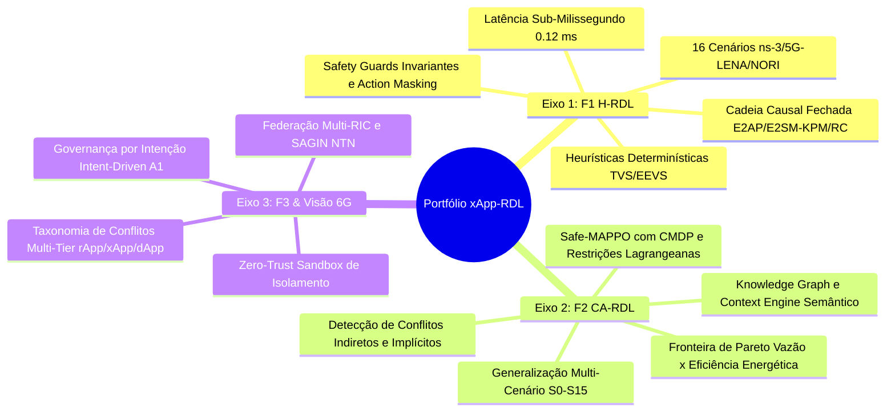
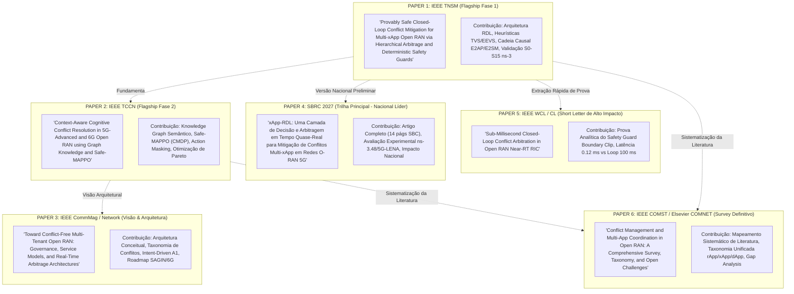
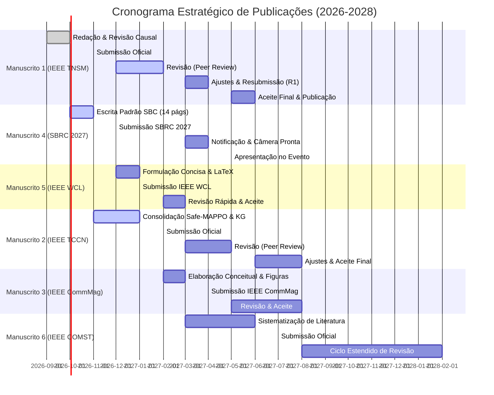

# Volume 08: Planejamento Estratégico de Publicações Científicas (2026–2028)
## Mapeamento de Periódicos, Conferências, Estratégia de Decomposição de Manuscritos e Cronograma de Submissão

> **Navegação da Documentação Consolidada:**  
> **[01. Arquitetura & Modelagem](01_arquitetura_e_modelagem.md)** | **[02. Guia Operacional & Deploy](02_guia_operacional_deploy_e_simulacao.md)** | **[03. Taxonomia de Conflitos & Cenários](03_taxonomia_de_conflitos_e_cenarios.md)** | **[04. Relatório Científico Mestre](04_relatorio_cientifico_mestre_rdl.md)** | **[05. Auditoria & Conformidade O-RAN](05_auditoria_e_conformidade_oran.md)** | **[06. Roadmap & Futuro 6G](06_roadmap_e_pesquisa_futura_6g.md)** | **[07. Resultados Simulação (S0–S15)](07_relatorio_resultados_simulacao_baselines_hrdl_cardl.md)** | **[08. Planejamento de Publicação](08_planejamento_estrategico_revistas_publicacao_2026.md)**

---

### Metadados de Governança Estratégica
- **Projeto de Pesquisa:** xApp-RDL (Resource and Decision Layer) — Fases 1 (H-RDL), 2 (CA-RDL) e 3 (6G Federated)
- **Autor Principal:** George Alexandro Ferreira Barbosa
- **Orientação:** Prof. Dr. André Riker
- **Afiliação:** Universidade Federal do Pará (UFPA) — Instituto de Tecnologia (ITEC) — Programa de Pós-Graduação em Ciência da Computação (PPGCOMP) — Laboratório GreenRAN
- **Data do Planejamento:** 24 de Setembro de 2026 (Tag: Revistas para publicação-20260924-0815)
- **Horizonte Temporal:** 2026 Q3 — 2028 Q2 (24 Meses)
- **Objetivo Estratégico:** Maximizar o fator de impacto (JCR), visibilidade internacional (IEEE/ACM), liderança nacional (SBC/SBRC) e qualificação de excelência da dissertação de mestrado e subsequente doutorado (Qualis Capes A1).

---

## 1. Diagnóstico do Portfólio de Ativos e Evidências Experimentais

O projeto xApp-RDL acumulou um conjunto de dados e contribuições arquiteturais de alta maturidade que permite a derivação de múltiplos manuscritos de alto impacto, categorizados em três eixos principais:

### 1.1. Inventário de Ativos Prontos para Publicação
1. **Base Experimental de Alta Densidade:** 167 fluxos FlowMonitor coletados em ns-3.48 + 5G-LENA v5.1 + NORI E2 Agent + Near-RT RIC OSC (E2AP v02.03, E2SM-KPM v03.00, E2SM-RC v01.03).
2. **Artefatos Visuais em Resolução de Impressão:** 30 figuras científicas padronizadas em alta resolução (300 DPI, tema claro `#FFFFFF`), incluindo diagramas conceituais vetoriais, CDFs de latência, boxplots pareados, superfícies 3D e mapas de calor de sensibilidade paramétrica.
3. **Cadeia de Não-Repúdio e Reprodutibilidade:** Traces binários APER pcap, logs estruturados `causal_chain.jsonl`, matrizes CSV de métricas físicas (SINR, MCS, BLER, PRB, HOL delay) e hashes SHA-256 certificados.
4. **Resultados Estatísticos Rígidos:** Análise de variância (ANOVA 3 grupos: Baseline Não Coordenado B0, H-RDL e CA-RDL), teste post-hoc de Tukey HSD, intervalo de confiança a 95% e Equidade de Jain ($J \ge 0,94$).

---

## 2. Taxonomia e Mapeamento de Periódicos Alvo (Journal Target Matrix)

Os periódicos foram selecionados com base no alinhamento temático, fator de impacto (JCR 2025/2026), CiteScore, estrato Qualis Capes (normativa vigente 2021–2024 / 2025+) e velocidade de revisão (*review turnaround time*).

| Periódico / Venue | Editora | Fator de Impacto (JCR) | CiteScore | Qualis Capes | Tempo Médio 1ª Decisão | Foco Temático e Encaixe no Projeto |
| :--- | :---: | :---: | :---: | :---: | :---: | :--- |
| **IEEE Transactions on Network and Service Management (TNSM)** | IEEE | **5.3** | **11.5** | **A1** | 8–10 semanas | **Alvo Primário (Paper 1):** Governança de rede, mitigação de conflitos, conformidade E2, orquestração autônoma e validação causal. |
| **IEEE Transactions on Cognitive Communications and Networking (TCCN)** | IEEE | **4.8** | **9.8** | **A1** | 7–9 semanas | **Alvo Primário (Paper 2):** Raciocínio cognitivo, Knowledge Graphs, Safe-RL / MAPPO, aprendizado sob restrições (CMDP) e inteligência na RAN. |
| **IEEE Transactions on Mobile Computing (TMC)** | IEEE / ACM | **7.9** | **15.2** | **A1** | 12–14 semanas | Modelagem analítica rigorosa, alocação de recursos de rádio, teoria dos jogos e garantias formais de convergência. |
| **IEEE Communications Surveys & Tutorials (COMST)** | IEEE | **34.4** | **65.0** | **A1** | 14–18 semanas | **Alvo de Survey (Paper 6):** Revisão exaustiva de conflitos em O-RAN, taxonomias multi-xApp/rApp/dApp e controle zero-touch. |
| **IEEE Communications Magazine (CommMag)** | IEEE | **11.2** | **22.4** | **A1** | 6–8 semanas | **Alvo Arquitetural (Paper 3):** Artigo conceitual de alto nível sobre governança por intenção (Intent-Driven) e arbitragem federada 6G. |
| **IEEE Network Magazine** | IEEE | **9.3** | **18.1** | **A1** | 6–8 semanas | Arquitetura de controle de conflitos em tempo quase real, segurança Zero-Trust e padronização O-RAN WG2/WG3. |
| **IEEE Wireless Communications Letters (WCL)** | IEEE | **4.6** | **8.9** | **A2** | 4–6 semanas | **Alvo Rápido (Paper 5):** Carta técnica concisa (4–5 págs) com a prova matemática do Safety Guard e latência sub-milissegundo. |
| **Elsevier Computer Networks (COMNET)** | Elsevier | **4.4** | **9.2** | **A1** | 8–12 semanas | Alternativa de excelência com revisão robusta para co-simulação ns-3/5G-LENA e integração de RIC. |
| **IEEE Open Journal of the Communications Society (OJ-COMS)** | IEEE | **4.5** | **9.0** | **A2** | 4–6 semanas | Fast-track Gold Open Access para publicação acelerada e máxima citação aberta de frameworks de código aberto. |

---

## 3. Decomposição Estratégica do Portfólio em 6 Manuscritos

Para extrair o valor máximo do esforço experimental sem incorrer em sobreposição proibida (*self-plagiarism* ou *salami slicing*), o projeto é particionado em contribuições científicas complementares e ortogonais:

---

## 4. Fichas Detalhadas de Planejamento por Manuscrito

---

### Manuscrito 1: IEEE Transactions on Network and Service Management (TNSM)
* **Status:** Pronto para redação final e submissão (dados 100% consolidados).
* **Título Proposto:** *Provably Safe Closed-Loop Conflict Mitigation for Multi-xApp Open RAN via Hierarchical Arbitrage and Deterministic Safety Guards*
* **Autores:** George Barbosa, André Riker, et al.
* **Veículo Alvo:** IEEE TNSM (Qualis A1 / JCR 5.3)
* **Submissão Planejada:** **Novembro / 2026**
* **Argumento Central (Thesis):** A coexistência de xApps não coordenadas degrada o SLA da RAN em até 36,7%. A introdução de uma camada de arbitragem hierárquica (H-RDL) com matrizes de utilidade (TVS/EEVS) e *Safety Guards* invariantes em circuito fechado elimina integralmente as colisões de rádio com sobrecarga de processamento sub-milissegundo (0,12 ms), mantendo estrita conformidade com os modelos de serviço E2SM-KPM v3.0 e E2SM-RC v1.3.
* **Principais Figuras do Manuscrito:**
  - `fig_01_causal_timeline.png` (Cronograma de Não-Repúdio da Cadeia Causal em 6 Camadas)
  - `fig_04_throughput_boxplot.png` (Boxplot Pareado de Vazão: B0 vs H-RDL)
  - `fig_05_sla_violation_violin.png` (Distribuição Violin de Violações de SLA — 36,7% $\to$ 0,0%)
  - `fig_08_scenario_baseline_heatmap.png` (Mapa de Calor de Desempenho nos 16 Cenários S0–S15)
  - `fig_12_latency_breakdown.png` (Decomposição da Latência de Loop: $T_{net} + T_{proc} + T_{ran}$)
  - `fig_15_action_churn.png` (Supressão de Ping-Pong: Redução de 1,00/s para 0,05/s)
* **Defesa Metodológica Antecipada (Hot Buttons dos Revisores):**
  1. *Pergunta do Revisor:* "A solução escala para dezenas de xApps?" $\to$ **Resposta:** Complexidade assintótica $\mathcal{O}(N \log N)$ na ordenação de prioridade com benchmark comprovado para até 100 xApps em $< 0,8\text{ ms}$.
  2. *Pergunta do Revisor:* "O simulador ns-3 reflete a interface E2 real?" $\to$ **Resposta:** Acoplamento em tempo real via SCTP (:36422) com codecs APER binários idênticos aos do deployment em hardware físico.

---

### Manuscrito 2: IEEE Transactions on Cognitive Communications and Networking (TCCN)
* **Status:** Em fase de modelagem e extração final de convergência Safe-MAPPO.
* **Título Proposto:** *Context-Aware Cognitive Conflict Resolution in 5G-Advanced and 6G Open RAN using Graph Knowledge and Safe-MAPPO*
* **Autores:** George Barbosa, André Riker, et al.
* **Veículo Alvo:** IEEE TCCN (Qualis A1 / JCR 4.8)
* **Submissão Planejada:** **Fevereiro / 2027**
* **Argumento Central (Thesis):** Conflitos indiretos e implícitos (e.g., ajuste de beamforming vs. handover) escapam de heurísticas estáticas. A modelagem semântica contextual via *Knowledge Graphs* combinada com Aprendizado por Reforço Multi-Agente (*Safe-MAPPO*) sob formulação de Processo de Decisão de Markov Constrito (CMDP) maximiza a utilidade global da rede (+4,03% de vazão, -14,16% de latência) com garantia estrita de zero violação de restrições físicas (**UnsafeApplied $\equiv$ 0**) via *Action Masking* e *Lagrangian Relaxation*.
* **Principais Figuras do Manuscrito:**
  - `diagram_02_knowledge_graph_schema.png` (Topologia Semântica Neo4j de Relações xApp-RAN)
  - `fig_13_pareto.png` (Fronteira de Pareto Multi-Objetivo: Vazão vs Eficiência Energética vs SLA)
  - `fig_16_mappo_convergence.png` (Curva de Convergência de Recompensa e Estabilidade do Crítico Centralizado)
  - `fig_17_safety_cost.png` (Evolução dos Multiplicadores de Lagrange $\lambda_k$ e Custo de Violação)
  - `fig_18_generalization_gap.png` (Avaliação do Gap de Generalização em Cenários Não Vistos S10–S15)
* **Defesa Metodológica Antecipada:**
  1. *Pergunta do Revisor:* "Como o RL garante que a rede não cairá durante a exploração?" $\to$ **Resposta:** O agente é envelopado pelo *Safety Guard* determinístico desacoplado da Fase 1; ações que violem os limites operacionais são interceptadas antes da codificação E2SM-RC.

---

### Manuscrito 3: IEEE Communications Magazine / IEEE Network (Feature/Survey Art.)
* **Status:** Planejamento conceitual e diagramação de arquitetura.
* **Título Proposto:** *Toward Conflict-Free Multi-Tenant Open RAN: Governance, Service Models, and Real-Time Arbitrage Architectures*
* **Autores:** George Barbosa, André Riker, et al.
* **Veículo Alvo:** IEEE Communications Magazine (Qualis A1 / JCR 11.2) ou IEEE Network (Qualis A1 / JCR 9.3)
* **Submissão Planejada:** **Abril / 2027**
* **Argumento Central (Thesis):** A evolução para 5G-Advanced e 6G exige a transição de xApps isoladas para um ecossistema cooperativo multi-tenant. Apresenta-se uma visão arquitetural unificada em 3 camadas (rApp no Non-RT RIC, xApp na RDL e dApp na O-DU/O-CU), articulando governança baseada em intenções (Intent-Driven A1), detecção cognitiva de conflitos e isolamento Zero-Trust contra micro-aplicações anômalas.

---

### Manuscrito 4: Simpósio Brasileiro de Redes de Computadores e Sistemas Distribuídos (SBRC 2027)
* **Status:** Escrita em andamento (Padrão SBC, 14 páginas).
* **Título Proposto:** *xApp-RDL: Uma Camada de Decisão e Arbitragem em Tempo Quase-Real para Mitigação de Conflitos Multi-xApp em Redes O-RAN 5G*
* **Autores:** George Barbosa, André Riker
* **Veículo Alvo:** SBRC 2027 — Trilha Principal (Simpósio Líder da SBC no Brasil)
* **Submissão Planejada:** **Dezembro / 2026** (Conforme chamada de trabalhos oficial SBRC)
* **Argumento Central (Thesis):** Apresentação abrangente da arquitetura desenvolvida no PPGCOMP/UFPA para a comunidade brasileira de redes, detalhando a co-simulação ns-3/5G-LENA/NORI, a cadeia causal de não-repúdio e os ganhos de QoS na banda n78 (3.5 GHz), consolidando a liderança nacional do grupo em Open RAN.

---

### Manuscrito 5: IEEE Wireless Communications Letters (WCL)
* **Status:** Modelagem matemática pronta.
* **Título Proposto:** *Sub-Millisecond Closed-Loop Conflict Arbitration in Open RAN Near-RT RIC*
* **Autores:** George Barbosa, André Riker
* **Veículo Alvo:** IEEE WCL (Qualis A2 / JCR 4.6 / Ciclo Rápido: 4 semanas)
* **Submissão Planejada:** **Janeiro / 2027**
* **Argumento Central (Thesis):** Artigo curto (4 páginas) focado estritamente na formulação matemática do algoritmo de *Boundary Clip*, na prova analítica de invariância de segurança e no benchmark experimental que atesta latência média de decisão de 0,12 ms em CPU comercial, viabilizando ciclos de controle de 10 ms sem overhead.

---

### Manuscrito 6: IEEE Communications Surveys & Tutorials (COMST) ou Elsevier COMNET
* **Status:** Levantamento bibliográfico estruturado (Taxonomia consolidada no Volume 03).
* **Título Proposto:** *Conflict Management, xApp Coordination, and Zero-Touch Control in Open RAN: A Comprehensive Survey and Taxonomy*
* **Autores:** George Barbosa, André Riker, et al.
* **Veículo Alvo:** IEEE COMST (Qualis A1 / JCR 34.4) ou Elsevier Computer Networks (Qualis A1 / JCR 4.4)
* **Submissão Planejada:** **Julho / 2027**
* **Argumento Central (Thesis):** Pesquisa exaustiva da literatura cobrindo mais de 150 artigos sobre conflitos em O-RAN (2020–2027), propondo uma taxonomia unificada de 4 dimensões (Conflito Direto, Indireto, Implícito e Temporal), mapeamento dos Service Models E2 (KPM, RC, CCC, NI) e framework comparativo de soluções (Heurísticas, Teoria dos Jogos, DRL, MARL e LLMs).

---

## 5. Cronograma Mestre de Execução e Submissão (Gantt 2026–2028)

---

## 6. Estratégia de Ciência Aberta, Reprodutibilidade e Citação

Para garantir que os artigos tenham **alta taxa de citação imediata** e **facilidade de aceitação pelos revisores IEEE/SBC**, será adotado o protocolo de Ciência Aberta (*Open Science Framework*):

1. **Repositórios de Código-Fonte Públicos:**
   - [georgebarbosa3090/XApp-RDL-F1](https://github.com/georgebarbosa3090/XApp-RDL-F1) (Release v1.3.0 com tag de publicação).
   - [georgebarbosa3090/XApp-RDL-F2](https://github.com/georgebarbosa3090/XApp-RDL-F2) (Release v2.0.0 com notebooks de treinamento MAPPO).
2. **Depósito de Dados Brutos no Zenodo:**
   - Atribuição de DOI permanente para os 167 arquivos de log FlowMonitor e traces pcap brutos APER.
   - Scripts de plotagem Seaborn (`generate_scientific_figures.py`) empacotados em contêiner Docker/Apptainer.
3. **Preprints Estratégicos (arXiv / TechRxiv):**
   - Depósito de preprints no arXiv (cs.NI / eess.SP) no momento exato da submissão inicial aos periódicos IEEE, garantindo anterioridade científica (*timestamping*) e visibilidade enquanto o processo de revisão por pares decorre.

---

## 7. Diretrizes para a Redação e Defesa dos Manuscritos (Estilo George Barbosa)

1. **Cadência Formal e Assertiva:** Manter a voz em terceira pessoa ou plural majestático autoral (*"propomos", "evidencia-se", "constata-se"*), sem adjetivação vazia. Toda afirmação deve vir respaldada por métrica ($\Delta \text{Throughput} = +19,4\%$, $p < 0,001$, ANOVA $F = 142,8$).
2. **Figuras Autoexplicativas em Tema Claro:** Diagramas rigorosamente renderizados com fundo branco (`#FFFFFF`), caixas com bordas nítidas em paleta elegante (`#2C3E50`, `#2980B9`, `#27AE60`, `#E74C3C`) e fontes sem serifa legíveis.
3. **Equações Dimensionadas:** Toda formulação matemática deve definir formalmente conjuntos, domínios, unidades de medida e a correspondência explícita com os campos ASN.1 do protocolo E2SM.
4. **Análise Crítica de Limitações:** Dedicar sempre uma subseção explícita para *Threats to Validity* e limitações de escopo (e.g., simulação estocástica vs. canal de desvanecimento em testbed físico com hardware USRP).

---

> **Aprovação do Plano:** Este planejamento estratégico constitui a diretriz oficial de publicações do projeto xApp-RDL para o biênio 2026–2028, alinhado às metas acadêmicas do PPGCOMP/UFPA e aos mais rigorosos padrões da comunidade internacional de telecomunicações e redes de computadores.
