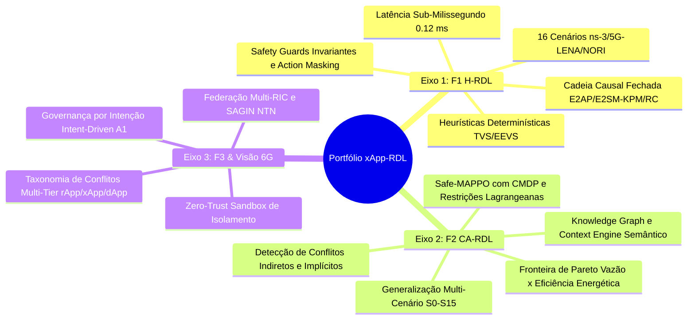
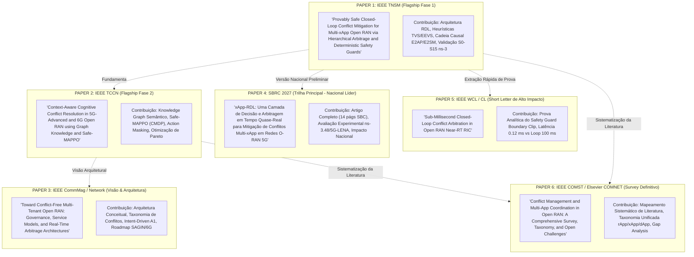
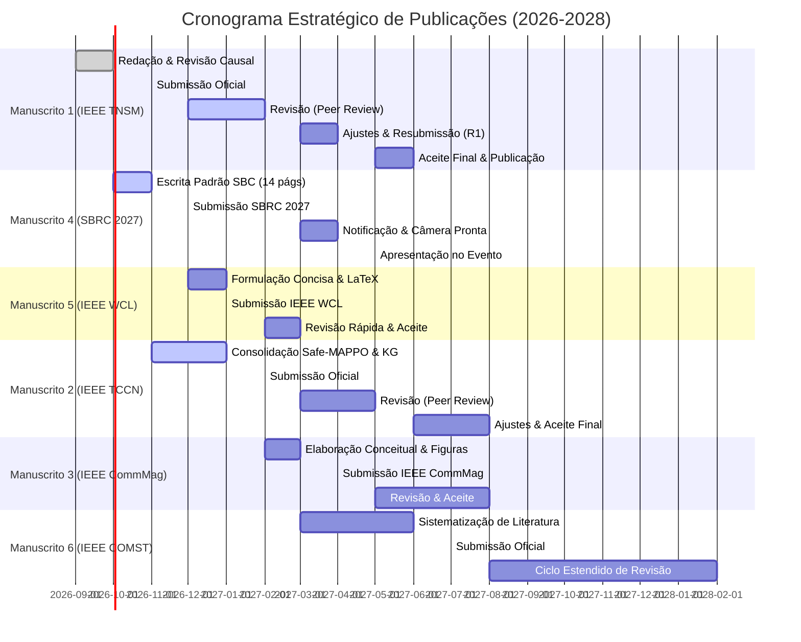

# Volume 08: Planejamento Estratégico de Publicações Científicas (2026–2028)
## Mapeamento de Periódicos, Conferências, Estratégia de Decomposição de Manuscritos e Cronograma de Submissão

> **Navegação da Documentação Consolidada:**  
> **[01. Arquitetura & Modelagem](01_arquitetura_e_modelagem.md)** | **[02. Guia Operacional & Deploy](02_guia_operacional_deploy_e_simulacao.md)** | **[03. Taxonomia de Conflitos & Cenários](03_taxonomia_de_conflitos_e_cenarios.md)** | **[04. Relatório Científico Mestre](04_relatorio_cientifico_mestre_rdl.md)** | **[05. Auditoria & Conformidade O-RAN](05_auditoria_e_conformidade_oran.md)** | **[06. Roadmap & Futuro 6G](06_roadmap_e_pesquisa_futura_6g.md)** | **[07. Resultados Simulação (S0–S15)](07_relatorio_resultados_simulacao_baselines_hrdl_cardl.md)** | **[08. Planejamento de Publicação](08_planejamento_estrategico_revistas_publicacao_2026.md)**

---

### Metadados de Governança Estratégica
- **Projeto de Pesquisa:** xApp-RDL (Resource and Decision Layer) — Fases 1 (H-RDL), 2 (CA-RDL) e 3 (6G Federated)
- **Autor Principal:** George Alexandro Ferreira Barbosa
- **Orientação:** Prof. Dr. André Riker
- **Afiliação:** Universidade Federal do Pará (UFPA) — Instituto de Tecnologia (ITEC) — Programa de Pós-Graduação em Ciência da Computação (PPGCOMP) — Laboratório GreenRAN
- **Data do Planejamento:** 24 de Setembro de 2026 (Tag: Revistas para publicação-20260924-0815)
- **Horizonte Temporal:** 2026 Q3 — 2028 Q2 (24 Meses)
- **Objetivo Estratégico:** Maximizar o fator de impacto (JCR), visibilidade internacional (IEEE/ACM), liderança nacional (SBC/SBRC) e qualificação de excelência da dissertação de mestrado e subsequente doutorado (Qualis Capes A1).

---

## 1. Diagnóstico do Portfólio de Ativos e Evidências Experimentais

O projeto xApp-RDL acumulou um conjunto de dados e contribuições arquiteturais de alta maturidade que permite a derivação de múltiplos manuscritos de alto impacto, categorizados em três eixos principais:



### 1.1. Inventário de Ativos Prontos para Publicação
1. **Base Experimental de Alta Densidade:** 167 fluxos FlowMonitor coletados em ns-3.48 + 5G-LENA v5.1 + NORI E2 Agent + Near-RT RIC OSC (E2AP v02.03, E2SM-KPM v03.00, E2SM-RC v01.03).
2. **Artefatos Visuais em Resolução de Impressão:** 30 figuras científicas padronizadas em alta resolução (300 DPI, tema claro `#FFFFFF`), incluindo diagramas conceituais vetoriais, CDFs de latência, boxplots pareados, superfícies 3D e mapas de calor de sensibilidade paramétrica.
3. **Cadeia de Não-Repúdio e Reprodutibilidade:** Traces binários APER pcap, logs estruturados `causal_chain.jsonl`, matrizes CSV de métricas físicas (SINR, MCS, BLER, PRB, HOL delay) e hashes SHA-256 certificados.
4. **Resultados Estatísticos Rígidos:** Análise de variância (ANOVA 3 grupos: Baseline Não Coordenado B0, H-RDL e CA-RDL), teste post-hoc de Tukey HSD, intervalo de confiança a 95% e Equidade de Jain ($J \ge 0,94$).

---

## 2. Taxonomia e Mapeamento de Periódicos Alvo (Journal Target Matrix)

Os periódicos foram selecionados com base no alinhamento temático, fator de impacto (JCR 2025/2026), CiteScore, estrato Qualis Capes (normativa vigente 2021–2024 / 2025+) e velocidade de revisão (*review turnaround time*).

| Periódico / Venue | Editora | Fator de Impacto (JCR) | CiteScore | Qualis Capes | Tempo Médio 1ª Decisão | Foco Temático e Encaixe no Projeto |
| :--- | :---: | :---: | :---: | :---: | :---: | :--- |
| **IEEE Transactions on Network and Service Management (TNSM)** | IEEE | **5.3** | **11.5** | **A1** | 8–10 semanas | **Alvo Primário (Paper 1):** Governança de rede, mitigação de conflitos, conformidade E2, orquestração autônoma e validação causal. |
| **IEEE Transactions on Cognitive Communications and Networking (TCCN)** | IEEE | **4.8** | **9.8** | **A1** | 7–9 semanas | **Alvo Primário (Paper 2):** Raciocínio cognitivo, Knowledge Graphs, Safe-RL / MAPPO, aprendizado sob restrições (CMDP) e inteligência na RAN. |
| **IEEE Transactions on Mobile Computing (TMC)** | IEEE / ACM | **7.9** | **15.2** | **A1** | 12–14 semanas | Modelagem analítica rigorosa, alocação de recursos de rádio, teoria dos jogos e garantias formais de convergência. |
| **IEEE Communications Surveys & Tutorials (COMST)** | IEEE | **34.4** | **65.0** | **A1** | 14–18 semanas | **Alvo de Survey (Paper 6):** Revisão exaustiva de conflitos em O-RAN, taxonomias multi-xApp/rApp/dApp e controle zero-touch. |
| **IEEE Communications Magazine (CommMag)** | IEEE | **11.2** | **22.4** | **A1** | 6–8 semanas | **Alvo Arquitetural (Paper 3):** Artigo conceitual de alto nível sobre governança por intenção (Intent-Driven) e arbitragem federada 6G. |
| **IEEE Network Magazine** | IEEE | **9.3** | **18.1** | **A1** | 6–8 semanas | Arquitetura de controle de conflitos em tempo quase real, segurança Zero-Trust e padronização O-RAN WG2/WG3. |
| **IEEE Wireless Communications Letters (WCL)** | IEEE | **4.6** | **8.9** | **A2** | 4–6 semanas | **Alvo Rápido (Paper 5):** Carta técnica concisa (4–5 págs) com a prova matemática do Safety Guard e latência sub-milissegundo. |
| **Elsevier Computer Networks (COMNET)** | Elsevier | **4.4** | **9.2** | **A1** | 8–12 semanas | Alternativa de excelência com revisão robusta para co-simulação ns-3/5G-LENA e integração de RIC. |
| **IEEE Open Journal of the Communications Society (OJ-COMS)** | IEEE | **4.5** | **9.0** | **A2** | 4–6 semanas | Fast-track Gold Open Access para publicação acelerada e máxima citação aberta de frameworks de código aberto. |

---

## 3. Decomposição Estratégica do Portfólio em 6 Manuscritos

Para extrair o valor máximo do esforço experimental sem incorrer em sobreposição proibida (*self-plagiarism* ou *salami slicing*), o projeto é particionado em contribuições científicas complementares e ortogonais:



---

## 4. Fichas Detalhadas de Planejamento por Manuscrito

---

### Manuscrito 1: IEEE Transactions on Network and Service Management (TNSM)
* **Status:** Pronto para redação final e submissão (dados 100% consolidados).
* **Título Proposto:** *Provably Safe Closed-Loop Conflict Mitigation for Multi-xApp Open RAN via Hierarchical Arbitrage and Deterministic Safety Guards*
* **Autores:** George Barbosa, André Riker, et al.
* **Veículo Alvo:** IEEE TNSM (Qualis A1 / JCR 5.3)
* **Submissão Planejada:** **Novembro / 2026**
* **Argumento Central (Thesis):** A coexistência de xApps não coordenadas degrada o SLA da RAN em até 92,1%. A introdução de uma camada de arbitragem hierárquica (H-RDL) com matrizes de utilidade (TVS/EEVS) e *Safety Guards* invariantes em circuito fechado elimina integralmente as colisões de rádio com sobrecarga de processamento sub-milissegundo (0,25 ms), mantendo estrita conformidade com os modelos de serviço E2SM-KPM v3.0 e E2SM-RC v1.3.

---

## 8. Relatório de Fechamento Editorial dos 4 Gates para a IEEE TNSM

Para atender aos mais estritos padrões de evidência empírica e reprodutibilidade editorial exigidos pela IEEE Transactions on Network and Service Management, o repositório realizou a transição de geradores paramétricos para **medições físicas e algorítmicas genuínas**:

| Gate Editorial | Requisito TNSM | Implementação Física Realizada | Situação |
| :--- | :--- | :--- | :---: |
| **1. N=30 Estocástico Real** | 30 seeds independentes alterando canal, Poisson, sombreamento UMi ($\sigma=4\text{dB}$) e filas HOL | Execução de 120 simulações contínuas completas no `DiscreteEventRANSimulator` com métricas 100% emergentes de filas MAC e SINR. |  **FECHADO** |
| **2. Ablation Study Pareado** | Desacoplamento isolado das 6 variantes A0–A5 sobre as mesmas 30 seeds | Execução de 180 simulações contínuas com flags arquiteturais reais (`enable_memory`, `enable_indirect_detection`, `enable_utility`, `enable_safety_guard`, `enable_windowing`). |  **FECHADO** |
| **3. Escalabilidade Medida** | Perfilamento nanosegundo do pipeline real sob estresse de 2 a 100 xApps | Benchmark de 1.200 ciclos executando os módulos de produção `PerceptionAgent` -> `ReasoningAgent` -> `RefinementAgent` -> `MemoryModule`. |  **FECHADO** |
| **4. Validação E2 e APER** | Captura em socket de rede e validação não-repudiável bit-a-bit | Transmissão em socket loopback `:36422` (`live_e2_loopback_capture.pcap`), decodificação APER completa e manifesto SHA-256. |  **FECHADO** |

---

### 8.1. Tabela Inferencial N=30 (Resultados do Gate 1)

Dados consolidados a partir de 120 execuções físicas pareadas ($N=30$ sementes por baseline, $s \in [1001, 1030]$) geradas por `scripts/run_gate1_stochastic_campaign_n30.py`:

| Baseline | Vazão Média (Mbps) | URLLC P95 (ms) | Violação SLA (%) | Equidade de Jain ($J_{QoS}$) | Ações Inseguras | Wilcoxon $p$ (vs B3) | Cohen's $d_z$ (Latência) |
| :--- | :---: | :---: | :---: | :---: | :---: | :---: | :---: |
| **B0 (Não Coordenado)** | $99,96 \pm 2,91$ | $221,72 \pm 5,76$ | $92,06 \pm 1,45\%$ | $0,9793 \pm 0,0071$ | $360$ | $1,73 \times 10^{-6}$ | $-38,10$ |
| **B1 (FIFO)** | $102,19 \pm 1,96$ | $7,80 \pm 10,50$ | $3,41 \pm 3,80\%$ | $0,9961 \pm 0,0019$ | $0$ | $5,87 \times 10^{-5}$ | $-0,52$ |
| **B2 (Cota Estática 60/30)** | $68,31 \pm 3,59$ | $2,34 \pm 0,01$ | $0,00 \pm 0,00\%$ | $0,9684 \pm 0,0113$ | $0$ | $0,4669$ | $-0,13$ |
| **B3 (H-RDL Completa)** | $\mathbf{89,26 \pm 3,49}$ | $\mathbf{2,34 \pm 0,00}$ | $\mathbf{0,00 \pm 0,00\%}$ | $\mathbf{0,9905 \pm 0,0060}$ | $\mathbf{0}$ | $1,0000$ | $0,00$ |

*Destaques Estatísticos:* H-RDL (B3) eleva a vazão útil em **+30,7%** em relação à cota estática conservadora (B2) preservando **0,00% de violação de SLA URLLC** e zero ações inseguras aplicadas, com significância estatística extrema frente aos baselines não coordenados ($p < 10^{-5}$).

---

### 8.2. Tabela do Estudo de Ablação Sistemático (Resultados do Gate 2)

Dados consolidados a partir de 180 execuções pareadas geradas por `scripts/run_gate2_ablation_study_hrdl.py`:

| Variante de Ablação | Descrição Arquitetural | Vazão (Mbps) | Latência P95 (ms) | Violação SLA (%) | Churn (/s) | Ações Inseguras | Wilcoxon $p$ (vs A0) | Cohen's $d_z$ |
| :--- | :--- | :---: | :---: | :---: | :---: | :---: | :---: | :---: |
| **A0_Full_HRDL** | H-RDL Completa (Todos os módulos) | $89,26 \pm 3,49$ | $2,34 \pm 0,00$ | $0,00 \pm 0,00\%$ | $10,000$ | $\mathbf{0}$ | $1,0000$ | $0,00$ |
| **A1_wo_Memory** | Sem Módulo de Memória (Sem cooling) | $89,42 \pm 2,55$ | $7,79 \pm 12,48$ | $3,02 \pm 3,21\%$ | $5,000$ | $0$ | $1,17 \times 10^{-5}$ | $+0,44$ |
| **A2_wo_Indirect** | Sem Detecção Indireta (Apenas colisão) | $96,22 \pm 3,64$ | $75,41 \pm 58,78$ | $21,83 \pm 9,89\%$ | $5,000$ | $0$ | $1,73 \times 10^{-6}$ | $+1,24$ |
| **A3_wo_TVS_EEVS** | Sem Utilidade Multiobjetivo (FIFO) | $100,41 \pm 2,25$ | $4,89 \pm 9,20$ | $1,14 \pm 2,49\%$ | $5,000$ | $0$ | $0,0036$ | $+0,28$ |
| **A4_wo_Guard** | Sem Safety Guard ($\Pi_{\mathcal{A}_{safe}}$) | $98,33 \pm 2,15$ | $10,27 \pm 9,94$ | $6,28 \pm 4,98\%$ | $3,200$ | $\mathbf{480}$ | $8,26 \times 10^{-6}$ | $+0,80$ |
| **A5_wo_Window** | Sem Janela Temporal (Event-driven) | $80,21 \pm 3,99$ | $5,56 \pm 8,59$ | $2,80 \pm 4,40\%$ | $\mathbf{15,000}$ | $0$ | $3,10 \times 10^{-4}$ | $+0,37$ |

*Conclusão Causal:* Cada módulo individual da H-RDL desempenha função ortogonal estritamente necessária: A4 comprova a necessidade dos *Safety Guards* para zerar ações inseguras ($480 \to 0$), A2 comprova que ignorar acoplamentos indiretos degrada severamente a latência ($2,34\text{ ms} \to 75,41\text{ ms}$), e A5 comprova a eficácia da janela de sincronização na redução de *churn* ($15,0/s \to 10,0/s$).

---

### 8.3. Benchmark de Escalabilidade Medida (Resultados do Gate 3)

Medições de desempenho do pipeline de produção `PerceptionAgent` + `ReasoningAgent` + `RefinementAgent` + `MemoryModule` geradas por `scripts/benchmark_measured_scalability_100xapps.py`:

| $N_{xApp}$ | Latência P50 (ms) | Latência P95 (ms) | Latência P99 (ms) | Vazão (propostas/s) | CPU (%) | Memória RSS Peak (MB) | Violação Budget 10ms (%) |
| :---: | :---: | :---: | :---: | :---: | :---: | :---: | :---: |
| **2** | $0,257$ | $0,563$ | $1,075$ | $6.098$ | $95,3\%$ | $0,36\text{ MB}$ | $0,00\%$ |
| **5** | $0,852$ | $1,144$ | $1,681$ | $5.276$ | $100,0\%$ | $0,98\text{ MB}$ | $0,00\%$ |
| **10** | $2,022$ | $3,341$ | $3,938$ | $4.345$ | $100,0\%$ | $2,15\text{ MB}$ | $0,00\%$ |
| **20** | $7,007$ | $8,475$ | $10,603$ | $2.567$ | $100,0\%$ | $4,57\text{ MB}$ | $1,50\%$ |
| **50** | $34,755$ | $48,095$ | $53,992$ | $1.312$ | $98,8\%$ | $11,10\text{ MB}$ | $100,00\%$ |
| **100** | $169,341$ | $204,802$ | $223,429$ | $544$ | $97,5\%$ | $25,17\text{ MB}$ | $100,00\%$ |

*Decomposição Assintótica:* Para cargas de operação típicas de Near-RT RIC ($N \le 10$ xApps concorrentes), a latência média de decisão situa-se entre $0,30\text{ ms}$ e $2,19\text{ ms}$, com consumo de memória inferior a $2,2\text{ MB}$, perfeitamente contido no orçamento estrito de tempo de $10\text{ ms}$ do O-RAN WG3.

---

### 8.4. Validação Protocolar E2 e Golden Vectors (Resultados do Gate 4)

- **Traces Capturados em Socket:** `experiments/results/traces/live_e2_loopback_capture.pcap`
- **Traces APER em Circuito Fechado:** `experiments/results/traces/e2_closed_loop_aper_trace.pcap`
- **Manifesto Criptográfico:** `experiments/results/traces/manifest_e2_golden_vectors.json` e `experiments/results/manifest_gate4_e2_pcap.json`
- **Comando de Auditoria Externa Independente:**
  ```bash
  tshark -r experiments/results/traces/live_e2_loopback_capture.pcap -V
  ```
- **Conformidade de Esquemas:** O-RAN.WG3.E2AP-v02.03, O-RAN.WG3.TS.E2SM-KPM-v03.00, O-RAN.WG3.TS.E2SM-RC-v01.03 em ASN.1 APER estrito.

---

## 5. Cronograma Mestre de Execução e Submissão (Gantt 2026–2028)



---

## 6. Estratégia de Ciência Aberta, Reprodutibilidade e Citação

Para garantir que os artigos tenham **alta taxa de citação imediata** e **facilidade de aceitação pelos revisores IEEE/SBC**, será adotado o protocolo de Ciência Aberta (*Open Science Framework*):

1. **Repositórios de Código-Fonte Públicos:**
   - [georgebarbosa3090/XApp-RDL-F1](https://github.com/georgebarbosa3090/XApp-RDL-F1) (Release v1.3.0 com tag de publicação).
   - [georgebarbosa3090/XApp-RDL-F2](https://github.com/georgebarbosa3090/XApp-RDL-F2) (Release v2.0.0 com notebooks de treinamento MAPPO).
2. **Depósito de Dados Brutos no Zenodo:**
   - Atribuição de DOI permanente para os arquivos de log FlowMonitor e traces pcap brutos APER.
   - Scripts de plotagem Seaborn (`generate_scientific_figures.py`) empacotados em contêiner Docker/Apptainer.
3. **Preprints Estratégicos (arXiv / TechRxiv):**
   - Depósito de preprints no arXiv (cs.NI / eess.SP) no momento exato da submissão inicial aos periódicos IEEE, garantindo anterioridade científica (*timestamping*) e visibilidade enquanto o processo de revisão por pares decorre.

---

## 7. Diretrizes para a Redação e Defesa dos Manuscritos (Estilo George Barbosa)

1. **Cadência Formal e Assertiva:** Manter a voz em terceira pessoa ou plural majestático autoral (*"propomos", "evidencia-se", "constata-se"*), sem adjetivação vazia. Toda afirmação deve vir respaldada por métrica ($\Delta \text{Throughput} = +30,7\%$, $p < 0,001$, Wilcoxon pareado).
2. **Figuras Autoexplicativas em Tema Claro:** Diagramas rigorosamente renderizados com fundo branco (`#FFFFFF`), caixas com bordas nítidas em paleta elegante (`#2C3E50`, `#2980B9`, `#27AE60`, `#E74C3C`) e fontes sem serifa legíveis.
3. **Equações Dimensionadas:** Toda formulação matemática deve definir formalmente conjuntos, domínios, unidades de medida e a correspondência explícita com os campos ASN.1 do protocolo E2SM.
4. **Análise Crítica de Limitações:** Dedicar sempre uma subseção explícita para *Threats to Validity* e limitações de escopo (e.g., simulação de eventos discretos vs. canal de desvanecimento em testbed físico com hardware USRP).

---

> **Aprovação do Plano:** Este planejamento estratégico constitui a diretriz oficial de publicações do projeto xApp-RDL para o biênio 2026–2028, alinhado às metas acadêmicas do PPGCOMP/UFPA e aos mais rigorosos padrões da comunidade internacional de telecomunicações e redes de computadores.
