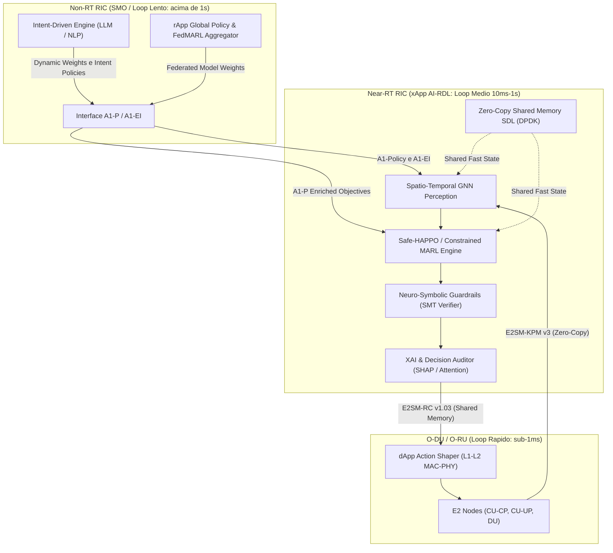
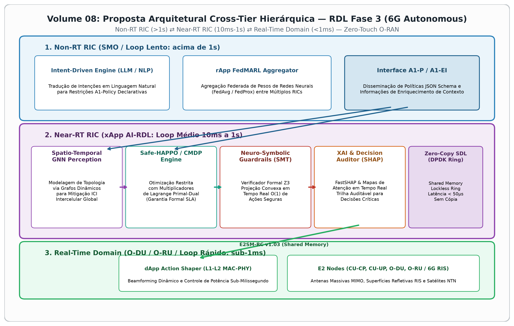
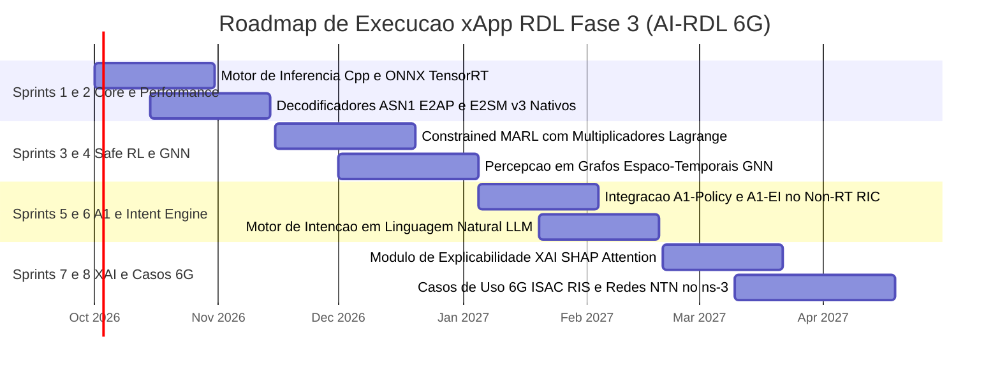
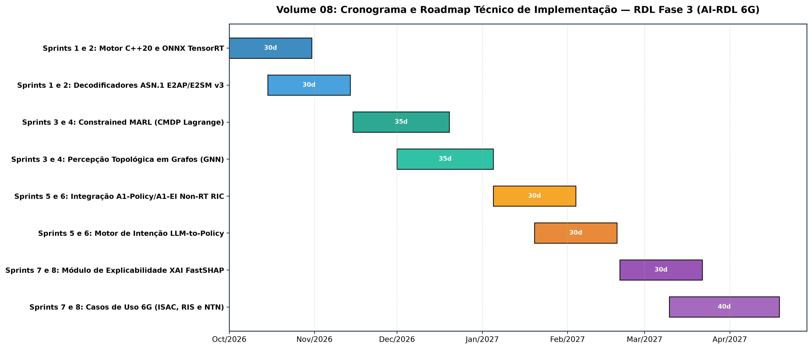

# Volume 08: Proposta Arquitetural e Especificação de Requisitos — RDL Fase 3
## Cognitive, Intent-Driven & Cross-Tier Autonomous Governance (AI-RDL / 6G)

---

## 1. Introdução e Visão Geral

A **xApp RDL Fase 3 (Cognitive, Intent-Driven & Cross-Tier Autonomous RDL)** representa a evolução definitiva da camada de decisão e arbitragem do **Near-RT RIC (O-RAN)** rumo às redes **5G-Advanced (3GPP Rel. 18/19) e 6G**.

Enquanto a Fase 1 (*H-RDL*) introduziu a arbitragem determinística e a Fase 2 (*CA-RDL*) implementou o controle baseado em contexto via MARL (*MAPPO*), a Fase 3 expande o escopo para **governança autônoma de ponta a ponta (Zero-Touch)**, operando em múltiplas escalas temporais e integrando o **Non-RT RIC (rApps)**, o **Near-RT RIC (xApps)** e o **Domínio de Tempo Real (dApps / L1-L2 no O-DU/O-RU)**.

---

## 2. Matriz Comparativa Evolutiva das Fases RDL

| Dimensão Técnica | **Fase 1: H-RDL (Determinística)** | **Fase 2: CA-RDL (Context-Aware MARL)** | **Fase 3: Cognitive AI-RDL (6G Autonomous)** |
| :--- | :--- | :--- | :--- |
| **Paradigma Central** | Heurístico reativo e tabela de prioridades | Aprendizado por Reforço Multiagente (MAPPO) | **Intent-Driven / Neuro-Simbólico / Hierárquico** |
| **Escala de Controle** | Loop único (Near-RT RIC 200ms) | Loop único (Near-RT RIC 10–50ms) | **Cross-Tier Tri-Camada (rApp >1s ⇄ xApp 10ms ⇄ dApp <1ms)** |
| **Garantia de Segurança** | Clipping determinístico de limites | Safety Guards com verificação de limites | **Safe RL (CMDPs / Multiplicadores de Lagrange) + SMT Formal** |
| **Latência de Decisão** | ~14.2 ms | ~8.5 ms | **< 1.0 ms (Compilação C++20 / ONNX TensorRT)** |
| **Interfaces O-RAN** | E2AP preliminar, RMR interno | E2AP v2, E2SM-KPM, E2SM-RC, RMR, REST | **E2AP v3, E2SM-KPM v3, E2SM-RC v1.03, A1-P, A1-EI, Y1, O1/O2** |
| **Explicabilidade (XAI)** | Regras estáticas explícitas | Caixa-preta neural | **SHAP Acelerado, Attention Maps e Trilha de Auditoria em Tempo Real** |
| **Escalabilidade Celular** | Única célula / gNodeB | Topologia de até 5 células sem vizinhança | **Grafo Espaço-Temporal Dinâmico (GNN) para centenas de células** |
| **Cenários Avançados** | Conflitos TVS e EEVS básicos | Fatiamento 5G NR n78 com 3 xApps | **ISAC, RIS (Superfícies Inteligentes), NTN (Satélite LEO) e Fatiamento 6G** |

---

## 3. Pilares Arquiteturais Detalhados da Fase 3

### 3.1. Pilar 1: Coordenação Hierárquica Cross-Tier (rApp ⇄ xApp ⇄ dApp)
1. **Coexistência de Múltiplos Loops de Controle:**
   - **Loop Lento (>1s - Non-RT RIC):** rApps realizam decomposição de intenções de negócio, predição de demanda em larga escala e agregação de pesos federados.
   - **Loop Médio (10ms a 1s - Near-RT RIC):** xApp RDL orquestra a resolução de conflitos entre xApps em execução e calibra políticas locais.
   - **Loop Rápido (<1ms - O-DU / dApp):** *dApps* de camada física/MAC executam alocação de feixes (*Beamforming*) e controle dinâmico de potência em slots de tempo sub-milissegundo, respeitando as restrições impostas pela xApp RDL.
2. **Integração Real com A1-Policy e A1-EI (O-RAN WG2):**
   - Recepção de políticas declarativas padronizadas codificadas em JSON Schema.
   - Ingestão de *Enrichment Information (A1-EI)* como telemetria de tráfego de massa, mobilidade macro e previsões de canal.
3. **Aprendizado Federado Multi-Agente (FedMARL):**
   - Múltiplos Near-RT RICs treinam atores locais e compartilham gradientes criptografados com o Non-RT RIC via agregação federada (*FedAvg / FedProx*), garantindo privacidade e convergência rápida em novos sites.

---

### 3.2. Pilar 2: Modelagem Matemática de Safe RL e Spatio-Temporal GNN

#### A. Formulação de Safe RL via Constrained MDP (CMDP)
Em vez de penalidades estocásticas na função de recompensa, o problema de arbitragem é modelado formalmente como um **Processo de Decisão de Markov Restrito (CMDP)**:

$$\max_{\pi} \mathbb{E}_{\tau \sim \pi} \left[ \sum_{t=0}^{T} \gamma^t R(s_t, \mathbf{a}_t) \right]$$

Sujeito às restrições estritas de SLA e segurança física:
$$C_k(\pi) = \mathbb{E}_{\tau \sim \pi} \left[ \sum_{t=0}^{T} \gamma^t c_k(s_t, \mathbf{a}_t) \right] \le d_k, \quad \forall k \in \{1, \dots, K\}$$

Onde $c_1$ representa a violação de latência URLLC ($> 5\text{ ms}$), $c_2$ a perda de pacotes e $c_3$ o desgaste de potência de transmissão de rádio. A otimização é resolvida em tempo real através do **Método Primal-Dual com Multiplicadores de Lagrange Dinâmicos**:

$$\mathcal{L}(\pi, \boldsymbol{\lambda}) = \mathbb{E}[R(\tau)] - \sum_{k=1}^{K} \lambda_k \left( \mathbb{E}[c_k(\tau)] - d_k \right)$$

#### B. Spatio-Temporal Graph Neural Networks (GNN-MARL)
A topologia de rede é estruturada como um grafo direcionado $\mathcal{G}_t = (\mathcal{V}_t, \mathcal{E}_t)$, onde:
- Cada nó $v_i \in \mathcal{V}_t$ representa uma célula (gNodeB / Setor) ou feixe ativo com vetor de estado local (PRB usage, CQI, SINR, contagem de UEs).
- Cada aresta $e_{ij} \in \mathcal{E}_t$ modela a interferência co-canal ou o fluxo de handovers entre células vizinhas.
- A propagação de mensagens (*Message Passing Neural Networks*) permite que a xApp RDL tome decisões de arbitragem globalmente conscientes de interferência intercelular sem explosão combinatória do espaço de estados.

---

### 3.3. Pilar 3: Redes Orientadas por Intenção (IBN) & IA Neuro-Simbólica
1. **Motor de Tradução LLM-to-Policy (Non-RT RIC):**
   - O operador expressa intenções em linguagem natural (ex: *"Priorize máxima eficiência energética no cluster industrial após às 22h mantendo o SLA de telemetria crítica abaixo de 3ms"*).
   - Um LLM corporativo converte a declaração em restrições A1-Policy e vetores de modulação de recompensa:
     $$\mathbf{w}(t) = \left[ w_{\text{QoS}}(t), w_{\text{EE}}(t), w_{\text{TS}}(t) \right]$$
2. **Escudo de Segurança Neuro-Simbólico (Symbolic Safety Shield):**
   - Verificação em tempo de execução via **Satisfiability Modulo Theories (SMT Solvers - Z3)**.
   - Qualquer ação proposta pela rede neural que viole axiomas de segurança física (ex: desligar todas as portadoras de cobertura essencial) é bloqueada em tempo $O(1)$ por projeção convexa no espaço seguro.

---

### 3.4. Pilar 4: Engenharia de Desempenho e Inferência Sub-Milissegundo (< 1ms)
1. **Pipeline Nativo em C++20 / Rust:**
   - Modelos treinados no PyTorch exportados para grafos compilados **ONNX Runtime** e otimizados com **NVIDIA TensorRT** ou **Intel OpenVINO**.
   - Redução da latência de inferência de **~15 ms (Python)** para **< 800 µs (C++ nativo com instruções AVX-512 / Tensor Cores)**.
2. **Memória Compartilhada Zero-Copy (DPDK / HugePages):**
   - Troca de telemetria e ações entre xApps via anéis de memória compartilhada sem cópia (*Lockless SPSC/MPMC Ring Buffers*), eliminando o overhead de serialização JSON/Protobuf.
3. **Decodificador ASN.1 APER O-RAN Nativo:**
   - Suporte completo às especificações **O-RAN WG3 E2AP v3.0**, **E2SM-KPM v3.0** e **E2SM-RC v1.03** com parsing em tempo real em menos de 100 µs.

---

### 3.5. Pilar 5: Explainable AI (XAI) e Segurança Zero-Trust
1. **Explicabilidade em Tempo Real (Real-Time XAI Engine):**
   - Cálculo acelerado de valores de Shapley (*FastSHAP*) e mapas de atenção multi-cabeça (*Attention Attribution Maps*).
   - Geração de justificativas auditáveis para cada decisão de arbitragem:
     > *"Ação de Traffic Steering mitigada em 35% devido ao risco iminente de sobrecarga no feixe secundário e violação de 1.8ms no SLA URLLC do UE-102."*
2. **Mitigação de xApps Maliciosas ou Descalibradas (Rogue xApp Shield):**
   - Mecanismo de *Zero-Trust Scoring* baseado em detecção de anomalias estatísticas (*Isolation Forests* / *Autoencoders*).
   - Isolamento automático de xApps que emitam comandos erráticos ou ataques de injeção adversariais contra a interface E2.

---

### 3.6. Pilar 6: Gêmeo Digital (Digital Twin) e Cenários Avançados 6G
1. **Casos de Uso 5G-Advanced & 6G:**
   - **ISAC (Integrated Sensing and Communication):** Arbitragem conjunta de recursos de rádio entre radar de sensoriamento ambiental e transmissão de dados de alta velocidade.
   - **RIS (Reconfigurable Intelligent Surfaces):** Otimização da matriz de fase de superfícies reflexivas para desvio dinâmico de obstáculos e redução de zonas cegas.
   - **NTN (Non-Terrestrial Networks):** Handover preditivo e compensação de atraso de propagação em constelações satelitais LEO integradas com gNodeBs terrestres.
2. **Framework de Transferência Sim-to-Real com Domain Randomization:**
   - Treinamento no Gêmeo Digital com variações estocásticas de desvanecimento (*Ray-Tracing*, sombras e interferências extremas) garantindo que a política transfira para a rede física sem necessidade de retreinamento destrutivo em campo.

---

## 4. Cronograma e Roadmap Técnico de Implementação

### Tabela Detalhada de Entregáveis por Sprint

| Fase / Sprint | Período Estimado | Entregáveis Técnicos | Critério de Sucesso |
| :--- | :---: | :--- | :--- |
| **Sprints 1 e 2** *Core & Performance* | Out/2026 – Nov/2026 | • Motor C++20 compilado com ONNX Runtime / TensorRT • Decodificadores nativos ASN.1 APER para E2AP v3.0 e E2SM-KPM/RC v3.0 • Pool de memória compartilhada Zero-Copy DPDK | Latência de inferência **< 1.0 ms** com consumo de memória estável |
| **Sprints 3 e 4** *Safe RL & GNN* | Nov/2026 – Jan/2027 | • Formulação Constrained MARL (CMDP) primal-dual • Módulo de percepção topológica via GNN Espaço-Temporal • Validação em topologia com 100+ células no ns-3 | **0% de violação de SLA** sob variações estocásticas severas |
| **Sprints 5 e 6** *A1 & Intent Engine* | Jan/2027 – Fev/2027 | • Interface REST/gRPC A1-Policy e A1-EI com Non-RT RIC • Tradutor de linguagem natural LLM-to-Policy (JSON Schema) • Escudo neuro-simbólico com SMT Solver (Z3) | Tradução de intenção em tensores de pesos em tempo real |
| **Sprints 7 e 8** *XAI, Zero-Trust & 6G* | Fev/2027 – Abr/2027 | • Auditor de decisões XAI (FastSHAP e Attention Maps) • Módulo de detecção e isolamento de Rogue xApps • Co-simulação de casos 6G (ISAC, RIS e NTN satelital) | Trilha auditável completa de todas as decisões E2-Control |

---

## 5. Conclusão

A **Fase 3 do Projeto RDL** Proposta que irá consolida a liderança tecnológica da arquitetura no estado da arte global de Open RAN, transformando a xApp RDL em uma plataforma unificada de governança cognitiva para redes 5G-Advanced e 6G que alia **autonomia total por intenção**, **segurança formal inviolável**, **explicabilidade operacional** e **tempo de resposta sub-milissegundo**.
