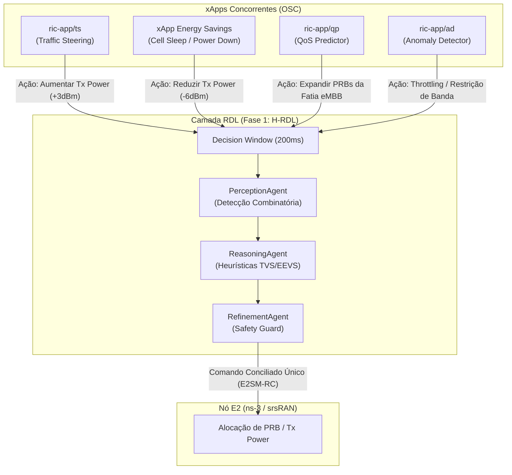

# Cenários de Teste, Integração de xApps OSC e Benchmark Comparativo (Fase 1 vs. Fase 2)

**Documento:** Relatório Experimental e Metodologia de Validação  
**Projeto:** xApp RDL (Resource and Decision Layer)  
**Versão:** 1.1.0 (Baseline Heurístico - H-RDL)  
**Data:** 24/08/2026  

---

## 1. Visão Geral e Hipóteses Científicas

Este documento estabelece o protocolo formal de testes, a integração das xApps de referência da **O-RAN Software Community (OSC)** e as métricas para a validação do **Baseline (Fase 1: H-RDL)**, estruturando os dados para posterior comparação direta com a **Fase 2 (CA-RDL - Context-Aware & MAPPO)**.

### Hipóteses Experimentais:
* **Hipótese Nula ($H_0$ - Fase 1 / H-RDL):** A arbitragem determinística baseada em detecção combinatória em janela temporal de 200 ms, heurísticas multiobjetivo de violação de SLA (TVS/EEVS) e *Safety Guards* é suficiente para eliminar 100% dos conflitos diretos de rádio e reduzir oscilações (*ping-pong*), sem necessidade de aprendizado por reforço.
* **Hipótese Alternativa ($H_1$ - Fase 2 / CA-RDL):** Em cenários de **conflitos indiretos e acoplamento não-linear de canais**, o modelo MARL (MAPPO) alcança um Equilíbrio de Nash superior, maximizando a utilidade global da rede em relação à heurística estática.

---

## 2. Cenários Experimentais de Conflito



---

### Cenário 1: Conflito Direto de Recursos de Rádio e Potência
* **xApps Participantes:** `ric-app/ts` (Traffic Steering) vs. `xApp Energy Saving` (ES).
* **Parâmetro Alvo:** Potência de transmissão (`tx_power_prb`) e alocação de blocos de recursos físicos (`PRB_ALLOCATION`) na célula `gnb_01`.
* **Descrição do Conflito:** 
  1. A xApp de Traffic Steering identifica UEs com alta demanda de vazão e emite uma proposta para **aumentar a potência em +3 dBm** e alocar 80% dos PRBs.
  2. Simultaneamente, a xApp de Energy Saving detecta que o horário comercial encerrou e emite uma proposta para **reduzir a potência em -6 dBm** para economia de energia.
* **Comportamento Esperado na Fase 1 (H-RDL):**
  * O `PerceptionAgent` classifica o evento como `ConflictType.DIRECT_EXCLUSIVE`.
  * O `ReasoningAgent` calcula a métrica **TVS (Throughput Violation Score)** e a **EEVS (Energy Efficiency Violation Score)**.
  * Como a violação de throughput de usuários VIP tem peso prioritário nas regras de negócio, a H-RDL aprova a ação de QoS ou calcula um valor intermediário seguro, descartando a ação conflitante de ES antes de chegar à antena.

---

### Cenário 2: Conflito Indireto em Fatiamento de Rede (Slicing)
* **xApps Participantes:** `ric-app/qp` (QoS Predictor) vs. `ric-app/ad` (Anomaly Detector).
* **Parâmetro Alvo:** Limite de admissão de usuários (`MAX_UE_ADMISSION`) vs. Reserva de Banda (`SLICE_PRB_QUOTA`).
* **Descrição do Conflito:**
  1. A xApp `qp` prediz uma degradação de SLA iminente para a fatia de streaming (eMBB) e solicita reserva de 60% da capacidade total da célula.
  2. A xApp `ad` detecta uma anomalia volumétrica de tráfego vinda dessa mesma fatia e propõe um *rate-limit* rígido de 20% da capacidade.
* **Comportamento Esperado na Fase 1 (H-RDL):**
  * O `PerceptionAgent` identifica o acoplamento cruzado na mesma fatia de rede.
  * O `ReasoningAgent` aplica regras determinísticas de isolamento de segurança e aciona o `RefinementAgent` para evitar esgotamento de recursos da célula.

---

### Cenário 3: Estresse de Mensageria e Latência em Laço Fechado
* **xApps Participantes:** `ric-app/bouncer` (Echo/Stress) + `ric-app/kpimon` (KPI Monitor).
* **Objetivo:** Avaliar a latência de processamento da RDL sob alta taxa de injeção de relatórios KPM e propostas concorrentes.
* **Métrica Avaliada:** Tempo total de resposta do laço E2 ($T_{\text{loop}} = T_{\text{kpm}} + T_{\text{decision}} + T_{\text{rc}} < 250\text{ ms}$).

---

## 3. Como Instalar e Configurar cada xApp da OSC

### 3.1 `ric-app/ts` (Traffic Steering xApp)
A xApp de Traffic Steering da OSC consome previsões de QoS e dispara comandos E2SM-RC.

```bash
cd ~
# 1. Clonar o repositório oficial da OSC
git clone https://gerrit.o-ran-sc.org/r/ric-app/ts

# 2. Build da imagem Docker
cd ts
docker build -t nexus3.o-ran-sc.org:10004/o-ran-sc/ric-app-ts:1.1.0 -f Dockerfile .

# 3. Onboarding no Near-RT RIC
dms_cli onboard init/config-file.json init/schema.json
dms_cli install --xapp-chart-name ts --version 1.1.0 --namespace ricxapp
```

---

### 3.2 `ric-app/qp` (QoS Predictor xApp)
A xApp de predição de qualidade de serviço em Python:

```bash
cd ~
git clone https://gerrit.o-ran-sc.org/r/ric-app/qp
cd qp

# Build e empacotamento
docker build -t nexus3.o-ran-sc.org:10004/o-ran-sc/ric-app-qp:1.1.0 -f Dockerfile .
dms_cli onboard init/config-file.json init/schema.json
dms_cli install --xapp-chart-name qp --version 1.1.0 --namespace ricxapp
```

---

### 3.3 `ric-app/ad` (Anomaly Detector xApp)
xApp de detecção de anomalias em Python:

```bash
cd ~
git clone https://gerrit.o-ran-sc.org/r/ric-app/ad
cd ad

docker build -t nexus3.o-ran-sc.org:10004/o-ran-sc/ric-app-ad:1.1.0 -f Dockerfile .
dms_cli onboard init/config-file.json init/schema.json
dms_cli install --xapp-chart-name ad --version 1.1.0 --namespace ricxapp
```

---

### 3.4 `ric-app/kpimon` (KPI Monitor xApp)
xApp de monitoramento de métricas E2SM-KPM em C++:

```bash
cd ~
git clone https://gerrit.o-ran-sc.org/r/ric-app/kpimon
cd kpimon

docker build -t nexus3.o-ran-sc.org:10004/o-ran-sc/ric-app-kpimon:1.1.0 -f Dockerfile .
dms_cli onboard init/config-file.json init/schema.json
dms_cli install --xapp-chart-name kpimon --version 1.1.0 --namespace ricxapp
```

---

### 3.5 Como Adaptar as xApps OSC para a RDL

Para que as xApps da OSC enviem suas ações para a RDL em vez de enviar diretamente para o E2Term, altera-se o tipo de mensagem RMR de saída:

* **Antes (Direto ao E2Term):** `mtype = 12010` (`RIC_CONTROL_REQ`)
* **Com a RDL:** `mtype = 30000` (`RDL_ACTION_PROPOSAL`) com o payload JSON padronizado no formato:

```json
{
  "xapp_id": "ric-app-ts",
  "node_id": "gnb_01",
  "parameter": "tx_power_prb",
  "value": 23.0,
  "priority": 80
}
```

---

## 4. Roteiro de Execução do Teste de Nível 1 (Baseline H-RDL)

### Passo 1: Inicializar o Ambiente e Dependências
```bash
# 1. Garantir que o Redis/DBAAS esteja operacional
kubectl get pods -n ricplt -l app=ricplt-dbaas

# 2. Iniciar a xApp RDL no namespace ricxapp
cd ~/XApp-RDL-F1
make build
kubectl apply -f deploy/kubernetes/deployment.yaml
kubectl apply -f deploy/kubernetes/service.yaml
```

### Passo 2: Injetar a Carga de Conflito Sintético (Harness de Teste)
Execute o gerador de eventos concorrentes simulando as propostas de `ric-app/ts` e `Energy Saving`:

```bash
# Executar a bateria de testes automatizados com pytest
PYTHONPATH=. pytest tests/ -v -k "test_batching or test_reasoning"
```

### Passo 3: Executar a Coleta Automatizada de Evidências
```bash
# Disparar o script de coleta do experimento
./scripts/collect_evidence.sh EXPERIMENTO_H0_BASELINE
```

---

## 5. Matriz de KPIs para Comparação com a Fase 2 (CA-RDL)

Ao concluir as baterias de testes da Fase 1, registre os dados nesta tabela para confrontar diretamente com a Fase 2:

| Indicador / KPI | Métrica / Definição | Meta Fase 1 (H-RDL) | Meta Fase 2 (CA-RDL / MAPPO) |
| :--- | :--- | :---: | :---: |
| **Taxa de Conflitos Mitigados** | $\frac{\text{Conflitos Resolvidos}}{\text{Conflitos Detectados}} \times 100$ | **100%** (em conflitos diretos) | **100%** (diretos e indiretos) |
| **Tempo de Decisão Médio** | Latência interna de arbitragem | **$< 15\text{ ms}$** | **$< 35\text{ ms}$** (inferência de rede neural) |
| **Estabilidade de Rádio (Ping-Pong)** | Alternâncias de parâmetro em $< 1\text{ s}$ | **0 oscilações** | **0 oscilações** |
| **Taxa de Violação de SLA (TVS)** | $\sum \max(0, \text{SLA}_{\text{req}} - \text{Thp}_{\text{real}})$ | Baseline de Referência ($H_0$) | **Redução de $\ge 25\%$ vs. $H_0$** |
| **Eficiência Energética (EEVS)** | Relação $\text{Throughput (Mbps)} / \text{Potência (W)}$ | Baseline de Referência ($H_0$) | **Ganho de $\ge 15\%$ vs. $H_0$** |
| **Taxa de Bloqueio por Safety Guard** | Ações reprovadas por limites físicos | **$< 1\%$** | **$< 0.1\%$** |

---

## 6. Próximos Passos para a Fase 2

1. Concluir e salvar os relatórios em PDF/CSV gerados pelo script `scripts/export_pdf.py` para a **Fase 1**.
2. No diretório clonado `XApp-RDL-F2`, instalar os pacotes de aprendizado de máquina (`pip install -r requirements-ml.txt`).
3. Treinar os agentes MAPPO (`src/agents/marl/mappo_agent.py`) utilizando os dados históricos coletados na Fase 1 como *Experience Replay*.
4. Executar os mesmos 3 cenários experimentais e gerar os gráficos comparativos de convergência de Pareto e Equilíbrio de Nash.
