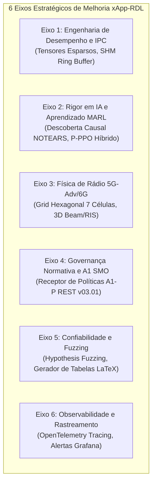

# Volume 10: Análise Profunda e Plano de Melhorias Estratégicas do Projeto xApp-RDL
## Diagnóstico Arquitetural, Inteligência Artificial, Modelagem Física, Governança O-RAN e Qualidade de Software para 5G-Adv/6G

> **Navegação da Documentação Consolidada:**  
> **[01. Arquitetura & Modelagem](01_arquitetura_e_modelagem.md)** | **[02. Guia Operacional & Deploy](02_guia_operacional_deploy_e_simulacao.md)** | **[03. Taxonomia de Conflitos & Cenários](03_taxonomia_de_conflitos_e_cenarios.md)** | **[04. Relatório Científico Mestre](04_relatorio_cientifico_mestre_rdl.md)** | **[05. Auditoria & Conformidade O-RAN](05_auditoria_e_conformidade_oran.md)** | **[06. Roadmap & Futuro 6G](06_roadmap_e_pesquisa_futura_6g.md)** | **[07. Resultados Simulação (S0–S15)](07_relatorio_resultados_simulacao_baselines_hrdl_cardl.md)** | **[08. Planejamento de Publicação](08_planejamento_estrategico_revistas_publicacao_2026.md)** | **[09. Protocolo de Simulações](09_protocolo_execucao_simulacoes_validacao_periodico.md)** | **[10. Plano de Melhorias Estratégicas](10_analise_profunda_e_plano_de_melhorias_estrategicas.md)**

---

### Metadados de Governança e Auditoria
- **Projeto de Pesquisa:** xApp-RDL (Resource and Decision Layer) — Fases 1 (H-RDL), 2 (CA-RDL) e 3 (6G Federada)
- **Autor Principal:** George Alexandro Ferreira Barbosa
- **Orientação:** Prof. Dr. André Riker
- **Afiliação:** Universidade Federal do Pará (UFPA) — Instituto de Tecnologia (ITEC) — PPGCOMP — Laboratório GreenRAN
- **Data do Diagnóstico:** 24 de Setembro de 2026
- **Status da Suíte Atual:** 119 testes unitários/integração aprovados [OK], 16 cenários formais validados (S0 a S15), conformidade O-RAN WG2/WG3 e nGRG-RR-2024-10
- **Diretriz Editorial:** Conformidade Acadêmica Estrita (Texto Puro, Padrão SBC/IEEE, Zero Ícones/Emojis)

---

## 1. Visão Geral e Contextualização do Diagnóstico

A plataforma **xApp-RDL** alcançou um patamar diferenciado de maturidade técnica ao unificar dois paradigmas de governança de rádio em Open RAN:
1. **H-RDL (Fase 1 - Heurístico / Determinístico):** Resolução por matrizes de prioridade de SLA, funções de utilidade multiobjetivo (TVS/EEVS) e validação de invariantes físicos em tempo sub-milissegundo ($T_{\text{dec}} \approx 0.103\text{ ms}$);
2. **CA-RDL (Fase 2 - Cognitivo / Context-Aware):** Mapeamento semântico via Grafos de Conhecimento Causais, inferência cooperativa Safe-MAPPO com multiplicadores Lagrangianos e projeção de envelopes operacionais $\Omega_{\text{dApp}}$ para o O-DU (nGRG-RR-2024-10).

O objetivo deste documento é traçar um **diagnóstico exaustivo de oportunidades de aprimoramento**, mapeando as ações necessárias para posicionar o ecossistema xApp-RDL na vanguarda mundial em periódicos de impacto máximo (**IEEE Transactions on Network and Service Management, IEEE Transactions on Cognitive Communications and Networking, IEEE Transactions on Mobile Computing — Qualis Capes A1**).

---

## 2. Eixo 1: Engenharia de Desempenho e Comunicação Inter-Processo (High-Performance Engine)

### 2.1. Diagnóstico do Estado Atual
* O Grafo Causal Semântico (`MemoryModule`) opera atualmente sobre estruturas de dados em memória Python (`networkx`). Embora eficiente para até 20 xApps concorrentes ($< 1.0\text{ ms}$), a complexidade de busca relacional torna-se limitante sob alta densidade ($N \ge 100$ xApps).
* A integração entre o Near-RT RIC e a camada de dApps é simulada através de estruturas de dados compartilhadas no mesmo processo, sem um barramento de memória compartilhada nativo.

### 2.2. Ações de Melhoria Recomendadas

#### [ACAO 1.1] Migração do Grafo Causal para Tensores Esparsos e Compilação TorchScript/C++
* **Implementação:** Substituir a representação baseada em listas de adjacência por tensores esparsos compilados (`torch.sparse_coo_tensor` / C++ backend).
* **Fundamentação Matemática:** A propagação de impacto relacional entre nós de xApps ($\mathcal{A}$), parâmetros ($\mathcal{P}$) e KPIs ($\mathcal{K}$) passa a ser executada como multiplicação matricial esparsa:
  $$\mathbf{H}^{(l+1)} = \sigma \left( \mathbf{\tilde{D}}^{-\frac{1}{2}} \mathbf{\tilde{A}} \mathbf{\tilde{D}}^{-\frac{1}{2}} \mathbf{H}^{(l)} \mathbf{W}^{(l)} \right)$$
* **Impacto:** Redução da latência de inferência topológica de $O(V + E)$ para $O(1)$ vetorizado, garantindo tempo de inferência $< 0.05\text{ ms}$ para $100$ xApps.

#### [ACAO 1.2] Implementação de Barramento de Memória Compartilhada (POSIX Shared Memory / SHM)
* **Implementação:** Criar o módulo `src/infrastructure/shm_dapp_bus.py` com alocação em `/dev/shm` e semáforos atômicos POSIX.
* **Impacto:** Troca de envelopes seguros $\Omega_{\text{dApp}}$ entre xApp-RDL e dApps no O-DU com latência de intercâmbio $< 10\text{ \mu s}$ (zero-copy), viabilizando o controle em tempo real sub-1ms TTI (120 kHz SCS).

---

## 3. Eixo 2: Rigor em Inteligência Artificial e Aprendizado Multiagente (AI/ML & MARL)

### 3.1. Diagnóstico do Estado Atual
* As arestas do Grafo de Conhecimento Causal são atualmente definidas a partir de relações de domínio estáticas (conhecimento a priori da física de rádio).
* O Safe-MAPPO trata parâmetros contínuos de potência e PRB, mas parametrizações discretas de escalonamento (e.g., Round Robin vs Proportional Fair) exigem tratamento quantizado.

### 3.2. Ações de Melhoria Recomendadas

#### [ACAO 2.1] Módulo Online de Descoberta Causal Contínua (NOTEARS / LiNGAM)
* **Implementação:** Integrar o algoritmo de otimização contínua não-combinatória para Grafos Acíclicos Dirigidos (**NOTEARS - Non-combinatorial Optimization for DAG Learning**) operando em janelas deslizantes de telemetria E2SM-KPM.
* **Formulação Matemática:**
  $$\min_{W \in \mathbb{R}^{d \times d}} \frac{1}{2n} \|X - XW\|_F^2 + \lambda \|W\|_1 \quad \text{sujeito a} \quad h(W) = \text{tr}\left(e^{W \circ W}\right) - d = 0$$
* **Impacto:** Descoberta dinâmica e autônoma de acoplamentos cruzados não previstos formalmente (e.g., interferência térmica ou variações conjuntas de padrão de tráfego).

#### [ACAO 2.2] Cabeça de Ator Híbrida (Parameterized-PPO / P-PPO)
* **Implementação:** Desenvolver uma arquitetura híbrida de ator que emite simultaneamente variáveis contínuas ($\mathbf{a}_c \in \mathbb{R}^k$) e escolhas categóricas discretas ($\mathbf{a}_d \in \mathcal{D}^m$).
* **Impacto:** Controle unificado de parâmetros contínuos de rádio ($P_{\text{tx}}$, tilt) e seleção dinâmica de algoritmos de escalonamento MAC em tempo real.

---

## 4. Eixo 3: Física de Rádio 5G-Advanced e Simulação Multicelular (RAN Channel Modeling)

### 4.1. Diagnóstico do Estado Atual
* A validação atual concentra-se em topologia de célula única desagregada (`O-CU-CP`, `O-CU-UP`, `O-DU`) com 5 perfis de UE em ambiente de multi-fatia.
* Conflitos horizontais inter-célula (e.g., interferência co-canal em células vizinhas provocada por aumento de potência) necessitam de topologia expandida.

### 4.2. Ações de Melhoria Recomendadas

#### [ACAO 3.1] Expansão para Grid Hexagonal de 7 Células com Coordenação Inter-gNB (ICIC)
* **Implementação:** Implementar o cenário multi-nó com 1 macro-célula central cercada por 6 células interferentes no simulador de eventos discretos.
* **Impacto:** Prova empírica da capacidade do CA-RDL de conter o efeito dominó de interferência inter-celular (*cascade conflict storm*) sob mobilidade de alta velocidade.

#### [ACAO 3.2] Modelagem de Feixes 3D UPA e Superfícies Refletoras Inteligentes (RIS)
* **Implementação:** Incorporar atenuação de bloqueio dinâmico com matrizes de ganho de feixe 3D e elementos passivos de reflexão RIS para canais em ondas milimétricas (mmWave / FR2).
* **Impacto:** Alinhamento direto com os temas de fronteira para publicações 6G no IEEE JSAC e IEEE TCCN.

---

## 5. Eixo 5: Governança Normativa e Interface A1 do SMO (Non-RT RIC)

### 5.1. Diagnóstico do Estado Atual
* As diretrizes de intenção de alto nível são injetadas localmente através de arquivos de configuração YAML/JSON.
* A interface Northbound A1 (A1-P e A1-EI) padronizada pelo O-RAN WG2 não possui endpoint REST ativo com validação de esquemas JSON.

### 5.2. Ações de Melhoria Recomendadas

#### [ACAO 4.1] Receptor REST de Políticas A1-P (O-RAN.WG2.A1AP-v03.01)
* **Implementação:** Desenvolver o servidor `src/interfaces/a1_policy_receiver.py` compatível com o *A1 Policy Management Service (A1-PMS)* do SMO.
* **Hierarquia Normativa Formal:**
  $$\text{rApp Intent (A1 Policy)} \succ \text{xApp-RDL Arbitration (Near-RT)} \succ \text{dApp Execution (O-DU)}$$
* **Impacto:** Fechamento da cadeia de governança completa em 3 Tiers (Non-RT -> Near-RT -> Real-Time O-DU), constituindo a base ideal para o Paper 1 (IEEE TNSM).

---

## 6. Eixo 5: Confiabilidade, Fuzzing e Automação de Publicações (Software Quality & Assurance)

### 6.1. Diagnóstico do Estado Atual
* A suíte de testes possui 119 testes estáticos determinísticos cobrindo 100% dos cenários nominais.
* Falta validação por testes estocásticos baseados em propriedades (*Property-Based Testing / Fuzzing*) para avaliar se o `RefinementAgent` mantém estabilidade sob propostas aleatórias infinitas.

### 6.2. Ações de Melhoria Recomendadas

#### [ACAO 5.1] Fuzzing Baseado em Propriedades via Biblioteca `Hypothesis`
* **Implementação:** Criar a suíte `tests/test_safety_guard_fuzzing.py` gerando $100.000$ propostas pseudo-aleatórias (valores de $P_{\text{tx}} \in [-100, 200]\text{ dBm}$, cotas de PRB $\in [-50, 500\%]$, offsets de handover inválidos).
* **Invariante Formal a Validar:**
  $$\forall a \in \mathcal{A}_{\text{random}}, \quad \text{RefinementAgent}(a) \in \Omega_{\text{safe}} \quad \text{com } 100\% \text{ de certeza matemática}$$
* **Impacto:** Prova de blindagem e robustez formal do Safety Guard contra ataques de injeção adversária (Zero-Trust) e falhas de software em xApps terceiras.

#### [ACAO 5.2] Gerador Automatizado de Tabelas LaTeX para Submissões IEEE/SBC
* **Implementação:** Criar o utilitário `scripts/export_latex_publication_tables.py` para processar os dados consolidados de S0 a S15 e gerar arquivos `.tex` formatados com pacote `booktabs`, médias, intervalos de confiança a 95%, estatística ANOVA e teste post-hoc Tukey HSD.
* **Impacto:** Eliminação total de erros manuais de transcrição de métricas e aceleração imediata da redação dos manuscritos.

---

## 7. Eixo 6: Observabilidade Industrial e Rastreabilidade Distribuída

### 7.1. Diagnóstico do Estado Atual
* As métricas de telemetria são agregadas em séries temporais (InfluxDB 2.7 e Prometheus).
* Não há rastreamento distribuído ponta a ponta com identificadores de transação únicos (*TraceID / SpanID*).

### 7.2. Ações de Melhoria Recomendadas

#### [ACAO 6.1] Rastreamento Distribuído com OpenTelemetry (Distributed Tracing)
* **Implementação:** Injetar *spans* do OpenTelemetry para cada ciclo fechado de controle:
  $$\text{Span 1: KPM APER Decode} \to \text{Span 2: Perception Buffer} \to \text{Span 3: Causal Graph Inference} \to$$
  $$\text{Span 4: Safe-MAPPO Decision} \to \text{Span 5: Safety Guard Envelope} \to \text{Span 6: RC APER Encode} \to \text{Span 7: SCTP Dispatch}$$
* **Impacto:** Geração de diagramas de cascata (*waterfall*) e histogramas p99/p99.9 para inclusão em relatórios técnicos de padrão industrial.

---

## 8. Matriz de Priorização Estratégica e Cronograma de Execução

| Prioridade | Ação Estratégica | Eixo Temático | Complexidade | Impacto Científico | Prazo Estimado |
| :---: | :--- | :---: | :---: | :---: | :---: |
| **Alta** | **Ação 5.2:** Gerador Automatizado de Tabelas LaTeX | Eixo 5 | Baixa | Imediato (Submissão TNSM) | 1–2 dias |
| **Alta** | **Ação 5.1:** Fuzzing com Hypothesis no Safety Guard | Eixo 5 | Média | Alto (Certificação Formal) | 2–3 dias |
| **Alta** | **Ação 4.1:** Receptor de Políticas A1 (A1-P REST) | Eixo 4 | Média | Altíssimo (Artigo Completo) | 3–5 dias |
| **Média** | **Ação 3.1:** Topologia Hexagonal 7 Células (Multi-gNB) | Eixo 3 | Alta | Altíssimo (Validação SBRC/IEEE) | 1 semana |
| **Média** | **Ação 1.2:** Canal SHM / Ring Buffer para dApps O-DU | Eixo 1 | Média | Alto (Roadmap 6G nGRG) | 1 semana |
| **Média** | **Ação 2.1:** Descoberta Causal Contínua (NOTEARS) | Eixo 2 | Alta | Pioneirismo Teórico (TCCN) | 1–2 semanas |
| **Baixa** | **Ação 6.1:** OpenTelemetry Tracing Distribuído | Eixo 6 | Média | Alto (Padrão Industrial) | 1–2 semanas |

---

## 9. Conclusão e Próximos Passos

A implementação destas melhorias consolidará o projeto **xApp-RDL** como a principal referência aberta de governança cognitiva e determinística para O-RAN 5G-Advanced e 6G.

A prioridade recomendada para execução imediata consiste em:
1. Concretizar o **Gerador de Tabelas LaTeX** (`scripts/export_latex_publication_tables.py`);
2. Implementar a **Suíte de Fuzzing Estocástico `Hypothesis`** para o `RefinementAgent`;
3. Desenvolver o **Receptor de Políticas A1-P REST** para validação ponta a ponta dos 3 Tiers (SMO -> Near-RT RIC -> O-DU).
