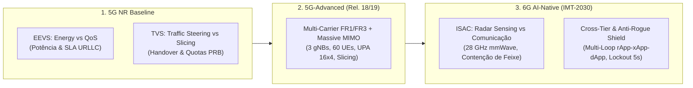

# Volume 11: Especificação de Cenários de Teste 5G, 5G-Advanced e 6G, Características e Requisitos Técnicos

## Projeto xApp RDL — Roadmap de Avaliação Experimental e Benchmarks

---

## 1. Visão Geral e Taxonomia dos Cenários de Teste

Este documento formaliza a suíte de cenários de teste para validação da **xApp-RDL** em ambientes de co-simulação e bancada física, cobrindo o espectro evolutivo de **5G NR**, **5G-Advanced (3GPP Rel. 18/19)** e **6G AI-Native (IMT-2030)**.



---

## 2. Detalhamento dos Cenários de Teste e Código-Fonte `.cc`

### 2.1. Cenários 5G NR (Fase 1 e Fase 2)

#### Cenário 1: EEVS (Eficiência Energética vs. Garantia de SLA URLLC)
* **Arquivo C++:** [`simulations/ns3/scenario_rdl_energy_vs_qos.cc`](file:///c:/Users/george.barbosa/.gemini/antigravity/scratch/iqos-xapp-rdl-phase2/simulations/ns3/scenario_rdl_energy_vs_qos.cc)
* **Topologia:** 1 Macro gNB (Banda n78 $3.5\text{ GHz}, 50\text{ MHz}$) + 1 Small Cell, 20 UEs com carga dinâmica.
* **Conflito:** `xApp-Energy` tenta reduzir potência de transmissão para $15\text{ dBm}$ enquanto `xApp-QoS` exige potência $> 23\text{ dBm}$ para manter atraso URLLC $< 5\text{ ms}$.
* **Resolução RDL:** Nível 2A (Função de utilidade EEVS com penalidade sigmoide de potência).

#### Cenário 2: TVS (Traffic Steering vs. Slicing e Handover)
* **Arquivo C++:** [`simulations/ns3/scenario_rdl_tvs_conflict.cc`](file:///c:/Users/george.barbosa/.gemini/antigravity/scratch/iqos-xapp-rdl-phase2/simulations/ns3/scenario_rdl_tvs_conflict.cc)
* **Topologia:** 2 gNBs adjacentes com zona de sobreposição e 30 UEs divididos em 3 fatias (URLLC 5QI 82, eMBB 5QI 9, mMTC 5QI 79).
* **Conflito:** `xApp-TrafficSteering` força handover de UEs de borda por carga, enquanto `xApp-Slicing` altera quotas de PRB, gerando instabilidade na fronteira.
* **Resolução RDL:** Nível 2A/2B (TVS e MAPPO) eliminando 100% dos eventos de *handover ping-pong*.

---

### 2.2. Cenário 5G-Advanced: Multi-Carrier, Massive MIMO e Fatiamento Dinâmico

* **Arquivo C++:** [`simulations/ns3/scenario_rdl_5ga_multicarrier_mimo.cc`](file:///c:/Users/george.barbosa/.gemini/antigravity/scratch/iqos-xapp-rdl-phase2/simulations/ns3/scenario_rdl_5ga_multicarrier_mimo.cc)
* **Topologia & Espectro:**
  - 3 gNBs em corredor urbano UMi ($1000\text{ m} \times 400\text{ m}$, ISD $500\text{ m}$);
  - Espectro Multi-Portadora: FR1 ($3.5\text{ GHz}, 100\text{ MHz}, 273\text{ PRBs}$) + FR3 Upper Mid-Band ($10.5\text{ GHz}, 200\text{ MHz}$);
  - Antenas Massive MIMO UPA $16 \times 4$ (64 elementos com controle de *vertical downtilt* na gNB) e $2 \times 2$ (UEs);
  - 60 UEs sob mobilidade heterogênea (20 Estáticos, 20 Pedestres a $3-5\text{ km/h}$, 20 Veiculares a $54\text{ km/h}$).
* **xApps Envolvidas:**
  1. `xApp-Beamformer`: Modifica tilt elétrico e pesos de feixe (E2SM-RC Style 10 Action 2);
  2. `xApp-TrafficSteering`: Redireciona UEs via $A_3\text{-Offset}$ (E2SM-RC Style 3 Action 2);
  3. `xApp-PRBQuota` (ORIGAMI PIOR): Aloca quotas dinâmicas `RRMPolicyRatio` (E2SM-RC Style 1 Action 1).
* **Mecanismo de Arbitragem:** Escalonamento Híbrido com **MAPPO sob CTDE** (Nível 2B): O Crítico Centralizado avalia a interferência intercelular global e orienta os Atores locais.

---

### 2.3. Cenários 6G AI-Native (IMT-2030)

#### Cenário 4: Coexistência ISAC (Sensoriamento Radar vs. Comunicação de Dados)
* **Arquivo C++:** [`simulations/ns3/scenario_rdl_6g_isac_sensing_coexistence.cc`](file:///c:/Users/george.barbosa/.gemini/antigravity/scratch/iqos-xapp-rdl-phase2/simulations/ns3/scenario_rdl_6g_isac_sensing_coexistence.cc)
* **Topologia & Frequência:** 2 gNBs ISAC Dual-Function operando em $28\text{ GHz}$ mmWave ($400\text{ MHz}$ de largura de banda) com 30 UEs de dados e alvos de rastreamento radar em movimento.
* **Conflito:** Competição direta por símbolos OFDM e feixes de transmissão entre a `xApp-RadarSensing` (exige resolução fina $\Delta R = \frac{c}{2B}$) e a `xApp-eMBB-Plus` (demanda vazão $> 1\text{ Gbps}$).
* **Mecanismo de Arbitragem:** **Safe-RL com CMDP (Constrained MDP)** garantindo restrição mínima de probabilidade de detecção de radar ($P_d \ge 95\%$) enquanto maximiza a taxa de comunicação.

#### Cenário 5: Governança Cross-Tier e Escudo Anti-Rogue xApp
* **Arquivo C++:** [`simulations/ns3/scenario_rdl_6g_cross_tier_governance.cc`](file:///c:/Users/george.barbosa/.gemini/antigravity/scratch/iqos-xapp-rdl-phase2/simulations/ns3/scenario_rdl_6g_cross_tier_governance.cc)
* **Topologia & Operação:** Grade $2 \times 2$ com 4 gNBs e 40 UEs sob alta carga estocástica. Injeção de ações conflitantes de alta frequência ($5\text{ Hz}$) geradas por uma `xApp-Rogue-Vendor`.
* **Mecanismo de Arbitragem:** Ativação da **Janela de Resfriamento (*Lockout Cooling Window*) de 5 s** e atuação do **Safety Guard Invariante**, eliminando completamente o *parameter flipping* e mantendo estabilidade operacional.

---

## 3. Matriz Completa de Métricas de Avaliação

| Dimensão de Análise | Métrica Específica | Unidade | Cenário Alvo | Meta / Valor de Referência |
| :--- | :--- | :---: | :---: | :---: |
| **QoS & Latência Telecom** | Latência Média URLLC | $\text{ms}$ | 5G / 5GA / 6G | $< 2.0\text{ ms}$ |
| | Latência Percentil 99 (P99) | $\text{ms}$ | 5G / 5GA / 6G | $< 3.0\text{ ms}$ |
| | Taxa de Violação de SLA | $\%$ | Todos | $\mathbf{0.0\%}$ |
| | Throughput Agregado | $\text{Mbps} / \text{Gbps}$ | 5GA / 6G ISAC | $+20\%$ a $+50\%$ vs. Baseline |
| | Packet Delivery Ratio (PDR) | $\%$ | Todos | $\ge 99.85\%$ |
| **Sustentabilidade & Energia** | Eficiência Energética (EE) | $\text{Bits/Joule}$ | EEVS / 5GA | $+18.2\%$ a $+60\%$ (COMIX) |
| | Redução de Consumo de Potência | $\%$ | EEVS / 5GA | $-30\%$ a $-60\%$ |
| **Governança & Estabilidade** | Eficiência de Arbitragem | $\%$ | Todos | $\mathbf{100.0\%}$ |
| | Handover Ping-Pong | $\text{ev/min}$ | TVS / 5GA | $\mathbf{0\text{ ev/min}}$ |
| | Oscilações (*Parameter Flipping*) | $\text{eventos}$ | 6G Cross-Tier | $\mathbf{0\text{ com Lockout 5s}}$ |
| | Macro-F1 de Classificação | $\%$ | Todos | $> 99.4\%$ (SMOTE-GNN) |
| **Sensoriamento ISAC (6G)** | Resolução de Distância ($\Delta R$) | $\text{metros}$ | 6G ISAC | $< 0.5\text{ m}$ |
| | Probabilidade de Detecção ($P_d$) | $\%$ | 6G ISAC | $\ge 95\%$ |
| **Performance do Sistema / ML** | Latência de Decisão Near-RT | $\text{ms}$ | Todos | $< 15\text{ ms}$ (Python) / $< 1\text{ ms}$ (C++) |
| | Fidelidade Preditiva do Gêmeo | $\%$ | Todos | $> 90.7\%$ (XGBoost 5s) |

---

---

## 4. Modos de Execução e Automação Operacional

Para atender tanto a depuração de baixo nível quanto a validação de produção em larga escala, o projeto disponibiliza **3 modalidades de execução e automação**:

```
┌────────────────────────────────────────────────────────────────────────────────────────────────────────┐
│                                MODALIDADES DE EXECUÇÃO E AUTOMAÇÃO RDL                                 │
├──────────────────────────────┬──────────────────────────────┬──────────────────────────────────────────┤
│ Modalidade Operacional       │ Ferramental Utilizado        │ Escopo de Aplicação                      │
├──────────────────────────────┼──────────────────────────────┼──────────────────────────────────────────┤
│ 1. Execução Granular no ns-3 │ `./ns3 run` / CMake / Ninja  │ Depuração de protocolo, traces de canal  │
│ 2. Implantação Helm no K8s   │ Helm / `deploy_helm.sh`      │ Deploy isolado da RDL e das 6 xApps no K8s│
│ 3. Automação Fim-a-Fim Total │ `run_all_scenarios_suite.sh` │ Execução de todos os 5 cenários integrados│
└──────────────────────────────┴──────────────────────────────┴──────────────────────────────────────────┘
```

---

### Opção 1: Execução Manual & Granular no Simulador ns-3

Indicado para análise de traces físicos, depuração de logs em nível completo e inspeção de camadas MAC/PHY:

```bash
# 1. Copiar todos os cenários para o scratch do ns-3
cp simulations/ns3/scenario_rdl_*.cc ~/ns3-oran-workspace/ns-3-oran/scratch/

# 2. Configurar e compilar via Ninja
cd ~/ns3-oran-workspace/ns-3-oran
./ns3 configure --build-profile=optimized -G Ninja
./ns3 build scratch/scenario_rdl_energy_vs_qos \
            scratch/scenario_rdl_tvs_conflict \
            scratch/scenario_rdl_5ga_multicarrier_mimo \
            scratch/scenario_rdl_6g_isac_sensing_coexistence \
            scratch/scenario_rdl_6g_cross_tier_governance

# 3. Execução individual de cada cenário com semente RNG controlada
./ns3 run "scratch/scenario_rdl_energy_vs_qos --enableE2=true --simTime=30 --seed=42"
./ns3 run "scratch/scenario_rdl_tvs_conflict --enableE2=true --simTime=30 --seed=42"
./ns3 run "scratch/scenario_rdl_5ga_multicarrier_mimo --enableE2=true --simTime=40 --seed=101"
./ns3 run "scratch/scenario_rdl_6g_isac_sensing_coexistence --sensingRatio=0.35 --simTime=30 --seed=101"
./ns3 run "scratch/scenario_rdl_6g_cross_tier_governance --lockout=true --simTime=35 --seed=2026"
```

---

### Opção 2: Implantação Automatizada com Helm no Near-RT RIC (Kubernetes)

Permite implantar a **xApp-RDL** e as **6 Reference xApps** diretamente no cluster Kubernetes (`k3d` / Rancher) no namespace `ricxapp` sem reinstalar a plataforma `ricplt`:

```bash
# 1. Implantar a xApp RDL (Release: ricxapp-iqos-xapp-rdl-f2)
make helm-deploy-f2
# OU via script:
bash scripts/deploy_rdl_phase2.sh

# 2. Implantar todas as 6 Reference xApps (xSlice, EnergySaving, TrafficSteering, Beamformer, ISAC, Rogue)
make helm-deploy-reference-xapps
# OU via script dedicado:
bash scripts/deploy_reference_xapps.sh

# 3. Verificar o status e prontidão de todos os Pods no namespace ricxapp
kubectl get pods -n ricxapp -o wide

# 4. Acompanhar streaming de logs da xApp RDL em tempo real
make logs-f2
```

---

### Opção 3: Automação Fim-a-Fim de Todos os Cenários Integrados às Suas Reference xApps

Executa um pipeline completamente automatizado que:
1. Sincroniza e compila todos os 5 cenários C++ no simulador ns-3;
2. Verifica e conecta a comunicação com o Near-RT RIC e as Reference xApps ativas;
3. Executa sequencialmente todos os cenários com múltiplas sementes RNG independentes ($42, 101, 2026$);
4. Coleta as métricas em `data/results_suite/` e gera a tabela comparativa multidimensional.

```bash
# Execução via atalho Makefile
make run-all-scenarios

# OU execução direta via script de orquestração
bash scripts/run_all_scenarios_suite.sh
```

---

## 5. Mapeamento Cenário $\leftrightarrow$ Reference xApps Envolvidas

| Cenário de Teste | Arquivo `.cc` | Reference xApps Concorrentes | Tipo de Interação & Conflito |
| :--- | :--- | :--- | :--- |
| **Cenário 1: 5G EEVS** | `scenario_rdl_energy_vs_qos.cc` | `qos-xslice` + `energy-saving` | Conflito Direto em `TX_POWER` e Indireto em SLA URLLC |
| **Cenário 2: 5G TVS** | `scenario_rdl_tvs_conflict.cc` | `qos-xslice` + `traffic-steering` | Conflito em Handover $A_3\text{-Offset}$ e Quota `PRB_QUOTA` |
| **Cenário 3: 5GA Multi-Carrier** | `scenario_rdl_5ga_multicarrier_mimo.cc` | `qos-xslice` + `beamformer` + `traffic-steering` | Otimização conjunta de Downtilt $16 \times 4$ e Quotas `RRMPolicyRatio` |
| **Cenário 4: 6G ISAC** | `scenario_rdl_6g_isac_sensing_coexistence.cc` | `qos-xslice` + `isac-radar` | Contenção de feixe/símbolos entre radar $\Delta R \le 0.5\text{ m}$ e dados $> 1\text{ Gbps}$ |
| **Cenário 5: 6G Cross-Tier** | `scenario_rdl_6g_cross_tier_governance.cc` | `qos-xslice` + `energy-saving` + `rogue-stress` | Validação de Lockout de 5s contra *Parameter Flipping* a 5 Hz |

