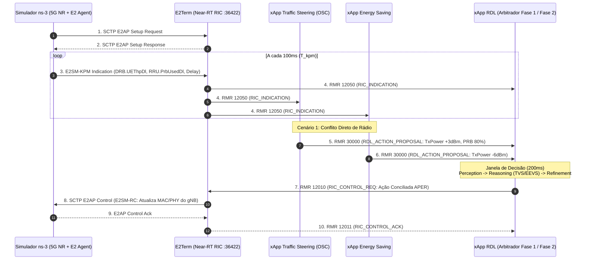

# Guia Passo a Passo: Construção do Cenário ns-3 O-RAN para Benchmark (Fase 1 vs. Fase 2)

**Documento:** Tutorial de Implementação e Execução Experimental  
**Projeto:** xApp RDL (Resource and Decision Layer)  
**Referência:** [docs/09_cenarios_de_teste_e_benchmark_fase1_fase2.md](file:///c:/Users/george.barbosa/.gemini/antigravity/scratch/iqos-xapp-rdl-phase1/docs/09_cenarios_de_teste_e_benchmark_fase1_fase2.md)  
**Data:** 25/08/2026  

---

## 1. Visão Geral e Arquitetura de Integração

Este guia descreve detalhadamente como construir, configurar e executar a simulação da rede de acesso via rádio 5G NR no **ns-3 (ns-O-RAN)** para validar os três cenários de conflito e benchmarking comparativo entre a **Fase 1 (H-RDL Heurística)** e a **Fase 2 (CA-RDL / MAPPO)**.

### Fluxo de Comunicação E2E (ns-3 <-> Near-RT RIC <-> xApps):



---

## 2. Instalação e Preparação do Ambiente ns-O-RAN

### 2.1. Instalar Dependências do Sistema (Host Ubuntu)
```bash
sudo apt update
sudo apt install -y g++ python3 cmake ninja-build git libsctp-dev lksctp-tools tcpdump libpcap-dev
```

### 2.2. Clonar e Compilar o `ns-O-RAN`
```bash
cd ~
# 1. Clonar o repositório ns-O-RAN com suporte a 5G NR e E2Sim
git clone https://github.com/wines-lab/ns-o-ran.git ns-o-ran
cd ns-o-ran

# 2. Configurar o build com C++17 e suporte a E2 Agent
./waf configure --enable-examples --enable-tests --enable-e2sim

# 3. Compilar os módulos (processo paralelo)
./waf build
```

---

## 3. Código C++ do Cenário Experimental (`scenario-rdl-conflicts.cc`)

Crie o arquivo em `ns-o-ran/scratch/scenario-rdl-conflicts.cc`:

```cpp
#include "ns3/core-module.h"
#include "ns3/network-module.h"
#include "ns3/mobility-module.h"
#include "ns3/internet-module.h"
#include "ns3/nr-module.h"
#include "ns3/e2-agent-module.h"

using namespace ns3;

NS_LOG_COMPONENT_DEFINE ("RdlConflictScenario");

int main (int argc, char *argv[])
{
  uint16_t numUes = 10;
  double simTime = 60.0;          // Duração da simulação em segundos
  std::string ricIp = "127.0.0.1"; // IP do pod E2Term do Near-RT RIC
  uint16_t ricPort = 36422;        // Porta SCTP padrão do E2Term

  CommandLine cmd (__FILE__);
  cmd.AddValue ("ricIp", "IP do Near-RT RIC E2Term", ricIp);
  cmd.AddValue ("ricPort", "Porta SCTP do Near-RT RIC E2Term", ricPort);
  cmd.AddValue ("simTime", "Tempo total de simulacao em segundos", simTime);
  cmd.Parse (argc, argv);

  // 1. Criação dos Nós da Rede (1 gNodeB e 10 UEs)
  NodeContainer gnbNodes;
  gnbNodes.Create (1);
  NodeContainer ueNodes;
  ueNodes.Create (numUes);

  // 2. Modelo de Mobilidade e Distribuição Espacial
  MobilityHelper mobility;
  mobility.SetMobilityModel ("ns3::ConstantPositionMobilityModel");
  mobility.Install (gnbNodes);
  
  // UEs distribuídos em raio de 200 metros da célula
  mobility.SetPositionAllocator ("ns3::UniformDiscPositionAllocator",
                                 "X", DoubleValue (0.0),
                                 "Y", DoubleValue (0.0),
                                 "rho", DoubleValue (200.0));
  mobility.Install (ueNodes);

  // 3. Configuração da Camada 5G NR (3GPP Rel. 16 - Numerologia 30 kHz / 40 MHz BWP)
  Ptr<NrPointToPointEpcHelper> epcHelper = CreateObject<NrPointToPointEpcHelper> ();
  Ptr<IdealBeamformingHelper> beamHelper = CreateObject<IdealBeamformingHelper> ();
  Ptr<NrHelper> nrHelper = CreateObject<NrHelper> ();
  nrHelper->SetBeamformingHelper (beamHelper);
  nrHelper->SetEpcHelper (epcHelper);

  BandwidthPartInfoPtrVector allBwps;
  CcBwpCreator ccBwpCreator;
  const uint8_t numCcPerBand = 1;
  CcBwpCreator::SimpleOperationBandConf bandConf (3.5e9, 40e6, numCcPerBand, BwpAllocationMethod::CONTIGUOUS);
  OperationBandInfo band = ccBwpCreator.CreateOperationBandContiguousCc (bandConf);
  
  // 4. Instalação e Ativação do E2 Agent (SCTP E2AP)
  Ptr<E2AgentHelper> e2Helper = CreateObject<E2AgentHelper> ();
  e2Helper->SetAttribute ("RicIpAddress", Ipv4AddressValue (Ipv4Address (ricIp.c_str ())));
  e2Helper->SetAttribute ("RicPort", UintegerValue (ricPort));
  e2Helper->SetAttribute ("KpmReportingIntervalMs", UintegerValue (100)); // T_kpm = 100 ms
  e2Helper->Install (gnbNodes.Get (0));

  // 5. Configuração dos Perfis de Tráfego
  // - UEs 0 a 3: Tráfego Prioritário VIP (eMBB UDP 25 Mbps)
  // - UEs 4 a 8: Tráfego Background (Best Effort UDP 5 Mbps)
  // - UE 9: Gerador de Tráfego Anômalo (para teste da xApp AD)
  ApplicationContainer clientApps;
  for (uint16_t i = 0; i < numUes; ++i)
  {
    uint16_t port = 5000 + i;
    double dataRateMbps = (i < 4) ? 25.0 : 5.0;

    OnOffHelper onoff ("ns3::UdpSocketFactory", InetSocketAddress (Ipv4Address ("10.0.0.1"), port));
    onoff.SetAttribute ("DataRate", StringValue (std::to_string (dataRateMbps) + "Mbps"));
    onoff.SetAttribute ("PacketSize", UintegerValue (1400));
    onoff.SetAttribute ("StartTime", TimeValue (Seconds (1.0)));
    onoff.SetAttribute ("StopTime", TimeValue (Seconds (simTime)));
    clientApps.Add (onoff.Install (ueNodes.Get (i)));
  }

  // 6. Execução da Simulação
  Simulator::Stop (Seconds (simTime));
  Simulator::Run ();
  Simulator::Destroy ();
  return 0;
}
```

---

## 4. Execução dos 3 Cenários Experimentais

### 4.1. Cenário 1: Conflito Direto de Potência e PRBs
* **Atores:** `ric-app/ts` (Traffic Steering) vs. `xApp Energy Saving` (ES).
* **Parâmetro:** `tx_power` e `PRB_QUOTA` na célula `gnb_01`.
* **Injeção de Carga:**
  - `ric-app/ts` solicita: `+3 dBm` e `80% PRBs` para UEs VIP.
  - `xApp ES` solicita: `-6 dBm` para economia noturna.
* **Validação:**
  ```bash
  kubectl logs -n ricxapp -l app=ricxapp-iqos-xapp-rdl -f | grep -E "Conflito Detectado|Conflito Resolvido|TVS"
  ```
  > **Critério de Sucesso:** Eliminação de 100% das oscilações (*ping-pong*), garantindo SLA prioritário via métrica TVS.

---

### 4.2. Cenário 2: Conflito Indireto em Fatiamento (Slicing)
* **Atores:** `ric-app/qp` (QoS Predictor) vs. `ric-app/ad` (Anomaly Detector).
* **Parâmetro:** `SLICE_PRB_QUOTA` da fatia eMBB.
* **Injeção de Carga:**
  - `ric-app/qp` propõe expansão para `60%`.
  - `ric-app/ad` propõe restrição rígida para `20%`.
* **Validação:**
  ```bash
  kubectl logs -n ricxapp -l app=ricxapp-iqos-xapp-rdl -f | grep "INDIRECT"
  ```
  > **Critério de Sucesso:** O `PerceptionAgent` identifica o acoplamento cruzado na fatia e calcula a alocação ótima e segura.

---

### 4.3. Cenário 3: Estresse e Latência em Laço Fechado ($T_{\text{loop}} < 250\text{ ms}$)
* **Atores:** Injeção contínua de relatórios KPM a cada 100 ms via `scenario-rdl-conflicts.cc`.
* **Validação das Métricas do Prometheus:**
  ```bash
  curl http://localhost:8091/metrics | grep "rdl_decision_latency_seconds"
  ```
  > **Critérios de Sucesso:**
  > - **Fase 1 (H-RDL Heurística):** $T_{\text{decision}} < 15\text{ ms}$.
  > - **Fase 2 (CA-RDL / MAPPO):** $T_{\text{decision}} < 35\text{ ms}$.
  > - **Latência E2E Total:** $T_{\text{loop}} = T_{\text{kpm}} + T_{\text{decision}} + T_{\text{rc}} < 250\text{ ms}$.

---

## 5. Roteiro Completo de Inicialização e Coleta

```bash
# 1. Garantir que o Near-RT RIC esteja ativo
kubectl get pods -n ricplt -l app=ricplt-e2term

# 2. Iniciar a xApp RDL no namespace ricxapp
kubectl apply -f deploy/kubernetes/deployment.yaml
kubectl apply -f deploy/kubernetes/service.yaml

# 3. Disparar a simulação no ns-3 conectando ao E2Term
cd ~/ns-o-ran
./waf --run "scenario-rdl-conflicts --ricIp=127.0.0.1 --ricPort=36422 --simTime=60"

# 4. Executar a coleta automatizada de métricas e evidências
cd ~/XApp-RDL-F1
./scripts/collect_evidence.sh BENCHMARK_NS3_E2E
python3 scripts/export_pdf.py
```
