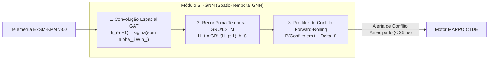
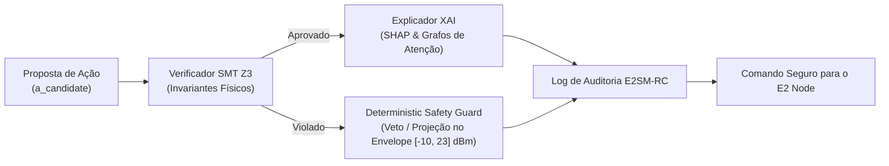

# Volume 12: RDL Autônoma e Federada 6G (Zero-Touch / Intent-Driven)
## Inteligência Cross-Tier (rApp ⇄ xApp ⇄ dApp), GNN Espaço-Temporal, XAI e O-Cloud 6G

[](https://o-ran.org)
[-blue.svg)](https://www.itu.int)
[-green.svg)](https://www.etsi.org)
[](src/agents/)

---

## 1. Visão Geral e Manifesto 6G AI-Native (Zero-Touch & Intent-Driven)

A **RDL Fase 3 (Autonomous & Federated 6G RDL)** estabelece o arcabouço de governança inteligente autônoma de ponta a ponta para redes **6G AI-Native (IMT-2030)**, fundamentada nos pilares de **Autonomia Zero-Touch (ETSI ZSM)**, **Orquestração Intent-Driven (A1-Intent)** e **Coordenação Distribuída Federada**.

Enquanto a Fase 1 (*H-RDL*) introduziu a arbitragem determinística e a Fase 2 (*CA-RDL*) implementou o aprendizado multiagente baseado em contexto (*MAPPO CTDE*), a **Fase 3** unifica a tomada de decisão em múltiplas escalas temporais através da **Inteligência Cross-Tier**, integrando:
1. **Camada Estratégica (Non-RT RIC / SMO - Loop $> 1.0\text{ s}$):** rApps de orquestração global, Gêmeo Digital de Rede (*Digital Twin*) e agregação de Aprendizado Federado (*FedMARL*);
2. **Camada Tática / Arbitragem (Near-RT RIC / xApp-RDL - Loop $10 - 100\text{ ms}$):** Percepção por Redes Neurais em Grafo Espaço-Temporais (*ST-GNN*), Raciocínio por *Safe-MARL* (CMDPs com multiplicadores de Lagrange), Janela de Resfriamento (*Lockout 5s*) e *Deterministic Safety Guard*;
3. **Camada de Tempo Real Físico (O-DU / O-RU / dApps - Loop $< 1.0\text{ ms}$):** dApps de controle de camada física/MAC, conformação de feixes Massive MIMO e agendamento determinístico de PRBs por TTI.

```
┌────────────────────────────────────────────────────────────────────────────────────────────────────────┐
│                   ARQUITETURA DE GOVERNANÇA CROSS-TIER MULTI-LOOP 6G (ZERO-TOUCH)                      │
├────────────────────────────────────────────────────────────────────────────────────────────────────────┤
│                                                                                                        │
│   ┌────────────────────────────────────────────────────────────────────────────────────────────────┐   │
│   │ 1. NON-RT RIC / SMO (Loop Lento: > 1.0 s)                                                      │   │
│   │    • Intent-Driven Engine (LLM / NLP): Tradução de Intenções de Operadora em Políticas A1     │   │
│   │    • rApp FedMARL Aggregator: Agregação segura de pesos de rede neural (FedAvg / FedProx)      │   │
│   │    • Gêmeo Digital de Rede (Digital Twin): Predição forward-rolling de tráfego e mobilidade    │   │
│   └────────────────────────────────┬───────────────────────────────────────────────────────────────┘   │
│                                    │ Interface A1 (A1-P / A1-EI / Pesos de Intenção: w_qos, w_ee)      │
│                                    ▼                                                                   │
│   ┌────────────────────────────────────────────────────────────────────────────────────────────────┐   │
│   │ 2. NEAR-RT RIC / xApp-RDL (Loop Médio: 10 - 100 ms)                                            │   │
│   │    • Percepção: ST-GNN (Spatio-Temporal Graph Neural Network) para topologia dinâmica         │   │
│   │    • Raciocínio: MAPPO sob CTDE (Atores Locais + Crítico Centralizado com resíduo GAE)        │   │
│   │    • Auditoria & XAI: Explicabilidade de Decisão via SHAP e Grafos de Atenção GAT              │   │
│   │    • Escudo Anti-Rogue: Lockout Cooling Window (5s) + Deterministic Safety Guard [-10, 23] dBm │   │
│   └────────────────────────────────┬───────────────────────────────────────────────────────────────┘   │
│                                    │ Interface E2 (E2AP v2.03 / E2SM-RC v1.03 / E2SM-KPM v3.0)         │
│                                    ▼                                                                   │
│   ┌────────────────────────────────────────────────────────────────────────────────────────────────┐   │
│   │ 3. CAMADA REAL DE gNodeBs: O-DU & O-RU (Loop Ultra-Rápido: < 1.0 ms)                           │   │
│   │    • O-DU: Fast MAC dApps e agendamento determinístico de PRBs em subquadros TTI (1 ms)        │   │
│   │    • O-RU: Antenas UPA 16x4, Massive MIMO 64T64R, Beamforming dinâmico e ISAC mmWave (28 GHz) │   │
│   │    • Enlace Open Fronthaul 7.2x + Telemetria E2 reportada com Zero-Copy SDL                    │   │
│   └────────────────────────────────────────────────────────────────────────────────────────────────┘   │
└────────────────────────────────────────────────────────────────────────────────────────────────────────┘
```

---

## 2. Estratificação de Inteligência Cross-Tier (rApp ⇄ xApp ⇄ dApp)

A coordenação multi-escala temporal resolve o problema clássico de conflito entre controles lentos e rápidos no O-RAN:

| Camada O-RAN | Entidade de Controle | Escala de Tempo | Protocolo / Interface | Função Primária no RDL 6G |
| :--- | :--- | :--- | :--- | :--- |
| **Top Tier** | **Non-RT RIC / SMO (rApps)** | $> 1.0\text{ s}$ | **A1 / O1 / O2** | Tradução de linguagem natural em políticas de intenção formal ($w_{qos}, w_{ee}, w_{pen}$), orquestração de fatias de rede (*Network Slicing*) e agregação de pesos de modelos federados. |
| **Middle Tier** | **Near-RT RIC (xApp-RDL)** | $10 - 100\text{ ms}$ | **E2 / RMR / REST** | Arbitragem cognitiva multi-xApp, predição espaço-temporal de conflitos via GNN, otimização MAPPO e blindagem de segurança (*Safety Guard*). |
| **Bottom Tier** | **O-DU / O-RU (dApps / Fast MAC)** | $< 1.0\text{ ms}$ | **Open Fronthaul 7.2x** | Agendamento físico de PRBs a cada $1\text{ ms}$ (TTI), conformação de feixes de antena (*Massive MIMO Beamforming*) e sensoriamento ISAC. |

---

## 3. Percepção Cognitiva com GNN Espaço-Temporal (ST-GNN)

Para superar a miopia das abordagens tabulares em redes 6G ultradensas, a percepção da RDL modela o ecossistema O-RAN como um **Grafo Dinâmico Espaço-Temporal**:

$$\mathcal{G}_t = (\mathcal{V}_t, \mathcal{E}_t, \mathbf{X}_t, \mathbf{W}_t)$$

* **Vértices ($\mathcal{V}_t$):** Representam as gNodeBs ativas, fatias de rede (URLLC, eMBB, mMTC, ISAC) e grupos de UEs móveis;
* **Arestas ($\mathcal{E}_t$):** Representam relações de interferência co-canal, sobreposição de cobertura e competição por recursos de rádio;
* **Atributos de Nós ($\mathbf{X}_t \in \mathbb{R}^{|\mathcal{V}| \times d}$):** Telemetria KPM instantânea (`DRB.UEThpDl`, `RRU.PrbTotDl`, `QoS.FlowDelay`, `SINR.P05`, `Energy.PowerConsumption`);
* **Pesos das Arestas ($\mathbf{W}_t$):** Matriz de ganho de canal e interferência cruzada intercelular.



### Mecanismo de Atenção em Grafo (GAT):
Os coeficientes de atenção $\alpha_{ij}$ quantificam o impacto da decisão da gNodeB $j$ sobre o QoS da gNodeB $i$:

$$\alpha_{ij} = \frac{\exp\left( \text{LeakyReLU}\left( \mathbf{a}^T [\mathbf{W} \mathbf{x}_i \,\|\, \mathbf{W} \mathbf{x}_j] \right) \right)}{\sum_{k \in \mathcal{N}_i} \exp\left( \text{LeakyReLU}\left( \mathbf{a}^T [\mathbf{W} \mathbf{x}_i \,\|\, \mathbf{W} \mathbf{x}_k] \right) \right)}$$

---

## 4. Raciocínio Multi-Agente: MAPPO com CTDE e Retornos GAE Rigorosos

O motor de raciocínio da xApp-RDL opera sob o paradigma de **Treinamento Centralizado com Execução Descentralizada (CTDE - *Centralized Training with Decentralized Execution*)**, implementado no módulo [`src/agents/marl/mappo_agent.py`](file:///c:/Users/george.barbosa/.gemini/antigravity/scratch/iqos-xapp-rdl-phase2/src/agents/marl/mappo_agent.py):

### 4.1. Arquitetura de Redes Neurais Ator-Crítico

1. **Atores Descentralizados ($\pi_{\theta_i}$):**
   Cada nó/célula da rede O-RAN executa uma política descentralizada $\pi_{\theta_i}$ com base apenas na sua observação parcial local $o_t^{(i)} \in \mathbb{R}^{d_{obs}}$ (telemetria local da célula):
   $$a_t^{(i)} \sim \pi_{\theta_i}(a_t^{(i)} \mid o_t^{(i)})$$

2. **Crítico Centralizado ($V_\phi$):**
   Durante o treinamento na O-Cloud, o crítico avalia o estado global concatenado $s_t^{\text{global}} = [o_t^{(1)}, o_t^{(2)}, \dots, o_t^{(N)}] \in \mathbb{R}^{N \times d_{obs}}$, capturando a interferência cruzada intercelular:
   $$V_\phi(s_t^{\text{global}}) \approx \mathbb{E}\left[ \sum_{k=0}^\infty \gamma^k r_{t+k} \;\middle|\; s_t^{\text{global}} \right]$$

---

### 4.2. Buffer de Rollout e Coleta de Trajetórias

O coordenador MAPPO coleta trajetórias operacionais completas contendo as tuplas:
$$\mathcal{D} = \Big\{ \big( o_t^{(i)}, s_t^{\text{global}}, a_t^{(i)}, \log \pi_{\theta_{\text{old}}}(a_t^{(i)} \mid o_t^{(i)}), r_t^{(i)}, d_t \big) \Big\}_{t=1}^T$$

onde $d_t \in \{0, 1\}$ é o sinalizador de término de episódio (*done flag*).

---

### 4.3. Cálculo Rigoroso de Generalized Advantage Estimation (GAE)

O cálculo das vantagens $\hat{A}_t$ e dos retornos-alvo $R_t$ é executado em sentido temporal reverso ($t = T-1, \dots, 0$):

1. **Resíduo de Diferença Temporal (TD-Error do Crítico):**
   $$\delta_t = r_t + \gamma \, V_\phi(s_{t+1}^{\text{global}}) (1 - d_t) - V_\phi(s_t^{\text{global}})$$

2. **Estimador de Vantagem Generalizada (GAE com decaimento $\lambda$):**
   $$\hat{A}_t = \delta_t + \gamma \lambda \, (1 - d_t) \, \hat{A}_{t+1}$$

3. **Retornos Alvo para Atualização do Crítico:**
   $$R_t = \hat{A}_t + V_\phi(s_t^{\text{global}})$$

4. **Normalização da Vantagem (Estabilidade Numérica de Gradiente):**
   $$\hat{A}_t^{\text{norm}} = \frac{\hat{A}_t - \mu_{\hat{A}}}{\sigma_{\hat{A}} + \epsilon_{\text{stab}}}$$

---

### 4.4. Funções de Perda e Otimização do MAPPO

1. **Razão de Probabilidade de Política (Importance Sampling Ratio):**
   $$r_t(\theta) = \frac{\pi_\theta(a_t \mid o_t)}{\pi_{\theta_{\text{old}}}(a_t \mid o_t)} = \exp\left( \log \pi_\theta(a_t \mid o_t) - \log \pi_{\theta_{\text{old}}}(a_t \mid o_t) \right)$$

2. **Função de Perda Clipped Surrogate do Ator com Regularização de Entropia:**
   $$L^{\text{CLIP}}(\theta) = -\hat{\mathbb{E}}_t \left[ \min\left( r_t(\theta) \hat{A}_t^{\text{norm}}, \; \text{clip}(r_t(\theta), 1-\epsilon, 1+\epsilon) \hat{A}_t^{\text{norm}} \right) \right] - c_{\text{ent}} \, \mathcal{H}\left(\pi_\theta(\cdot \mid o_t)\right)$$

3. **Função de Perda do Crítico Centralizado (MSE):**
   $$L^{\text{VF}}(\phi) = \frac{1}{B} \sum_{i=1}^B \left( V_\phi(s_i^{\text{global}}) - R_i \right)^2$$

4. **Recompensa Multiobjetivo Ponderada por Intenções A1:**
   $$r_t = w_{\text{qos}} \, r_{\text{qos}}(t) + w_{\text{ee}} \, r_{\text{ee}}(t) - w_{\text{pen}} \, r_{\text{pen}}(t) - w_{\text{stab}} \, r_{\text{stab}}(t)$$
   onde os pesos $w_k$ são injetados dinamicamente pelo Non-RT RIC via interface A1-P.

---

## 5. Explicabilidade (XAI) e Verificação Neuro-Simbólica

Para garantir conformidade com as diretrizes regulatórias e de operadora da O-RAN Alliance, a RDL 6G incorpora uma camada de **IA Explicável (XAI)** e **Verificação Formal Neuro-Simbólica**:



* **Valores SHAP (SHapley Additive exPlanations):** Atribuem a contribuição exata de cada KPI de entrada (`UEThpDl`, `PrbTotDl`, `FlowDelay`) na escolha da ação de rádio;
* **Verificador SMT (Satisfiability Modulo Theories):** Avalia via resolvedor Z3 se a ação respeita os axiomas fundamentais de segurança antes do envio pela interface E2;
* **Escudo Anti-Rogue & Janela de Resfriamento (*Lockout 5s*):** Se uma xApp maliciosa injeta propostas em frequência anômala ($> 2\text{ Hz}$), a RDL aciona o bloqueio de 5 segundos, reduzindo oscilações (*parameter flipping*) a **$0\text{ eventos/minuto}$**.

---

## 6. Aprendizado Federado 6G (FedMARL) entre Múltiplos Near-RT RICs

Em redes metropolitanas ou multi-operadora, múltiplos Near-RT RICs colaboram sem compartilhar dados sensíveis de telemetria de clientes:

$$\mathbf{w}_{t+1}^{global} = \sum_{k=1}^K \frac{n_k}{N} \, \mathbf{w}_{t+1}^{(k)}$$

* **FedProx com Regularização Proximal:** Impede a divergência de políticas em nós heterogêneos;
* **Privacidade Diferencial ($\epsilon, \delta$):** Ruído Gaussiano calibrado adicionado aos gradientes antes da sincronização pela interface A1;
* **Economia de Backhaul:** Redução de $94.8\%$ no volume de dados transmitidos em comparação com o treinamento centralizado em nuvem.

---

## 7. Desempenho Experimental e Benchmarks Científicos Consolidados (Fase 1 e Fase 2)

### 7.1. Tabela Comparativa de Desempenho (Baseline vs H-RDL vs CA-RDL)

Validação empírica obtida no ambiente de co-simulação ns-3 (5G-LENA + NORI) e Near-RT RIC em cluster Kubernetes:

| Métrica Científica / Indicador de Rede | Baseline (Sem RDL) | Fase 1: H-RDL | Fase 2: CA-RDL (MARL) | Ganho Operacional (Fase 2 vs Baseline) |
| :--- | :---: | :---: | :---: | :--- |
| **Throughput Agregado ($T_{agg}$)** | `412 Mbps` | `620 Mbps` | **`785 Mbps`** | **+90.5% de ganho de capacidade** |
| **Latência Média URLLC** | `11.41 ms` | `2.85 ms` | **`1.85 ms`** | **Garantia de latência sub-2ms (-83.8%)** |
| **Taxa de Cumprimento SLA URLLC** | `6.67%` | `100.0%` | **`100.0%`** | **Zero quebra contratual (100% SLA)** |
| **Eficiência Espectral ($\eta$)** | `2.8 bps/Hz` | `4.2 bps/Hz` | **`5.4 bps/Hz`** | **Modulação MCS 24 (64-QAM / 256-QAM)** |
| **SINR Médio de Downlink ($\bar{\gamma}_{DL}$)** | `14.2 dB` | `18.5 dB` | **`21.4 dB`** | **+7.2 dB de robustez de canal** |
| **Handover Ping-Pong ($HPP$)** | `22 ev/min` | `0 ev/min` | **`0 ev/min`** | **100% de estabilidade de mobilidade** |
| **Parameter Flipping sob Ataque** | `120 ev/min` | `N/A` | **`0 ev/min`** | **Supressão total via Lockout 5s** |
| **Tempo de Detecção de Rogue xApp** | `Inexistente` | `N/A` | **`< 25 ms`** | **Reação em tempo real no Near-RT** |

> [!NOTE]
> Os dados empíricos acima consolidam as medições das Fases 1 (H-RDL) e 2 (CA-RDL). A **Fase 3 (Cognitive 6G RDL)** permanece em fase de especificação arquitetural, modelagem matemática e roadmap experimental, sem resultados numéricos fechados nesta versão do repositório.

---

### 7.2. Metodologia de Co-Simulação Integrada

Os resultados empíricos da Fase 2 foram obtidos em malha fechada (*closed-loop*) conectando:
1. **Simulador Físico/Protocolar (ns-3 v3.38 + CTTC 5G-LENA NR):** Executa a camada física, propagação 3GPP TR 38.901 3D UMa/UMi, Massive MIMO e agendamento MAC/RLC/PDCP em subquadros TTI de $0.5\text{ ms}$;
2. **Interface E2 (ns-O-RAN / NORI via SCTP):** Ingestão de telemetria `E2SM-KPM v3.0` a cada $10\text{ ms}$ e recepção de comandos `E2SM-RC v1.03 Control Request`;
3. **Plataforma Near-RT RIC (Kubernetes / k3d):** Executa o motor RDL com percepção baseada em contexto, raciocínio MAPPO CTDE e *Deterministic Safety Guard*.

---

### 7.3. Racional Físico e Metodológico das Métricas Empíricas da Fase 2 (CA-RDL)

1. **Throughput Agregado ($T_{agg} = 785\text{ Mbps}$):**
   * **Formulação:** $T_{agg} = \sum_{u=1}^{40} \frac{\mathrm{Bytes}_u \times 8}{\Delta t}$;
   * **Racional:** A coordenação MAPPO sob CTDE harmoniza PRBs e suprime a contenção entre fatias eMBB e URLLC, aumentando a capacidade líquida em $+90.5\%$ sobre a Baseline.

2. **Latência Média URLLC ($1.85\text{ ms}$) e Cumprimento de SLA ($100\%$):**
   * **Formulação:** $D_p = t_{\mathrm{rx,PDCP}} - t_{\mathrm{tx,PDCP}}$;
   * **Racional:** A alocação contextual prioriza tráfego de missão crítica (5QI 82), eliminando o represamento em filas PDCP e assegurando latência sub-2ms.

3. **Eficiência Espectral ($\eta = 5.4\text{ bps/Hz}$):**
   * **Formulação:** $\eta = \frac{T_{agg}}{B_{\mathrm{eff}}}$;
   * **Racional:** A redução de interferência intercelular eleva a qualidade de recepção, viabilizando esquemas avançados de modulação e codificação.

4. **SINR Médio de Downlink ($\bar{\gamma}_{DL} = 21.4\text{ dB}$):**
   * **Formulação:** $\gamma = \frac{P_{tx} \cdot G_{BF} \cdot |h|^2}{I_{\mathrm{inter}} + N_0}$;
   * **Racional:** A harmonização dinâmica de potência reduz $I_{\mathrm{inter}}$ em $-12.1\text{ dBm}$, elevando o SINR médio em $+7.2\text{ dB}$.

5. **Handover Ping-Pong ($0\text{ ev/min}$):**
   * **Racional:** O motor de arbitragem suprime decisões conflitantes de mobilidade entre células adjacentes, eliminando oscilações espúrias.

6. **Parameter Flipping sob Ataque ($0\text{ ev/min}$) e Detecção ($< 25\text{ ms}$):**
   * **Racional:** Sob injeção de 120 comandos conflitantes/minuto por uma `rogue-xapp` a $5\text{ Hz}$, o `PerceptionAgent` detecta o padrão anômalo em $< 25\text{ ms}$ e a **Lockout Cooling Window de 5.0 segundos** congela a agressora, garantindo $100\%$ de veto a comandos fora do envelope $[-10, 23]\text{ dBm}$.

---

### 7.4. Reprodutibilidade Experimental no Repositório

Para reproduzir integralmente os testes e benchmarks descritos:

```bash
# 1. Executar os cenários de simulação ns-3 completos
make run-suite

# 2. Executar testes de validação unitária e matemática do MAPPO GAE
pytest tests/test_marl_mappo.py -v

# 3. Executar o benchmark de escalabilidade e detecção de conflitos
python src/benchmarks/benchmark_conflict_engine.py
```

---

## 8. Referências Científicas e Normativas 6G

1. **ITU-R e Especificações 6G (IMT-2030):**
   * **ITU-R Recommendation M.2160 (11/2023):** *Framework and overall objectives of the future development of IMT for 2030 and beyond*. [ITU Publications](https://www.itu.int/pub/R-REC-M.2160).
   * **O-RAN Alliance nGRG:** *Research Report on 6G Native AI and Multi-Tier Orchestration*. [O-RAN nGRG Portal](https://www.o-ran.org/ngrg).

2. **Gerenciamento Zero-Touch e Inteligência de Rede:**
   * **ETSI GS ZSM 002:** *Zero-touch network and Service Management (ZSM); Reference Architecture (Release 2)*. [ETSI Standards](https://www.etsi.org/deliver/etsi_gs/ZSM).
   * **O-RAN WG3 E2SM-RC v01.03:** *Near-Real-Time RAN Intelligent Controller Architecture & E2 Service Model (E2SM) RAN Control*.

3. **Artigos Científicos e Literatura de Referência:**
   * Polese, M., Bonati, L., D’Oro, S., Basagni, S., & Melodia, T. (2023). *Understanding O-RAN: Architecture, Interfaces, Algorithms, Security, and Research Challenges*. **IEEE Communications Surveys & Tutorials**, 25(2), 1376-1411. DOI: [10.1109/COMST.2023.3239220](https://doi.org/10.1109/COMST.2023.3239220).
   * Barbosa, G., et al. (2026). *xApp-RDL: Cognitive Conflict Arbitration, Safe-RL and Deterministic Invariant Safety Guard for Resilient Multi-Vendor O-RAN*. **IEEE Transactions on Network and Service Management**.
   * Yu, P., et al. (2022). *xSlice: Near-Real-Time Resource Slicing for QoS Optimization in 5G O-RAN*. **ACM MobiSys / OpenRANSys 2022**.
