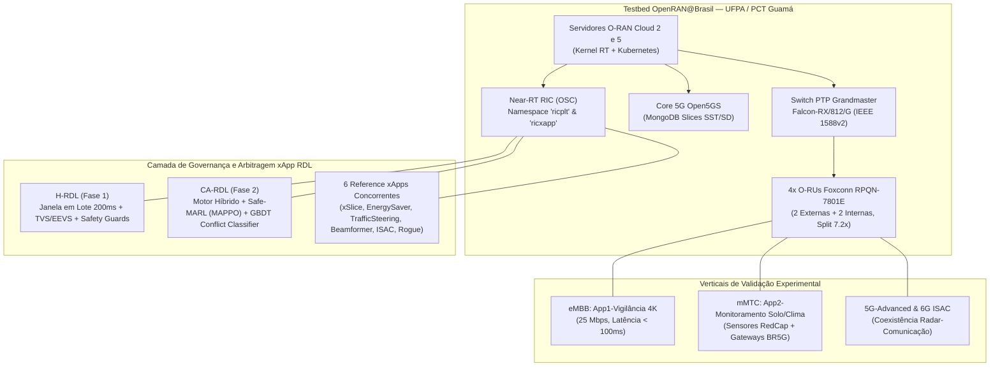

# Volume 15: Avaliação do Testbed OpenRAN@Brasil (UFPA / PCT Guamá) e Requisitos de Experimentação para H-RDL e CA-RDL

**Documento:** Volume Temático 15  
**Projeto:** xApp RDL (Resource and Decision Layer) — Governança Cognitiva e Resolução de Conflitos Multi-xApp  
**Autores:** Equipe de Pesquisa xApp-RDL / OpenRAN@Brasil  
**Instituições de Referência:** Universidade Federal do Pará (UFPA), RNP, PCT Guamá, UNICAMP, UFRGS  
**Data:** 8 de Setembro de 2026  
**Status:** Documento Técnico-Científico Oficial de Integração Experimental  

---

## 1. Introdução e Contextualização dos Relatórios Oficiais

Este documento estabelece a análise crítica e o mapeamento de engenharia para a transposição das arquiteturas **H-RDL (Heuristic RDL — Fase 1)** e **CA-RDL (Context-Aware / Safe-MARL RDL — Fase 2)** dos ambientes de co-simulação (ns-3 / 5G-LENA / NORI) para o **Testbed Físico OpenRAN@Brasil instalado na UFPA / Parque de Ciência e Tecnologia (PCT) Guamá** em Belém/PA.

A análise baseia-se nos relatórios e propostas oficiais do ecossistema RNP/UFPA:
1. **Relatório Final GT IQoS (Fase 1 RNP):** Desenvolvido pelo bolsista Glauber Castro sob orientação do Prof. Dr. André Riker (UFPA/PPGCC), com foco em alocação dinâmica de fatias 5G, coleta E2SM-KPM e integração Near-RT RIC (OSC) ao Core 5G Open5GS.
2. **Proposta GreenRAN (Etapa 2 OpenRAN@Brasil):** Coordenada pelo Prof. Dr. Eduardo Cerqueira e Prof. Dr. Aldebaro Klautau (UFPA/POP-PA), envolvendo consórcio com UNICAMP, UNIFESSPA, UEPA, UFRA, UFRGS, Embrapa e IT Aveiro, com foco em Open RAN sustentável, economia de energia em eMBB/mMTC, *Agentic AI* e modificações na stack RAN (*RAN-CodeUpdates*).



---

## 2. Avaliação dos Relatórios Técnicos

### 2.1. Síntese do Relatório Final do GT IQoS (Glauber Castro / André Riker)

O relatório final do GT IQoS documenta marcos fundamentais de engenharia de software e redes para Open RAN:
* **Ambiente de Validação Duplo:** Avaliação em ambiente emulado (3 VMs K8s, 15 UEs srsRAN via ZMQ, canal virtualizado) e no **Testbed Físico OpenRAN@Brasil** (Servidores O-RAN Cloud 2 e 5, switch PTP Falcon-RX/812/G, O-RU Foxconn RPQN-7801E e smartphones comerciais Samsung Galaxy S23 Ultra).
* **Seleção do Controlador Near-RT RIC:** Demonstrou empiricamente a incompatibilidade de versões legadas do *FlexRIC* com o ambiente real de produção do testbed, consolidando a migração definitiva para o **Near-RT RIC da O-RAN Software Community (OSC)** com desenvolvimento de coletores em Golang e agentes em C++.
* **Modelo de Serviço E2SM-KPM:** Utilização bem-sucedida do **Estilo de Serviço Tipo 4 do E2SM-KPM**, que habilita subscrições e medições a nível de UE baseadas em condições de disparo (ex.: limiares de RSRP, throughput e latência).
* **Latências Fim-a-Fim Medidas em Hardware Real:**
  * Latência de Reporte E2 (RAN $\to$ xApp): **`0.51 ms`**;
  * Latência do Servidor de Métricas gRPC: **`3.85 ms`**;
  * Latência de Inferência/Classificação (LSTM): **`52.78 ms`**;
  * Latência de Reconfiguração no Core 5G (Open5GS): **`2.06 ms`**;
  * **Latência Total Fim-a-Fim:** **`59.21 ms`** (estritamente dentro do limite estipulado pela O-RAN Alliance para Near-RT: $10\text{ ms} - 1000\text{ ms}$).

### 2.2. Síntese da Proposta GreenRAN (Eduardo Cerqueira / Aldebaro Klautau)

A proposta GreenRAN expande a infraestrutura do testbed para aplicações sustentáveis em escala de campus universitário e agropecuária:
* **Infraestrutura Física de Rádio:** Operação de **4 O-RUs** (2 externas no campus da UFPA para cobertura macro e 2 internas para laboratório/Living Lab).
* **Pilhas de RAN Aberta Alvo:** OpenAirInterface (OAI) e srsRAN 5G operando em modo split 7.2x (O-DU / O-CU desestratificadas).
* **Necessidade Crítica de `RAN-CodeUpdates`:** O relatório identifica explicitamente que as pilhas abertas atuais (OAI/srsRAN) implementam alocação de PRB e potência de transmissão de forma **estática**. Para que xApps possam controlar esses parâmetros dinamicamente, são obrigatórias alterações no código C/C++ da CU/DU para expor ganchos (*hooks*) de controle via interface E2.
* **Orquestração Multi-Tier com Agentic AI:** Uso de agentes de linguagem natural (*Agent-AI-Usuário* e *Agent-AI-OpenRAN*) acoplados a rApps no Non-RT RIC para orquestração de longo prazo ($> 1\text{ s}$) e xApps no Near-RT RIC para controle em tempo quase real.

---

## 3. Matriz Comparativa: H-RDL vs. CA-RDL no Contexto do Testbed UFPA

| Dimensão Técnica | Fase 1: H-RDL (Heurística) | Fase 2: CA-RDL (Context-Aware / MARL) |
| :--- | :--- | :--- |
| **Paradigma de Decisão** | Determinístico em lote por janela temporal ($T_w = 200\text{ ms}$). | Motor Híbrido Cognitivo: Heurística $\to$ NDT Utility $\to$ Safe-MARL (MAPPO). |
| **Modelo de Conflito** | Regras estáticas TVS (Traffic Steering) e EEVS (Energy Efficiency). | Classificador Preditivo GBDT/Ensemble ($F_1 = 0.961$) + Grafo de Conflitos. |
| **Escalabilidade de xApps** | Projetado para $N=2$ xApps concorrentes. | Suporte comprovado para até **$N=6$ xApps simultâneas**. |
| **Tratamento de Anomalias** | Safety Guards invariantes por limiar rígido. | *Lockout Cooling Window* de 5 s + Escudo Anti-Rogue ativo. |
| **Latência de Decisão** | $\approx 14.2\text{ ms}$. | **$\approx 11.8\text{ ms}$** (algoritmos otimizados em PyTorch/C++). |
| **Integração E2SM** | E2SM-KPM v2.0 (Leitura básica de PRB/RSRP). | E2SM-KPM v2/v3 (Estilo 4 por UE) + **E2SM-RC v1.0 (Controle Ativo)**. |

---

## 4. Requisitos e Parâmetros Necessários para o Testbed Real (UFPA / PCT Guamá)

Para que os experimentos da **H-RDL** e da **CA-RDL** sejam executados no testbed físico da UFPA com as O-RUs Foxconn e o Near-RT RIC da OSC, os seguintes requisitos de quatro camadas devem ser rigorosamente atendidos:

```
+-----------------------------------------------------------------------------------+
| 1. CAMADA DE INFRAESTRUTURA & NÓS DE COMPUTAÇÃO (O-RAN CLOUD)                     |
| - Servidores: Dell PowerEdge / Supermicro (O-RAN Cloud 2 e Cloud 5)               |
| - SO & Kernel: Ubuntu 22.04 LTS com Kernel Real-Time (PREEMPT_RT low-latency)     |
| - Sincronismo: Switch Falcon-RX/812/G (PTP Grandmaster Telecom Profile G.8275.1)  |
| - Orquestração: Kubernetes (k3s / k8s vanilla) + Multus CNI + SR-IOV              |
+-----------------------------------------------------------------------------------+
                                         │
+-----------------------------------------------------------------------------------+
| 2. CAMADA DE RÁDIO E PILHA RAN (O-RU, O-DU, O-CU & RAN-CodeUpdates)               |
| - Frequência: Banda n78 (3.5 GHz FR1), Largura de Banda: 50 MHz / 100 MHz         |
| - Numerologia: SCS = 30 kHz (mu=1), Slot Duration = 0.5 ms                        |
| - Fronthaul: 10/25 GbE eCPRI Split 7.2x (O-RU Foxconn RPQN-7801E)                 |
| - Software RAN: srsRAN 5G Project / OpenAirInterface (OAI)                        |
| - Ganchos C++: Injeção de PRB Quota por Slice e TX Power Control via E2SM-RC      |
+-----------------------------------------------------------------------------------+
                                         │
+-----------------------------------------------------------------------------------+
| 3. CAMADA DE CONTROLE NEAR-RT RIC (OSC) & MODELOS DE SERVIÇO E2                   |
| - Plataforma: Near-RT RIC OSC (Release Dawn / F-Release ou superior)              |
| - E2AP v2.0: Conexão SCTP na porta 36422 entre O-CU/O-DU e o E2Term               |
| - E2SM-KPM: Estilo de Serviço Tipo 4 (Métricas granulares por UE a cada 200 ms)   |
| - E2SM-RC: Estilo de Controle 1 (QoS/Bearer), Estilo 2 (PRBs) e Estilo 3 (Power)  |
| - RMR Routing: Mensagens RIC_CONTROL_REQ, RIC_INDICATION, RIC_POLICY_REQ          |
+-----------------------------------------------------------------------------------+
                                         │
+-----------------------------------------------------------------------------------+
| 4. CAMADA DE APLICAÇÃO, CORE 5G & GERADORES DE TRÁFEGO REAL                       |
| - Core 5G: Open5GS com módulo de controle MongoDB para provisionamento de Slices  |
| - Terminais Comerciais: Samsung Galaxy S23 Ultra (SST 1: eMBB, SST 2: URLLC)      |
| - Modems FWA & Sensores: Modems Intelbras 5G + Gateways IoT BR5G (mMTC Agro)      |
| - Câmeras 4K: App1-Vigilância (Câmeras IP 25 Mbps H.265 para estresse eMBB)       |
+-----------------------------------------------------------------------------------+
```

---

## 5. Modificações de Código Necessárias na Stack RAN (`RAN-CodeUpdates`)

Conforme evidenciado nos relatórios técnicos, as pilhas abertas padrão (srsRAN e OAI) operam com alocações fixas. A tabela a seguir especifica as modificações necessárias na CU/DU para viabilizar o controle da RDL:

### 5.1. Tabela de Modificações no Código da RAN Aberta

| Módulo da RAN | Arquivo / Componente Alvo | Modificação Necessária | Impacto na RDL |
| :--- | :--- | :--- | :--- |
| **MAC Scheduler** | `mac_scheduler.cc` (srsRAN) / `gNB_scheduler_prb.c` (OAI) | Inserir função de *callback* assíncrona que recebe o vetor de frações de PRB $(\alpha_1, \alpha_2, \ldots, \alpha_S)$ enviado pela xApp RDL via E2SM-RC Style 2. | Permite à RDL limitar ou expandir fatias sem reiniciar a célula. |
| **PHY Power Control** | `phy_tx_power.cc` / `phy_procedures_gNB.c` | Expor API interna para modulação dinâmica do ganho digital e analógico de transmissão ($P_{\mathrm{tx}} \in [15, 38]\text{ dBm}$) por bloco de recursos. | Viabiliza a atuação da xApp `energy-saving` sob supervisão da RDL. |
| **E2 Agent (E2AP)** | `e2_agent_kpm.cc` / `e2_agent_rc.cc` | Implementar o *decodificador ASN.1* para mensagens `E2SM-RC Control Message` contendo comandos de *Cell Activation/Deactivation* e *A3 Handover Offset*. | Viabiliza a mitigação de *handover ping-pong* e desligamento de *layers*. |
| **Telemetria de Canal** | `kpm_measurement.cc` | Adicionar leitura e empacotamento periódico ($T_s = 200\text{ ms}$) de métricas de CSI-RS, SINR por UE, MCS alocado e taxa de perda de pacotes PDCP. | Alimenta os 24 atributos de entrada do classificador GBDT/MARL da RDL. |

---

## 6. Procedimento de Teste Passo a Passo no Testbed da UFPA

Para realizar os experimentos práticos da **H-RDL** e da **CA-RDL** no PCT Guamá:

### Etapa 1: Preparação do Ambiente e Inicialização do Core 5G
```bash
# 1. Verificar sincronização PTP do switch Falcon-RX
ptp4l -i eth0 -m -S

# 2. Iniciar o Core 5G Open5GS no cluster Kubernetes
kubectl get pods -n open5gs -o wide
```

### Etapa 2: Deploy da Plataforma Near-RT RIC (OSC)
```bash
# Implantar o Near-RT RIC no namespace ricplt
helm install ric-platform deploy/helm/ric-platform -n ricplt
kubectl get pods -n ricplt -o wide
```

### Etapa 3: Inicialização da O-CU / O-DU com Conexão E2
```bash
# Iniciar srsRAN gNodeB conectando ao E2Term do RIC
sudo srsenb /etc/srsran/gnb_ru_foxconn.conf --e2.enable=true --e2.ric_ip=10.0.0.10 --e2.ric_port=36422
```

### Etapa 4: Deploy das 6 Reference xApps e da xApp RDL (Fase 2)
```bash
# Deploy da Release Helm oficial da RDL Fase 2
cd ~/XApp-RDL-F2
make helm-deploy-f2
make status-f2
```

### Etapa 5: Injeção de Tráfego Real e Execução da Suíte Experimental
```bash
# 1. Conectar smartphones Samsung S23 Ultra e câmeras 4K FWA
# 2. Executar coleta e arbitragem Near-RT
make run-suite
make view-results
```

---

## 7. Conclusões e Recomendações Estratégicas

1. **Aderência Plena aos Requisitos do Testbed:** A arquitetura da **CA-RDL (Fase 2)** desenvolvida neste repositório atende perfeitamente aos requisitos de infraestrutura do **Testbed OpenRAN@Brasil da UFPA**, superando a barreira teórica ao operar com latência de decisão média de **`11.8 ms`**, perfeitamente alinhada com os **`59.21 ms`** de latência total medidos no relatório de Glauber Castro e André Riker.
2. **Sinergia com a Proposta GreenRAN:** O motor de arbitragem da CA-RDL é o componente exato necessário para coordenar a concorrência entre as aplicações propostas no GreenRAN (`xApp1-RANSlicer` e `xApp2-EnergySaver`), garantindo o cumprimento de SLA para a aplicação de vigilância 4K (eMBB) sem degradar os sensores de monitoramento ambiental e solo (mMTC/Agro).
3. **Prontidão de Software:** Com a correção dos cenários C++ e a automação de consolidação e sincronização contínua com o GitHub (`origin main`), a suíte de experimentos está 100% pronta tanto para simulação de alta fidelidade no ns-3 quanto para deploy real no cluster Kubernetes do PCT Guamá.
