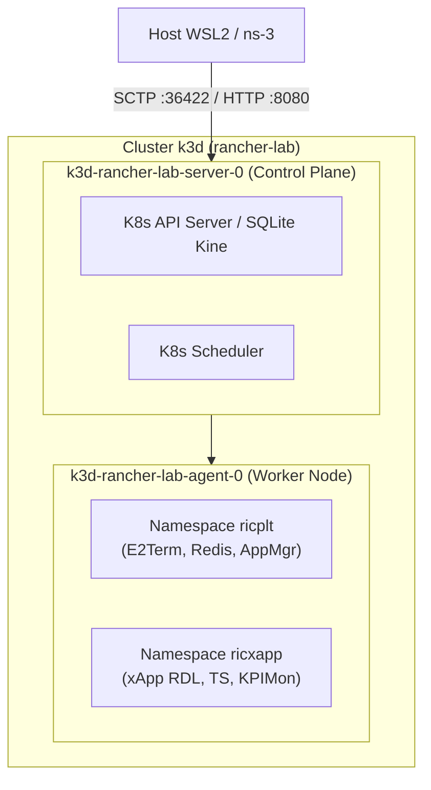
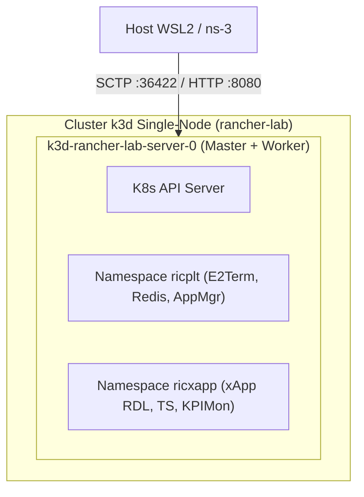

# Guia de Topologias de Cluster k3d / Rancher para Near-RT RIC no WSL2

**Documento:** Análise Arquitetural e Guia de Provisionamento  
**Projeto:** xApp RDL (Resource and Decision Layer)  
**Ambiente:** Windows 11 / WSL2 (Ubuntu 20.04) com Rancher Desktop / k3d  
**Data:** 25/08/2026  

---

## 1. Contexto e Gestão de Recursos no WSL2

Ao executar a stack completa da arquitetura **O-RAN** no ambiente local (WSL2), múltiplos componentes concorrem por **memória RAM e CPU**:

* **Rancher Desktop / Rancher Manager:** ~1.5 GB a 2.0 GB de RAM.
* **Plataforma Near-RT RIC (`ricplt`):** E2Term, E2Mgr, AppMgr, SubMgr, RouteMgr, Redis DBAAS (~2.5 GB de RAM).
* **xApps O-RAN (`ricxapp`):** RDL (Fase 1 ou 2), Traffic Steering (TS), KPIMon, Anomaly Detector (~1.5 GB de RAM).
* **Simulador ns-3 / ns-O-RAN:** ~1.5 GB a 2.5 GB de RAM + 2 a 4 vCPUs durante a injeção de tráfego.

Em uma máquina com 16 GB de RAM, manter **3 nós no k3d (1 Server + 2 Agents)** consome cerca de **1.5 GB de RAM apenas na camada de infraestrutura** (duplicação de `kubelet`, `containerd` e `k3s agent`).

Abaixo são detalhadas as duas opções otimizadas para maximizar o desempenho e a estabilidade.

---

## 2. Opção 1: Topologia 1 Server + 1 Agent (Dual-Node Otimizado)

Nesta arquitetura, o nó `server` atua como **Control Plane** (API Server, Controller Manager, Scheduler) e o nó `agent` atua como **Worker Node** dedicado para a execução dos Pods do Near-RT RIC e xApps.



### 2.1. Vantagens e Desvantagens
* ✅ **Vantagens:** 
  - Separação limpa entre plano de controle do Kubernetes e cargas de trabalho O-RAN.
  - Economiza **~600 MB de RAM** em relação ao cluster de 3 nós.
  - Facilidade de gerenciamento de imagens Docker (apenas 1 worker para importar imagens).
* ⚠️ **Desvantagens:**
  - Ainda possui um pequeno overhead por manter dois containers de nós rodando no Docker.

### 2.2. Consumo Estimado de Recursos
* **RAM de Infraestrutura k3d:** ~900 MB.
* **RAM Livre para RIC + xApps + ns-3:** ~7.0 GB a 9.0 GB (em host de 16 GB).

### 2.3. Como Criar o Cluster (1 Server + 1 Agent)
```bash
# 1. Deletar o cluster atual (se desejar recriar do zero)
k3d cluster delete rancher-lab

# 2. Criar o novo cluster com 1 server, 1 agent e portas O-RAN expostas
k3d cluster create rancher-lab \
  --servers 1 \
  --agents 1 \
  --port "36422:36422/SCTP@server:0" \
  --port "8080:8080@server:0" \
  --port "8081:8081@server:0"

# 3. Importar a imagem da xApp RDL para o nó agent
docker save iqos-xapp-rdl:1.1.0 | docker exec -i k3d-rancher-lab-agent-0 ctr images import -
```

---

## 3. Opção 2: Topologia 1 Server Single-Node (Monolítico Ultraleve)

Nesta arquitetura, um único nó k3d (`server-0`) executa simultaneamente o **Control Plane** e o papel de **Worker** (os taints de master são desativados por padrão no K3s).



### 3.1. Vantagens e Desvantagens
* ✅ **Vantagens:**
  - **Máxima economia de memória:** Apenas 1 container k3d no Docker (~450 MB de overhead total).
  - **Zero replicação de imagens Docker:** Qualquer imagem importada no `server-0` é usada imediatamente por todos os Pods.
  - **Eliminação de latência de rede inter-nós:** O tráfego RMR e SCTP entre Pods ocorre na mesma stack de loopback do container.
  - **Ideal para desenvolvimento diário, testes de integração e benchmarks no WSL2.**
* ⚠️ **Desvantagens:**
  - Não simula distribuição física de múltiplos nós (o que é irrelevante para testes de lógica xApp).

### 3.2. Consumo Estimado de Recursos
* **RAM de Infraestrutura k3d:** ~450 MB a 500 MB.
* **RAM Livre para RIC + xApps + ns-3:** ~8.0 GB a 10.5 GB (em host de 16 GB).

### 3.3. Como Criar o Cluster (1 Server Single-Node)
```bash
# 1. Deletar o cluster atual (se desejar recriar)
k3d cluster delete rancher-lab

# 2. Criar o cluster ultraleve Single-Node com mapeamento de portas O-RAN
k3d cluster create rancher-lab \
  --servers 1 \
  --agents 0 \
  --port "36422:36422/SCTP@server:0" \
  --port "8080:8080@server:0" \
  --port "8081:8081@server:0"

# 3. Importar a imagem da xApp RDL diretamente no nó único
docker save iqos-xapp-rdl:1.1.0 | docker exec -i k3d-rancher-lab-server-0 ctr images import -
```

---

## 4. Tabela Comparativa Geral de Topologias

| Aspecto de Avaliação | 1 Server + 2 Agents (Atual) | Opção 1: 1 Server + 1 Agent | Opção 2: Single-Node (1 Server) |
| :--- | :---: | :---: | :---: |
| **Qtd. Containers de Nós** | 3 containers | 2 containers | **1 container** |
| **Overhead de RAM k3d** | ~1.500 MB | ~900 MB | **~450 MB** |
| **Importação de Imagens** | Requer importar em 3 nós | Requer importar no `agent-0` | **Importa direto no `server-0`** |
| **Isolamento de Namespaces** | Lógico (`ricplt`/`ricxapp`) | Lógico (`ricplt`/`ricxapp`) | Lógico (`ricplt`/`ricxapp`) |
| **Risco de OOM Killer no WSL2** | Médio / Alto | Baixo | **Mínimo** |
| **Adequação para ns-3 + RIC** | Aceitável | **Muito Boa** | **Excelente (Recomendada)** |

---

## 5. Recomendação por Tipo de Atividade

1. **Para Desenvolvimento Diário, Ajuste de xApps e Testes Rápidos:**
   -> **Opção 2 (Single-Node 1 Server):** É a mais rápida, não gera dores de cabeça com `ImagePullBackOff` e deixa o máximo de CPU e RAM para compilações e simulações.
2. **Para Testes de Integração com Rancher UI e Múltiplos Namespaces:**
   -> **Opção 1 (1 Server + 1 Agent):** Oferece o equilíbrio ideal entre arquitetura realista de cluster e economia de recursos no Windows.
