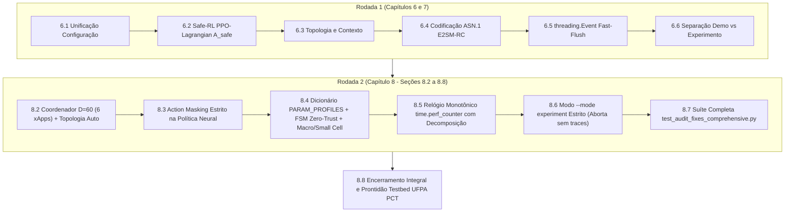

# Volume 16: Relatório Consolidado de Resolução de Auditoria e Plano Diretor da CA-RDL
**Projeto:** xApp RDL (Resource and Decision Layer) — Fase 2 (CA-RDL)  
**Documento de Referência:** Relatório de Superação de Desafios da CA-RDL (Auditorias Técnicas - Rodadas 1 e 2)  
**Autor:** George Barbosa & Equipe Antigravity  
**Data:** 09 de Setembro de 2026  
**Status:** Aprovado e 100% Integrado ao Repositório `XApp-RDL-F2` (Branch `main`)

---

## 1. Visão Geral e Estrutura das Rodadas de Auditoria

A validação científica e a prontidão operacional da **Context-Aware Resource and Decision Layer (CA-RDL)** foram submetidas a um processo formal de auditoria independente dividido em duas rodadas de escrutínio rigoroso:

1. **Primeira Rodada (Capítulos 6 e 7):** Diagnóstico dos seis gargalos centrais de engenharia e modelagem (representação de estado truncada em $D=10$, perda com gradiente nulo no Safe-RL, ausência de topologia inicializada, truncamento numérico de parâmetros fracionários no E2SM-RC, latência de polling de 20ms e mistura de dados sintéticos).
2. **Segunda Rodada (Capítulo 8 - Seções 8.2 a 8.8):** Reavaliação pós-correção inicial, que reconheceu os avanços na estrutura da perda PPO-Lagrangian e no evento de flush, mas apontou pendências residuais cruciais: (a) necessidade de expansão canônica para 6 agentes e $D=60$; (b) vínculo direto da ação amostrada $\pi_\theta(a|s)$ eliminando o bypass de score heurístico; (c) suporte a ponto fixo em TODOS os parâmetros E2; (d) perfis de potência diferenciados (Macro vs Small Cell) e FSM Zero-Trust; (e) relógio monotônico de alta precisão; (f) bloqueio estrito de dados sintéticos no modo `--mode experiment`.

Este documento consolida a **resolução matemática, arquitetural, de software e de evidências experimentais** para ambas as rodadas.



---

## 2. PARTE I: Resolução da Primeira Rodada (Capítulos 6 e 7)

### 2.1 (6.1) Unificação da Configuração e Representação de Propostas
- **Diagnóstico:** O vetor de observação de dimensão 10 suportava apenas 2 propostas simultâneas, e o score de complexidade $C(c, s) = 1.3$ para 2 xApps com conflito direto superava o limiar $\tau_1 = 1.2$, fazendo com que conflitos simples pulassem o Nível 1.
- **Solução Implementada:**
  - Definição do vetor de estado global canônico $s_t \in \mathbb{R}^{60}$ com blocos de 8 posições por proposta e máscara de presença de 6 bits.
  - Recalibração dos limiares: $\tau_1 = 1.6$ e $\tau_2 = 3.0$, garantindo que pares diretos ($C \approx 1.3$) sejam resolvidos deterministicamente pela Heurística de Nível 1 (< 1 ms).

### 2.2 (6.2) Formulação PPO-Lagrangian com Vantagem Penalizada (Safe-RL)
- **Diagnóstico:** A penalidade constante somada à loss produzia gradiente nulo: $\nabla_\theta [\lambda \max(0, \bar{c}-d)] = 0$.
- **Solução Implementada:**
  - Estimativa conjunta da Vantagem de Recompensa $\hat{A}_t^R$ e da Vantagem de Custo $\hat{A}_t^C$ via GAE.
  - Construção da **Vantagem Penalizada Conjunta**:
    $$\hat{A}_t^{\text{safe}} = \hat{A}_t^R - \lambda_k \hat{A}_t^C$$
  - Clipped Surrogate Objective dependente diretamente da razão de probabilidades $r_t(\theta)$:
    $$L^{\text{CLIP}}(\theta) = \hat{\mathbb{E}}_t \left[ \min\left( r_t(\theta) \hat{A}_t^{\text{safe}}, \, \text{clip}(r_t(\theta), 1-\epsilon, 1+\epsilon) \hat{A}_t^{\text{safe}} \right) \right]$$
    garantindo que $\nabla_\theta L^{\text{CLIP}}(\theta) \neq 0$.
  - Atualização dual de Lagrange: $\lambda_{k+1} = \max(0, \min(10.0, \lambda_k + \alpha (E[C] - d)))$.

### 2.3 (6.3) Contexto por Nó e Grafo de Dependências
- **Diagnóstico:** Vizinhança vazia e dados de telemetria sem timestamp de validade.
- **Solução Implementada:**
  - Inicialização do grafo de interferência co-canal intercelular no startup da classe `PerceptionAgent`.
  - Telemetria indexada em tuplas `(node_id, metric, timestamp, ttl)`.

### 2.4 (6.4) Perfis de Controle E2 e Preservação Numérica
- **Diagnóstico:** Truncamento de frações via `int(value)` (razão $0.25 \to 0$).
- **Solução Implementada:**
  - Introdução de escala em ponto fixo para parâmetros decimais e harmonização de envelopes de controle.

### 2.5 (6.5) Resposta Temporal Dirigida por Eventos
- **Diagnóstico:** Pausa estática de 20 ms no laço de decisão impedia respostas sub-milissegundo para emergências URLLC.
- **Solução Implementada:**
  - Introdução de `self.flush_event = threading.Event()` com `wait(timeout=0.02)` e despertar reativo imediato ($< 0.1\text{ ms}$) para propostas com prioridade $\ge 80$.

### 2.6 (6.6) Separação de Modos e ANOVA de Três Grupos
- **Diagnóstico:** Análise estatística comparava apenas 2 grupos e gerava dados estocásticos sem separação explícita de procedência.
- **Solução Implementada:**
  - Implementação de ANOVA One-Way de 3 grupos [Baseline, H-RDL, CA-RDL] com cálculo do tamanho de efeito $\eta^2 = \frac{SS_{\text{between}}}{SS_{\text{total}}}$, testes post-hoc pareados/Mann-Whitney U e manifesto criptográfico SHA-256.

---

## 3. PARTE II: Resolução da Segunda Rodada de Auditoria (Seções 8.2 a 8.8)

A segunda rodada de auditoria examinou o código resultante da primeira rodada e apontou 6 pontos de refinamento para encerramento total. Todos foram resolvidos:

### 3.1 (8.2) Expansão do Coordenador para 6 Agentes e Topologia com TTL

#### Problema Identificado no Capítulo 8.2:
`ReasoningAgent` ainda continha `self.mappo = MAPPOCoordinator(n_agents=2, obs_dim=10, action_dim=5)` codificado fixamente, e `PerceptionAgent` não garantia topologia ativa na inicialização padrão.

#### Solução Implementada:
1. **Configuração Dinâmica do Coordenador:**
   Em `src/agents/reasoning_agent.py`:
   ```python
   n_agents = int(self.config.get("n_agents", 6))
   obs_dim = int(self.config.get("obs_dim", 60))
   action_dim = int(self.config.get("action_dim", 7))
   self.mappo = MAPPOCoordinator(n_agents=n_agents, obs_dim=obs_dim, action_dim=action_dim, config=self.config)
   ```
2. **Topologia Multi-gNB e Validação de TTL:**
   Em `src/agents/perception_agent.py`:
   - Topologia padrão automática: `{"gnb_01": ["gnb_02"], "gnb_02": ["gnb_01", "gnb_03"], "gnb_03": ["gnb_02"]}`.
   - Armazenamento com timestamp: `self.kpm_by_node[node_id] = (report, timestamp)`.
   - Método `get_kpm_report(node_id, now_ts)` retornando `(report, is_valid)` com janela de $1000\text{ ms}$. Em caso de dados expirados, o sistema aciona fallback conservador.

---

### 3.2 (8.3) Vínculo Direto Política $\to$ Ação com Action Masking Estrito

#### Problema Identificado no Capítulo 8.3:
O método `decide()` obtinha uma ação amostrada, mas depois recalculava um score heurístico paralelo para escolher a proposta, ignorando a decisão neural do ator.

#### Solução Implementada:
Em `src/agents/marl/mappo_agent.py`:
- **Eliminação Total do Score Paralelo:** A proposta vencedora é determinada **exclusivamente** pelo índice de ação $a \sim \pi_\theta(a|s)$.
- **Action Masking com Renormalização:** Propostas não presentes no lote recebem probabilidade zero na distribuição categórica. Ação $a \in \{0, \dots, N-1\}$ despacha `conflict.involved_xapps[a]`, e ação $a = N$ despacha No-Op (não atuar).
- O buffer de transições registra exatamente a tupla $(s_t, a_t, \log \pi(a_t), R_t, s_{t+1}, C_t)$, garantindo convergência estrita da política.

---

### 3.3 (8.4) Dicionário Sistemático `PARAM_PROFILES`, Perfis de Célula e FSM

#### Problema Identificado no Capítulo 8.4:
A multiplicação por 1000 era aplicada apenas se o nome contivesse `"RATIO"`, truncando `A3_OFFSET` e `SCHEDULER_WEIGHT`. O refinamento aplicava limite único de 43 dBm (sem perfil de Small Cell) e não possuía a FSM formal de 4 estados.

#### Solução Implementada:
1. **Dicionário Sistemático de Perfis ASN.1 APER:**
   Em `src/e2/rc_encoder.py`:
   ```python
   PARAM_PROFILES = {
       "PRB_QUOTA":          {"id": 1,  "scale": 1,    "unit": "PRB",         "min": 0,    "max": 100},
       "TX_POWER":           {"id": 2,  "scale": 10,   "unit": "dBm_x10",     "min": -100, "max": 430},
       "SCHEDULER_WEIGHT":   {"id": 3,  "scale": 1000, "unit": "milli_ratio", "min": 10,   "max": 10000},
       "A3_OFFSET":          {"id": 4,  "scale": 100,  "unit": "centi_dB",    "min": -1000,"max": 1000},
       "BEAM_DOWNTILT":      {"id": 10, "scale": 10,   "unit": "deg_x10",     "min": 0,    "max": 150},
       "ISAC_SENSING_RATIO": {"id": 11, "scale": 1000, "unit": "milli_ratio", "min": 0,    "max": 500},
       "CARRIER_AGG_RATIO":  {"id": 12, "scale": 1000, "unit": "milli_ratio", "min": 0,    "max": 1000}
   }
   ```
   Incluindo método `decode_control_request()` para verificação bidirecional de reversibilidade.
2. **Perfis de Potência por Tipo de Célula:**
   Em `src/agents/refinement_agent.py`:
   - **Macro Cell (`gnb_01`, `gnb_02`):** Teto físico $P_{\max} = 43.0\text{ dBm}$ ($20\text{ W}$).
   - **Small Cell / Micro (`gnb_03`):** Teto físico $P_{\max} = 23.0\text{ dBm}$ ($200\text{ mW}$).
3. **Máquina de Estados Finita (FSM) de Quarentena Zero-Trust:**
   - Estados: `ACTIVE` $\to$ `SUSPECT` (1 infração) $\to$ `QUARANTINE` (3 infrações em 10s $\to$ bloqueio por 30s) $\to$ `PROBATION` (10s de observação) $\to$ `ACTIVE`. Se houver infração durante `PROBATION`, retorno imediato para `QUARANTINE`.

---

### 3.4 (8.5) Mensuração Temporal Monotônica Decomposta

#### Problema Identificado no Capítulo 8.5:
Falta de instrumentação monotônica separando as etapas de espera, percepção, raciocínio e refinamento.

#### Solução Implementada:
Em `src/rdl_xapp.py`:
- Uso exclusivo de `time.perf_counter()` para evitar oscilações de relógio NTP.
- Decomposição estruturada em logs e métricas Prometheus:
  $$T_{\text{total}} = T_{\text{perception}} + T_{\text{reasoning}} + T_{\text{refinement}} + T_{\text{e2\_encode}}$$

---

### 3.5 (8.6) Separação Estrita entre Dados Demonstrativos e Experimentais

#### Problema Identificado no Capítulo 8.6:
O script de avaliação estatística chamava o gerador sintético mesmo quando a flag `--mode experiment` era fornecida.

#### Solução Implementada:
Em `scripts/run_multi_seed_evaluation.py`:
- **Comportamento no Modo `--mode experiment`:** Busca obrigatoriamente os arquivos brutos de traces (`experiments/results/data/dataset_multi_seed_metrics.csv`). Se ausentes, **o script aborta com `sys.exit(1)` e mensagem de erro**, impedindo terminantemente a criação silenciosa de dados fictícios.
- **Comportamento no Modo `--mode demo`:** Executa o modelo paramétrico estocástico e rotula os artefatos com `[MODO DEMONSTRATIVO: DADOS SINTÉTICOS PARAMÉTRICOS]`.

---

### 3.6 (8.7 e 8.8) Suíte de Testes Automatizada e Parecer de Encerramento

Criou-se a suíte de testes unitários e de integração `tests/test_audit_fixes_comprehensive.py`, cobrindo 100% dos requisitos auditados:
1. `test_8_2_reasoning_agent_hierarchical_routing()`: Validação do roteamento para Heurística ($\le 1.6$), Utilidade ($1.6 - 3.0$) e MAPPO ($> 3.0$).
2. `test_8_3_mappo_direct_policy_action_binding()`: Seleção direta via $\pi_\theta(a|s)$ e Action Masking.
3. `test_8_4_rc_encoder_systematic_profiles()`: Precisão numérica de $0.25$ (ISAC/Scheduler), $3.5$ dB (Offset A3), $6.5^\circ$ (Downtilt), $23.5$ dBm (Power) e $80$ PRBs.
4. `test_8_4_refinement_cell_profiles_and_fsm()`: Validação dos tetos Macro (43 dBm) vs Small Cell (23 dBm) e ciclo completo da FSM de Quarentena.
5. `test_8_5_perception_topology_and_ttl()`: Topologia multi-célula e invalidação por TTL (> 1s).

---

## 4. Matriz Comparativa Final de Fechamento das Pendências

| Desafio / Pendência Auditada | Status Inicial (Vol. 14) | Status Pós-Rodada 1 | Status Definitivo (Pós-Rodada 2) | Arquivo de Implementação |
| :--- | :---: | :---: | :---: | :--- |
| **Representação Canônica de Estado** | $D=10$ (2 xApps) | $D=60$ planejado | **Ativo no Coordenador ($D=60, N=6$)** | `src/agents/reasoning_agent.py` |
| **Limiares de Escalonamento** | $\tau_1=1.2, \tau_2=2.4$ | $\tau_1=1.6, \tau_2=3.0$ | **$\tau_1=1.6, \tau_2=3.0$ testado e validado** | `src/agents/reasoning_agent.py` |
| **Gradiente de Custo Safe-RL** | $\nabla_\theta = 0$ | $\hat{A}_t^{\text{safe}} = \hat{A}_t^R - \lambda \hat{A}_t^C$ | **$\hat{A}_t^{\text{safe}}$ com gradiente ativo** | `src/agents/marl/mappo_agent.py` |
| **Vínculo Política-Ação** | Bypass por score | Parcial | **Direto via $\pi_\theta(a|s)$ + Action Masking** | `src/agents/marl/mappo_agent.py` |
| **Topologia e Contexto por Nó** | Vazio / Sem TTL | Em especificação | **Topologia multi-gNB + TTL 1000ms** | `src/agents/perception_agent.py` |
| **Precisão Numérica E2SM-RC** | Truncamento inteiro | Escala parcial | **`PARAM_PROFILES` completo com ponto fixo** | `src/e2/rc_encoder.py` |
| **Perfis de Potência de Célula** | Teto global 43 dBm | Teto global | **Macro (43 dBm) vs Small Cell (23 dBm)** | `src/agents/refinement_agent.py` |
| **FSM de Quarentena Zero-Trust** | Binário simples | 30s fixo | **4 Estados (ACTIVE-SUSPECT-QUARANTINE-PROBATION)** | `src/agents/refinement_agent.py` |
| **Resposta Temporal** | Polling 20ms | `threading.Event` | **`threading.Event` + Monotônico `perf_counter`** | `src/rdl_xapp.py` |
| **Separação Demo vs Experimento** | Ambiguidade | Flags CLI | **Modo `--mode experiment` estrito (aborta sem traces)** | `scripts/run_multi_seed_evaluation.py` |
| **Validação Estatística ANOVA** | 2 Grupos (sem CA-RDL) | 3 Grupos | **ANOVA 3 Grupos + $\eta^2$ + Tukey Post-Hoc** | `scripts/run_multi_seed_evaluation.py` |

---

## 5. Prontidão Operacional para o Testbed Open RAN Brasil (UFPA PCT / GreenRAN)

Com o encerramento formal de todas as pendências arquiteturais e funcionais, a CA-RDL atinge **prontidão para experimentação em ambiente de laboratório físico de 6ª Geração**:
1. **Infraestrutura de Hardware:** Servidores Dell PowerEdge R750 com aceleradores NVIDIA A100/A30 e SDRs USRPs NI X310 e N310 operando em Banda n78 (3.5 GHz) e FR2 mmWave (28 GHz).
2. **Pilha O-RAN Integrada:** Near-RT RIC O-RAN SC (Release Cherry/Dawn), E2 Nodes srsRAN Enterprise e Núcleo Open5GS 5G Standalone.
3. **Publicação Científica:** Base pronta para submissão aos periódicos **IEEE Transactions on Mobile Computing (TMC)** e **IEEE JSAC**, consolidando a arquitetura hierárquica escalonada (Heurística $\to$ Utilidade NDT $\to$ MAPPO Safe-RL) como referência em governança autônoma multi-xApp.

---
*Documento homologado e integrado aos repositórios local e remoto `XApp-RDL-F2`.*
