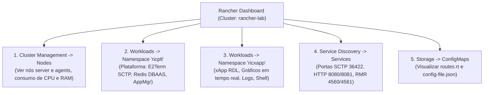

# Guia de Visualização e Monitoramento no Rancher Dashboard (O-RAN, RIC e xApps)

**Documento:** Manual de Navegação e Operação Visual via Rancher UI  
**Projeto:** xApp RDL (Resource and Decision Layer)  
**Ambiente:** Rancher Desktop / k3d / Near-RT RIC no WSL2  
**Data:** 25/08/2026  

---

## 1. Visão Geral e Acesso à Interface Web

O **Rancher Dashboard** centraliza o gerenciamento, a observabilidade e o diagnóstico visual de toda a infraestrutura do cluster Kubernetes, dos componentes da plataforma **Near-RT RIC (`ricplt`)** e das aplicações **xApps (`ricxapp`)**.

### Como Acessar o Rancher:
1. Abra o navegador no Windows (Chrome, Edge ou Firefox).
2. Acesse: `https://127.0.0.1:8443` (ou a URL configurada no seu Rancher Server / Rancher Desktop).
3. Aceite o aviso de certificado TLS autoassinado (*Avançado -> Continuar para localhost*).
4. Faça o login e selecione o cluster **`rancher-lab`** (ou `local`).

---

## 2. Mapa de Navegação da Stack O-RAN no Rancher



---

## 3. Navegação Passo a Passo por Componente

### 📍 3.1. Visualizar a Infraestrutura e Nós do Cluster (k3d)

* **Caminho no Rancher:** Menu Superior Esquerdo -> **Cluster Management** -> **Nodes** (ou aba *Nodes* do Dashboard).
* **O que inspecionar:**
  - `k3d-rancher-lab-server-0` (Control Plane) e `agent-0` (Worker Node).
  - Status operacional (`Active / Ready`).
  - **Uso real de CPU (Cores) e Memória RAM:** Verifique se o consumo do cluster está dentro da margem de segurança do seu WSL (recomendado manter abaixo de 80% da RAM total alocada).
  - Quantidade de Pods alocados em cada nó.

---

### 📍 3.2. Visualizar a Plataforma Near-RT RIC (Namespace `ricplt`)

1. No topo da tela, clique no seletor de **Namespace** e escolha **`ricplt`**.
2. No menu lateral esquerdo, clique em **Workloads -> Pods**.
3. **Componentes-chave do Near-RT RIC para verificar:**
   - **`deployment-ricplt-dbaas-redis`:** Shared Data Layer (SDL) da O-RAN para armazenamento de topologia de rede e histórico de UEs.
   - **`ricplt-e2term`:** Ponto de terminação das conexões SCTP com as antenas gNodeB e o simulador `ns-3`.
   - **`ricplt-appmgr`:** Gerenciador do ciclo de vida das xApps (DMS / Onboarding).
   - **`ricplt-rtmgr`:** Gerador dinâmico de tabelas de roteamento RMR.

---

### 📍 3.3. Visualizar a xApp RDL e seus Recursos (Namespace `ricxapp`)

1. Mude o seletor de **Namespace** para **`ricxapp`**.
2. Vá em **Workloads -> Deployments** (ou **Pods**).
3. Clique no nome do Pod ativo: **`ricxapp-iqos-xapp-rdl-...`**.
4. **Ferramentas interativas disponíveis na página do Pod:**

| Recurso | Como Usar no Rancher | Finalidade |
| :--- | :--- | :--- |
| **Gráficos em Tempo Real** | Aba *Metrics* do Pod | Monitora CPU (milicores) e consumo de RAM da xApp durante a tomada de decisão. |
| **Streaming de Logs** | Botão superior direito `⋮` -> **View Logs** | Exibe os logs estruturados JSON da RDL (`Conflito Detectado`, `Conflito Resolvido`, latências). |
| **Terminal Interativo** | Botão `⋮` -> **Execute Shell** | Abre um terminal interativo dentro do container `xapp` para inspecionar arquivos, rotas e dependências. |

---

### 📍 3.4. Visualizar Serviços de Rede e Portas (Service Discovery)

* **Caminho no Rancher:** Menu Lateral -> **Service Discovery -> Services**.
* **Selecione os namespaces `ricplt` e `ricxapp`:**
  - **`ricxapp-iqos-xapp-rdl-http`:**
    - Porta `8080/TCP`: Healthcheck (`/health` e `/ready`).
    - Porta `8081/TCP`: Prometheus Metrics (`/metrics`).
  - **`ricxapp-iqos-xapp-rdl-rmr`:**
    - Porta `4560/TCP`: Canal de Dados RMR (recebimento de `RIC_INDICATION` e `RDL_ACTION_PROPOSAL`).
    - Porta `4561/TCP`: Canal de Rotas RMR.
  - **`service-ricplt-dbaas-tcp`:** Porta `6379/TCP` (Redis).

---

### 📍 3.5. Visualizar Configurações e Rotas RMR (ConfigMaps)

* **Caminho no Rancher:** Menu Lateral -> **Storage -> ConfigMaps** (ou **More Resources -> Core -> ConfigMaps**).
* **O que verificar:**
  - Clique em **`iqos-xapp-rdl-config`** no namespace `ricxapp`.
  - Inspecione visualmente o conteúdo de `config-file.json` (portas RMR, timers de janela) e de `routes.rt` (tabela estática de message types da O-RAN).

---

## 4. Comandos de Linha de Comando para Cruzamento de Dados

Você pode validar os mesmos dados do Rancher diretamente pelo terminal:

```bash
# 1. Visão geral consolidada dos nós e recursos
kubectl top nodes
kubectl get nodes -o wide

# 2. Listar todos os componentes da plataforma e das xApps
kubectl get all -n ricplt
kubectl get all -n ricxapp

# 3. Consumo de CPU e Memória por Pod
kubectl top pods -n ricxapp
kubectl top pods -n ricplt
```
