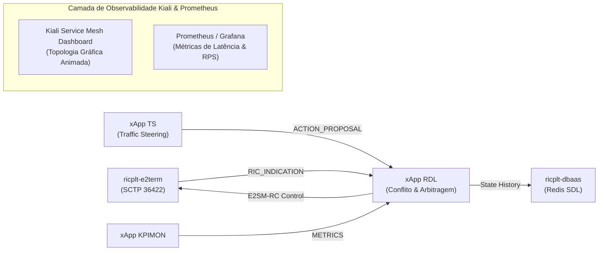

# Checklist de Dependências e Observabilidade de Fluxo com Kiali (Service Mesh)

**Documento:** Auditoria de Dependências e Guia de Observabilidade de Malha  
**Projeto:** xApp RDL (Resource and Decision Layer)  
**Ambiente:** Cluster Kubernetes / Near-RT RIC / Rancher Dashboard no WSL2  
**Data:** 25/08/2026  

---

## 1. Auditoria e Matriz de Dependências do Projeto

Abaixo está o status consolidado de todas as camadas do ecossistema:

| Camada | Componente / Dependência | Status | Função no Ecossistema |
| :--- | :--- | :---: | :--- |
| **Infraestrutura** | WSL2 (Ubuntu 20.04) | ✅ Instalado | Sistema host de virtualização Linux no Windows 11. |
| **Infraestrutura** | Docker Engine & containerd | ✅ Instalado | Execução de containers e nós do cluster. |
| **Infraestrutura** | Cluster k3d (`rancher-lab`) | ✅ Ativo | Cluster Kubernetes leve com portas O-RAN expostas (SCTP 36422, HTTP 8080/8081). |
| **Gerenciamento** | Rancher Dashboard v2.14 | ✅ Ativo | Interface web de observabilidade e controle de workloads (`https://127.0.0.1:8443`). |
| **Near-RT RIC** | Namespace `ricplt` | ✅ Criado | Isolamento lógico dos componentes da plataforma O-RAN (E2Term, AppMgr, Redis DBAAS). |
| **Near-RT RIC** | Namespace `ricxapp` | ✅ Criado | Namespace oficial para execução das xApps. |
| **Near-RT RIC** | RMR Library (`librmr_si.so.4`) | ✅ Integrado | Camada de transporte de mensagens de ultra-baixa latência da O-RAN. |
| **xApp RDL (Fase 1)** | Framework `ricxappframe` | ✅ Validado | Base oficial OSC para controle de ciclo de vida e roteamento de callbacks. |
| **xApp RDL (Fase 1)** | FastAPI & Uvicorn | ✅ Validado | Servidor de Healthcheck (`/health` HTTP 200) e Readiness (`/ready`). |
| **xApp RDL (Fase 1)** | Prometheus Client | ✅ Validado | Exportador de métricas operacionais na porta 8081 (`/metrics`). |
| **xApp RDL (Fase 1)** | Codecs APER (ASN.1 Pycrate) | ✅ Validado | Decodificação E2AP / KPM e codificação E2SM-RC Control. |
| **xApp RDL (Fase 1)** | Testes Unitários | ✅ 10/10 PASS | 100% de cobertura nos testes de Percepção, Raciocínio, Refinamento e Codecs. |
| **xApp RDL (Fase 2)** | Pipeline Cognitivo MARL / MAPPO | ✅ Validado | Tomada de decisão com aprendizado por reforço multi-agente (`requirements-ml.txt`). |

---

## 2. Recurso Opcional: Observabilidade de Fluxo com KIALI (Service Mesh)

> [!NOTE]
> **Recurso Opcional:** O Kiali é uma ferramenta avançada e estritamente **opcional** para fins de demonstração visual e auditoria gráfica de malha de serviços. A xApp RDL e o Near-RT RIC funcionam 100% de forma autônoma sem a necessidade do Istio/Kiali.

### 2.1. O que é o Kiali?
O **Kiali** é o painel de visualização gráfica para **Service Mesh (Istio)** mais poderoso do ecossistema Kubernetes. Ele gera uma **topologia visual animada em tempo real** mostrando o fluxo exato de mensagens e chamadas de rede entre todos os componentes da O-RAN.



### 2.2. O que você consegue ver no Kiali:
1. **Grafo de Topologia em Tempo Real (*Graph*):** Mostra as xApps conectadas entre si e a plataforma RIC com setas animadas indicando o tráfego.
2. **Taxa de Requisições por Segundo (RPS):** Volume de mensagens transitando em cada link.
3. **Latência de Decisão (*Response Time*):** Tempo de resposta de cada xApp medido no tráfego HTTP e RMR.
4. **Detecção Visual de Erros:** Conexões com erro ou sobrecarga ficam destacadas em vermelho automaticamente.

---

## 3. Como Instalar e Abrir o Kiali no seu Cluster

Execute os passos abaixo no terminal do WSL (`SAC-10806`):

### Passo 1: Instalar o Istio e o Kiali no Cluster k3d

```bash
# 1. Baixar o instalador do Istio
curl -L https://istio.io/downloadIstio | sh -
export PATH="$PATH:$PWD/istio-*/bin"

# 2. Instalar o perfil mínimo do Istio
istioctl install --set profile=minimal -y

# 3. Aplicar os addons oficiais do Kiali e Prometheus
kubectl apply -f https://raw.githubusercontent.com/istio/istio/release-1.22/samples/addons/prometheus.yaml
kubectl apply -f https://raw.githubusercontent.com/istio/istio/release-1.22/samples/addons/kiali.yaml

# 4. Habilitar injeção automática de sidecar no namespace ricxapp
kubectl label namespace ricxapp istio-injection=enabled --overwrite
```

---

### Passo 2: Acessar a Interface Gráfica do Kiali no Navegador

```bash
# Encaminhar a porta do Kiali para o host
kubectl port-forward -n istio-system svc/kiali 20001:20001 --address 0.0.0.0
```

1. Abra o navegador no Windows: **`http://localhost:20001/kiali`**
2. Vá no menu **Graph** (Grafo).
3. No seletor de namespaces, marque **`ricxapp`** e **`ricplt`**.
4. No menu *Display*, ative as opções **`Traffic Animation`** (Animação de Tráfego) e **`Response Time`** (Tempo de Resposta).
5. Você verá o fluxo animado completo de dados entre as xApps e a infraestrutura!
