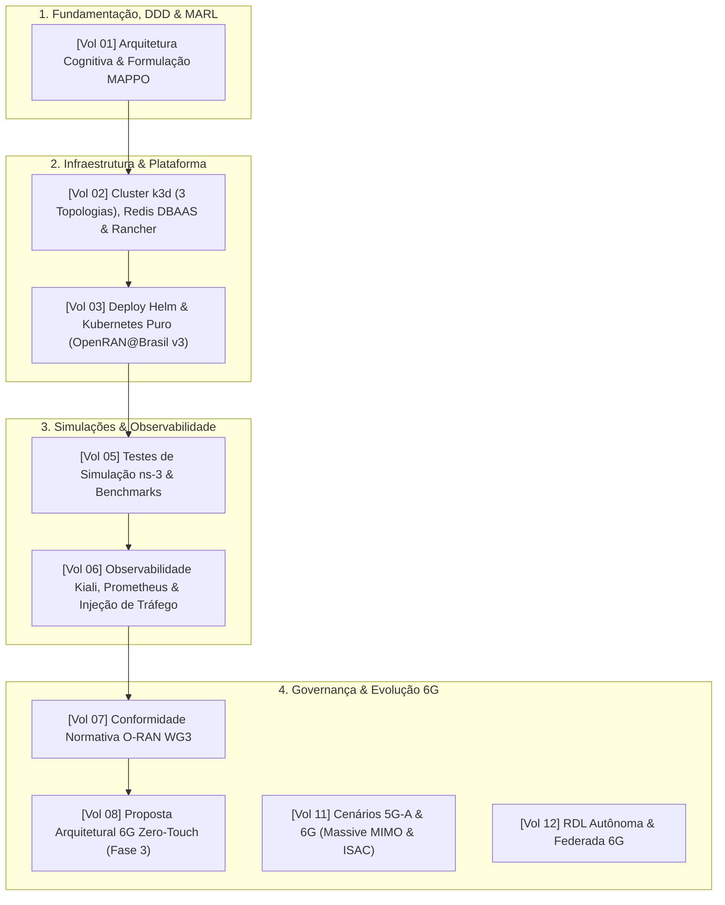

# Portal de Documentação Técnica: xApp RDL (Fase 2 — CA-RDL)

**Resource and Decision Layer com Aprendizado por Reforço Multiagente (MARL / MAPPO) e Governança Cognitiva**  
*Interoperabilidade com O-RAN ALLIANCE WG3, O-RAN SC (Release J), NORI (5G-LENA v5.1 / ns-3.48) e OpenRAN@Brasil Blueprint v3.*

---

### Navegação Multi-Fases do Projeto RDL (Resource and Decision Layer)

| Fase do Projeto | Descrição e Paradigma de Controle | Status de Implementação | Repositório Oficial |
| :---: | :--- | :---: | :---: |
| **Fase 1** | **RDL Determinística e Segura (H-RDL)** *Janela em lote (200ms), heurísticas TVS/EEVS, Safety Guards físicos e mapeamento formal E2AP/E2SM.* | **Implementada / Operacional** | [georgebarbosa3090/XApp-RDL-F1](https://github.com/georgebarbosa3090/XApp-RDL-F1) |
| **Fase 2 (Atual)** | **RDL Baseada em Contexto (CA-RDL)** *Aprendizado por Reforço Multiagente (MARL / MAPPO), observabilidade Service Mesh e cognição contextual 5G-A/6G.* | **Ativa / Em Evolução** | [georgebarbosa3090/XApp-RDL-F2](https://github.com/georgebarbosa3090/XApp-RDL-F2) |
| **Fase 3** | **RDL Autônoma e Federada 6G (Zero-Touch)** *Inteligência distribuída, orquestração por intenção (Intent-Driven) e coordenação Cross-Tier Non-RT / Near-RT / NTN.* | **Roadmap / Planejada** | *Em especificação futura* |

---

## 1. Estrutura e Volumes da Documentação Técnica

A documentação da **xApp CA-RDL (Fase 2)** está organizada em volumes modulares cobrindo todo o ciclo de vida:

---

## 2. Índice dos Volumes Técnicos

### Arquitetura Core e Modelagem
* **[Volume 01: Arquitetura e Modelagem Matemática](01_arquitetura_e_modelagem_matematica.md)**: Clean Architecture, formulação de observação canônica ($\mathbb{R}^{60}$), ator-crítico descentralizado (CTDE) e modelos de recompensa multiobjetivo.
* **[Volume 09: Relatório Técnico Detalhado](09_relatorio_tecnico_detalhado_fase2.md)**: Detalhamento exaustivo dos algoritmos cognitivos, agentes de refinamento com quarentena comportamental (*Anti-Rogue Shield*) e mapeamento E2AP.

### Infraestrutura, Deploy e Observabilidade
* **[Volume 02: Infraestrutura de Cluster k3d e Rancher](02_infraestrutura_cluster_k3d_e_rancher.md)**: Topologias Single-Node (~450MB), Dual-Node (~900MB) e Multi-Node (~1.5GB) com mapeamento de portas O-RAN.
* **[Volume 03: Guia de Deploy Helm e Kubernetes](03_guia_deploy_helm_e_k8s.md)**: Implantação rápida via perfil OpenRAN@Brasil Blueprint v3 (`deploy/openran-br-v3/`) e Helm Chart oficial `v2.0.0`.
* **[Volume 06: Observabilidade Kiali e Injeção de Tráfego](06_observabilidade_kiali_e_injecao_trafego.md)**: Service Mesh Istio, métricas Prometheus em tempo real e visualização de topologia inter-xApps no Kiali.

### Simulações ns-3 e Validação Experimental
* **[Volume 05: Testes de Simulação ns-3 e Benchmarks](05_testes_simulacao_ns3_e_benchmarks.md)**: Co-simulação Closed-Loop via NORI, 5G-LENA v5.1 e execução de cenários C++.
* **[Volume 11: Cenários de Teste 5G, 5G-Advanced e 6G](11_cenarios_de_teste_5g_5ga_6g_e_requisitos.md)**: Cenários 1 a 5 (EEVS, TVS, Multi-Carrier Massive MIMO, 6G ISAC e Governança Cross-Tier).
* **[Volume 14: Relatório de Desempenho Comparativo](14_relatorio_resultados_e_desempenho_comparativo_fase2.md)**: Validação estatística multi-semente ($N=30$, IC 95%) e comparativos com a Fase 1.
* **[Volume 15: Avaliação no Testbed UFPA PCT OpenRAN@Brasil](15_relatorio_avaliacao_testbed_ufpa_pct_openran_brasil_rdl.md)**: Roteiro de integração e plano de testes físicos no testbed nacional.

### Governança e Evolução 6G (Fase 3)
* **[Volume 07: Relatórios de Conformidade e Governança O-RAN](07_relatorios_conformidade_e_governanca.md)**: Matriz de conformidade formal com padrões O-RAN Alliance e 3GPP.
* **[Volume 08: Proposta Arquitetural RDL Fase 3 (6G)](08_proposta_arquitetural_rdl_fase3.md)**: Arquitetura Cross-Tier Near-RT / Non-RT / NTN e gêmeos digitais.
* **[Volume 10: Matriz de Validade e Pontos de Atenção Fase 3](10_matriz_validade_e_pontos_de_atencao_fase3.md)**: Análise de riscos e viabilidade técnica para 6G Zero-Touch.
* **[Volume 12: RDL Autônoma e Federada 6G](12_rdl_autonoma_e_federada_6g.md)**: Aprendizado Federado distribuído e orquestração baseada em intenção (*Intent-Driven*).

### Matriz Normativa e Catálogo Visual
* **[Matriz de Versões e Compatibilidade O-RAN](e2/version-matrix.md)**: E2AP v02.03, E2SM-KPM v03.00, E2SM-RC v01.03 e Release J.
* **[Fontes Normativas e Especificações](e2/specification-sources.md)**: Especificações de referência O-RAN WG3.
* **[Catálogo Temático de Figuras (docs/figures/README.md)](figures/README.md)**: 44 ilustrações científicas estruturadas em 300 DPI.

---

## 3. Trilhas de Leitura Recomendadas

| Perfil de Engenharia / Pesquisa | Sequência Sugerida |
| :--- | :--- |
| **Pesquisador de IA / MARL 6G** | [Volume 01](01_arquitetura_e_modelagem_matematica.md) $\rightarrow$ [Volume 11](11_cenarios_de_teste_5g_5ga_6g_e_requisitos.md) $\rightarrow$ [Volume 14](14_relatorio_resultados_e_desempenho_comparativo_fase2.md) $\rightarrow$ [Volume 12](12_rdl_autonoma_e_federada_6g.md) |
| **Engenheiro de Deploy e Infraestrutura** | [Volume 02](02_infraestrutura_cluster_k3d_e_rancher.md) $\rightarrow$ [Volume 03](03_guia_deploy_helm_e_k8s.md) $\rightarrow$ [Volume 06](06_observabilidade_kiali_e_injecao_trafego.md) |
| **Especialista em Simulação ns-3 / NORI** | [Volume 05](05_testes_simulacao_ns3_e_benchmarks.md) $\rightarrow$ [Volume 11](11_cenarios_de_teste_5g_5ga_6g_e_requisitos.md) $\rightarrow$ [Matriz E2](e2/version-matrix.md) |
| **Arquiteto de Redes e Governança O-RAN** | [Volume 01](01_arquitetura_e_modelagem_matematica.md) $\rightarrow$ [Volume 07](07_relatorios_conformidade_e_governanca.md) $\rightarrow$ [Volume 08](08_proposta_arquitetural_rdl_fase3.md) |

---

[Voltar para a Página Inicial (README.md)](../README.md)
