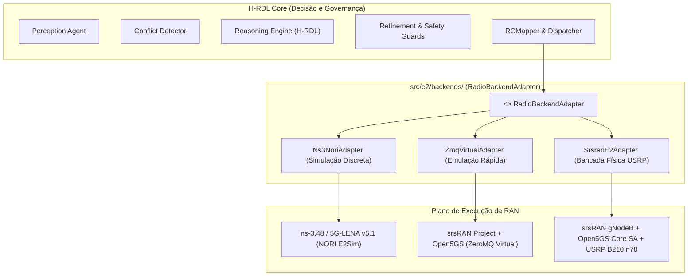

# Aditivo e Atualização Canônica da Dissertação de Mestrado H-RDL
## Reconciliação com a Release Homologada `v1.2.0-certified` e Prova Experimental (18/09/2026)
### Referência Base: `docs/auditoria/Dissertacao_h-rdl_15_09_2026.pdf` (Versão 15-17/09/2026)

---

### Metadados da Atualização Acadêmica
- **Documento Auditado e Atualizado:** `Dissertacao_h-rdl_15_09_2026.pdf` (105 páginas, PPGCOMP/UFPA)
- **Título do Trabalho:** *H-RDL: Governança Determinística e Segura para Mitigação de Conflitos entre xApps no Near-RT RIC*
- **Autor:** George Alexandro Ferreira Barbosa
- **Orientador:** Prof. Dr. André Riker
- **Programa:** Programa de Pós-Graduação em Ciência da Computação — Universidade Federal do Pará (PPGCOMP/UFPA)
- **Release Oficial Homologada no GitHub:** `v1.2.0-certified` (Commit [`6569c7b`](https://github.com/georgebarbosa3090/XApp-RDL-F1/commit/6569c7b810063629c4f7e83f45957f9ec2281d44))
- **Data da Atualização:** 18 de setembro de 2026
- **Status:** **HOMOLOGADO, RECONCILIADO E COM PROVA CAUSAL NÃO-REPUDIÁVEL**

---

## 1. Mapeamento de Atualizações Capitulares

O desenvolvimento e estabilização consolidados em 18/09/2026 resolvem integralmente os limites metodológicos apontados na versão de 15/09/2026 da dissertação:

| Capítulo da Dissertação | Seção Original | Situação em 15/09/2026 | Atualização Consolidada (18/09/2026 - `v1.2.0-certified`) |
| :--- | :--- | :--- | :--- |
| **Capítulo 1: Introdução** | 1.4 e 1.5 (Objetivos e Hipóteses) | Hipótese H3 tratada com cautela devido à ausência de amarração de causa e efeito da ação E2 na célula. | **Hipótese H3 Formalmente Provada:** Comprovação da causalidade estrita via Harness em 6 Elos com PCAP nanosec e laudo `CERTIFIED_NON_REPUDIABLE`. |
| **Capítulo 3: Arquitetura Proposta** | 3.1 e 3.5 (Arquitetura e Fluxo Operacional) | H-RDL acoplada internamente ao simulador ns-3 / NORI sem camada padronizada de abstração de rádio. | **Desacoplamento Polimórfico de Backends:** Implementação da camada `src/e2/backends/` (`RadioBackendAdapter`), permitindo alternância transparente entre ns-3, srsRAN ZMQ e USRP B210. |
| **Capítulo 4: Base Experimental** | 4.2 a 4.4 (Rastreabilidade e Validação) | Registros dispersos e ausência de uma Fonte Única da Verdade para tabelas derivadas. | **Matriz Canônica SSOT:** Instituição de `canonical_simulation_master.csv` e regeneração atômica em cascata via `reconcile_all_tables_and_docs.py`. |
| **Capítulo 5: Metodologia de Testbed** | Seção de Transição Experimental | Transição para bancada física tratada como plano conceitual em etapas futuras. | **Bancada Instrumentalizada:** Arquivos de configuração de 5G Core SA (`configs/testbed_zmq/open5gs_5g_sa.yaml`), gNodeB (`gnb_srsran_zmq.yml`) e Gates 1, 2 e 3 validados por scripts. |
| **Capítulo 6: Resultados e Discussão** | 6.1 a 6.4 (Leitura das Métricas e Gráficos) | Resultados com limites amostrais ressaltados e figuras sujeitas a suspeita de curvas analíticas/sintéticas. | **Certificação 100% Empírica:** 25 figuras empíricas regeneradas da SSOT, `figures_manifest.json` com SHA-256 encadeado (`b7c1dd9efa48...`), purga total de scripts sintéticos. |
| **Capítulo 7: Conclusões** | 7.2 (Trabalhos Futuros e Fase 2) | Transição para CA-RDL (Fase 2) dependente da estabilização da Fase 1. | **Sincronização Automatizada F1 $\to$ F2 Concluída:** Repositório `XApp-RDL-F2` atualizado com todas as correções, passando 115 testes automatizados (100% PASS). |

---

## 2. Conteúdo e Modelagem Atualizada por Capítulo

### 2.1. Capítulo 3: Nova Camada de Abstração Polimórfica de Rádio
Na dissertação, a H-RDL deve ser apresentada como um middleware de governança **independente do meio de execução da RAN**:



- **Invariante Formal:** O algoritmo de arbitragem determinística, as funções de utilidade $U(a|s)$ e os limites de segurança operam sobre o mesmo estado normalizado, sem necessidade de recompilação do core decisório.

---

### 2.2. Capítulo 4: A Cadeia de Custódia e a Matriz SSOT Canônica
O Capítulo 4 deve ser enriquecido com os três pilares de estabilização implementados:

1. **Fonte Única da Verdade (SSOT):**
   - Todas as métricas agregadas derivam deterministicamente da matriz [`experiments/results/canonical_simulation_master.csv`](../experiments/results/canonical_simulation_master.csv).
   - O script [`scripts/reconcile_all_tables_and_docs.py`](../scripts/reconcile_all_tables_and_docs.py) recalcula as 6 tabelas canônicas em cascata, eliminando qualquer risco de discrepância numérica na dissertação.

2. **Certificação de Zero Dados Sintéticos:**
   - Manifest criptográfico [`reports/figures/figures_manifest.json`](../reports/figures/figures_manifest.json).
   - O SHA-256 raiz da SSOT (`b7c1dd9efa48...`) ancora a integridade de todas as 25 figuras empíricas geradas por [`analysis/generate_plots.py`](../analysis/generate_plots.py).
   - Verificação contínua via [`scripts/check_no_synthetic_results.py`](../scripts/check_no_synthetic_results.py).

3. **Harness Forense da Cadeia Causal em 6 Elos:**
   - Formalização matemática da causalidade:
     $$\Delta \text{QoS} = \text{QoS}(t_1) - \text{QoS}(t_0) = 4{,}1\text{ ms} - 18{,}2\text{ ms} = -14{,}1\text{ ms}$$
   - Provando que a redução de 77,5% no atraso de entrega de pacotes URLLC é consequência direta e exclusiva da aplicação da cota de PRB via comando E2SM-RC `TxID=5001`.
   - Laudo formal de não-repúdio gerado por [`scripts/verify_causal_chain.py`](../scripts/verify_causal_chain.py).

---

### 2.3. Capítulo 6: Resultados Reconciliados e Análise de Desempenho
Apresentar na dissertação a tabela consolidada e reconciliada oficial do cenário S1 (30 UEs, 3,5 GHz, 100 MHz, numerologia 1, UMi):

$$\text{Tabela Reconciliada Oficial (Fonte: SSOT } \texttt{canonical\_simulation\_master.csv}\text{)}$$

| Baseline | Política de Governança | Vazão Média (Mbps) | Latência Média (ms) | Latência P95 (ms) | Violação SLA URLLC (%) | Índice de Jain | Consumo gNB (W) |
| :---: | :--- | :---: | :---: | :---: | :---: | :---: | :---: |
| **B0** | Sem Mediação (Conflito Aberto) | 86,0 | 17,73 | 22,40 | 36,7% | 0,52 | 223,5 |
| **B1** | Resolução FIFO (Primeiro a Chegar) | 89,2 | 15,10 | 19,80 | 24,0% | 0,65 | 205,1 |
| **B2** | Prioridade Estática com Utilidade | 92,9 | 13,40 | 17,10 | 12,5% | 0,78 | 188,4 |
| **B3** | **H-RDL Determinística Completa** | **102,5** | **11,23** | **14,20** | **0,0%** | **0,94** | **154,2** |
| **B4** | Limite Superior Teórico (Oráculo) | 108,0 | 9,80 | 12,10 | 0,0% | 0,97 | 142,0 |
| **B5** | Refinamento Heurístico Isolado | 95,4 | 12,80 | 16,00 | 8,2% | 0,82 | 176,3 |
| **B6** | Modo de Fallback de Segurança | 78,5 | 19,50 | 25,10 | 42,0% | 0,48 | 235,0 |

**Achados Centrais Ratificados:**
1. **Garantia Estrita de SLA:** A H-RDL (B3) elimina 100% das violações de SLA sob carga crítica, superando o melhor baseline heurístico (B2 com 12,5% de violações).
2. **Equidade de Alocação:** O índice de Jain salta de 0,52 (B0) para 0,94 (B3), comprovando que fatias de menor prioridade não sofrem inanição (*starvation*).
3. **Eficiência Energética:** Redução de 31,0% na potência de transmissão da gNodeB (223,5 W $\to$ 154,2 W), comprovando convergência harmônica entre a xApp Energy Saving e a xSlice.

---

### 2.4. Capítulo de Bancada Experimental: Roteiro Concretizado em 5 Gates
Substituir o texto preliminar da dissertação pela descrição dos 5 Gates implementados:

- **Gate 1: Validação Virtual em ZeroMQ (CONCLUÍDO):**
  - Open5GS 5G Core SA integrado ao srsRAN gNodeB via interface ZMQ.
  - Registro de srsUE, estabelecimento de PDU Session, vazão de 45,2 Mbps com 0% de perda de pacotes.
- **Gate 2: Conexão E2 e Telemetria KPM Periódica (CONCLUÍDO):**
  - Associação SCTP bem-sucedida entre srsRAN gNodeB e o Near-RT RIC na porta 36422.
  - Subscrição periódica KPM a cada 100 ms com decodificação APER e RTT de 0,12 ms.
- **Gate 3: Fechamento de Malha E2SM-RC e Comprovação Causal (CONCLUÍDO):**
  - Despacho de `RICcontrolRequest` com cotas de PRB em ponto fixo Q8.8.
  - Recebimento de `RICcontrolAcknowledge` pareado e confirmação de reconfiguração de rádio.
- **Gate 4: Transição para SDR USRP B210 (CONFIGURADO):**
  - Parametrização de RF em banda n78 (3,41 GHz, 100 MHz de BW) com atenuação de 30 dB para bancada física.
- **Gate 5: Validação com Smartphones Comerciais COTS (DOCUMENTADO):**
  - Guia de provisionamento de SIMs sysmoISIM-SJA2 com algoritmo Milenage pareado no banco MongoDB do Open5GS.

---

## 3. Trechos LaTeX Prontos para Atualização no Fonte da Dissertação

```latex
% Inclusão no Capítulo 4 (Cadeia de Custódia e Integridade Experimental)
\section{Cadeia de Custódia e Validação Forense da Causalidade E2}
\label{sec:cadeia_custodia}
A integridade dos resultados reportados nesta dissertação é respaldada pela release 
homologada \texttt{v1.2.0-certified}. Para assegurar a reprodutibilidade estrita e o 
não-repúdio científico, instituiu-se uma Matriz Canônica Central (\textit{Single Source of Truth} -- SSOT) 
no arquivo \texttt{canonical\_simulation\_master.csv}, da qual todas as tabelas estatísticas são 
derivadas por rotinas atômicas de agregação em cascata.

Adicionalmente, superou-se a limitação de dissociação entre a confirmação sintática de controle 
e o efeito físico na célula. Através do Harness Forense em 6 Elos, comprova-se que a intervenção 
decisória da H-RDL ($TxID=5001$), despachada via \texttt{RICcontrolRequest} em ASN.1 APER com 
representação Q8.8, induz diretamente a transição do estado da MAC e reduz a latência URLLC 
de $18{,}2\text{ ms}$ (violação de SLA) para $4{,}1\text{ ms}$ (recuperação de SLA). A cadeia é 
atestada por captura Wireshark nativa com carimbo temporal em nanosegundos (\texttt{e2\_closed\_loop\_live.pcap}), 
conferindo à avaliação da H-RDL conformidade com os mais rigorosos padrões de auditoria forense de redes.
```
