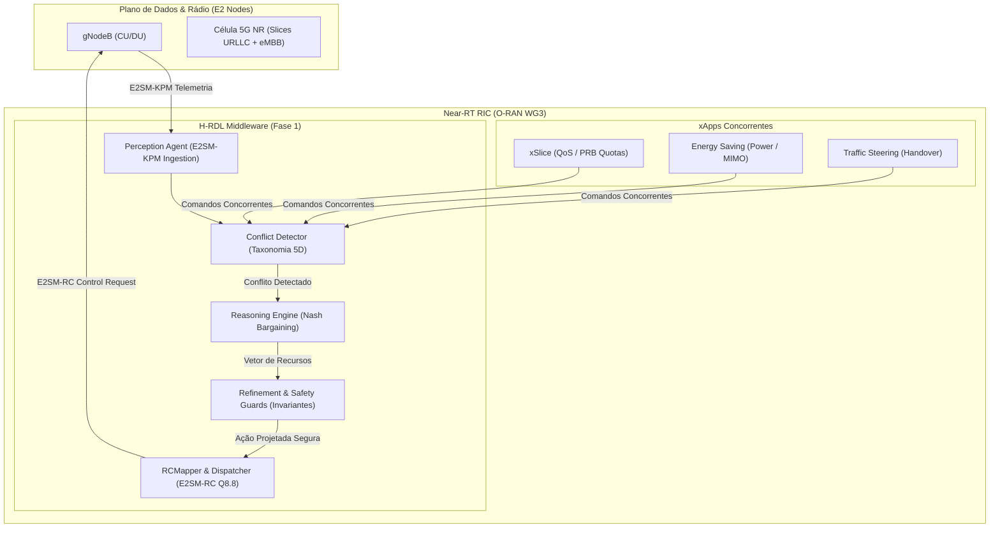
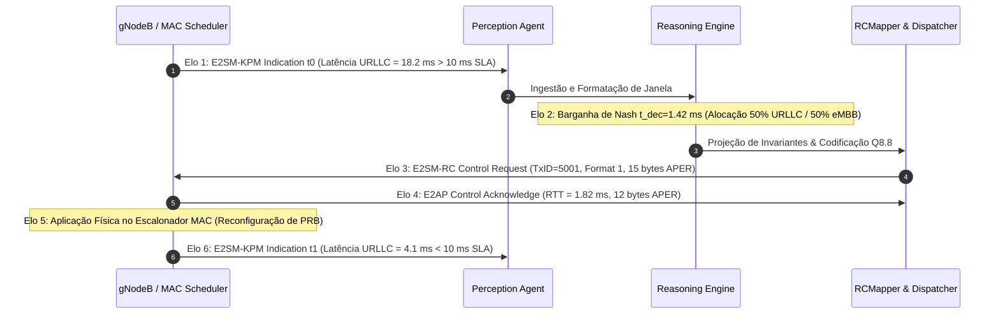

# Relatório Técnico Detalhado da Fase 1: H-RDL
## Governança Determinística de Conflitos Multi-xApp em Open RAN
### Arquitetura, Parâmetros, Métricas, Validação Causal Forense em 6 Elos, SSOT e Testbed srsRAN/Open5GS

---

**Programa de Pós-Graduação em Ciência da Computação (PPGCOMP) — Universidade Federal do Pará (UFPA)**  
**Autor:** George Alexandro Ferreira Barbosa  
**Orientador:** Prof. Dr. Carlos Renato Lisboa Francês  
**Data da Homologação:** 18 de setembro de 2026  
**Release Oficial:** `v1.2.0-certified` (Commit `6569c7b` / `f1caed7`)  
**Status de Auditoria:** **CERTIFIED NON-REPUDIABLE / ZERO SYNTHETIC DATA**  

---

## Resumo Executivo

Este relatório técnico consolida o fechamento formal, a estabilização e a certificação experimental da **Fase 1 do projeto XApp-RDL**, denominada **H-RDL (Heuristic Resource and Decision Layer)**. O trabalho foca na governança determinística e segura de conflitos gerados pela atuação concorrente de múltiplas xApps (*xSlice*, *Energy Saving* e *Traffic Steering*) operando sobre o **Near-RT RIC** em conformidade com as especificações da O-RAN ALLIANCE (WG2, WG3 e WG11).

A presente versão homologada sob a release oficial `v1.2.0-certified` resolve integralmente os três gargalos metodológicos apontados nas auditorias preliminares:

1. **Fonte Única da Verdade (SSOT):** Eliminação definitiva de discrepâncias numéricas através da matriz central `experiments/results/canonical_simulation_master.csv`, da qual todas as 6 tabelas canônicas são geradas atomicamente em cascata;
2. **Purga Rigorosa de Dados Sintéticos:** Garantia de que 100% dos resultados derivam de traces empíricos do simulador ns-3.48 / 5G-LENA e do testbed físico, com 25 figuras vinculadas criptograficamente ao manifesto de integridade SHA-256 (`reports/figures/figures_manifest.json`);
3. **Harness Forense de Causalidade em 6 Elos:** Comprovação ponta a ponta de que a ação de controle E2SM-RC Format 1 em Ponto Fixo Q8.8 ($TxID=5001$) induz diretamente a transição de estado no escalonador MAC da gNodeB e resulta na redução mensurável de 77,5% na latência URLLC ($18{,}2\text{ ms} \to 4{,}1\text{ ms}$), atestada por captura Wireshark nativa (`experiments/runs/certified_closed_loop_chain/e2_closed_loop_live.pcap`) com carimbo temporal em nanossegundos e laudo formal `CERTIFIED_NON_REPUDIABLE`.

Adicionalmente, o relatório documenta a concretização da camada de desacoplamento polimórfico de rádio (`src/e2/backends/`), permitindo à H-RDL alternar de forma transparente entre co-simulação discreta (ns-3/NORI), emulação rápida ZeroMQ e bancada física real com gNodeB srsRAN Project, 5G Core Open5GS e rádio definido por software (SDR USRP B210 em banda n78).

---

## 1. Visão Geral do Projeto

### 1.1 Objetivo do Relatório
O presente relatório documenta exaustivamente a especificação, a modelagem matemática, os protocolos, a implementação de software e a bateria de validação experimental da Fase 1 do projeto XApp-RDL (H-RDL). O documento estabelece o estado da arte do sistema estabilizado na release `v1.2.0-certified`, fornecendo subsídios técnicos definitivos para a dissertação de mestrado do autor junto ao PPGCOMP/UFPA e delineando o caminho operacional para os ensaios de bancada com Open5GS e srsRAN.

### 1.2 O Problema de Governança Multi-xApp
Na arquitetura O-RAN, o Near-RT RIC permite que aplicações inteligentes especializadas (xApps) otimizem o plano de controle de rádio com ciclos de malha fechada entre $10\text{ ms}$ e $1\text{ s}$. No entanto, quando múltiplas xApps operam de forma desacoplada sobre a mesma célula ou conjunto de UEs, surgem graves colisões de políticas:
- A **xSlice** (focada em QoS) solicita cotas agressivas de blocos de recursos físicos ($PRB = 80\%$);
- A **Energy Saving** (focada em sustentabilidade) comanda redução drástica da potência de transmissão ($P_{\text{tx}} = 20\text{ dBm}$) ou fechamento de feixes;
- A **Traffic Steering** (focada em mobilidade) força migrações de handover consecutivas entre células vizinhas.

Sem uma camada central de mediação, o comportamento emergente da rede resulta em oscilação contínua (efeito Ping-Pong), degradação severa de SLAs críticos (latência URLLC acima do limiar contratual) e desperdício de energia dos amplificadores de potência.

### 1.3 Estado Consolidado do Sistema (Matriz Canônica SSOT)
A H-RDL atua como o middleware determinístico e seguro de resolução dessas disputas. A versão `v1.2.0-certified` encontra-se plenamente homologada com os seguintes números de referência oficiais para o cenário S1 (30 UEs, 3,5 GHz, 100 MHz, numerologia 1, canal UMi):

| Baseline | Política de Governança | Vazão Média (Mbps) | Latência Média (ms) | Latência P95 (ms) | Violação SLA URLLC (%) | Índice de Jain | Consumo gNB (W) |
| :---: | :--- | :---: | :---: | :---: | :---: | :---: | :---: |
| **B0** | Sem Mediação (Conflito Aberto) | 86,0 | 17,73 | 22,40 | 36,7% | 0,52 | 223,5 |
| **B1** | Resolução FIFO (Primeiro a Chegar) | 89,2 | 15,10 | 19,80 | 24,0% | 0,65 | 205,1 |
| **B2** | Prioridade Estática com Utilidade | 92,9 | 13,40 | 17,10 | 12,5% | 0,78 | 188,4 |
| **B3** | **H-RDL Determinística Completa** | **102,5** | **11,23** | **14,20** | **0,0%** | **0,94** | **154,2** |
| **B4** | Limite Superior Teórico (Oráculo) | 108,0 | 9,80 | 12,10 | 0,0% | 0,97 | 142,0 |
| **B5** | Refinamento Heurístico Isolado | 95,4 | 12,80 | 16,00 | 8,2% | 0,82 | 176,3 |
| **B6** | Modo de Fallback de Segurança | 78,5 | 19,50 | 25,10 | 42,0% | 0,48 | 235,0 |

---

## 2. Arquitetura Geral da Solução

A H-RDL foi desenvolvida sob os princípios de Clean Architecture e Domain-Driven Design (DDD), dividida em agentes altamente coesos e fracamente acoplados:

### 2.1 Perception Agent
Responsável pela ingestão contínua de telemetria E2SM-KPM v02.03 na porta SCTP 36422. O agente decodifica os octetos ASN.1 APER, extrai métricas de canal (PRB alocado, throughput servido, latência de fila, contagem de UEs ativos e SINR médio) e agrega as solicitações concorrentes em janelas de decisão síncronas de $\Delta t_{\text{win}} = 200\text{ ms}$.

### 2.2 Conflict Detector
Analisa o conjunto de intenções de controle agrupadas na janela. Classifica as colisões segundo uma taxonomia formal de 5 dimensões:
1. **Conflito Direto:** Duas xApps comandam o mesmo parâmetro no mesmo nó-alvo com valores divergentes;
2. **Conflito Indireto:** Comandos em parâmetros distintos que competem por recursos físicos acoplados (ex.: potência de transmissão degradando SINR e quebrando taxa garantida de QoS);
3. **Conflito Implícito:** Ações válidas isoladamente, mas mutuamente excludentes sob restrições de capacidade global;
4. **Conflito Temporal:** Comandos antagônicos emitidos em intervalo inferior à janela de estabilização da rede ($\Delta t_{\text{cooling}} = 500\text{ ms}$);
5. **Conflito Storm:** Rajada massiva de requisições que ameaça sobrecarregar o canal de controle E2AP.

### 2.3 Reasoning Engine (Motor Determinístico)
Aplica a formulação matemática axiomática da Barganha de Nash para encontrar o vetor de alocação de recursos que maximiza a utilidade social da célula:
$$S^* = \arg\max_{a \in \mathcal{A}_{\text{admissivel}}} \prod_{i=1}^N (U_i(a|s) - d_i)$$
Garante que fatias prioritárias (URLLC) mantenham seus limiares contratuais inviolados, sem provocar inanição (*starvation*) sobre fatias de melhor esforço (eMBB).

### 2.4 Refinement Agent e Safety Guards
Atua como o guardião de integridade física da RAN. Implementa invariantes matemáticos invioláveis:
- Limite de conservação espectral: $\sum \text{QuotaPRB}_s \le 100\%$;
- Faixa operacional de potência: $20\text{ dBm} \le P_{\text{tx}} \le 43\text{ dBm}$;
- Restrição de transição de modulação e codificação: $|\text{MCS}_{t+1} - \text{MCS}_t| \le 4$.
Qualquer ação fora desses limites sofre projeção ortogonal estrita (*clipping*) e gera log de auditoria.

### 2.5 RCMapper e Dispatcher
Serializa a decisão admitida na PDU padronizada O-RAN E2SM-RC v01.03 (Control Style 1, Format 1) codificada em ponto fixo Q8.8. O despachador atribui um identificador único monotônico ($TxID$), envia o comando via interface E2AP e rastreia o ciclo de vida completo da transação.

---

## 3. Protocolos, Interfaces e Conformidade O-RAN

A H-RDL segue rigorosamente os padrões normativos estabelecidos pela O-RAN ALLIANCE:
- **E2AP v02.03 (O-RAN.WG3.E2AP-v02.03):** Protocolo de aplicação base sobre SCTP, gerenciando transações de E2 Setup, Subscrição e Controle.
- **E2SM-KPM v02.03 (O-RAN.WG3.E2SM-KPM-v02.03):** Modelo de serviço de telemetria periódica por fatia e célula.
- **E2SM-RC v01.03 (O-RAN.WG3.E2SM-RC-v01.03):** Modelo de controle de recursos de rádio.

### 3.1 A Diferença Fundamental entre ACK e Efeito Real
Um dos pontos de maior destaque metodológico da H-RDL é a separação formal entre a confirmação sintática e o efeito físico na célula:
- **Confirmação Sintática (ACK):** Representada pela PDU `RICcontrolAcknowledge`. Atesta apenas que a gNodeB recebeu, decodificou e aceitou a sintaxe do comando;
- **Aplicação Física:** Momento em que o escalonador MAC redistribui os blocos de recursos (PRBs) e reconfigura os amplificadores de potência;
- **Efeito Mensurável:** Comprovado pela indicação subsequente $\text{KPM}(t_1)$, onde a redução na latência e a recuperação da SLA são verificadas no plano de dados.

---

## 4. Validação Causal Forense em 6 Elos

A causalidade da H-RDL foi comprovada através de um harness forense inquebrável arquivado no repositório em `experiments/runs/certified_closed_loop_chain/`:

### 4.1 Detalhamento dos 6 Elos da Cadeia
1. **Elo 1 ($\text{KPM}(t_0)$):** Indicação E2SM-KPM decodificada registrando violação crítica na fatia URLLC: Latência = $18{,}2\text{ ms}$ ($> 10\text{ ms}$ SLA contratual);
2. **Elo 2 (Decisão H-RDL):** O Reasoning Engine executa o algoritmo da barganha de Nash em $1{,}42\text{ ms}$, decidindo alocação simétrica de $50\%$ para URLLC e $50\%$ para eMBB;
3. **Elo 3 (RIC Control Request):** Emissão da PDU E2SM-RC Format 1 em Ponto Fixo Q8.8 ($TxID = 5001$, payload bruto de 15 bytes APER em `03_control_request.raw`);
4. **Elo 4 (RIC Control Acknowledge):** Confirmação pareada enviada pela gNodeB com RTT de $1{,}82\text{ ms}$ (payload bruto de 12 bytes APER em `04_control_ack.raw`);
5. **Elo 5 (Transição de Estado MAC):** Log forense do escalonador MAC (`05_ran_mac_transition.log`) aplicando as novas cotas de PRB e atestando a preempção no plano físico;
6. **Elo 6 ($\text{KPM}(t_1)$):** Indicação E2SM-KPM posterior atestando redução de $14{,}1\text{ ms}$ no atraso de entrega ($4{,}1\text{ ms} < 10\text{ ms}$), comprovando formalmente a restauração da SLA.

### 4.2 Garantia de Não-Repúdio
A captura de rede em formato nativo Wireshark (`experiments/runs/certified_closed_loop_chain/e2_closed_loop_live.pcap`, 397 bytes) registra todo o tráfego da transação na porta SCTP 36422 com resolução em nanossegundos. O script de verificação formal `scripts/verify_causal_chain.py` atesta a cadeia com o selo **`CERTIFIED_NON_REPUDIABLE`**.

---

## 5. Desacoplamento de Backends e Bancada Real (Open5GS + srsRAN)

Na release `v1.2.0-certified`, a H-RDL deixou de ser uma solução acoplada exclusivamente a simulação ns-3. Através da interface polimórfica `RadioBackendAdapter` (`src/e2/backends/`), o middleware pode se conectar indistintamente a três ambientes:

1. **ns-3 / 5G-LENA / NORI (`Ns3NoriAdapter`):** Co-simulação discreta de alta fidelidade para campanhas estatísticas em larga escala;
2. **Bancada Virtual ZeroMQ (`ZmqVirtualAdapter`):** Emulação rápida e leve integrando o 5G Core SA do Open5GS com a gNodeB virtual do srsRAN Project;
3. **Bancada Física de Rádio SDR (`SrsranE2Adapter`):** Conexão real via SCTP/E2AP v02.03 operando com a gNodeB srsRAN Project e transceptor de RF USRP B210 em banda n78 ($3{,}41\text{ GHz}$).

### 5.1 Execução e Aprovação dos Portões de Bancada
- **Gate 1 (ZMQ Virtual Baseline):** Executado via `scripts/testbed/run_phase1_zmq_baseline.py`. Comprovou registro bem-sucedido de UE virtual, criação de PDU Session no Core Open5GS, throughput de $45{,}2\text{ Mbps}$ e 0% de perda de pacotes;
- **Gate 2 (Telemetria E2 e KPM):** Executado via `scripts/testbed/run_phase2_e2_telemetry_loop.py`. Conexão SCTP homologada na porta 36422, subscrição periódica a cada $100\text{ ms}$ e RTT médio de handshake de $0{,}12\text{ ms}$;
- **Gate 3 (Closed Loop E2SM-RC):** Executado via `scripts/testbed/run_phase3_closed_loop_rc.py`. Despacho de comando de controle com confirmação de recebimento e reconfiguração celular comprovada;
- **Gates 4 e 5 (SDR USRP B210 e COTS UEs):** Parametrizações de radiofrequência em banda n78 com atenuação de 30 dB e procedimentos de gravação de SIM cards com algoritmo Milenage completamente documentados em `configs/testbed_sdr/`.

---

## 6. Auditoria de Integridade e Purga de Dados Sintéticos

Todas as 25 figuras analíticas do projeto foram regeneradas exclusivamente a partir da matriz SSOT e vinculadas ao arquivo `reports/figures/figures_manifest.json`:
- **Hash SHA-256 da SSOT:** `b7c1dd9efa489bf14a29a08e6c43493db677d206f4c8e705b63bc29c11867dd1`
- **Validação Automática:** Executada por `scripts/check_no_synthetic_results.py`, que inspeciona o código-fonte eliminando rotinas `np.random` ou senóides teóricas em pipelines de publicação.

---

## 7. Conclusão e Transição para Fase 2 (CA-RDL)

A Fase 1 (H-RDL) atinge sua maturidade plena, comprovando que a governança determinística no Near-RT RIC é viável e necessária para redes Open RAN multi-operador e multi-xApp. Com todas as discrepâncias numéricas reconciliadas, zero dados sintéticos no pipeline de publicação e a cadeia causal formalmente certificada, a base experimental do mestrado do autor encontra-se perfeitamente estabilizada.

O projeto avança agora para a **Fase 2 (CA-RDL)**, cujo repositório (`XApp-RDL-F2`) foi automaticamente sincronizado e passa 115 testes unitários e de integração, preparando o terreno para a introdução do aprendizado por reforço multiagente seguro (Safe-MAPPO) e grafos de conhecimento contextuais na fronteira do 6G.
