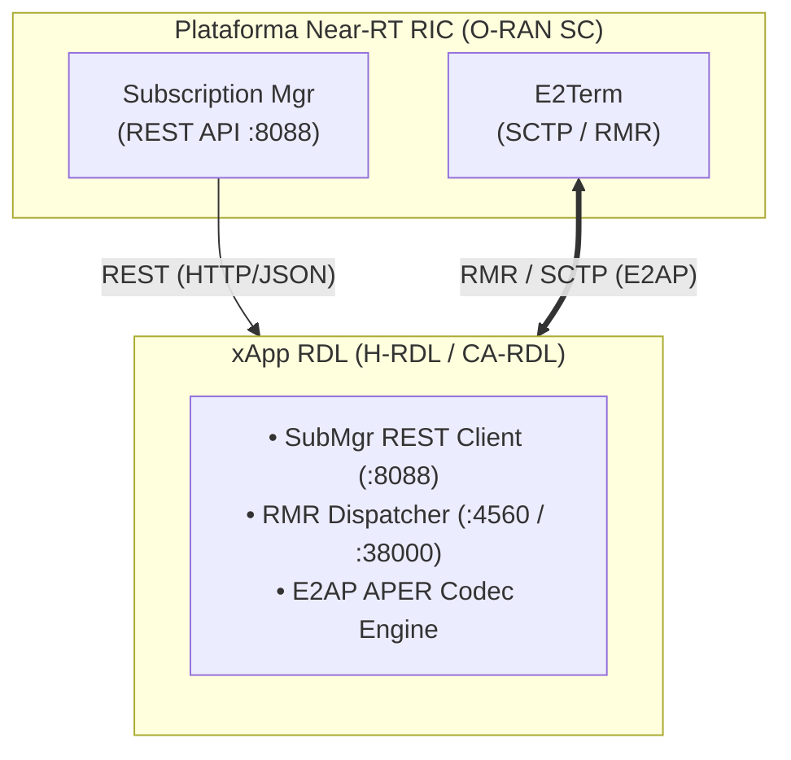

# Perfil de Implantação O-RAN SC — O-RAN SC Implementation Profile

**Projeto:** xApp RDL (Resource and Decision Layer) — Fase 1 (H-RDL Determinística)  
**Documento:** `ORAN_SC_IMPLEMENTATION_PROFILE.md`  
**Escopo:** Mapeamento de integração do H-RDL com os serviços e componentes da plataforma de referência O-RAN Software Community (O-RAN SC Release J).

---

## 1. Mapeamento de Serviços e Comunicação RMR / REST

O H-RDL integra-se com a plataforma O-RAN SC Release J através de duas interfaces principais de comunicação:

---

## 2. Tabela de Tipos de Mensagem RMR (`mtype`) vs E2AP `ProcedureCode`

Para evitar qualquer confusão entre os identificadores internos do RMR e os códigos normativos do protocolo E2AP, o H-RDL mantém um mapeamento explícito de constantes:

| Função / Operação O-RAN | RMR Message Type (`mtype`) | E2AP `ProcedureCode` | Direção da Mensagem |
| :--- | :---: | :---: | :--- |
| **E2 Setup Request** | *N/A (SCTP/E2AP)* | `1` | E2 Node (gNB / NORI) $\rightarrow$ E2Term |
| **RIC Subscription Request** | `12010` / REST (`:8088`) | `8` | H-RDL $\rightarrow$ SubMgr $\rightarrow$ E2Term |
| **RIC Subscription Response** | `12011` / REST (`:8088`) | `8` | SubMgr $\rightarrow$ H-RDL |
| **RIC Indication** | `12050` | `5` | E2Term $\rightarrow$ H-RDL |
| **RIC Control Request** | `12040` | `4` | H-RDL $\rightarrow$ E2Term |
| **RIC Control Acknowledge** | `12041` | `4` | E2Term $\rightarrow$ H-RDL |
| **RIC Control Failure** | `12042` | `4` | E2Term $\rightarrow$ H-RDL |

---

## 3. Integração com Subscription Manager (REST API)

Conforme os padrões atualizados da O-RAN SC (Release J), o envio e a gestão de assinaturas `RICsubscriptionRequest` pela xApp RDL são realizados via **API REST** do Subscription Manager (`http://service-ricplt-submgr-http.ricplt:8088/ric/v1/subscriptions`), mantendo a compatibilidade normativa O-RAN SC enquanto as indicações e controles fluem em alta velocidade via RMR.
