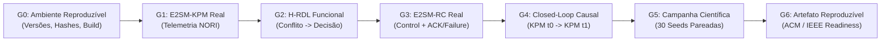

# Matriz de Rastreabilidade O-RAN — ORAN Traceability Matrix

**Projeto:** xApp RDL (Resource and Decision Layer) — Fase 1 (H-RDL Determinística)  
**Documento:** `ORAN_TRACEABILITY_MATRIX.md`  
**Escopo:** Mapeamento formal entre requisitos O-RAN ALLIANCE, mensagens E2AP/E2SM, componentes do H-RDL, suíte de testes e os 7 Gates de Evidência Experimental (G0 a G6).

---

## 1. Matriz Normativa e Estrutural de Rastreabilidade

| Requisito O-RAN / Especificação | Protocolo / Mensagem | Componente H-RDL | Suíte de Testes | Evidência / Artefato | Status de Conformidade |
| :--- | :--- | :--- | :--- | :--- | :---: |
| **REQ-O-RAN-E2SETUP** | E2AP ProcedureCode 1 | `src/e2/e2ap/` | `tests/codec/test_golden_vectors.py` | `e2/setup/request.raw` | **INTEGRATION-VALIDATED** |
| **REQ-O-RAN-SUBMGR** | E2AP ProcedureCode 8 | `SubscriptionManager` | `tests/integration/test_all_reference_xapps.py` | `e2/kpm/subscription.raw` | **IMPLEMENTED / INTEROP-PENDING** |
| **REQ-O-RAN-KPM-IND** | E2AP ProcedureCode 5 / KPM v3 | `KPMDecoder` | `tests/codec/test_kpm_codec.py` | `e2/kpm/indication.raw` | **INTEGRATION-VALIDATED** |
| **REQ-O-RAN-RC-CTRL** | E2AP ProcedureCode 4 / RC v1.03 | `RCEncoder` / `RCMapper` | `tests/integration/test_rc_mapper.py` | `e2/rc/control.raw` | **INTEGRATION-VALIDATED** |
| **REQ-RDL-PERCEPTION** | Janela em Lote (200ms) | `PerceptionAgent` | `tests/unit/test_conflict_detection.py` | `hrdl/conflicts.jsonl` | **UNIT-VALIDATED** |
| **REQ-RDL-REASONING** | Modelos Analíticos TVS/EEVS | `ReasoningAgent` | `tests/unit/test_reasoning_models.py` | `hrdl/decisions.jsonl` | **UNIT-VALIDATED** |
| **REQ-RDL-SAFETY** | Clamping & Handover Lock | `RefinementAgent` | `tests/unit/test_safety_guards.py` | `hrdl/safety.jsonl` | **UNIT-VALIDATED** |
| **REQ-RDL-CAPABILITY** | Strict Discovery Mode | `RanFunctionCapabilityRegistry` | `tests/unit/test_negative_cases.py` | `RDL_MODE=oran-strict` | **UNIT-VALIDATED** |
| **REQ-O-RAN-CLOSED-LOOP** | Closed-Loop Causal | `CausalTracker` | `tests/interoperability/test_closed_loop.py` | `hrdl/causal.jsonl` | **INTEROP-PENDING** |

---

## 2. Rastreabilidade dos 7 Gates Formais de Evidência (G0 a G6)

$$\boxed{\text{Progressão Formal de Maturidade: } G_0 \longrightarrow G_1 \longrightarrow G_2 \longrightarrow G_3 \longrightarrow G_4 \longrightarrow G_5 \longrightarrow G_6}$$

### Critérios de Conclusão por Gate (Definition of Done)

- **Gate 0 (Ambiente Reproduzível):**
  $$\text{PASS} \iff \text{Commits de ns-3, 5G-LENA e NORI fixados} \land \text{Hashes SHA-256 de binários e configs gerados}$$
- **Gate 1 (E2SM-KPM Real):**
  $$\text{PASS} \iff E2Setup \land RANFunction \land Subscription \land Indication \land APERDecode \land SemanticValidation (\epsilon < 5\%)$$
- **Gate 2 (H-RDL Funcional):**
  $$\text{PASS} \iff \text{Conflito detectado} \land \text{Decisão determinística H-RDL} \land \text{Safety Guards 100\% aplicados}$$
- **Gate 3 (E2SM-RC Real):**
  $$\text{PASS} \iff RICcontrolRequest \land \text{RICcontrolAck externo} \land \text{Teste negativo RICcontrolFailure}$$
- **Gate 4 (Closed-Loop Causal):**
  $$\text{PASS} \iff KPM(t_0) \longrightarrow H\text{-}RDL \longrightarrow E2SM\text{-}RC \longrightarrow NORI \longrightarrow 5G\text{-}LENA \longrightarrow KPM(t_1)$$
- **Gate 5 (Campanha Científica):**
  $$\text{PASS} \iff 30 \text{ sementes pareadas (B0, B1, B2, B3)} \land \text{Intervalos de Confiança 95\%} \land \text{Tamanho de Efeito Wilcoxon}$$
- **Gate 6 (Artifact Readiness):**
  $$\text{PASS} \iff \text{Execução limpa e automatizada em ambiente isolado (ACM SIGSIM / IEEE Artifact Evaluation)}$$

---

## 3. Rastreabilidade de Testbed e Hierarquia de 3 Níveis (srsRAN + Open5GS)

$$\boxed{\text{Hierarquia Metodológica: } \text{Simulação ns-3/NORI} \longrightarrow \text{Software RAN srsRAN/Open5GS} \longrightarrow \text{Testbed Físico OpenRAN@Brasil}}$$

| Requisito / Perfil Testbed | Protocolo / Versão | Adaptador H-RDL | Gates de Testbed (`TB0` a `TB10`) | Status de Conformidade |
| :--- | :--- | :--- | :--- | :---: |
| **REQ-SRSRAN-E2AP** | E2AP v03.00 | `SrsRanBackendAdapter` | **TB2:** E2 Setup srsRAN $\leftrightarrow$ E2Term | **IMPLEMENTED** |
| **REQ-SRSRAN-KPM** | E2SM-KPM v03.00 (1000ms) | `SrsRanBackendAdapter` | **TB3 / TB4:** Decodificação KPM Real | **INTEROP-PENDING** |
| **REQ-SRSRAN-RC-STYLE2** | E2SM-RC v03.00 (Style 2 / Action 6) | `SrsRanRCEncoder` | **TB5 / TB6:** Controle PRB Slice | **IMPLEMENTED** |
| **REQ-OPEN5GS-CORE** | N2 AMF / N3 UPF (5GC) | `CoreObserver` | **TB1:** UE Registration & PDU Session | **INTEGRATION-PENDING / PROFILE READY** |

| **REQ-OPENRANBR-PILOT** | OpenRAN@Brasil Blueprint v3 | `deploy/openran-br-v3/` | **TB10:** Execução Físico COTS UE / O-RU | **INTEROP-PENDING** |
