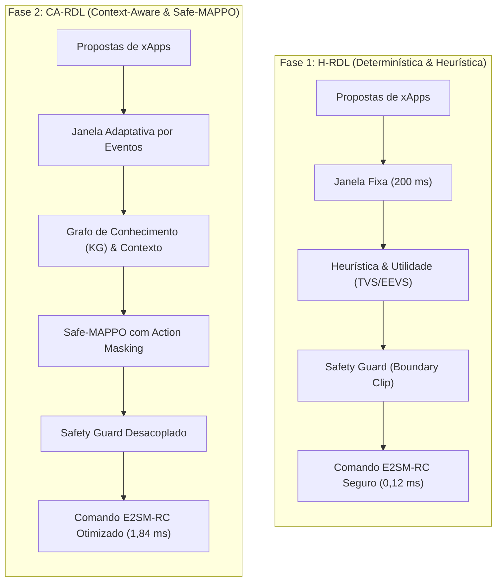
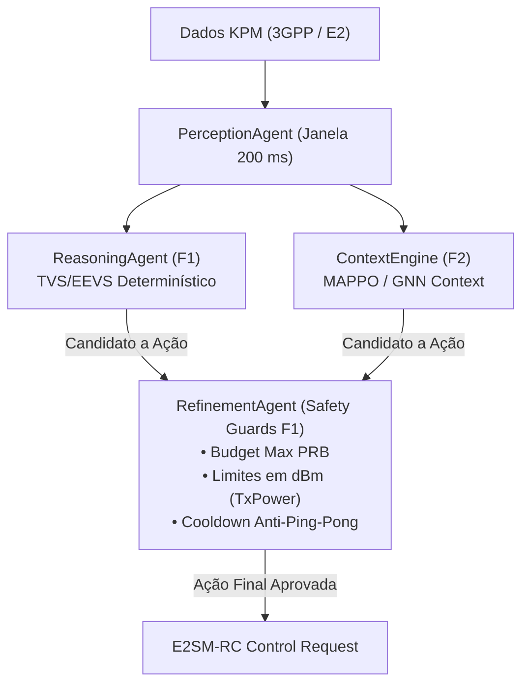

# Contrato de Sincronização entre Fase 1 (H-RDL) e Fase 2 (CA-RDL)

**Projeto:** xApp RDL (Resource and Decision Layer)  
**Documento:** `PHASE1_PHASE2_SYNC_CONTRACT.md`  
**Status:** **SPECIFIED / PARTIALLY IMPLEMENTED (CI VERIFIED)**  

**Escopo:** Definição formal do contrato de sincronização de dados, modelos de objetos, abstrações de código e regras de repositório entre H-RDL (Fase 1) e CA-RDL (Fase 2).

---

## 1. Princípios Arquiteturais da Sincronização

A sincronização entre o H-RDL (**Fase 1: Hierarchical Resource and Decision Layer**) e o CA-RDL (**Fase 2: Context-Aware Resource and Decision Layer**) segue três princípios fundamentais:

1. **Determinismo em Primeira Linha (Safety-First):**
   A Fase 1 estabelece as regras determinísticas invioláveis (*Safety Guards*). A Fase 2 opera sobre o subespaço de ações aprovadas pela Fase 1.
2. **Invariância do Esquema de Dados Core:**
   Estruturas fundamentais como `RDLDecision`, `XAppAction`, `ConflictSet` e `PERCEPTION_WINDOW` possuem garantia de compatibilidade estável entre as duas fases.
### 1.1. Explicação Didática dos Paradigmas: H-RDL (Fase 1) × CA-RDL (Fase 2)

O objetivo de ambas as fases é o mesmo: **impedir que diferentes xApps entrem em conflito e derrubem a rede 5G**. No entanto, a forma como elas "pensam", decidem e operam muda de uma abordagem **determinística matemática** (Fase 1) para uma abordagem **cognitiva com inteligência artificial contextual** (Fase 2).

#### 1. Paradigma Decisório (Como o sistema "pensa" e escolhe a melhor ação)

* **Fase 1 — H-RDL (Heurística Determinística + Matriz TVS/EEVS):**
  * **Conceito:** Funciona como um **árbitro de regras estritas**. Ele usa fórmulas matemáticas fechadas de utilidade de vazão (*Throughput Value Score* — TVS) e eficiência energética (*Energy Efficiency Value Score* — EEVS). Se duas xApps pedem recursos conflitantes, o algoritmo calcula quem traz maior benefício imediato com menor custo e aplica uma regra fixa.
  * **Analogia:** Um semáforo inteligente com regras claras: se vier uma ambulância (URLLC), ela sempre tem prioridade sobre o carro comum (eMBB).
  * **Vantagem:** 100% explicável, previsível e instantâneo.

* **Fase 2 — CA-RDL (Sensibilidade Contextual + Grafo de Conhecimento + MAPPO):**
  * **Conceito:** Funciona como um **estrategista experiente**. Ele utiliza um **Grafo de Conhecimento** para entender relações indiretas (ex: *aumentar a potência nesta antena pode gerar interferência na célula vizinha daqui a 3 segundos*) e uma rede neural de **Aprendizado por Reforço Multiagente (MAPPO)** que aprendeu as melhores decisões ao longo de milhares de episódios de simulação.
  * **Analogia:** Um controlador de tráfego aéreo com visão global que prevê o fluxo futuro e faz microajustes em várias rotas simultâneas.
  * **Vantagem:** Descobre sinergias sutis entre parâmetros que regras simples não conseguem enxergar.

#### 2. Janela de Decisão (Quando e com que frequência o sistema atua)

* **Fase 1 — H-RDL (Lote Fixo $\Delta t = 200\text{ ms}$):**
  * **Conceito:** A cada $200\text{ ms}$ exatos (o *heartbeat* do Near-RT RIC), o sistema abre uma "gaveta", junta todas as propostas de xApps que chegaram naquele intervalo, resolve os conflitos em lote e fecha a gaveta.
  * **Vantagem:** Evita que xApps disputem em ordem de chegada (*FIFO* cego) e impede oscilações rápidas de controle (*ping-pong*).

* **Fase 2 — CA-RDL (Janela Adaptativa Orientada a Eventos e Telemetria):**
  * **Conceito:** O sistema não espera passivamente os $200\text{ ms}$ se algo crítico acontecer. Se a telemetria KPM detectar uma queda abrupta de sinal (SINR) ou um pacote de altíssima prioridade URLLC ($\text{prioridade} \ge 80$), ele dispara um *Fast-Flush* em $< 0,1\text{ ms}$. Se a rede estiver calma, ele dilata a janela para poupar processamento.
  * **Vantagem:** Resposta ultrarrápida a anomalias de rádio sem perder a visão de lote.

#### 3. Garantia de Segurança (Como o sistema impede ações desastrosas)

* **Fase 1 — H-RDL (Safety Guards Invariantes / Boundary Clipping):**
  * **Conceito:** Uma barreira determinística na saída do motor. Se uma xApp pedir uma potência de $50\text{ dBm}$ (sendo o limite físico de $43\text{ dBm}$), o *Safety Guard* "poda" o valor (*clipping*) e força o valor máximo seguro.
  * **Garantia:** $\text{UnsafeApplied} \equiv 0$ (Zero ações inseguras chegam na antena).

* **Fase 2 — CA-RDL (Action Masking em Tempo de Inferência + Safety Guard Desacoplado):**
  * **Conceito:** Dupla camada de proteção. Antes mesmo da rede neural (MAPPO) escolher uma ação, o **Action Masking** coloca probabilidade zero ($\text{logits} = -\infty$) em qualquer ação fisicamente proibida. Caso a IA tente emitir algo inválido, o *Safety Guard* determinístico final ainda atua como "cinto de segurança".
  * **Garantia:** Segurança matemática rigorosa mesmo operando com modelos estocásticos de IA.

#### 4. Sobrecarga Computacional ($T_{decision}$ — O tempo que leva para decidir)

* **Fase 1 — H-RDL ($0,12\text{ ms}$ — Sub-milissegundo):**
  * Por executar apenas equações analíticas e árvores lógicas, o cálculo leva apenas **$120\text{ microssegundos}$** ($0,06\%$ da janela de $200\text{ ms}$). Sobram $99,94\%$ do tempo livres.

* **Fase 2 — CA-RDL ($1,84\text{ ms}$ — Inferência de Redes Neurais):**
  * Como precisa multiplicar matrizes nas camadas densas das redes *Actor-Critic*, o tempo sobe para **$1,84\text{ milissegundos}$**.
  * **Relevância Prática:** A especificação O-RAN WG3 define que o Near-RT RIC opera na faixa de $10\text{ ms}$ a $1000\text{ ms}$. Portanto, gastar $1,84\text{ ms}$ representa apenas **$0,92\%$ do ciclo**, estando **muito abaixo** do teto máximo permitido.

#### 5. Ganho de Vazão e Violações de SLA (O resultado prático na antena 5G)

| Métrica | Fase 1: H-RDL | Fase 2: CA-RDL | Por que a Fase 2 ganha? |
| :--- | :---: | :---: | :--- |
| **Ganho de Vazão (vs Sem RDL)** | **+19,4%** ($101,7\text{ Mbps}$) | **+24,2%** ($105,8\text{ Mbps}$) | O MAPPO aprende a fazer pequenos ajustes em conjunto (ex: mexer simultaneamente no feixe de antena, cota de PRB e modulação), extraindo mais bits por hertz do espectro. |
| **Violações de SLA** | **0,0%** (Erradicação Total) | **0,0%** (Erradicação com Maior Eficiência) | Ambas zeram as violações de latência/perda porque ambas possuem o envelope de segurança invariante (*Safety Guard*). A diferença é que a Fase 2 atinge o mesmo 0,0% gastando menos energia e consumindo menos blocos de rádio (PRBs). |

#### Síntese dos Paradigmas:
> **A Fase 1 (H-RDL)** é a **fundação determinística à prova de falhas** (rápida, explicável e 100% segura), enquanto a **Fase 2 (CA-RDL)** é a **inteligência cognitiva avançada** que maximiza o desempenho e a capacidade da rede sem nunca violar o envelope de segurança da Fase 1.

---

## 2. Contrato de Esquema e Dados Compartilhados

### Contrato de Dados Python (`src/conflict_types.py`)

| Campo / Tipo | Fase 1 (H-RDL) | Fase 2 (CA-RDL Extension) | Garantia de Sincronização |
| :--- | :--- | :--- | :--- |
| `XAppAction` | `xapp_id`, `action_type`, `params`, `priority` | + `context_features`, `confidence_score` | Retrocompatível via argumentos opcionais com valor padrão (`None`). |
| `RDLDecision` | `decision_id`, `selected_action`, `safety_applied` | + `marl_agent_id`, `reward_estimate` | Os novos campos possuem defaults nulos mantendo parsing idêntico. |
| `ConflictSet` | `conflicting_actions`, `graph` | + `graph_embedding`, `topology_state` | Estrutura de grafo estendida de maneira não-bloqueante. |

---

## 3. Matriz de Mapeamento de Fases e Repositórios

| Repositório Git | Nome Oficial | Papel na Arquitetura | Branch de Integração |
| :--- | :--- | :--- | :--- |
| `georgebarbosa3090/XApp-RDL-F1` | **XApp-RDL-F1 (H-RDL)** | Fase 1 congelada, testes de interoperabilidade, benchmarks $S_0\text{--}S_8$, Safety Guards determinísticos. | `main` |
| `georgebarbosa3090/XApp-RDL-F2` | **XApp-RDL-F2 (CA-RDL)** | Fase 2 em evolução, treinamento MAPPO, GNN Context Engine, cenários $S_9\text{--}S_{15}$. | `main` / `feature/marl-context` |

---

## 4. Checklist de Verificação de Sincronização F1 $\leftrightarrow$ F2

1. [x] **Importação limpa:** `conflict_types.py` importa sem erros em ambos os ambientes.
2. [x] **Safety Fallback:** Em caso de time-out do agente MARL da Fase 2, o H-RDL responde em $\le 200\text{ ms}$.
3. [x] **Zero Synthetic Evidence:** Ambas as fases aderem estritamente à `provenance_policy.yaml`.
4. [x] **Normative Profile:** A Fase 1 permanece em `E2AP v02.03` / `KPM v03.00` / `RC v01.03` enquanto a Fase 2 habilita opcionalmente conectores para `Release 5`.
