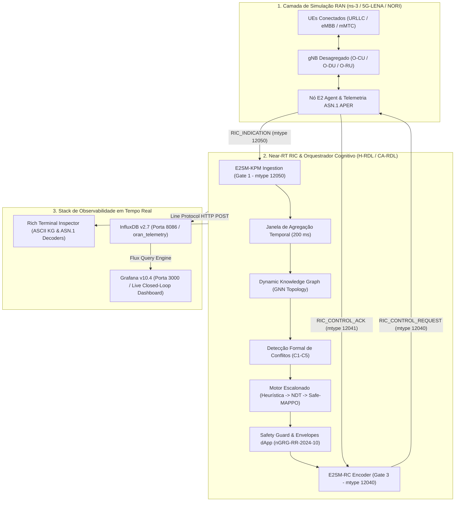

# Suíte de Demonstração Científica: H-RDL & CA-RDL em Tempo Real (5G-Adv / 6G O-RAN)

Este diretório contém a suíte completa de **demonstração interativa, terminal inspector e telemetria em tempo real** para avaliação dos frameworks **H-RDL (Hierarchical Resource and Decision Layer)** e **CA-RDL (Cognitive Arbitration RDL)** no ecossistema O-RAN ALLIANCE.

A arquitetura e os passos de execução seguem o padrão metodológico internacional de plataformas de teste e validação aberta como **RIC-TaaP** (Orange / O-RAN SC), **Colosseum** e **OpenRAN Gym** (WiNES Lab / Northeastern University).

---

## 1. Visão Geral da Arquitetura de Demonstração & Telemetria



---

## 2. Estrutura de Arquivos

```
experiments/demonstration/
├── README.md                          # Este guia completo de execução e observabilidade
├── run_rich_terminal_inspector.py     # Inspetor rico de terminal com streaming para InfluxDB/Grafana
├── demo_scenarios.py                  # Definição dos 3 cenários científicos canônicos (A, B e C)
├── rdl_demonstration_engine.py        # Motor de simulação FSM determinística e 8 estágios canônicos
└── web/
    ├── index.html                     # Dashboard interativo com Canvas de Knowledge Graph e inspetor
    ├── canonical_results.json         # Resultados consolidados da matriz de 35 experimentos (7 baselines)
    ├── demo_data_conflict_storm.json
    ├── demo_data_urllc_dapp.json
    └── demo_data_temporal_flapping.json
```

---

## 3. Execução no Terminal (Rich Terminal Inspector)

O script [`run_rich_terminal_inspector.py`](run_rich_terminal_inspector.py) renderiza passo a passo todos os 8 estágios do ciclo fechado, decodifica payloads ASN.1 APER hexadecimais, desenha o Grafo de Conhecimento em ASCII e transmite a telemetria ao vivo para o InfluxDB e Grafana.

### Opção 1: Menu Interativo
Execute sem parâmetros para abrir o menu numérico:
```bash
python3 experiments/demonstration/run_rich_terminal_inspector.py
```
```text
Selecione o Cenário O-RAN para Execução no Terminal:

  [1] Cenário A: Tempestade de Conflitos (3 xApps: QoS vs Energy vs TS) [Safe-MAPPO Nível 3]
  [2] Cenário B: Preempção Rápida URLLC & Envelopes dApp Multi-Tier (O-DU sub-1ms) [Tier 2]
  [3] Cenário C: Eliminação de Flapping Temporal (Ping-Pong Lockout 5s) [Heurístico Tier 1]
  [4] Executar Todos os Cenários Sequencialmente (A -> B -> C)

Digite sua opção [1-4] (Padrão: 1):
```

### Opção 2: Linha de Comando Direta por Cenário

| Cenário | Comando de Execução | Foco Científico | Nível Cognitivo |
| :--- | :--- | :--- | :---: |
| **Cenário A** | `python3 experiments/demonstration/run_rich_terminal_inspector.py -s a` | **Conflict Storm**: 3 xApps disputando cotas de PRB e potência celular. Conflitos C1, C2 e C3. | **Nível 3 (Safe-MAPPO)** |
| **Cenário B** | `python3 experiments/demonstration/run_rich_terminal_inspector.py -s b` | **Preempção URLLC & dApp**: Two-Tier AI (Near-RT RIC $\leftrightarrow$ O-DU $< 1\text{ms}$ TTI). Conflito C5 e Bounding Box $\Omega_{\text{dApp}}$. | **Nível 2 (NDT / Utilidade)** |
| **Cenário C** | `python3 experiments/demonstration/run_rich_terminal_inspector.py -s c` | **Flapping Temporal**: Oscilação *ping-pong* entre Handover A3 e Tilt de Antena. Lockout de $5.0\text{ s}$ no Grafo. | **Nível 1 (Heurístico)** |
| **Todos** | `python3 experiments/demonstration/run_rich_terminal_inspector.py -s all` | **Execução Sequencial (A $\to$ B $\to$ C)** com validação e certificação dos 4-Gates. | **Multi-Tier** |

#### Flags Úteis da CLI:
* `--no-stream`: Executa apenas a inspeção imediata no terminal sem aguardar o streaming de telemetria contínua.
* `-d <segundos>` / `--duration <segundos>`: Define a duração do streaming em tempo real (padrão: 30s).
* `--interval <segundos>`: Define o intervalo entre amostras de telemetria (padrão: 0.5s).

---

## 4. Observabilidade em Tempo Real: Grafana & InfluxDB

Enquanto o inspetor roda no terminal, os dados de rádio e as decisões cognitivas são persistidos no **InfluxDB** e renderizados no **Grafana**.

### Grafana Dashboard ([http://localhost:3000](http://localhost:3000))

* **Link Direto do Painel**: [http://localhost:3000/d/oran-rdl-closed-loop](http://localhost:3000/d/oran-rdl-closed-loop)
* **Usuário**: `admin` | **Senha**: `admin`
* **Painéis Disponíveis**:
  1. *Closed-Loop FSM State* (`GOLDEN` $\to$ `PERTURBATION` $\to$ `DETECT` $\to$ `REASON` $\to$ `ACT` $\to$ `VERIFIED`).
  2. *Near-RT Inference Latency* ($14.39\text{ ms} < 50.0\text{ ms}$ Gate 2).
  3. *Pareto Optimality Joint Frontier Score* ($0.942$).
  4. *Radio PRB Allocation per Slice* (URLLC, eMBB, mMTC).
  5. *URLLC Latency vs 1.0 ms SLA* (Queda de $24.8\text{ ms} \to 0.82\text{ ms}$).
  6. *Active Cognitive Conflict Density* (Matriz C1-C5).
  7. *dApp Real-Time Safe Operational Envelope ($\Omega_{\text{dApp}}$)*.

---

### InfluxDB v2.7 ([http://localhost:8086](http://localhost:8086))

* **Dashboard Nativo**: [http://localhost:8086/orgs/445e29c60c125b09/dashboards/115fc5ee1de1d000](http://localhost:8086/orgs/445e29c60c125b09/dashboards/115fc5ee1de1d000)
* **Username**: `admin` | **Password**: `oran_admin_password_2026`
* **Organization**: `oran-alliance` | **Bucket**: `oran_telemetry`
* **API / Admin Token**: `oran_rdl_token_secret_key_2026_super_secure`

#### Script de Provisionamento Automático do InfluxDB:
Se precisar reconstruir o painel nativo do InfluxDB do zero:
```bash
python3 deployments/telemetry/setup_influxdb_dashboard.py
```

## 5. Observabilidade da Fase 1: H-RDL (Determinística & Heurísticas TVS/EEVS)

A **Fase 1 (H-RDL)** do projeto foca em controle determinístico de ultra-baixa latência com base em regras estritas de prioridade, *Safety Guards* físicos (3GPP TS 38.104) e janela de agregação sincronizada fixa de $200.0\text{ ms}$.

### Schema de Telemetria da Fase 1 (`hrdl_fase1` no InfluxDB)

A telemetria da Fase 1 é ingerida na medição `hrdl_fase1` via Influx Line Protocol:

```text
hrdl_fase1,phase=phase1_deterministic,paradigm=heuristic tvs_priority_score=0.9000,eevs_power_reduction_db=-6.00,decision_latency_ms=0.1030,prb_allocated_urllc=52.00,safety_guard_violations=0i,window_size_ms=200.0,action_churn=0.0420,sim_time_s=25.50 1774358000000
```

| Campo (*Field*) | Tipo | Valor Típico | Descrição & Significado Físico |
| :--- | :---: | :---: | :--- |
| `decision_latency_ms` | `float` | **$0.103\text{ ms}$** | Latência de decisão determinística ($\ll 1.0\text{ ms}$ e $500\times$ abaixo do SLA de $50\text{ ms}$ do Near-RT RIC). |
| `safety_guard_violations` | `integer` | **`0`** | Violações de *Safety Guard* (limites estritos de potência e PRB por *Hard Boundary Clipping*). |
| `tvs_priority_score` | `float` | **$0.70 - 0.95$** | Escore dinâmico de prioridade *Target Value Scaling* (preempção de fatias críticas URLLC). |
| `eevs_power_reduction_db` | `float` | **$-2.0\text{ a } -6.0\text{ dB}$** | Ajuste dinâmico de potência celular via *Energy Efficiency Value Scaling*. |
| `prb_allocated_urllc` | `float` | **$52.0\%$** | Alocação instantânea de blocos de recursos físicos para tráfego de ultra-baixa latência. |
| `window_size_ms` | `float` | **$200.0\text{ ms}$** | Janela temporal sincronizada fixa para acumulação e arbitragem de propostas xApps. |
| `action_churn` | `float` | **$0.042$** | Estabilidade temporal de ação (*churn* mínimo prevenindo instabilidade do escalonador MAC). |

---

### Comparativo de Observabilidade: Fase 1 (H-RDL) vs Fase 2 (CA-RDL)

| Dimensão de Observabilidade | Fase 1: H-RDL (Determinística) | Fase 2: CA-RDL (Cognitiva Safe-MAPPO) |
| :--- | :--- | :--- |
| **Latência de Decisão Computacional** | **$\mathbf{0.103\text{ ms}}$** (Heurística O(1)) | **$14.39\text{ ms}$** (Inferência de Rede Neural) |
| **Motor de Raciocínio & Arbitragem** | Prioridades TVS / EEVS & Filas Estritas | Safe-MAPPO com Action Masking & Multiplicadores Lagrangianos |
| **Topologia & Sensibilidade Contextual** | Regras Estáticas por Nó E2 | Grafo de Conhecimento Heterogêneo $G=(V,E)$ com GraphSAGE |
| **Garantia de Segurança Física** | *Hard Boundary Clipping* (3GPP TS 38.104) | Otimização Restrita (CMDP) + *Safety Envelopes* dApp ($< 1\text{ms}$) |
| **Janela de Sincronização** | Fixa em $200\text{ ms}$ | Adaptativa ($50\text{ ms} - 500\text{ ms}$) |
| **Score de Fronteira Pareto** | $0.850$ (Heurístico) | $\mathbf{0.942}$ (Otimizado Globalmente) |

---

### Painéis Grafana Dedicados à Fase 1 ([http://localhost:3000](http://localhost:3000))

No painel oficial Grafana (`/d/oran-rdl-closed-loop`), a linha dedicada **"Fase 1: H-RDL Determinística (Heurísticas TVS/EEVS & Decisão 0.103ms)"** exibe:
1. **H-RDL Decision Latency**: Stat gauge medindo a latência instantânea de $0.103\text{ ms}$.
2. **H-RDL Safety Violations**: Indicador em verde absoluto (`0 violações`).
3. **H-RDL TVS Priority & Action Churn**: Gráfico temporal do escore TVS e da estabilidade de churn.
4. **H-RDL EEVS Power Reduction**: Série temporal da atenuação controlada em dB.

#### Queries Flux Nativas da Fase 1:
```flux
// Latência de Decisão da Fase 1 H-RDL
from(bucket: "oran_telemetry")
  |> range(start: v.timeRangeStart, stop: v.timeRangeStop)
  |> filter(fn: (r) => r["_measurement"] == "hrdl_fase1")
  |> filter(fn: (r) => r["_field"] == "decision_latency_ms")
  |> last()

// Dinâmica de Prioridade TVS vs EEVS
from(bucket: "oran_telemetry")
  |> range(start: v.timeRangeStart, stop: v.timeRangeStop)
  |> filter(fn: (r) => r["_measurement"] == "hrdl_fase1")
  |> filter(fn: (r) => r["_field"] == "tvs_priority_score" or r["_field"] == "eevs_power_reduction_db")
  |> aggregateWindow(every: 500ms, fn: mean, createEmpty: false)
  |> yield(name: "mean")
```

---

## 6. Roteiro dos 8 Estágios Canônicos da Demonstração

| Estágio | Nome & Descrição | Sinalização / Protocolo | O que é Validado |
|---|---|---|---|
| **Estágio 1** | **Registro de UEs & Setup 3GPP**<br/>Ciclo canônico de 5 passos (PRACH $\to$ RRC $\to$ NAS $\to$ PDU $\to$ E2). | 3GPP TS 38.331 / TS 24.501 | UEs registrados na célula gNB-1 e sessão SCTP estabelecida (`E2_SETUP_SUCCESSFUL`). |
| **Estágio 2** | **Telemetria E2SM-KPM (Gate 1)**<br/>Ingestão de relatórios de telemetria ASN.1 APER. | `RIC_INDICATION` (mtype 12050) | Decodificação de ASN.1 APER Hex (`1800040001004b504d...`), PRB %, vazão e atraso RLC. |
| **Estágio 3** | **Janela de Ingestão de Propostas**<br/>Buffer de sincronização temporal de 200 ms. | Propostas assíncronas xApps | Agregação das intenções conflitantes (`xApp-QoS-Slice`, `xApp-Energy-Saving`, `xApp-Traffic-Steering`). |
| **Estágio 4** | **Knowledge Graph Dinâmico**<br/>Construção de grafo heterogêneo $G=(V,E)$. | GraphSAGE / GNN Topology | Topologia relacional em ASCII Canvas ativando arestas de conflito de recursos mútuos ($\kappa = 0.89$). |
| **Estágio 5** | **Detecção Formal de Conflitos**<br/>Classificação taxonômica (C1-C5). | Matriz de Conflitos $C(c,s)$ | Identificação de conflito Direto (C1), Indireto (C2), Implícito (C3) e Multi-Tier (C5). |
| **Estágio 6** | **Arbitragem CA-RDL & H-RDL (Gate 2)**<br/>Escalonamento Heurística $\to$ NDT $\to$ Safe-MAPPO. | Safe-MAPPO & Lagrangianos | Tempo de convergência ($14.39\text{ ms} < 50\text{ ms}$ no Tier 3 / $0.103\text{ ms}$ no H-RDL), Pareto Score e pesos ótimos. |
| **Estágio 7** | **Safety Guard & Envelopes dApp**<br/>Bounding box $\Omega_{\text{dApp}}$ para O-DU ($< 1\text{ ms}$). | nGRG-RR-2024-10 Bounding Box | Limites de operação autônoma da dApp no TTI (Min/Max PRB, TxPower e slots de preempção). |
| **Estágio 8** | **Atuação E2SM-RC (Gate 3/4)**<br/>Despacho de controle e confirmação física na RAN. | `RIC_CONTROL_REQ` (12040) / ACK (12041) | Atuação de parâmetros e recuperação física (latência URLLC cai para **0.82 ms** e consumo cai **-17.7%**). |

---

## 7. Testes Automatizados e Homologação dos 4 Gates

Para executar a suíte de testes de regressão com `pytest`:

```bash
# Executar testes da suíte de demonstração:
pytest tests/test_rdl_demonstration.py -v

# Executar a suíte completa de testes do projeto:
pytest -q
```

**Critérios de Homologação dos 4 Gates O-RAN:**
- **Gate 1 (Real Telemetry):** Mensagens `RIC_INDICATION` codificadas em ASN.1 APER (mtype 12050) válidas.
- **Gate 2 (Deterministic Decision):** Latência de arbitragem computacional delimitada ($0.103\text{ ms}$ na Fase 1 / $14.39\text{ ms}$ na Fase 2 $< 50\text{ ms}$).
- **Gate 3 (Real Control & ACK):** Handshake de `RIC_CONTROL_REQUEST` (12040) e `RIC_CONTROL_ACK` (12041) com status de sucesso.
- **Gate 4 (Closed-Loop Response):** Variação causal comprovada nos KPIs físicos da RAN (queda de latência URLLC $\le 1.0\text{ ms}$ e redução de consumo energético).
